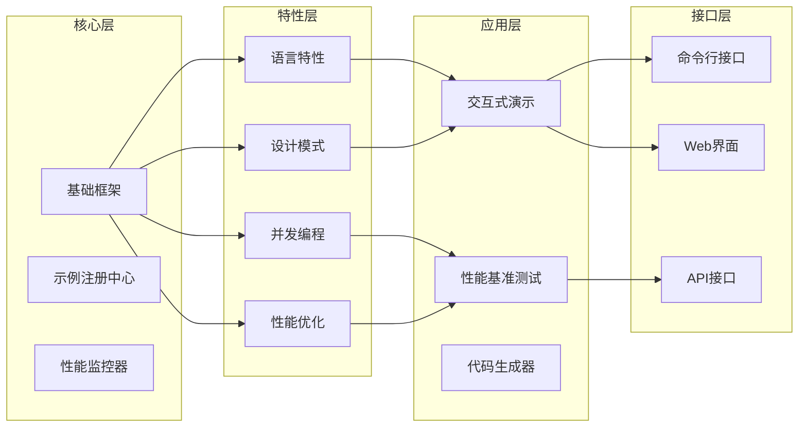
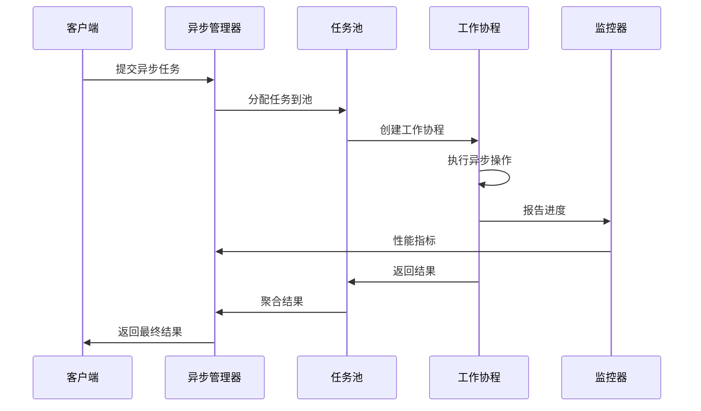
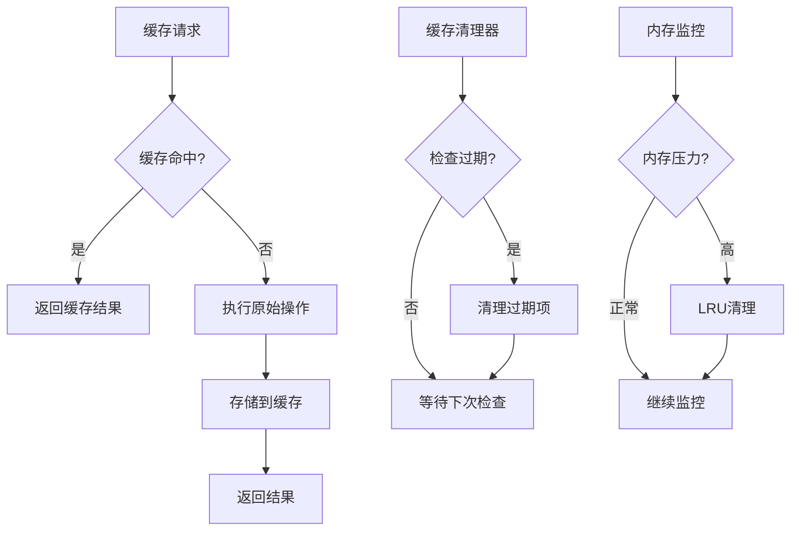
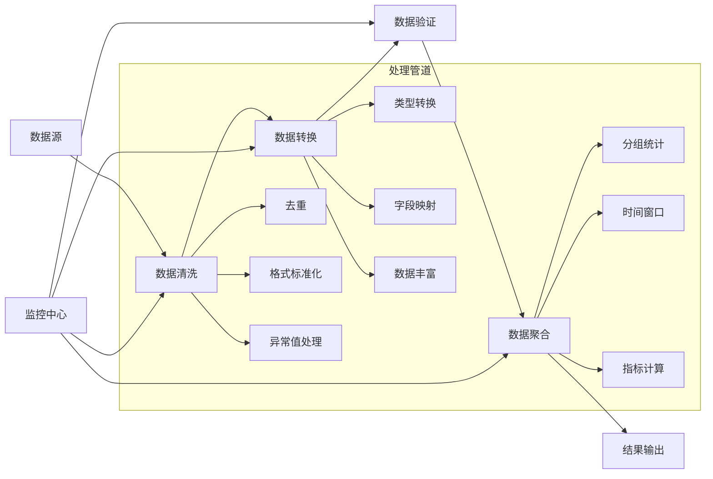
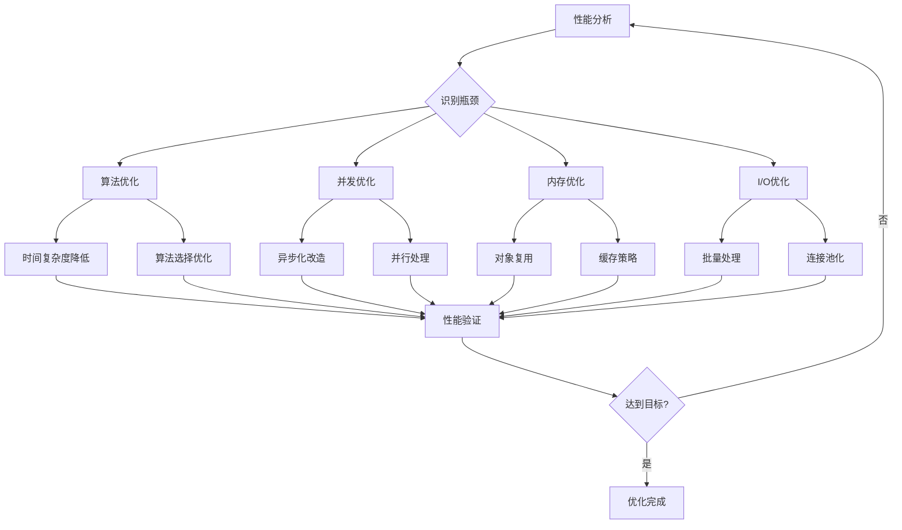
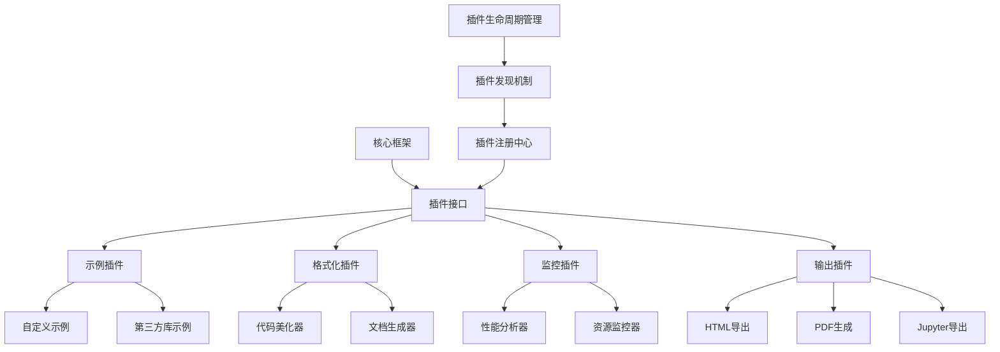
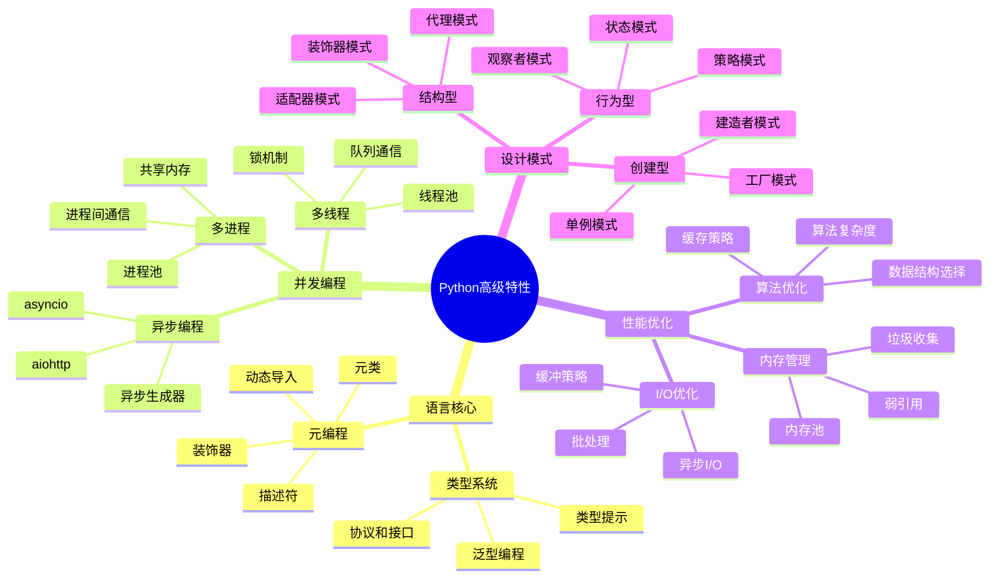

# Python高级用法示例系统设计

## 概述

本设计文档描述了一个综合性的Python高级用法示例系统，旨在展示现代Python开发中的核心概念、设计模式、性能优化技术和最佳实践。该系统将通过实际的代码示例展示如何在真实项目中应用这些高级特性。

### 核心目标

- **教育价值**: 通过实际案例展示Python高级特性的应用
- **实用性**: 提供可直接应用于生产环境的代码模式
- **全面性**: 覆盖从基础到高级的各种Python特性
- **可扩展性**: 支持持续添加新的示例和模式

### 技术架构特点

- 模块化设计，每个高级特性独立实现
- 异步编程和并发处理示例
- 高级装饰器和元编程技术
- 性能优化和内存管理示例
- 现代Python工具链集成

## 技术栈与依赖

### 核心技术栈

| 技术领域 | 选择 | 版本要求 | 用途 |
|---------|------|----------|------|
| 编程语言 | Python | 3.9+ | 主要开发语言 |
| 异步框架 | asyncio | 内置 | 异步编程示例 |
| Web框架 | FastAPI | 0.100+ | API开发示例 |
| 数据处理 | pandas | 2.0+ | 数据科学示例 |
| 并发库 | concurrent.futures | 内置 | 并发编程示例 |

### 开发工具

| 工具类型 | 工具名称 | 用途 |
|---------|----------|------|
| 类型检查 | mypy | 静态类型检查 |
| 代码格式化 | black | 代码自动格式化 |
| 代码质量 | ruff | 快速代码检查 |
| 测试框架 | pytest | 单元测试和集成测试 |
| 性能分析 | cProfile | 性能监控和分析 |

## 系统架构

### 整体架构设计

```mermaid
graph TB
    subgraph "Python高级特性示例系统"
        A[示例管理器] --> B[语言特性模块]
        A --> C[设计模式模块]
        A --> D[并发编程模块]
        A --> E[性能优化模块]
        A --> F[元编程模块]
        A --> G[数据处理模块]
        
        B --> B1[装饰器高级用法]
        B --> B2[上下文管理器]
        B --> B3[生成器和迭代器]
        B --> B4[类型提示进阶]
        
        C --> C1[创建型模式]
        C --> C2[结构型模式]
        C --> C3[行为型模式]
        
        D --> D1[asyncio异步编程]
        D --> D2[多线程优化]
        D --> D3[多进程处理]
        D --> D4[协程池管理]
        
        E --> E1[内存优化技术]
        E --> E2[缓存策略实现]
        E --> E3[性能监控工具]
        E --> E4[算法优化示例]
        
        F --> F1[元类应用]
        F --> F2[描述符协议]
        F --> F3[动态类创建]
        F --> F4[代码生成技术]
        
        G --> G1[数据流处理]
        G --> G2[函数式编程]
        G --> G3[响应式编程]
        G --> G4[流式计算]
    end
    
    A --> H[CLI命令行界面]
    A --> I[Web演示界面]
    A --> J[Jupyter示例集]
```

### 模块层次结构

## 核心功能架构

### 示例管理系统

| 组件 | 职责 | 接口设计 |
|------|------|----------|
| ExampleRegistry | 示例注册和发现 | register_example(), find_examples(), list_categories() |
| ExampleRunner | 示例执行引擎 | run_example(), run_with_profiling(), compare_implementations() |
| PerformanceCollector | 性能数据收集 | collect_metrics(), generate_report(), benchmark_comparison() |
| DocumentationGenerator | 文档自动生成 | generate_docs(), create_tutorial(), export_notebook() |

### 语言特性演示模块

#### 高级装饰器系统

| 装饰器类型 | 功能描述 | 应用场景 |
|-----------|----------|----------|
| 缓存装饰器 | 结果缓存和失效策略 | 函数结果缓存、方法缓存 |
| 重试装饰器 | 自动重试机制 | 网络请求、数据库操作 |
| 限流装饰器 | 调用频率控制 | API限流、资源保护 |
| 类型检查装饰器 | 运行时类型验证 | 参数验证、返回值检查 |
| 性能监控装饰器 | 执行时间和资源监控 | 性能分析、瓶颈识别 |

#### 上下文管理器进阶

| 管理器类型 | 功能特性 | 使用场景 |
|-----------|----------|----------|
| 资源管理器 | 自动资源获取和释放 | 文件操作、数据库连接 |
| 异常处理管理器 | 统一异常处理逻辑 | 错误恢复、日志记录 |
| 状态管理器 | 临时状态变更和恢复 | 配置切换、环境变量 |
| 并发管理器 | 线程安全和锁管理 | 共享资源访问 |

### 并发编程架构

#### 异步编程模式

#### 并发策略对比

| 并发模式 | 适用场景 | 性能特点 | 复杂度 |
|---------|----------|----------|---------|
| asyncio协程 | I/O密集型任务 | 高并发、低延迟 | 中等 |
| 线程池 | 中等I/O操作 | 平衡性能和资源 | 较低 |
| 进程池 | CPU密集型任务 | 真正并行处理 | 较高 |
| 混合模式 | 复杂业务场景 | 最优性能配置 | 高 |

### 性能优化模块

#### 内存优化技术

| 优化技术 | 原理 | 适用场景 | 效果 |
|---------|------|----------|------|
| __slots__ | 限制实例属性 | 大量小对象 | 减少内存占用40-50% |
| 对象池 | 复用对象实例 | 频繁创建销毁 | 减少GC压力 |
| 惰性加载 | 延迟初始化 | 大数据结构 | 提升启动速度 |
| 内存映射 | 文件直接映射 | 大文件处理 | 减少内存拷贝 |
| 弱引用 | 避免循环引用 | 缓存系统 | 防止内存泄漏 |

#### 缓存策略实现

### 元编程技术

#### 元类应用架构

| 元类用途 | 实现技术 | 应用价值 |
|---------|----------|----------|
| 自动属性生成 | __new__方法定制 | 减少重复代码 |
| 设计模式实现 | 单例、注册器模式 | 架构约束和规范 |
| ORM字段映射 | 描述符和元类结合 | 数据模型定义 |
| API类自动生成 | 动态类创建 | 代码生成和模板 |
| 调试和监控 | 方法拦截和包装 | 运行时分析 |

## 数据处理架构

### 函数式编程模式

| 概念 | 实现方式 | 优势 |
|------|----------|------|
| 不可变数据结构 | dataclasses、NamedTuple | 线程安全、可预测 |
| 高阶函数 | map、filter、reduce组合 | 代码简洁、可复用 |
| 函数组合 | 管道操作符、链式调用 | 表达力强、易测试 |
| 惰性求值 | 生成器、itertools | 内存高效、按需计算 |
| 纯函数设计 | 无副作用函数 | 易于测试和并发 |

### 数据流处理架构

## 接口设计

### 命令行接口架构

| 命令分类 | 命令格式 | 功能描述 |
|---------|----------|----------|
| 示例运行 | python-advanced run \<example> | 执行指定示例 |
| 性能测试 | python-advanced benchmark \<pattern> | 运行性能基准测试 |
| 代码生成 | python-advanced generate \<template> | 生成代码模板 |
| 教程模式 | python-advanced tutorial \<topic> | 交互式学习 |
| 分析工具 | python-advanced analyze \<file> | 代码分析和建议 |

### Web演示界面

| 页面模块 | 功能特性 | 技术实现 |
|---------|----------|----------|
| 示例浏览器 | 分类浏览、搜索过滤 | 动态加载、代码高亮 |
| 在线执行器 | 代码编辑、即时运行 | WebAssembly、沙盒环境 |
| 性能仪表板 | 实时监控、图表展示 | WebSocket、Chart.js |
| 学习路径 | 渐进式教程、进度追踪 | 个性化推荐算法 |

## 性能监控与分析

### 性能指标体系

| 指标类别 | 具体指标 | 监控方式 | 优化目标 |
|---------|----------|----------|----------|
| 执行性能 | 函数执行时间、内存占用 | 装饰器、上下文管理器 | 响应时间<100ms |
| 并发性能 | 吞吐量、并发数、队列长度 | 异步监控、指标收集 | 并发数>1000 |
| 资源使用 | CPU利用率、内存使用率 | 系统监控、资源追踪 | CPU<80%、内存<512MB |
| 代码质量 | 复杂度、覆盖率、技术债务 | 静态分析、测试报告 | 覆盖率>90% |

### 性能优化策略

## 测试策略

### 测试金字塔架构

| 测试层级 | 测试类型 | 覆盖范围 | 执行频率 |
|---------|----------|----------|----------|
| 单元测试 | 函数级别测试 | 80% | 每次提交 |
| 集成测试 | 模块间交互测试 | 15% | 每日构建 |
| 系统测试 | 端到端功能测试 | 5% | 版本发布前 |
| 性能测试 | 基准测试、压力测试 | 关键路径 | 版本发布前 |

### 测试数据管理

| 数据类型 | 生成方式 | 管理策略 |
|---------|----------|----------|
| 单元测试数据 | 代码内嵌、工厂方法 | 轻量级、快速生成 |
| 集成测试数据 | 测试夹具、数据文件 | 版本控制、环境隔离 |
| 性能测试数据 | 大数据生成器 | 动态生成、资源清理 |
| 边界测试数据 | 极值生成器 | 自动化边界探测 |

## 部署与扩展

### 包管理与分发

| 分发方式 | 目标用户 | 安装方式 | 依赖管理 |
|---------|----------|----------|----------|
| PyPI包 | 终端用户 | pip install | 自动解析 |
| Docker镜像 | 企业用户 | docker run | 环境封装 |
| 源码安装 | 开发者 | git clone + pip -e | 开发模式 |
| 在线版本 | 学习者 | 浏览器访问 | 无需安装 |

### 扩展机制设计

## 教育价值与学习路径

### 学习难度分级

| 难度等级 | 目标用户 | 主要内容 | 预期时间 |
|---------|----------|----------|----------|
| 初级 | Python入门者 | 基础语法、内置函数 | 2-4周 |
| 中级 | 有经验开发者 | 装饰器、生成器、类设计 | 4-8周 |
| 高级 | 资深开发者 | 元编程、并发、性能优化 | 8-12周 |
| 专家级 | 架构师 | 设计模式、框架设计 | 持续学习 |

### 知识体系映射

