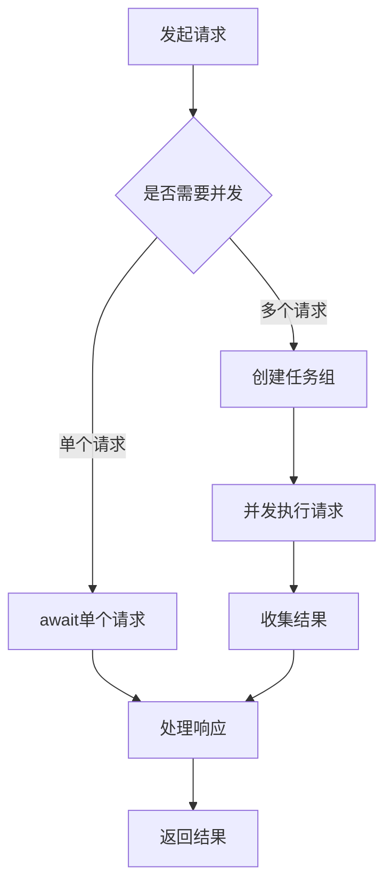

# Python 异步处理演示项目设计文档

## 概述

本项目是一个Python异步编程的综合学习演示，旨在展示asyncio库的各种使用场景和最佳实践。通过实际可运行的示例代码，帮助学习者理解异步编程的核心概念、常见模式和性能优势。

### 项目目标
- 演示Python异步编程的基本概念和语法
- 展示不同异步处理场景的实现方式
- 提供性能对比，突出异步处理的优势
- 包含错误处理和最佳实践示例

### 目标用户
- Python初学者想要学习异步编程
- 有同步编程经验但缺乏异步编程知识的开发者
- 需要理解异步编程性能优势的技术人员

## 技术栈与依赖

### 核心技术
- Python 3.8+
- asyncio (内置库)
- aiohttp (异步HTTP客户端/服务器)
- aiofiles (异步文件操作)
- asyncpg (异步PostgreSQL驱动)

### 可选依赖
- pytest-asyncio (异步测试)
- uvloop (高性能事件循环)
- rich (终端输出美化)

## 项目架构

### 目录结构
```
async-processing-demo/
├── src/
│   ├── basic_concepts/          # 基础概念演示
│   ├── http_operations/         # HTTP异步操作
│   ├── file_operations/         # 文件异步操作
│   ├── database_operations/     # 数据库异步操作
│   ├── concurrent_patterns/     # 并发模式演示
│   ├── performance_comparison/  # 性能对比测试
│   └── utils/                   # 工具模块
├── examples/                    # 独立示例脚本
├── tests/                       # 测试文件
└── docs/                        # 文档说明
```

### 模块设计

#### 基础概念模块 (basic_concepts)
展示异步编程的核心概念：

| 组件 | 功能描述 | 学习要点 |
|------|----------|----------|
| async_await_demo | async/await语法基础 | 协程定义和调用 |
| event_loop_demo | 事件循环操作 | 事件循环生命周期管理 |
| task_demo | 任务创建和管理 | Task对象的使用 |
| future_demo | Future对象使用 | Promise模式理解 |

#### HTTP操作模块 (http_operations)
演示异步HTTP请求处理：

| 组件 | 功能描述 | 应用场景 |
|------|----------|----------|
| single_request | 单个异步HTTP请求 | 基础HTTP客户端 |
| concurrent_requests | 并发HTTP请求 | 批量数据获取 |
| http_server | 异步HTTP服务器 | Web服务开发 |
| session_management | 会话管理 | 连接池优化 |

#### 文件操作模块 (file_operations)
展示异步文件I/O操作：

| 组件 | 功能描述 | 性能优势 |
|------|----------|----------|
| async_file_read | 异步文件读取 | 避免I/O阻塞 |
| batch_file_processing | 批量文件处理 | 并发处理提升效率 |
| streaming_operations | 流式文件操作 | 内存使用优化 |

#### 数据库操作模块 (database_operations)
演示异步数据库交互：

| 组件 | 功能描述 | 数据库类型 |
|------|----------|------------|
| connection_pool | 连接池管理 | PostgreSQL |
| crud_operations | 基础CRUD操作 | 通用数据库 |
| transaction_handling | 事务处理 | ACID特性保证 |

#### 并发模式模块 (concurrent_patterns)
展示常见的异步并发模式：

| 模式 | 描述 | 适用场景 |
|------|------|----------|
| producer_consumer | 生产者消费者模式 | 队列处理 |
| worker_pool | 工作池模式 | 任务分发 |
| rate_limiting | 速率限制 | API调用控制 |
| circuit_breaker | 熔断器模式 | 容错处理 |

## 功能特性设计

### 基础异步概念演示

#### 协程与任务管理
- 协程函数定义和调用方式
- 任务创建、取消和状态监控
- 异常处理和超时控制
- 协程间通信机制

#### 事件循环操作
- 事件循环的创建和销毁
- 任务调度和执行顺序
- 回调函数注册和执行
- 信号处理集成

### HTTP异步处理

#### 客户端请求模式


#### 服务器端处理流程
- 请求路由和处理器映射
- 中间件链式处理
- 响应流式传输
- WebSocket连接管理

### 文件异步操作

#### 批量文件处理流程


#### 流式处理优势
- 大文件分块读取
- 内存使用控制
- 进度监控机制
- 错误恢复策略

### 数据库异步交互

#### 连接池管理策略
| 参数 | 描述 | 推荐值 |
|------|------|--------|
| min_size | 最小连接数 | 5 |
| max_size | 最大连接数 | 20 |
| max_queries | 单连接最大查询数 | 50000 |
| max_inactive_time | 最大空闲时间 | 300秒 |

#### 事务处理模式
- 自动提交和手动事务
- 嵌套事务支持
- 死锁检测和重试
- 连接故障恢复

### 性能对比测试

#### 测试场景设计
| 测试类型 | 同步版本 | 异步版本 | 对比指标 |
|----------|----------|----------|----------|
| HTTP请求 | requests库 | aiohttp | 响应时间、吞吐量 |
| 文件I/O | open/read | aiofiles | 处理速度、CPU使用率 |
|数据库查询 | psycopg2 | asyncpg | 查询性能、连接效率 |

#### 性能监控指标
- 执行时间对比
- 内存使用情况
- CPU利用率
- 并发处理能力

## 错误处理与异常管理

### 异常处理策略

#### 常见异步异常类型
| 异常类型 | 发生场景 | 处理方式 |
|----------|----------|----------|
| TimeoutError | 操作超时 | 重试或降级处理 |
| ConnectionError | 连接失败 | 重连机制 |
| CancelledError | 任务取消 | 清理资源 |
| asyncio.InvalidStateError | 状态错误 | 状态检查 |

#### 错误恢复机制
- 指数退避重试策略
- 熔断器模式实现
- 优雅降级处理
- 日志记录和监控

### 资源管理

#### 上下文管理器使用
- 异步上下文管理器实现
- 资源自动清理
- 异常安全保证
- 嵌套资源管理

## 测试策略

### 单元测试设计

#### 异步测试框架
- pytest-asyncio集成
- 模拟异步依赖
- 测试覆盖率统计
- 性能基准测试

#### 测试用例分类
| 测试类型 | 测试范围 | 验证重点 |
|----------|----------|----------|
| 功能测试 | 各模块功能 | 正确性验证 |
| 性能测试 | 响应时间 | 效率对比 |
| 压力测试 | 并发处理 | 稳定性验证 |
| 异常测试 | 错误处理 | 健壮性检查 |

### 集成测试

#### 端到端测试场景
- 完整业务流程验证
- 多组件协作测试
- 真实环境模拟
- 数据一致性检查

## 学习路径建议

### 渐进式学习计划

#### 阶段一：基础概念
1. 理解同步与异步的区别
2. 掌握async/await语法
3. 学习事件循环原理
4. 实践简单协程示例

#### 阶段二：实际应用
1. HTTP客户端异步请求
2. 文件异步读写操作
3. 数据库异步访问
4. 并发模式应用

#### 阶段三：高级特性
1. 性能优化技巧
2. 错误处理最佳实践
3. 监控和调试方法
4. 生产环境部署

### 实践建议

#### 动手练习要点
- 每个示例都要亲自运行
- 修改参数观察性能变化
- 对比同步异步版本差异
- 尝试组合不同功能模块

#### 常见学习误区
- 过度使用异步（不是所有场景都适用）
- 忽略异常处理
- 混用同步和异步代码
- 不理解事件循环机制

## 部署与运行

### 环境要求

#### 系统要求
- Python 3.8或更高版本
- 操作系统：Windows/macOS/Linux
- 内存：建议4GB以上
- 磁盘空间：100MB

#### 可选组件
- PostgreSQL数据库（用于数据库示例）
- Redis（用于缓存示例）
- Docker（用于容器化部署）

### 运行方式

#### 快速开始
1. 安装依赖包
2. 运行基础示例
3. 查看输出结果
4. 阅读代码注释

#### 自定义配置
- 调整并发数量
- 修改超时设置
- 配置数据库连接
- 设置日志级别