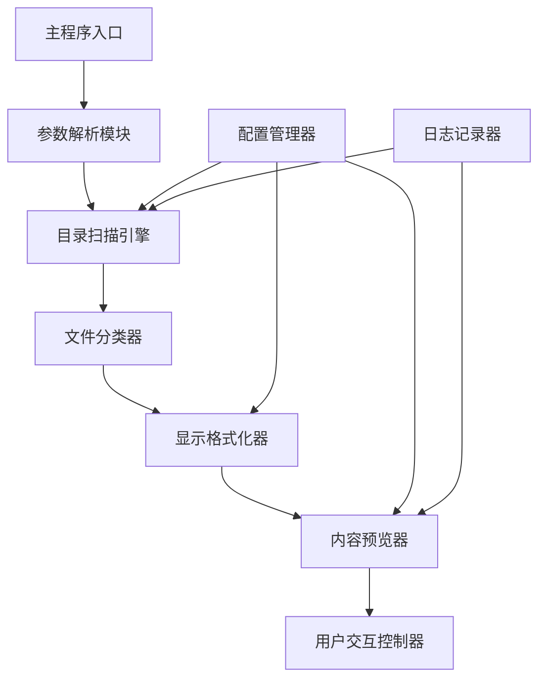

# 目录文件浏览批处理脚本设计文档

## 概述

本设计文档定义了一个Windows批处理脚本，用于递归浏览并显示当前目录下所有文件的结构和内容。该脚本将提供直观的目录树形结构展示，并支持文本文件内容的查看功能。

### 核心目标
- 递归遍历当前目录及其所有子目录
- 以树形结构显示文件和文件夹层次关系
- 显示文件基本信息（大小、修改时间等）
- 预览文本文件内容
- 提供用户友好的交互界面

## 系统架构

### 主要组件关系图



### 核心功能模块

| 模块名称 | 职责描述 | 输入 | 输出 |
|----------|----------|------|------|
| 参数解析模块 | 处理命令行参数和选项 | 命令行参数 | 配置对象 |
| 目录扫描引擎 | 递归遍历目录结构 | 起始路径 | 文件列表 |
| 文件分类器 | 根据扩展名分类文件类型 | 文件路径 | 文件类型标识 |
| 显示格式化器 | 生成树形结构显示 | 文件列表 | 格式化输出 |
| 内容预览器 | 预览文本文件内容 | 文件路径 | 文件内容摘要 |
| 用户交互控制器 | 处理用户输入和导航 | 用户命令 | 操作响应 |

## 功能规格说明

### 目录遍历功能

#### 遍历策略
- 采用深度优先搜索算法遍历目录树
- 支持跳过隐藏文件和系统文件的选项
- 提供最大深度限制功能以防止过深递归
- 支持文件大小和数量统计

#### 文件过滤机制
- 支持按文件扩展名过滤
- 支持按文件大小范围过滤
- 支持按修改时间过滤
- 提供排除特定目录的功能

### 显示格式功能

#### 树形结构展示
树形显示采用标准的ASCII字符绘制，提供清晰的层次关系视觉效果：

| 显示符号 | 含义 | 使用场景 |
|----------|------|----------|
| ├── | 中间节点连接符 | 目录或文件非最后项 |
| └── | 末尾节点连接符 | 目录或文件最后项 |
| │   | 垂直连接线 | 上级目录延续线 |
| [DIR] | 目录标识符 | 标识文件夹类型 |
| [FILE] | 文件标识符 | 标识普通文件 |

#### 文件信息显示格式
```
文件名 [文件大小] [修改时间] [文件类型]
```

### 内容预览功能

#### 支持的文件类型
| 文件类型 | 扩展名 | 预览方式 |
|----------|--------|----------|
| 文本文件 | .txt, .md, .log | 显示前10行内容 |
| 配置文件 | .ini, .conf, .cfg | 显示前10行内容 |
| 脚本文件 | .bat, .cmd, .ps1 | 显示前5行内容 |
| 数据文件 | .json, .xml, .csv | 显示前5行内容 |
| 代码文件 | .py, .js, .html, .css | 显示前5行内容 |

#### 预览限制策略
- 单个文件预览最大字符数：1000字符
- 二进制文件显示文件类型和大小信息
- 大文件（>1MB）仅显示基本信息，不预览内容
- 特殊文件（如系统文件）显示警告信息

### 用户交互功能

#### 交互式浏览模式
- 支持按键导航功能
- 提供文件详细信息查看
- 支持搜索特定文件名
- 提供快捷操作菜单

#### 导航控制命令
| 按键/命令 | 功能描述 |
|-----------|----------|
| ENTER | 查看文件详细内容 |
| q/Q | 退出程序 |
| h/H | 显示帮助信息 |
| s/S | 搜索文件名 |
| f/F | 应用文件过滤器 |

## 配置参数定义

### 命令行参数规格

| 参数名 | 短参数 | 描述 | 默认值 | 示例 |
|--------|--------|------|--------|------|
| --depth | -d | 最大遍历深度 | 无限制 | -d 3 |
| --size | -s | 显示文件大小 | true | -s false |
| --hidden | -h | 包含隐藏文件 | false | -h true |
| --filter | -f | 文件扩展名过滤 | 无 | -f "txt,log" |
| --preview | -p | 启用内容预览 | true | -p false |
| --interactive | -i | 交互式模式 | false | -i true |

### 配置文件结构

脚本支持通过配置文件自定义行为参数：

| 配置项 | 数据类型 | 描述 | 默认值 |
|--------|----------|------|--------|
| MAX_DEPTH | 整数 | 最大遍历深度 | -1 |
| SHOW_HIDDEN | 布尔值 | 显示隐藏文件 | false |
| PREVIEW_LINES | 整数 | 预览行数 | 10 |
| MAX_FILE_SIZE | 整数 | 预览文件最大大小(KB) | 1024 |
| LOG_LEVEL | 字符串 | 日志级别 | INFO |

## 性能与限制考虑

### 性能优化策略
- 实现文件扫描进度显示功能
- 对大目录结构采用分页显示
- 缓存目录扫描结果以提高重复访问速度
- 异步处理文件内容读取操作

### 系统限制
- 支持Windows 7及以上版本操作系统
- 最大单次扫描文件数量：10000个文件
- 最大单个文件预览大小：1MB
- 最大目录深度：50层

### 错误处理机制
- 权限不足时显示友好错误信息
- 文件占用时跳过并记录警告
- 路径过长时自动截断显示
- 系统资源不足时优雅降级

## 安全考虑

### 访问控制
- 遵循当前用户权限限制
- 不尝试访问受保护的系统目录
- 对敏感文件类型提供警告提示

### 数据保护
- 不修改任何被浏览的文件
- 预览模式下不执行任何文件
- 记录操作日志但不包含敏感信息

## 扩展性设计

### 插件化架构
脚本设计支持通过模块化方式扩展功能：
- 自定义文件类型识别器
- 可插拔的显示格式化器
- 扩展的内容预览器

### 输出格式支持
- 标准控制台输出
- HTML格式报告导出
- JSON格式数据导出
- CSV格式统计信息导出

## 测试策略

### 功能测试场景
- 空目录处理测试
- 深层嵌套目录测试
- 大文件数量处理测试
- 特殊字符文件名处理测试
- 权限受限目录访问测试

### 性能测试指标
- 扫描10000个文件的时间不超过30秒
- 内存使用量不超过100MB
- 支持中断和恢复操作