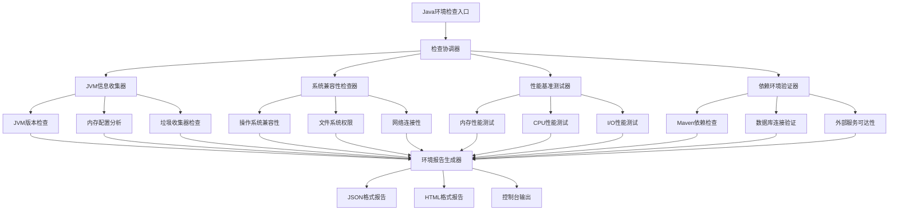
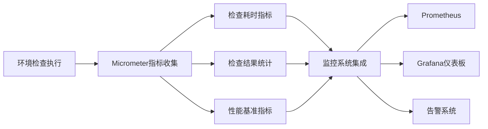
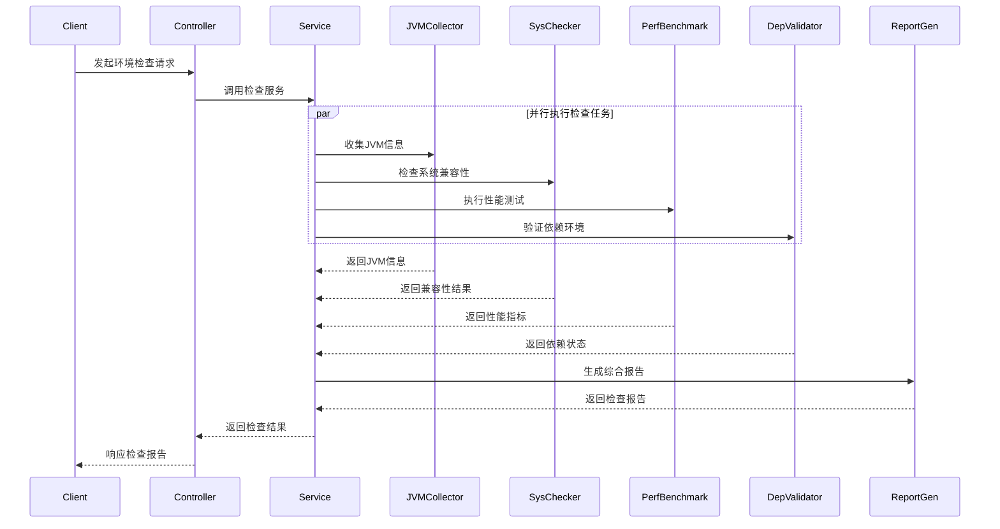
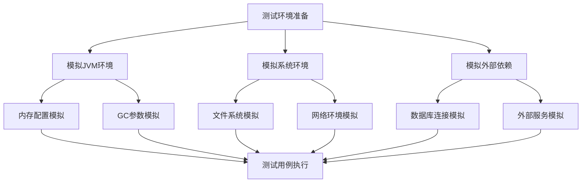

# Java环境检查系统设计文档

## 概述

Java环境检查系统是一个独立的诊断组件，用于验证和评估Java运行时环境的完整性、兼容性和性能特征。该系统将集成到现有的Java配置管理系统中，为应用程序启动前的环境预检和运行时的环境监控提供全面支持。

### 核心价值
- **环境兼容性保障**: 确保应用程序在目标Java环境中能够正常运行
- **性能基线建立**: 评估Java环境的性能特征，为优化提供数据支撑
- **问题早期发现**: 在应用启动前识别潜在的环境问题
- **运维决策支持**: 为环境升级和配置调优提供科学依据

## 技术栈与依赖

### 核心技术栈
- Spring Boot 2.7.0 作为基础框架
- Spring Boot Actuator 用于健康检查端点
- Micrometer 用于指标收集
- JMX (Java Management Extensions) 用于运行时监控

### 运行环境要求
- Java 17+ (当前环境: Java 17.0.2)
- JAVA_HOME 路径: /Users/zay/opt/jdk/jdk-17.0.2.jdk/Contents/Home
- Maven 3.6+ 用于构建管理

## 架构设计

### 系统架构图



### 组件架构

| 组件类别 | 组件名称 | 核心职责 |
|---------|----------|----------|
| 控制层 | JavaEnvironmentController | 提供REST API端点，处理检查请求 |
| 服务层 | EnvironmentCheckService | 协调各个检查器的执行流程 |
| 检查器层 | JVMInfoCollector | 收集JVM运行时信息和配置参数 |
| 检查器层 | SystemCompatibilityChecker | 验证系统级兼容性要求 |
| 检查器层 | PerformanceBenchmarker | 执行性能基准测试 |
| 检查器层 | DependencyValidator | 验证外部依赖和连接性 |
| 报告层 | EnvironmentReportGenerator | 生成多格式的检查报告 |
| 配置层 | EnvironmentCheckConfiguration | 管理检查参数和阈值配置 |

## 核心功能模块

### 1. JVM信息收集器 (JVMInfoCollector)

#### 功能描述
收集和分析Java虚拟机的详细信息，包括版本、配置参数、内存分配和垃圾收集器设置。

#### 检查项目

| 检查类别 | 具体项目 | 预期结果 | 异常处理 |
|---------|----------|----------|----------|
| Java版本 | JDK版本号、供应商信息 | Java 17+ | 版本不兼容时记录警告 |
| 内存配置 | 堆内存、非堆内存、直接内存 | 符合应用需求的最小值 | 内存不足时提供建议配置 |
| GC配置 | 垃圾收集器类型、GC参数 | 生产环境推荐配置 | 不当配置时提供优化建议 |
| JVM参数 | 启动参数、系统属性 | 关键参数完整性检查 | 缺失关键参数时警告 |

#### 数据模型

```
JVMInfo:
  - javaVersion: String
  - javaVendor: String  
  - javaHome: String
  - heapMemory: MemoryInfo
  - nonHeapMemory: MemoryInfo
  - gcCollectors: List<GCInfo>
  - jvmArguments: List<String>
  - systemProperties: Map<String, String>

MemoryInfo:
  - init: Long
  - used: Long
  - committed: Long
  - max: Long
```

### 2. 系统兼容性检查器 (SystemCompatibilityChecker)

#### 功能描述
验证操作系统环境、文件系统权限和网络配置的兼容性，确保应用程序能够在当前环境中正常运行。

#### 检查维度

| 兼容性维度 | 检查内容 | 验证方法 |
|-----------|----------|----------|
| 操作系统 | OS类型、版本、架构 | 系统属性读取和命令执行 |
| 文件系统 | 读写权限、磁盘空间 | 临时文件创建和空间查询 |
| 网络环境 | 网络接口、DNS解析 | 连接测试和域名解析 |
| 环境变量 | JAVA_HOME、PATH配置 | 环境变量验证和路径检查 |

### 3. 性能基准测试器 (PerformanceBenchmarker)

#### 功能描述
执行标准化的性能测试，评估Java环境的计算、内存和I/O性能特征，建立性能基线。

#### 测试套件

| 测试类型 | 测试项目 | 测试方法 | 性能指标 |
|---------|----------|----------|----------|
| CPU性能 | 数学运算、字符串处理 | 基准算法执行时间测量 | 操作吞吐量 (ops/sec) |
| 内存性能 | 对象创建、垃圾回收 | 内存分配和回收效率测试 | 分配速率 (MB/sec) |
| I/O性能 | 文件读写、网络传输 | 标准I/O操作时间测量 | 传输速率 (MB/sec) |
| 并发性能 | 线程创建、同步操作 | 多线程场景性能测试 | 并发处理能力 |

#### 性能基线建立


### 4. 依赖环境验证器 (DependencyValidator)

#### 功能描述
验证应用程序所需的外部依赖、服务连接和资源可用性，确保完整的运行环境就绪。

#### 验证范围

| 依赖类型 | 验证内容 | 验证策略 |
|---------|----------|----------|
| Maven依赖 | JAR文件完整性、版本冲突 | 类路径扫描和版本解析 |
| 数据库连接 | 连接参数、权限验证 | 连接测试和基本操作验证 |
| 外部服务 | API可达性、响应时间 | HTTP连接测试和响应验证 |
| 文件资源 | 配置文件、静态资源 | 文件存在性和可读性检查 |

## API接口规范

### REST端点定义

| HTTP方法 | 路径 | 功能描述 | 响应格式 |
|---------|------|----------|----------|
| GET | /api/environment/check | 执行完整环境检查 | EnvironmentCheckReport |
| GET | /api/environment/jvm | 获取JVM信息 | JVMInfo |
| GET | /api/environment/system | 获取系统兼容性信息 | SystemCompatibilityInfo |
| GET | /api/environment/performance | 执行性能基准测试 | PerformanceBenchmarkReport |
| GET | /api/environment/dependencies | 验证依赖环境 | DependencyValidationReport |

### 响应数据模型

#### 环境检查报告结构

```
EnvironmentCheckReport:
  - checkId: String
  - timestamp: LocalDateTime
  - overallStatus: CheckStatus (PASS, WARN, FAIL)
  - checkResults: List<CheckResult>
  - performanceMetrics: PerformanceMetrics
  - recommendations: List<String>
  - reportSummary: ReportSummary

CheckResult:
  - category: String
  - item: String
  - status: CheckStatus
  - actualValue: String
  - expectedValue: String
  - message: String
  - severity: Severity (INFO, WARN, ERROR)
```

## 配置管理

### 检查配置参数

| 配置类别 | 参数名称 | 默认值 | 描述 |
|---------|----------|--------|------|
| JVM检查 | jvm.min-heap-size | 512MB | 最小堆内存要求 |
| JVM检查 | jvm.min-java-version | 11 | 最低Java版本要求 |
| 性能测试 | benchmark.cpu-test-duration | 5000ms | CPU测试持续时间 |
| 性能测试 | benchmark.memory-test-iterations | 1000 | 内存测试迭代次数 |
| 依赖验证 | dependency.connection-timeout | 5000ms | 连接超时时间 |
| 依赖验证 | dependency.retry-attempts | 3 | 重试次数 |

### 配置文件示例

```
environment-check:
  jvm:
    min-heap-size: 1024MB
    min-java-version: 17
    required-gc-collectors: [G1GC, ZGC]
  
  system:
    required-disk-space: 10GB
    required-memory: 4GB
  
  performance:
    benchmark-enabled: true
    cpu-test-duration: 10000ms
    memory-test-iterations: 2000
  
  dependencies:
    database-check-enabled: true
    external-service-check-enabled: true
    connection-timeout: 10000ms
```

## 监控与健康检查

### Spring Boot Actuator集成

#### 自定义健康检查端点

| 端点路径 | 功能描述 | 健康状态判断 |
|---------|----------|-------------|
| /actuator/health/java-env | Java环境健康状态 | JVM关键指标是否正常 |
| /actuator/health/system-compat | 系统兼容性状态 | 关键系统资源是否可用 |
| /actuator/health/dependencies | 依赖环境状态 | 外部依赖是否可连接 |

#### 指标收集



## 执行流程设计

### 检查执行工作流



### 异常处理策略

| 异常类型 | 处理策略 | 用户反馈 |
|---------|----------|----------|
| JVM信息获取失败 | 记录警告，继续其他检查 | 显示部分检查结果 |
| 性能测试超时 | 终止测试，使用默认值 | 提示性能测试未完成 |
| 外部依赖不可达 | 标记为失败，记录详情 | 显示连接失败原因 |
| 配置文件错误 | 使用默认配置，记录警告 | 提示使用默认配置 |

## 单元测试策略

### 测试覆盖范围

| 测试类别 | 测试重点 | 覆盖目标 |
|---------|----------|----------|
| 单元测试 | 各检查器的核心逻辑 | 代码覆盖率 > 90% |
| 集成测试 | 检查流程的端到端验证 | 主要业务场景覆盖 |
| 性能测试 | 检查执行时间和资源消耗 | 性能基线建立 |
| 兼容性测试 | 不同Java版本和OS环境 | 目标环境兼容性验证 |

### 测试数据准备

