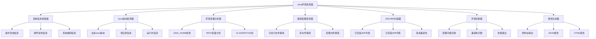
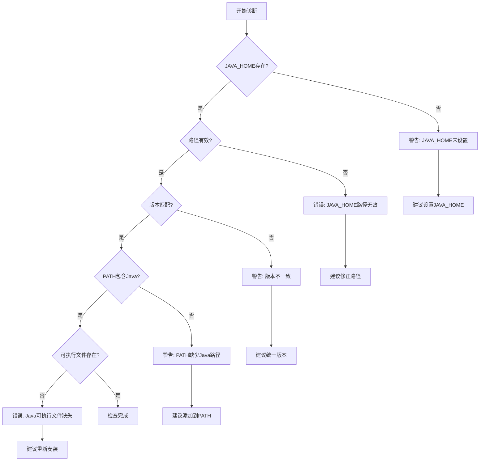
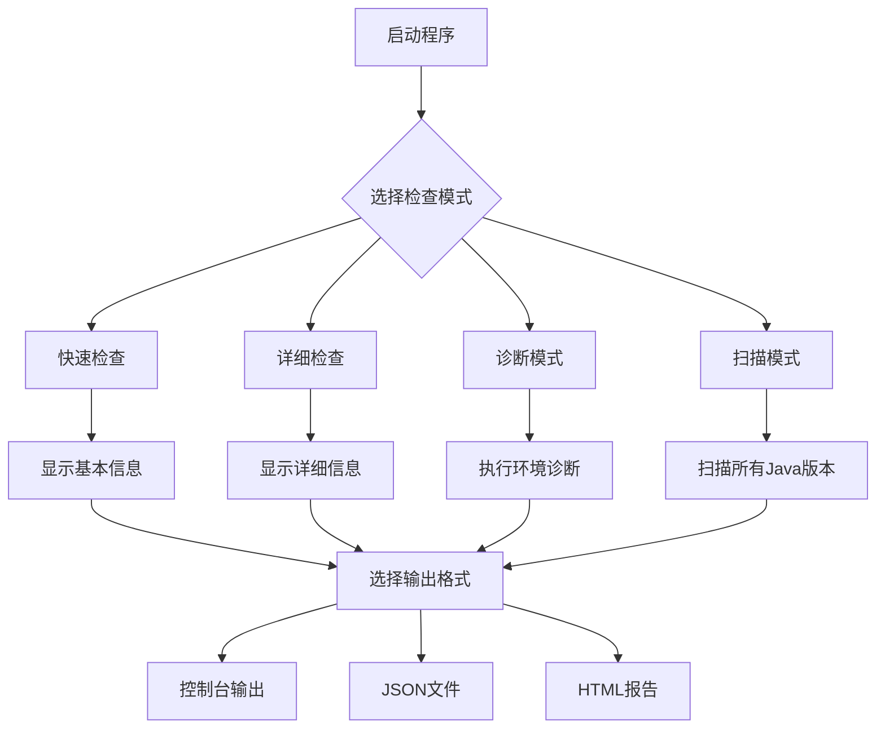
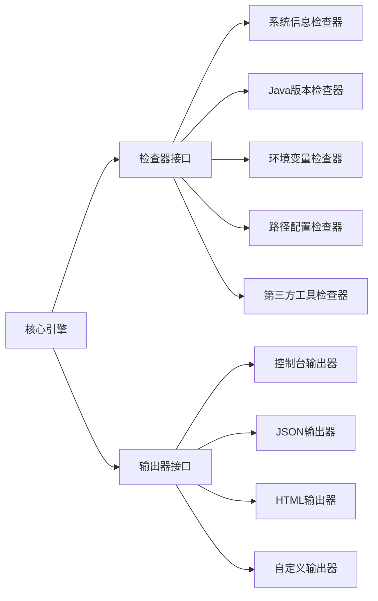

# 本地Java环境检查工具设计文档

## 概述

本工具旨在提供全面的本地Java环境检查功能，帮助开发者快速了解和诊断当前系统的Java运行环境状态。工具将检测Java版本、环境变量、路径配置、已安装的JDK/JRE版本等关键信息，并提供环境问题的诊断建议。

## 技术栈与依赖

### 核心技术
- Java SE 8+ 
- 系统属性访问 (System.getProperty)
- 环境变量访问 (System.getenv) 
- 文件系统操作 (java.io.File)
- 进程执行 (ProcessBuilder)

### 输出格式
- 控制台文本输出
- JSON格式输出
- HTML报告生成

## 架构设计

### 整体架构



### 核心组件设计

#### 1. 系统信息收集器 (SystemInfoCollector)

**职责**: 收集操作系统和硬件相关信息

**收集信息**:

| 信息类型 | 系统属性键 | 描述 |
|---------|-----------|------|
| 操作系统 | os.name | 操作系统名称 |
| 系统版本 | os.version | 操作系统版本 |
| 系统架构 | os.arch | 处理器架构 |
| 用户目录 | user.home | 用户主目录 |
| 工作目录 | user.dir | 当前工作目录 |
| 临时目录 | java.io.tmpdir | 临时文件目录 |
| 文件编码 | file.encoding | 默认文件编码 |
| 系统编码 | sun.jnu.encoding | 系统字符编码 |

#### 2. Java版本检测器 (JavaVersionDetector)

**职责**: 检测当前运行的Java版本和相关信息

**检测内容**:

| 检测项 | 系统属性键 | 用途 |
|-------|-----------|------|
| Java版本 | java.version | 完整版本号 |
| Java规范版本 | java.specification.version | 规范版本 |
| Java供应商 | java.vendor | JVM供应商 |
| JVM名称 | java.vm.name | 虚拟机名称 |
| JVM版本 | java.vm.version | 虚拟机版本 |
| JVM供应商 | java.vm.vendor | 虚拟机供应商 |
| 运行时名称 | java.runtime.name | 运行时环境名称 |
| 运行时版本 | java.runtime.version | 运行时版本 |

#### 3. 环境变量分析器 (EnvironmentVariableAnalyzer)

**职责**: 分析Java相关的环境变量配置

**分析项目**:

| 环境变量 | 重要性 | 检查内容 |
|---------|--------|---------|
| JAVA_HOME | 关键 | 是否存在、路径有效性、版本匹配 |
| PATH | 关键 | 是否包含Java可执行文件路径 |
| CLASSPATH | 重要 | 类路径配置、jar文件有效性 |
| JRE_HOME | 可选 | JRE路径配置 |
| JAVA_OPTS | 可选 | JVM启动参数 |
| MAVEN_HOME | 可选 | Maven配置 |
| GRADLE_HOME | 可选 | Gradle配置 |

#### 4. 路径配置检查器 (PathConfigurationChecker)

**职责**: 检查Java相关的路径配置和文件存在性

**检查路径**:

```mermaid
graph LR
    A[路径检查] --> B[JAVA_HOME路径]
    A --> C[可执行文件路径]
    A --> D[库文件路径]
    A --> E[扩展库路径]
    
    B --> B1[/bin目录]
    B --> B2[/lib目录]
    B --> B3[/conf目录]
    
    C --> C1[java可执行文件]
    C --> C2[javac编译器]
    C --> C3[jar工具]
    C --> C4[javadoc工具]
    
    D --> D1[rt.jar核心库]
    D --> D2[tools.jar工具库]
    D --> D3[其他系统库]
    
    E --> E1[ext扩展目录]
    E --> E2[endorsed目录]
```

#### 5. JDK/JRE扫描器 (JdkJreScanner)

**职责**: 扫描系统中已安装的所有JDK和JRE版本

**扫描策略**:

| 操作系统 | 扫描路径 | 备注 |
|---------|---------|------|
| Windows | C:\Program Files\Java\ | 标准安装路径 |
| Windows | C:\Program Files (x86)\Java\ | 32位程序路径 |
| macOS | /System/Library/Java/JavaVirtualMachines/ | 系统Java |
| macOS | /Library/Java/JavaVirtualMachines/ | 用户安装Java |
| Linux | /usr/lib/jvm/ | 系统包管理安装 |
| Linux | /opt/java/ | 手动安装路径 |
| Linux | /usr/java/ | Oracle官方安装 |

#### 6. 环境诊断器 (EnvironmentDiagnostic)

**职责**: 诊断Java环境配置问题并提供建议

**诊断类别**:

| 诊断类别 | 检查项目 | 问题类型 |
|---------|---------|---------|
| 基础配置 | JAVA_HOME设置 | 缺失、路径错误、版本不匹配 |
| 路径配置 | PATH变量 | Java路径缺失、路径顺序问题 |
| 版本兼容 | JDK版本 | 版本过旧、版本冲突 |
| 权限问题 | 文件权限 | 执行权限、读写权限 |
| 性能配置 | JVM参数 | 内存配置、垃圾收集器设置 |

**诊断流程**:



## 数据模型设计

### 系统信息模型

| 字段名 | 类型 | 描述 |
|-------|------|------|
| operatingSystem | String | 操作系统名称 |
| osVersion | String | 操作系统版本 |
| architecture | String | 系统架构 |
| userName | String | 当前用户名 |
| userHome | String | 用户主目录 |
| workingDirectory | String | 当前工作目录 |
| tempDirectory | String | 临时目录 |
| fileEncoding | String | 文件编码 |
| systemEncoding | String | 系统编码 |

### Java环境信息模型

| 字段名 | 类型 | 描述 |
|-------|------|------|
| javaVersion | String | Java版本号 |
| javaSpecVersion | String | Java规范版本 |
| javaVendor | String | Java供应商 |
| javaHome | String | Java安装目录 |
| vmName | String | 虚拟机名称 |
| vmVersion | String | 虚拟机版本 |
| vmVendor | String | 虚拟机供应商 |
| runtimeName | String | 运行时名称 |
| runtimeVersion | String | 运行时版本 |

### 环境变量模型

| 字段名 | 类型 | 描述 |
|-------|------|------|
| javaHome | String | JAVA_HOME环境变量 |
| pathVariable | String | PATH环境变量 |
| classPath | String | CLASSPATH环境变量 |
| jreHome | String | JRE_HOME环境变量 |
| javaOpts | String | JAVA_OPTS参数 |
| mavenHome | String | MAVEN_HOME路径 |
| gradleHome | String | GRADLE_HOME路径 |

### 安装版本模型

| 字段名 | 类型 | 描述 |
|-------|------|------|
| installPath | String | 安装路径 |
| version | String | 版本号 |
| vendor | String | 供应商 |
| type | String | 类型(JDK/JRE) |
| architecture | String | 架构 |
| isActive | Boolean | 是否为当前活动版本 |

### 诊断结果模型

| 字段名 | 类型 | 描述 |
|-------|------|------|
| category | String | 诊断类别 |
| level | String | 问题级别(INFO/WARN/ERROR) |
| message | String | 问题描述 |
| suggestion | String | 建议解决方案 |
| affectedComponent | String | 影响的组件 |

## 功能特性设计  

### 基础检查功能

1. **Java版本信息显示**
   - 当前Java版本详细信息
   - JVM实现信息
   - 运行时环境信息
   - 支持的Java特性

2. **系统环境信息**
   - 操作系统详细信息
   - 硬件架构信息
   - 用户和目录信息
   - 字符编码设置

3. **环境变量检查**
   - 关键环境变量存在性检查
   - 路径配置有效性验证
   - 环境变量值展示和分析

### 高级检查功能

4. **多版本Java扫描**
   - 系统中所有Java安装检测
   - 版本信息对比
   - 活动版本识别
   - 版本切换建议

5. **配置诊断**
   - 环境配置问题自动诊断
   - 常见问题识别和解决建议
   - 兼容性问题检查
   - 性能优化建议

6. **工具链检查**
   - 开发工具环境检查(Maven, Gradle)
   - IDE配置检查建议
   - 构建工具兼容性

### 输出格式选项

7. **多格式输出**
   - 控制台友好格式
   - JSON结构化数据
   - HTML可视化报告
   - 导出到文件选项

## 用户交互设计

### 命令行界面



### 交互流程

**基础使用流程**:
1. 用户启动工具
2. 选择检查类型(快速/详细/诊断/扫描)
3. 系统执行相应检查
4. 选择输出格式
5. 展示结果或保存到文件

**错误处理流程**:
1. 检测到环境问题
2. 分类问题级别
3. 提供解决建议
4. 可选择详细诊断模式

## 性能与安全考虑

### 性能优化策略

1. **并行检查**: 独立的检查项目并发执行
2. **结果缓存**: 重复检查时使用缓存结果
3. **按需扫描**: 根据用户选择进行有针对性的检查
4. **资源管理**: 及时关闭文件句柄和进程资源

### 安全注意事项

1. **权限控制**: 仅读取必要的系统信息，不修改任何配置
2. **路径验证**: 验证路径有效性，防止路径遍历攻击
3. **敏感信息**: 避免在输出中暴露敏感的系统信息
4. **异常处理**: 妥善处理权限不足等异常情况

## 扩展性设计

### 插件化架构



### 可扩展点

1. **检查器扩展**: 支持添加新的环境检查模块
2. **输出格式扩展**: 支持新的输出格式和报告样式
3. **诊断规则扩展**: 支持自定义诊断规则和建议
4. **平台适配扩展**: 支持新的操作系统平台适配

## 测试策略

### 单元测试范围

| 测试模块 | 测试重点 | 覆盖场景 |
|---------|---------|---------|
| 系统信息收集 | 属性读取准确性 | 各种操作系统环境 |
| Java版本检测 | 版本解析正确性 | 不同Java版本 |
| 环境变量分析 | 变量解析逻辑 | 存在/不存在/格式错误 |
| 路径检查 | 路径有效性验证 | 有效/无效/权限问题 |
| 多版本扫描 | 版本发现准确性 | 多版本共存环境 |
| 诊断引擎 | 问题识别准确性 | 各种配置问题场景 |

### 集成测试场景

1. **多操作系统测试**: Windows, macOS, Linux各版本
2. **多Java版本测试**: Oracle JDK, OpenJDK, 其他实现
3. **环境配置测试**: 正常配置、异常配置、缺失配置
4. **权限测试**: 有限权限环境下的工具行为

## 部署和分发

### 打包策略

1. **独立可执行包**: 包含所有依赖的可执行jar
2. **原生可执行文件**: 使用GraalVM编译为原生执行文件
3. **脚本封装**: 提供便捷的启动脚本

### 分发渠道

1. **命令行工具**: 作为独立的命令行实用程序
2. **开发环境集成**: 集成到IDE或构建工具中
3. **CI/CD集成**: 作为持续集成环境检查工具
4. **在线工具**: 提供Web版本的环境检查