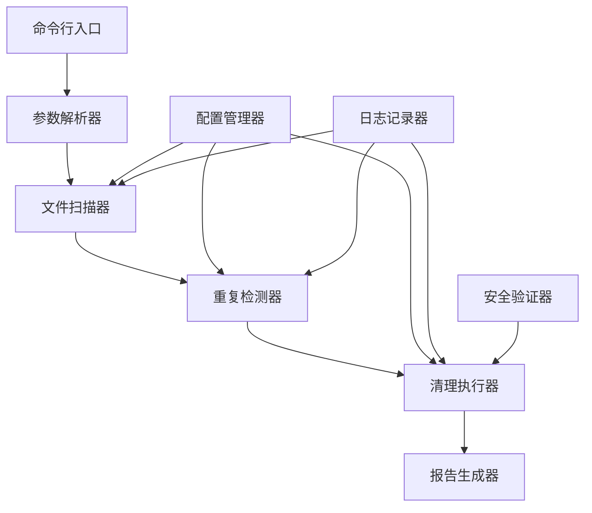
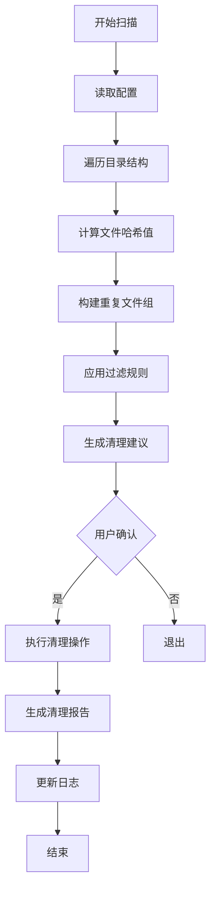
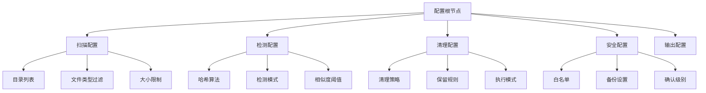
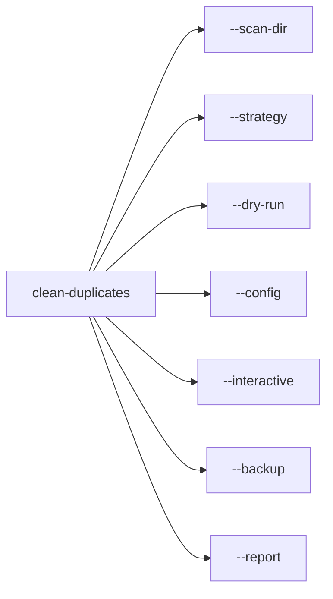

#清理重复文件脚本设计文档

## 概述

设计一个智能的重复文件清理脚本，能够扫描指定目录，识别重复文件，并提供安全的清理选项。该脚本将作为linux-file-commands项目的扩展功能，为用户提供文件管理的实用工具。

## 技术栈与依赖

- **核心语言**: Python 3.6+
- **文件处理**: hashlib (内置), pathlib (内置)
- **用户界面**: argparse (命令行), rich (可选，美化输出)
- **系统集成**: os, shutil (内置)
- **配置管理**: json, configparser## 架构设计

### 核心组件架构



### 工作流程设计



##文件扫描器设计

### 扫描策略

| 策略类型 | 描述 | 使用场景 |
|---------|------|----------|
| 递归扫描 | 深度遍历所有子目录 | 全面清理 |
| 单层扫描 | 仅扫描指定目录 |快速清理 |
| 选择性扫描 | 根据文件类型过滤 | 特定类型清理 |
| 大小优先 | 优先扫描大文件 | 释放存储空间 |

### 文件信息收集

扫描器将收集以下文件属性用于重复检测：

- **基础属性**: 文件大小、修改时间、创建时间
- **内容特征**: MD5哈希值、SHA256哈希值（可选）
- **路径信息**: 绝对路径、相对路径、目录深度
- **扩展信息**: 文件类型、权限、所有者

## 重复检测器设计

###检测算法


### 哈希策略

| 哈希类型 | 速度 | 准确性 | 使用场景 |
|---------|------|--------|----------|
| 快速哈希 | 极快 | 中等 | 初步筛选 |
| MD5 | 快 | 高| 一般检测 |
| SHA256 | 中等 | 极高 | 安全要求高 |
| 混合策略 | 自适应 | 高 | 推荐使用 |

### 重复判定规则

- **严格模式**: 内容完全相同（基于哈希值）
-**相似模式**: 文件名相似且大小相同
- **智能模式**: 结合文件名、大小、修改时间的综合判断

## 清理执行器设计

### 清理策略

| 策略名称 | 保留规则 | 适用场景 |
|---------|----------|----------|
| 保留最新 | 保留修改时间最新的文件 | 日常文件管理 |
| 保留最旧 | 保留创建时间最早的文件 | 历史文件保护 |
| 保留路径最短 | 保留路径层级最少的文件 | 目录结构优化 |
| 保留特定目录 | 保留指定目录中的文件 | 重要目录保护 |
| 手动选择 | 用户交互式选择 | 精确控制 |

### 安全机制

- **备份模式**: 清理前自动备份
- **回收站模式**: 移动到回收站而非直接删除
- **试运行模式**: 仅显示将要执行的操作
- **白名单保护**: 保护关键文件和目录
- **确认机制**: 多重确认防止误删

## 配置管理设计

### 配置文件结构



### 配置参数定义

| 参数类别 | 参数名 | 默认值 | 描述 |
|---------|--------|--------|------|
| 扫描配置 | max_depth | 10 | 最大扫描深度 |
| 扫描配置 | min_file_size | 1KB | 最小文件大小 |
| 扫描配置 | file_extensions | [".jpg", ".png", ".mp4"] | 关注的文件类型 |
| 检测配置 | hash_algorithm | "md5" | 使用的哈希算法 |
| 检测配置 | similarity_threshold | 0.95 | 相似度阈值 |
| 清理配置 | cleanup_strategy | "keep_newest" | 默认清理策略 |
| 清理配置 | execution_mode | "dry_run"| 执行模式 |

## 用户界面设计

### 命令行接口



### 交互模式流程

``mermaid
sequenceDiagram
    participant U as 用户
    participant S as 脚本
    participant F as 文件系统
    
    U->>S: 启动扫描
    S->>F: 遍历目录
    F-->>S: 返回文件列表
    S->>S:检测重复文件
    S->>U: 显示重复文件组
    U->>S: 选择清理策略
    S->>U: 显示清理预览
    U->>S: 确认执行
    S->>F: 执行清理操作
    S->>U: 显示清理结果
```

### 输出格式设计

| 输出格式 | 内容 | 使用场景 |
|---------|------|----------|
| 简洁格式 | 基本统计信息 | 快速查看 |
| 详细格式 | 完整的重复文件列表| 审查确认 |
| JSON格式 | 结构化数据 | 程序集成 |
| HTML报告 | 可视化报告 | 存档分享 |

## 安全与风险控制

### 安全检查机制

``mermaid
flowchart TD
    A[文件操作请求] --> B[路径验证]
    B --> C[权限检查]
    C --> D[白名单验证]
    D --> E[备份检查]
    E --> F[用户确认]
    F --> G[执行操作]
    
    B -->|失败| H[拒绝操作]
    C -->|失败| H
    D -->|失败| H
    E -->|失败| H
    F -->|拒绝| H
```

### 风险评估等级

| 风险等级 | 描述 | 处理方式 |
|---------|------|----------|
| 低风险| 临时文件、缓存文件 | 自动清理 |
| 中风险 | 用户文档、媒体文件 | 需要确认 |
| 高风险 | 系统文件、配置文件 | 禁止操作 |
| 极高风险 | 根目录、重要系统目录 | 强制保护 |

## 性能优化设计

### 优化策略

| 优化方向 | 策略 | 预期效果 |
|---------|------|----------|
| I/O优化 | 多线程文件扫描 | 提升50%扫描速度 |
| 内存优化 | 分批处理大文件 | 降低内存占用 |
| 算法优化 | 快速哈希预筛选 | 减少80%计算量 |
| 缓存优化 | 哈希值缓存 | 避免重复计算 |

### 性能监控

``mermaid
graphTB
    A[性能监控] --> B[扫描速度]
    A --> C[内存使用]
    A --> D[磁盘I/O]
    A --> E[CPU使用率]
    
    B --> B1[文件/秒]
    B --> B2[目录/秒]
    
    C --> C1[峰值内存]
    C --> C2[平均内存]
    
    D --> D1[读取速度]
    D --> D2[写入速度]
```

## 日志与审计

### 日志级别设计

| 级别 | 内容 | 用途 |
|------|------|------|
| DEBUG | 详细的执行过程 | 问题诊断 |
| INFO | 重要操作记录 | 操作追踪 |
| WARNING | 潜在问题提醒 | 风险提示 |
| ERROR | 错误信息 | 故障排查 |
| CRITICAL | 严重错误 | 紧急处理 |

### 审计信息记录

- **操作记录**: 时间戳、操作类型、影响文件
- **用户行为**: 用户选择、确认操作
- **系统状态**: 清理前后的磁盘使用情况
- **错误追踪**: 异常信息、堆栈跟踪

##扩展性设计

### 插件架构

``mermaid
graphTB
    A[核心引擎] --> B[检测器插件接口]
    A --> C[清理器插件接口]
    A --> D[报告器插件接口]
    
    B --> B1[图片相似度检测]
    B --> B2[视频重复检测]
    B --> B3[文档内容检测]
C --> C1[云存储清理]
    C --> C2[压缩归档]
    C --> C3[移动重组织]
    
    D --> D1[邮件报告]
    D --> D2[图表生成]
    D --> D3[数据库记录]
```

### 集成接口

- **命令行集成**: 与现有linux-file-commands工具集成
- **GUI界面**: 提供图形化操作界面
- **API接口**: 支持其他应用调用
- **配置管理**: 与系统配置工具集成

## 测试策略

### 测试层次| 测试类型 | 覆盖范围 | 工具 |
|---------|----------|------|
| 单元测试 | 核心算法、工具函数 | pytest |
| 集成测试 | 模块间协作 | pytest |
| 功能测试 | 端到端场景| behave |
| 性能测试 | 大文件、大目录场景 | pytest-benchmark |
| 安全测试 | 权限、路径安全 | 自定义测试 |

### 测试数据准备

``mermaid
graphLRA[测试环境] --> B[创建测试目录]
    B --> C[生成重复文件]
    C --> D[设置文件权限]
    D --> E[创建符号链接]
    E --> F[准备配置文件]
```

## 部署与维护

### 部署方式

- **独立脚本**: 单文件执行，无依赖
- **包管理器**: 通过pip安装
- **容器化**: Docker镜像部署
- **系统集成**: 系统工具集成

### 维护策略

- **版本管理**: 语义化版本控制
- **更新机制**: 自动检查更新
- **配置迁移**: 版本间配置兼容
- **问题反馈**: 用户反馈收集机制
