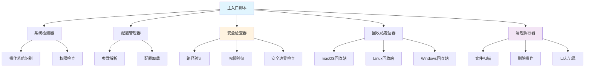
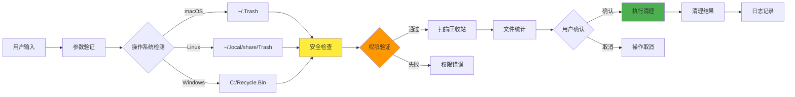
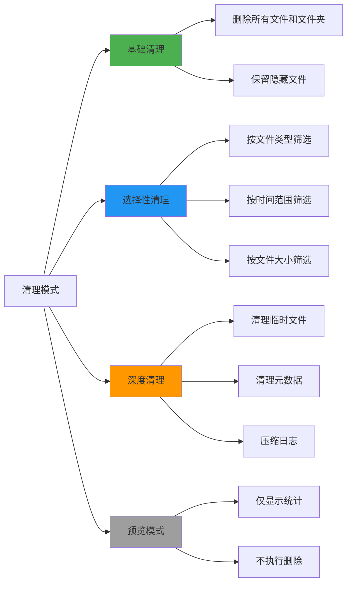
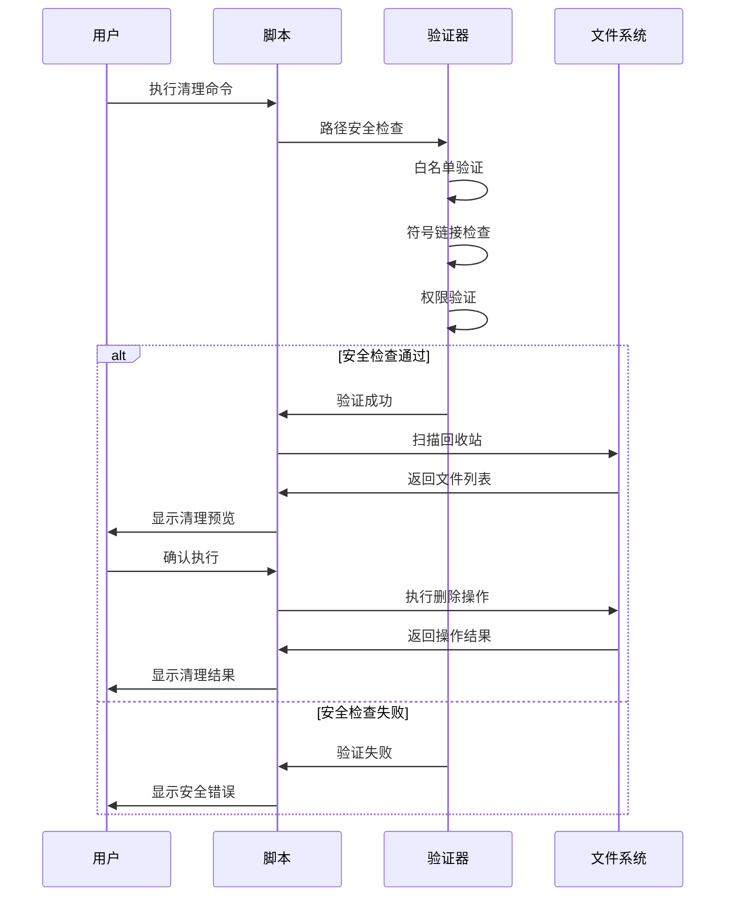
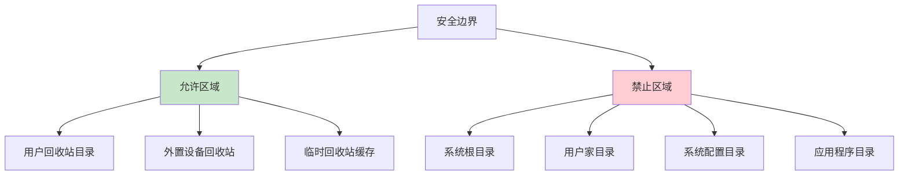
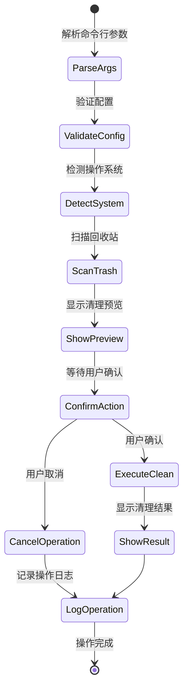
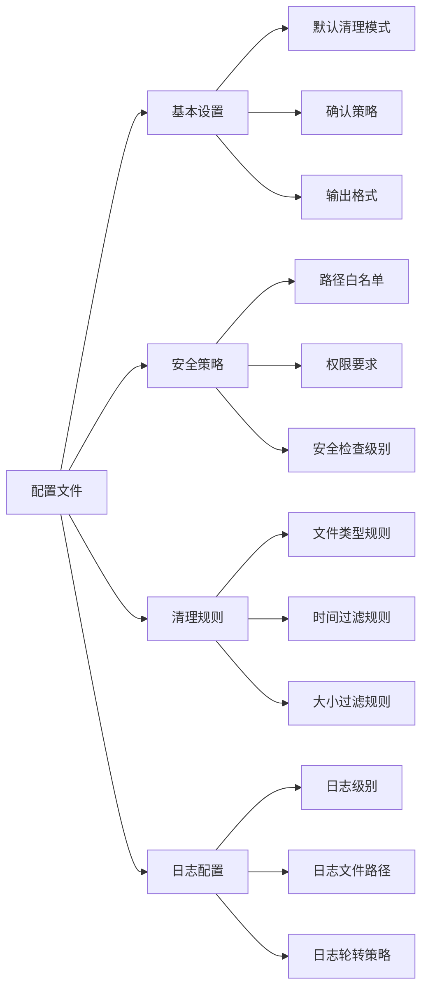
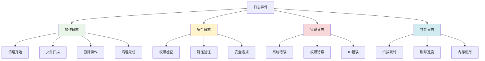
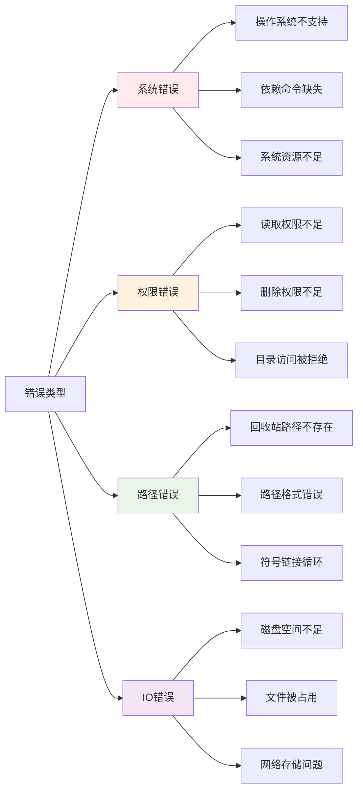
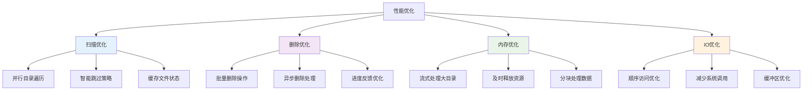

# 回收站清理脚本系统设计

## 概述

设计一个安全可靠的Shell脚本系统，专门用于清理本机回收站内容。该系统将根据不同操作系统自动识别回收站位置，并提供多种清理选项，确保只删除回收站内容而不影响其他系统目录。

### 核心价值
- **安全性**：严格限制操作范围在回收站目录内，防止误删系统文件
- **跨平台支持**：自动识别不同操作系统的回收站位置
- **可控性**：提供多种清理模式，用户可选择清理范围和确认方式
- **可追溯性**：详细记录清理操作，支持操作审计

## 技术栈与依赖

| 组件 | 技术选型 | 说明 |
|------|----------|------|
| 脚本语言 | Bash Shell | 系统原生支持，兼容性好 |
| 配置管理 | JSON/INI文件 | 结构化配置存储 |
| 日志系统 | 文本日志 | 简单可靠的日志记录 |
| 用户交互 | 命令行界面 | 提供交互式和批处理模式 |
| 安全检查 | 路径白名单 | 严格的目录访问控制 |

## 系统架构

### 核心组件架构



### 数据流架构



## 回收站路径映射

### 不同系统回收站位置表

| 操作系统 | 回收站路径 | 备注 |
|----------|------------|------|
| macOS | `~/.Trash/` | 用户级回收站 |
| macOS | `/Volumes/*/Trash/` | 外置存储设备回收站 |
| Linux (GNOME) | `~/.local/share/Trash/files/` | 标准XDG规范 |
| Linux (KDE) | `~/.local/share/Trash/files/` | 遵循同一规范 |
| Linux (通用) | `~/.trash/` | 部分发行版使用 |
| Windows | `C:\$Recycle.Bin\` | 系统级回收站 |
| Windows | `C:\RECYCLER\` | 旧版本Windows |

### 路径安全验证规则

| 验证类型 | 规则描述 | 实现方式 |
|----------|----------|----------|
| 路径白名单 | 仅允许操作预定义的回收站路径 | 硬编码路径列表匹配 |
| 路径深度检查 | 限制操作路径的目录深度 | 路径分割符计数验证 |
| 符号链接防护 | 防止通过软链接访问非回收站目录 | readlink检查真实路径 |
| 绝对路径验证 | 确保所有路径都是绝对路径 | 路径规范化处理 |
| 父目录检查 | 验证操作目录的父目录合法性 | 逐级目录验证 |

## 清理策略与模式

### 清理模式定义



### 筛选条件配置

| 筛选类型 | 配置参数 | 默认值 | 说明 |
|----------|----------|--------|------|
| 文件类型 | `--type` | `all` | 可选: files, dirs, all |
| 修改时间 | `--older-than` | 无限制 | 格式: 7d, 30d, 1m |
| 文件大小 | `--size-limit` | 无限制 | 格式: 100M, 1G |
| 文件名模式 | `--pattern` | `*` | 支持通配符匹配 |
| 深度限制 | `--max-depth` | 无限制 | 目录遍历深度 |

## 安全机制设计

### 多层安全检查流程



### 权限管理策略

| 权限级别 | 访问范围 | 安全措施 |
|----------|----------|----------|
| 用户级 | 仅用户回收站 | 无需特殊权限 |
| 系统级 | 系统回收站 | 需要管理员权限 |
| 设备级 | 外置设备回收站 | 检查设备挂载状态 |

### 安全边界定义



## 用户交互界面

### 命令行参数设计

| 参数 | 长格式 | 类型 | 默认值 | 说明 |
|------|--------|------|--------|------|
| `-h` | `--help` | 开关 | - | 显示帮助信息 |
| `-v` | `--verbose` | 开关 | false | 详细输出模式 |
| `-y` | `--yes` | 开关 | false | 自动确认，跳过交互 |
| `-n` | `--dry-run` | 开关 | false | 预览模式，不实际删除 |
| `-t` | `--type` | 字符串 | all | 清理类型(files/dirs/all) |
| `-d` | `--older-than` | 字符串 | - | 时间过滤条件 |
| `-s` | `--size-limit` | 字符串 | - | 大小过滤条件 |
| `-p` | `--pattern` | 字符串 | * | 文件名匹配模式 |
| `-c` | `--config` | 路径 | ~/.trash-cleaner.conf | 配置文件路径 |
| `-l` | `--log` | 路径 | ~/.trash-cleaner.log | 日志文件路径 |

### 交互流程设计



### 输出格式设计

#### 预览模式输出示例

| 项目 | 数量 | 大小 | 最老文件时间 |
|------|------|------|-------------|
| 文件 | 127 | 2.3GB | 2024-01-15 |
| 文件夹 | 15 | - | 2024-02-01 |
| 总计 | 142 | 2.3GB | - |

#### 清理结果输出示例

| 状态 | 数量 | 大小 | 说明 |
|------|------|------|------|
| ✅ 成功删除 | 140 | 2.2GB | 正常清理 |
| ❌ 删除失败 | 2 | 100MB | 权限不足 |
| ⏭️ 跳过文件 | 0 | 0B | 无跳过文件 |

## 配置管理

### 配置文件结构



### 配置参数表

| 配置项 | 类型 | 默认值 | 说明 |
|--------|------|--------|------|
| `default_mode` | 字符串 | "interactive" | 默认清理模式 |
| `confirm_deletion` | 布尔 | true | 是否需要确认删除 |
| `max_file_age_days` | 整数 | 0 | 文件最大保留天数(0=无限制) |
| `min_file_size_mb` | 整数 | 0 | 最小文件大小限制 |
| `enable_logging` | 布尔 | true | 是否启用日志记录 |
| `log_retention_days` | 整数 | 30 | 日志保留天数 |
| `color_output` | 布尔 | true | 是否使用彩色输出 |
| `progress_bar` | 布尔 | true | 是否显示进度条 |

## 日志与审计

### 日志记录策略



### 日志格式定义

| 字段名 | 类型 | 示例值 | 说明 |
|--------|------|--------|------|
| timestamp | ISO8601 | 2024-12-20T10:30:00Z | 操作时间戳 |
| level | 字符串 | INFO/WARN/ERROR | 日志级别 |
| operation | 字符串 | SCAN/DELETE/VERIFY | 操作类型 |
| path | 字符串 | ~/.Trash/ | 操作路径 |
| count | 整数 | 125 | 文件数量 |
| size | 整数 | 2147483648 | 文件大小(字节) |
| duration | 浮点数 | 1.234 | 操作耗时(秒) |
| status | 字符串 | SUCCESS/FAILED | 操作状态 |
| message | 字符串 | Operation completed | 详细信息 |

## 错误处理与恢复

### 错误分类与处理



### 异常恢复策略

| 错误类型 | 恢复策略 | 用户提示 |
|----------|----------|----------|
| 权限不足 | 提示使用sudo重试 | "需要管理员权限，请使用sudo执行" |
| 路径不存在 | 跳过该路径继续处理 | "回收站路径不存在，跳过处理" |
| 文件被占用 | 记录失败文件继续处理 | "部分文件正在使用中，无法删除" |
| 磁盘空间不足 | 停止操作并报告状态 | "磁盘空间不足，操作已停止" |
| 网络中断 | 重试机制，超时后失败 | "网络存储访问失败，请检查连接" |

## 性能优化

### 性能目标与指标

| 性能指标 | 目标值 | 测量方式 |
|----------|--------|----------|
| 文件扫描速度 | >1000文件/秒 | 单位时间处理文件数 |
| 内存使用 | <100MB | 运行时最大内存占用 |
| 启动时间 | <2秒 | 从执行到开始扫描的时间 |
| 大文件处理 | >1GB文件稳定删除 | 单个大文件删除成功率 |
| 并发安全 | 支持多实例运行 | 文件锁机制验证 |

### 优化策略设计



## 测试策略

### 测试层次架构

```mermaid
pyramid
    title 测试金字塔
    
    "手动测试" : 5
    "集成测试" : 15  
    "功能测试" : 30
    "单元测试" : 50
```

### 测试用例设计

| 测试类型 | 测试场景 | 预期结果 |
|----------|----------|----------|
| 功能测试 | 正常清理空回收站 | 操作成功，无文件删除 |
| 功能测试 | 清理包含文件的回收站 | 成功删除所有文件 |
| 功能测试 | 预览模式测试 | 显示统计信息，不删除文件 |
| 安全测试 | 尝试访问非回收站目录 | 被安全检查阻止 |
| 安全测试 | 符号链接攻击防护 | 识别并拒绝恶意链接 |
| 权限测试 | 无权限访问回收站 | 提示权限错误 |
| 权限测试 | 管理员权限测试 | 成功清理系统回收站 |
| 异常测试 | 磁盘空间不足 | 优雅处理并报告错误 |
| 异常测试 | 文件被占用 | 跳过占用文件继续处理 |
| 兼容测试 | macOS系统测试 | 正确识别并清理.Trash |
| 兼容测试 | Linux系统测试 | 正确识别并清理Trash目录 |
| 性能测试 | 大量文件清理 | 在规定时间内完成 |
| 性能测试 | 大文件删除 | 稳定删除GB级文件 |