# 回收站清理工具设计文档

## 概述

回收站清理工具是一个安全、智能的shell脚本，用于清理系统回收站中的文件。该工具支持多种操作系统的回收站机制，提供灵活的清理策略和完善的安全保护措施。

### 核心价值
- **跨平台兼容**: 支持Linux、macOS、Windows的回收站机制
- **智能清理**: 根据文件时间、大小、类型等条件进行精准清理
- **安全保护**: 多重安全检查，防止误删重要恢复数据
- **操作透明**: 详细的操作日志和结果报告

## 技术架构

### 系统组件架构

### 核心模块设计

| 模块 | 职责 | 输入 | 输出 |
|------|------|------|------|
| 平台检测器 | 识别操作系统类型 | 系统信息 | 平台标识 |
| 回收站定位器 | 定位回收站路径 | 平台类型 | 回收站路径列表 |
| 文件扫描器 | 扫描回收站文件 | 回收站路径 | 文件列表 |
| 过滤条件引擎 | 应用清理条件 | 文件列表、过滤规则 | 符合条件的文件 |
| 安全检查器 | 执行安全验证 | 待删除文件列表 | 安全检查结果 |
| 清理执行器 | 执行删除操作 | 确认的文件列表 | 清理结果 |

## 回收站机制适配

### 平台回收站路径映射

| 操作系统 | 回收站路径 | 特殊说明 |
|----------|------------|----------|
| Linux (KDE) | `~/.local/share/Trash/` | 包含files和info目录 |
| Linux (GNOME) | `~/.local/share/Trash/` | 标准XDG规范 |
| macOS | `~/.Trash/` | 用户级回收站 |
| macOS (系统级) | `/Volumes/*/.Trashes/` | 外部驱动器回收站 |
| Ubuntu | `~/.local/share/Trash/` | 遵循XDG规范 |

### 回收站文件结构分析

## 清理策略设计

### 清理条件配置

| 条件类型 | 参数 | 默认值 | 说明 |
|----------|------|--------|------|
| 时间过滤 | days_old | 30 | 删除时间超过N天的文件 |
| 大小过滤 | min_size | 0 | 最小文件大小(MB) |
| 大小过滤 | max_size | ∞ | 最大文件大小(MB) |
| 类型过滤 | file_types | all | 特定文件类型过滤 |
| 总量控制 | keep_count | 100 | 保留最新的N个文件 |
| 空间控制 | free_space_gb | 1 | 释放指定大小的空间 |

### 清理模式定义

| 模式 | 描述 | 安全等级 | 适用场景 |
|------|------|----------|----------|
| quick | 快速清理30天以上的文件 | 高 | 日常维护 |
| deep | 深度清理所有非重要文件 | 中 | 空间紧张时 |
| smart | 智能分析清理建议 | 高 | 自动化维护 |
| custom | 用户自定义条件 | 可配置 | 特殊需求 |
| emergency | 紧急释放空间 | 低 | 紧急情况 |

## 安全保护机制

### 多层安全验证

### 保护规则定义

| 保护类型 | 规则 | 保护机制 |
|----------|------|----------|
| 系统文件 | 以系统前缀命名的文件 | 禁止删除 |
| 重要文档 | `.doc, .pdf, .xls` 等 | 需要额外确认 |
| 最近文件 | 删除时间 < 7天 | 默认跳过 |
| 大文件 | 大小 > 100MB | 需要确认 |
| 特殊目录 | 系统、应用程序目录 | 禁止访问 |

## 用户交互界面

### 命令行接口设计

### 交互式操作流程

| 步骤 | 用户输入 | 系统响应 | 选项 |
|------|----------|----------|------|
| 1 | 启动脚本 | 显示主菜单 | 1-5个选项 |
| 2 | 选择清理模式 | 显示清理预览 | 确认/取消/修改 |
| 3 | 确认操作 | 执行清理过程 | 进度显示 |
| 4 | 查看结果 | 显示清理报告 | 保存日志/退出 |

## 配置管理系统

### 配置文件结构

### 配置参数规范

| 配置项 | 类型 | 默认值 | 描述 |
|--------|------|--------|------|
| default_mode | string | "quick" | 默认清理模式 |
| confirm_before_delete | boolean | true | 删除前确认 |
| days_threshold | integer | 30 | 默认天数阈值 |
| size_threshold_mb | integer | 100 | 大文件阈值(MB) |
| enable_backup | boolean | true | 启用备份功能 |
| log_level | string | "INFO" | 日志级别 |
| protected_extensions | array | [".doc",".pdf"] | 受保护的文件扩展名 |

## 日志与报告系统

### 日志记录架构

```mermaid
sequenceDiagram
    participant U as 用户
    participant S as 脚本
    participant L as 日志系统
    participant F as 文件系统
    
    U->>S: 执行清理命令
    S->>L: 记录操作开始
    S->>F: 扫描回收站
    F->>S: 返回文件列表
    S->>L: 记录扫描结果
    S->>F: 执行删除操作
    F->>S: 返回删除结果
    S->>L: 记录清理结果
    L->>U: 生成操作报告
```

### 日志记录内容

| 日志类型 | 记录内容 | 格式 |
|----------|----------|------|
| 操作日志 | 命令参数、执行时间、结果状态 | JSON结构化 |
| 错误日志 | 错误类型、错误消息、堆栈信息 | 文本格式 |
| 性能日志 | 扫描耗时、删除耗时、文件数量 | 统计格式 |
| 审计日志 | 删除的文件列表、原始路径 | CSV格式 |

## 错误处理与恢复

### 错误处理策略

### 恢复机制设计

| 错误场景 | 处理策略 | 恢复操作 |
|----------|----------|----------|
| 权限不足 | 提示用户使用sudo | 重新执行或退出 |
| 回收站不存在 | 创建标准回收站目录 | 继续正常流程 |
| 磁盘空间不足 | 暂停清理，清理临时文件 | 重试或调整清理策略 |
| 文件被占用 | 跳过占用文件 | 记录跳过文件，继续清理 |
| 网络驱动器异常 | 跳过网络回收站 | 仅清理本地回收站 |

## 性能优化设计

### 扫描性能优化

### 优化策略配置

| 优化项 | 配置参数 | 默认值 | 说明 |
|--------|----------|--------|------|
| 并行扫描 | max_parallel_scans | 4 | 最大并行扫描进程数 |
| 批量大小 | batch_size | 100 | 批量处理文件数量 |
| 缓存启用 | enable_cache | true | 启用扫描结果缓存 |
| 缓存过期 | cache_expire_minutes | 30 | 缓存过期时间 |
| 大文件阈值 | large_file_mb | 50 | 大文件处理阈值 |

## 测试策略

### 测试覆盖范围

| 测试类型 | 测试内容 | 覆盖范围 |
|----------|----------|----------|
| 功能测试 | 基本清理功能 | 核心清理逻辑 |
| 兼容性测试 | 多平台支持 | Linux/macOS/Windows |
| 安全性测试 | 权限和保护机制 | 误删保护、权限验证 |
| 性能测试 | 大量文件处理 | 扫描速度、内存使用 |
| 错误测试 | 异常情况处理 | 错误恢复、日志记录 |
| 集成测试 | 与系统回收站集成 | 回收站机制兼容性 |

### 测试用例设计

| 测试场景 | 输入条件 | 期望结果 | 验证点 |
|----------|----------|----------|--------|
| 正常清理 | 标准回收站，30天以上文件 | 成功清理目标文件 | 文件删除、日志记录 |
| 权限测试 | 无sudo权限访问系统回收站 | 提示权限错误 | 错误处理、用户提示 |
| 保护测试 | 清理包含重要文件的回收站 | 跳过重要文件 | 保护机制、确认流程 |
| 空回收站 | 回收站为空 | 正常退出，无错误 | 边界条件处理 |
| 大文件测试 | 回收站包含GB级文件 | 性能稳定，成功处理 | 性能表现、内存控制 |