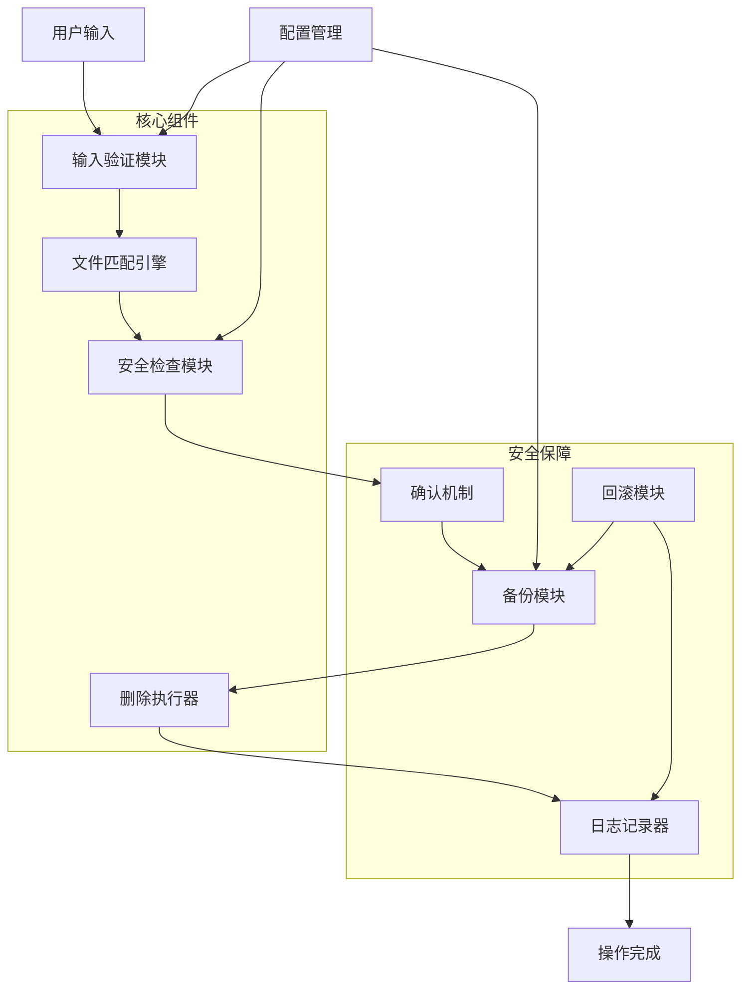
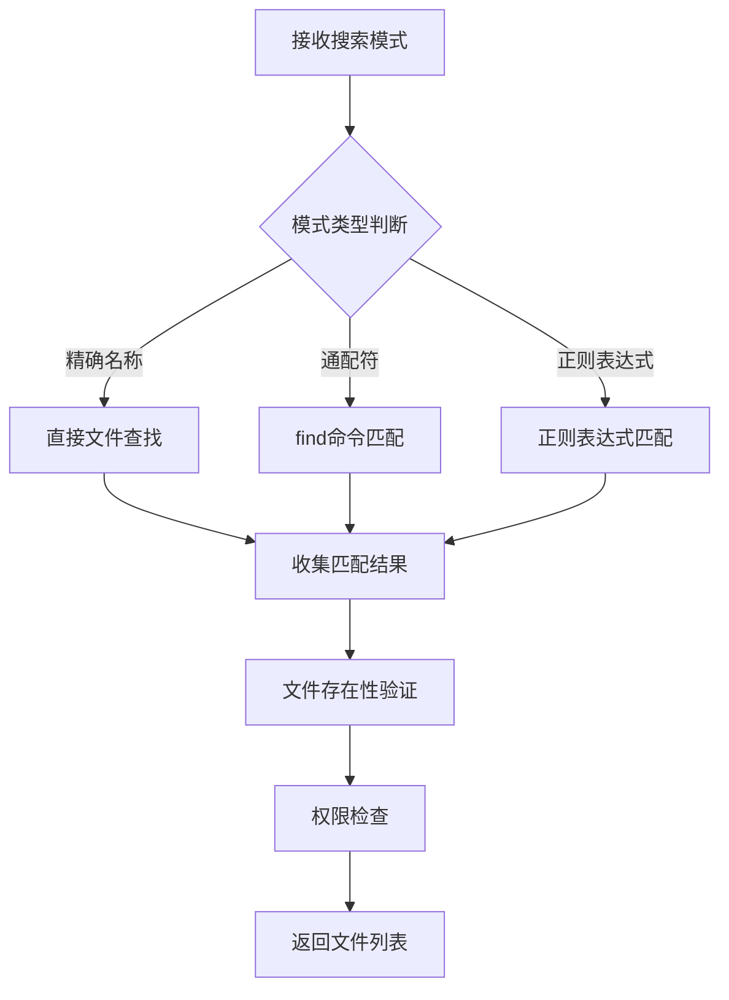
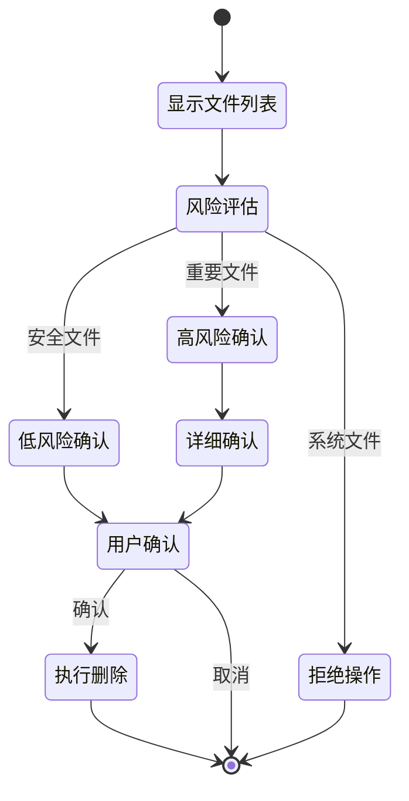
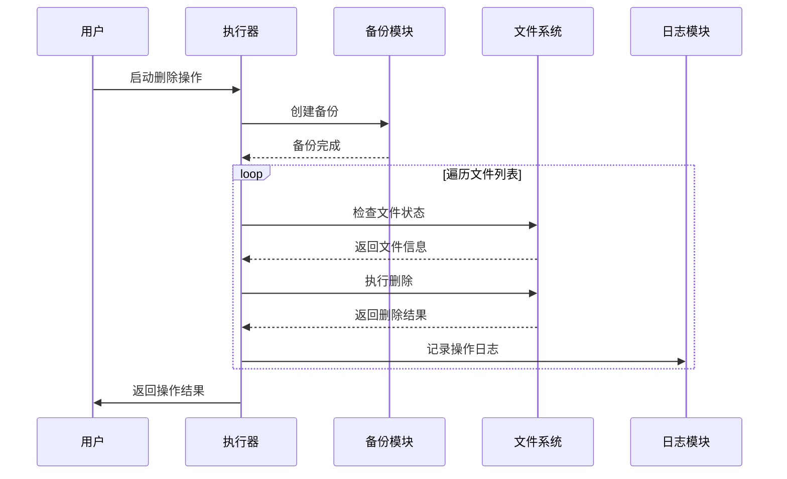
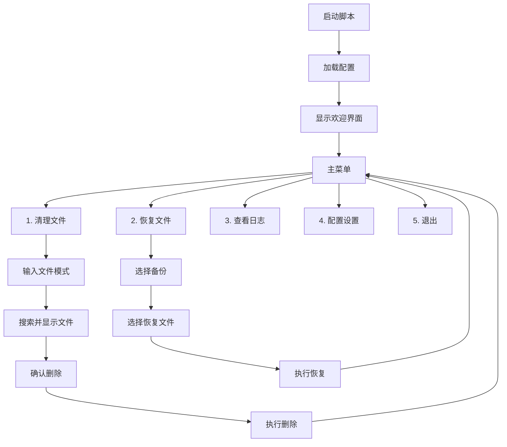

# 本地目录文件清理脚本系统设计

## 概述

设计一个交互式的shell脚本系统，用于安全清理本地目录中的无用文件。该系统允许用户通过输入文件名或模式来删除文件，并提供多种安全机制防止误删重要文件。

### 核心价值
- **安全性**: 提供多重确认机制，防止误删重要文件
- **灵活性**: 支持多种文件匹配模式和删除策略
- **可追溯性**: 记录所有删除操作，支持操作回滚
- **易用性**: 提供友好的交互界面和清晰的操作指导

### 目标用户
- 需要定期清理项目目录的开发者
- 系统管理员进行日常维护
- 需要批量清理文件的普通用户

## 技术栈与依赖

| 组件 | 技术选择 | 说明 |
|------|----------|------|
| 脚本语言 | Bash | 原生shell支持，无需额外依赖 |
| 交互界面 | dialog/whiptail | 可选的GUI增强 |
| 日志记录 | 文本文件 | 简单可靠的日志存储 |
| 配置管理 | JSON/YAML | 灵活的配置文件格式 |
| 备份存储 | tar.gz | 压缩备份删除的文件 |

### 系统要求
- Linux/Unix系统
- Bash 4.0+
- 标准Unix工具 (find, grep, awk, tar等)
- 可选: dialog工具包

## 系统架构



## 核心功能模块

### 1. 输入验证模块

**职责**: 验证用户输入的文件名或模式，确保输入格式正确且安全

**功能特性**:
- 支持精确文件名匹配
- 支持通配符模式 (*.tmp, test*)
- 支持正则表达式匹配
- 输入安全性检查，防止恶意模式

**验证规则表**:
| 输入类型 | 示例 | 验证规则 | 风险等级 |
|----------|------|----------|----------|
| 精确文件名 | test.txt | 文件名合法性检查 | 低 |
| 扩展名模式 | *.log | 限制通配符使用 | 中 |
| 前缀模式 | temp* | 长度限制检查 | 中 |
| 正则表达式 | ^test.*\.bak$ | 复杂度限制 | 高 |
| 危险模式 | * 或 / | 直接拒绝 | 极高 |

### 2. 文件匹配引擎

**职责**: 根据用户输入查找匹配的文件列表

**匹配策略**:
- **精确匹配**: 直接文件名匹配
- **模式匹配**: 使用find命令的-name参数
- **正则匹配**: 结合find和grep进行复杂匹配
- **递归搜索**: 可选的子目录搜索功能

**匹配流程**:


### 3. 安全检查模块

**职责**: 对待删除文件进行安全性评估，防止删除重要文件

**安全检查项**:

| 检查项 | 检查内容 | 处理策略 |
|--------|----------|----------|
| 系统文件保护 | /bin, /usr, /etc等系统目录 | 直接拒绝 |
| 隐藏文件检查 | .bashrc, .profile等配置文件 | 高级确认 |
| 大文件警告 | 超过指定大小的文件 | 额外确认 |
| 最近修改检查 | 最近24小时内修改的文件 | 提示确认 |
| 文件类型识别 | 可执行文件、源代码文件 | 类型提醒 |

**保护列表配置**:
- 系统关键目录黑名单
- 重要文件扩展名列表
- 用户自定义保护规则
- 项目相关文件保护 (如package.json, Makefile等)

### 4. 确认机制

**职责**: 向用户展示删除计划并获取确认

**确认流程**:


**确认界面设计**:
- 文件列表展示（文件名、大小、修改时间）
- 风险等级标识（颜色编码）
- 统计信息（文件数量、总大小）
- 多种确认选项（全部确认、逐个确认、取消）

### 5. 备份模块

**职责**: 在删除前创建文件备份，支持操作回滚

**备份策略**:
- **即时备份**: 删除前自动备份到指定目录
- **压缩存储**: 使用tar.gz格式节省空间
- **时间戳命名**: 备份文件包含时间戳便于识别
- **空间管理**: 自动清理过期备份

**备份目录结构**:
```
~/.clean-script-backups/
├── 2024-01-15_10-30-45/
│   ├── backup.tar.gz
│   ├── file-list.txt
│   └── metadata.json
├── 2024-01-14_16-20-10/
│   └── ...
└── cleanup.log
```

**元数据记录**:
| 字段 | 内容 | 用途 |
|------|------|------|
| timestamp | 操作时间 | 备份识别 |
| original_paths | 原始文件路径列表 | 恢复定位 |
| file_count | 文件数量 | 操作统计 |
| total_size | 总文件大小 | 空间统计 |
| operation_type | 操作类型 | 日志分类 |

### 6. 删除执行器

**职责**: 安全执行文件删除操作

**执行策略**:
- **原子操作**: 要么全部成功，要么全部回滚
- **进度显示**: 实时显示删除进度
- **错误处理**: 详细记录删除失败的文件
- **权限处理**: 智能处理权限不足的情况

**删除流程**:


### 7. 日志记录器

**职责**: 记录所有操作历史，支持审计和故障排查

**日志级别**:
- **INFO**: 正常操作记录
- **WARN**: 警告信息（如权限问题）
- **ERROR**: 错误信息（删除失败）
- **DEBUG**: 调试信息（详细执行步骤）

**日志格式**:
```
[2024-01-15 10:30:45] [INFO] [Session:abc123] Operation started: pattern="*.tmp"
[2024-01-15 10:30:46] [INFO] [Session:abc123] Found 5 files matching pattern
[2024-01-15 10:30:47] [INFO] [Session:abc123] Backup created: ~/.clean-script-backups/2024-01-15_10-30-45/
[2024-01-15 10:30:48] [INFO] [Session:abc123] Deleted: /path/to/file1.tmp (size: 1024)
[2024-01-15 10:30:49] [ERROR] [Session:abc123] Failed to delete: /path/to/file2.tmp (permission denied)
[2024-01-15 10:30:50] [INFO] [Session:abc123] Operation completed: 4/5 files deleted
```

### 8. 回滚模块

**职责**: 提供操作回滚功能，恢复误删的文件

**回滚功能**:
- 列出可用的备份记录
- 选择性恢复（全部或部分文件）
- 路径冲突处理（如原位置已有新文件）
- 权限恢复

**回滚界面**:


## 配置管理

### 配置文件结构

**主配置文件** (~/.clean-script.conf):
```
# 基础设置
DEFAULT_BACKUP_DIR="$HOME/.clean-script-backups"
MAX_BACKUP_AGE_DAYS=30
LOG_LEVEL="INFO"
LOG_FILE="$HOME/.clean-script.log"

# 安全设置
ENABLE_BACKUP=true
REQUIRE_CONFIRMATION=true
PROTECTED_DIRS="/bin:/usr:/etc:/home"
DANGEROUS_PATTERNS="*:/*:.*"

# 界面设置
USE_COLORS=true
SHOW_PROGRESS=true
PAGE_SIZE=20
```

**保护规则文件** (~/.clean-script-protected.json):
```json
{
  "system_dirs": ["/bin", "/usr", "/etc", "/var"],
  "config_files": [".bashrc", ".profile", ".gitconfig"],
  "important_extensions": [".sql", ".json", ".yaml", ".md"],
  "project_files": ["package.json", "Makefile", "requirements.txt"],
  "user_rules": [
    {
      "pattern": "*.bak",
      "action": "warn",
      "message": "备份文件删除需要额外确认"
    }
  ]
}
```

### 配置优先级

1. 命令行参数（最高优先级）
2. 环境变量
3. 用户配置文件
4. 系统默认配置

## 用户交互界面

### 命令行参数接口

| 参数 | 简写 | 说明 | 示例 |
|------|------|------|------|
| --pattern | -p | 指定文件匹配模式 | -p "*.tmp" |
| --recursive | -r | 递归搜索子目录 | -r |
| --backup | -b | 指定备份目录 | -b /backup |
| --no-backup | -n | 不创建备份 | -n |
| --force | -f | 跳过确认（危险） | -f |
| --dry-run | -d | 模拟运行，不实际删除 | -d |
| --restore | -R | 恢复模式 | -R |
| --list-backups | -l | 列出备份 | -l |
| --config | -c | 指定配置文件 | -c myconfig.conf |
| --verbose | -v | 详细输出 | -v |

### 交互模式流程



### 用户体验设计

**颜色编码系统**:
- 🔴 红色：高风险文件（系统文件、重要配置）
- 🟡 黄色：中风险文件（最近修改、大文件）
- 🟢 绿色：低风险文件（临时文件、缓存文件）
- 🔵 蓝色：信息提示
- ⚪ 灰色：已备份文件

**进度指示器**:
- 文件扫描进度条
- 删除操作进度
- 备份创建进度
- 百分比和剩余时间估算

## 错误处理与异常管理

### 错误分类

| 错误类型 | 处理策略 | 用户提示 | 恢复措施 |
|----------|----------|----------|----------|
| 权限不足 | 跳过文件，记录日志 | 显示权限错误 | 提示使用sudo |
| 文件不存在 | 继续处理其他文件 | 显示文件已不存在 | 从列表中移除 |
| 磁盘空间不足 | 停止操作 | 警告磁盘空间 | 建议清理空间 |
| 配置文件错误 | 使用默认配置 | 提示配置问题 | 重新生成配置 |
| 备份失败 | 询问是否继续 | 备份创建失败 | 手动指定备份位置 |

### 故障恢复机制

**操作中断恢复**:
- 保存中断时的状态
- 下次启动时询问是否继续
- 部分完成的操作回滚选项

**数据一致性保障**:
- 原子操作设计
- 操作日志完整性检查
- 自动修复损坏的日志文件

## 性能优化策略

### 文件搜索优化
- 使用find命令的并行处理
- 智能目录跳过（.git, node_modules等）
- 搜索结果缓存机制

### 大文件处理
- 流式处理大型目录
- 分批处理文件列表
- 内存使用监控

### 备份优化
- 增量备份支持
- 压缩算法选择
- 并行压缩处理

## 测试策略

### 单元测试覆盖

| 模块 | 测试用例 | 覆盖范围 |
|------|----------|----------|
| 输入验证 | 各种输入模式测试 | 边界值、异常输入 |
| 文件匹配 | 匹配准确性测试 | 各种模式组合 |
| 安全检查 | 保护规则测试 | 系统文件保护 |
| 备份模块 | 备份恢复测试 | 完整性验证 |
| 日志记录 | 日志格式测试 | 并发写入测试 |

### 集成测试场景
- 完整的删除操作流程
- 错误情况下的恢复流程
- 多用户并发使用测试
- 大量文件处理测试

### 安全测试
- 恶意输入防护测试
- 权限边界测试
- 路径遍历攻击防护
- 符号链接处理测试

