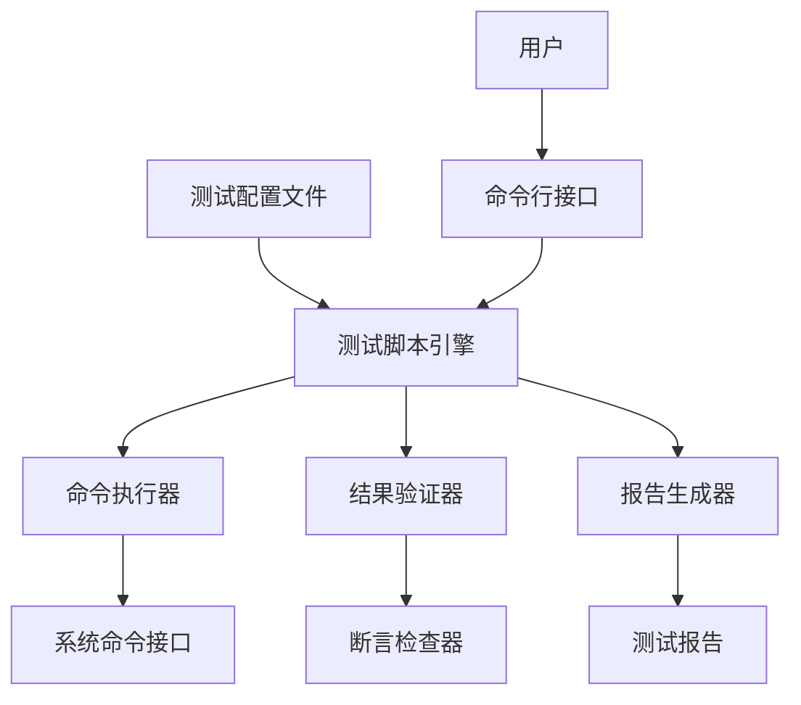
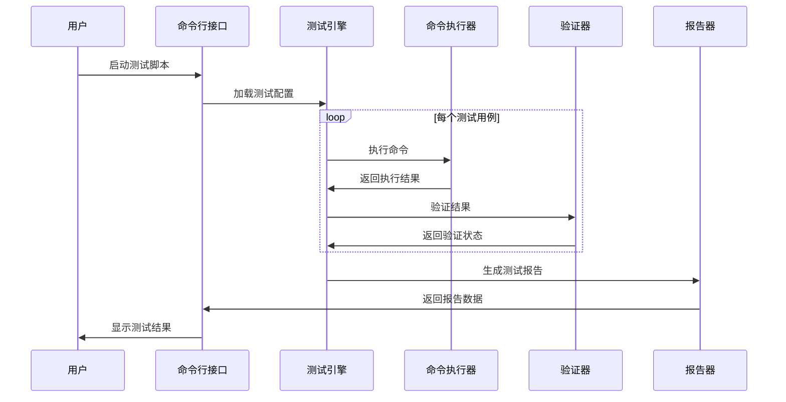

# 命令行测试脚本设计文档

## 概述

本设计描述了一个Python命令行测试脚本系统，用于自动化测试各种命令行工具的功能，如 `claudecode --version`。该系统将提供灵活的测试框架，支持多种测试场景，包括版本检查、帮助信息验证、错误处理测试等。

### 核心价值
- 自动化验证命令行工具的基本功能
- 提供可重复的测试流程
- 支持批量测试多个命令
- 生成详细的测试报告

## 架构设计

### 系统架构



### 核心组件架构

| 组件名称 | 职责描述 | 输入 | 输出 |
|---------|----------|------|------|
| 测试脚本引擎 | 协调整个测试流程 | 测试配置、命令参数 | 测试结果状态 |
| 命令执行器 | 执行系统命令并捕获输出 | 命令字符串、超时设置 | 执行结果、错误信息 |
| 结果验证器 | 验证命令输出是否符合预期 | 实际输出、期望规则 | 验证结果 |
| 报告生成器 | 生成测试报告 | 测试结果数据 | 格式化报告 |

### 数据模型

#### 测试用例模型

| 字段名称 | 数据类型 | 描述 | 示例 |
|---------|----------|------|------|
| test_name | 字符串 | 测试用例名称 | "版本检查测试" |
| command | 字符串 | 要执行的命令 | "claudecode --version" |
| expected_exit_code | 整数 | 期望的退出码 | 0 |
| expected_output_pattern | 字符串 | 期望输出的正则模式 | "v\\d+\\.\\d+\\.\\d+" |
| timeout | 整数 | 命令超时时间(秒) | 30 |
| description | 字符串 | 测试描述 | "验证版本信息显示正确" |

#### 测试结果模型

| 字段名称 | 数据类型 | 描述 |
|---------|----------|------|
| test_name | 字符串 | 测试名称 |
| status | 枚举 | 测试状态(PASS/FAIL/ERROR) |
| execution_time | 浮点数 | 执行耗时(秒) |
| actual_exit_code | 整数 | 实际退出码 |
| actual_output | 字符串 | 实际输出内容 |
| error_message | 字符串 | 错误信息(如果有) |
| timestamp | 日期时间 | 测试执行时间 |

## 功能设计

### 核心功能模块

#### 1. 命令执行模块
- **职责**: 安全执行系统命令并捕获所有输出
- **功能特性**:
  - 支持超时控制，防止命令无限执行
  - 分别捕获标准输出和标准错误
  - 记录命令执行时间
  - 处理命令不存在的情况

#### 2. 测试配置模块
- **职责**: 管理测试用例的定义和加载
- **支持格式**: JSON、YAML配置文件
- **配置能力**:
  - 定义多个测试套件
  - 支持测试用例分组
  - 配置全局超时设置
  - 定义输出验证规则

#### 3. 结果验证模块
- **职责**: 验证命令执行结果是否符合预期
- **验证维度**:
  - 退出码验证
  - 输出内容模式匹配
  - 执行时间检查
  - 错误信息验证

#### 4. 报告生成模块
- **职责**: 生成详细的测试报告
- **报告格式**:
  - 控制台文本报告
  - HTML格式报告
  - JSON格式结果数据
- **报告内容**:
  - 测试总结统计
  - 详细测试结果
  - 失败用例分析
  - 性能统计数据

### 测试流程设计



## 命令行接口设计

### 主命令结构

| 命令选项 | 描述 | 示例用法 |
|---------|------|----------|
| --config | 指定测试配置文件路径 | --config tests/config.yaml |
| --output | 指定报告输出路径 | --output results/ |
| --format | 指定报告格式 | --format html |
| --verbose | 详细输出模式 | --verbose |
| --timeout | 全局超时设置 | --timeout 60 |
| --pattern | 只运行匹配的测试 | --pattern "*version*" |

### 使用场景示例

#### 基础版本测试场景
**测试目标**: 验证 `claudecode --version` 命令能正常返回版本信息

**配置定义**:
- 命令: `claudecode --version`
- 期望退出码: 0
- 输出模式: 包含版本号格式
- 超时时间: 10秒

#### 帮助信息测试场景
**测试目标**: 验证帮助命令的完整性

**测试维度**:
- `claudecode --help` 显示帮助信息
- `claudecode -h` 短选项功能
- 帮助文本包含关键使用说明

#### 错误处理测试场景
**测试目标**: 验证非法参数的错误处理

**测试用例**:
- 不存在的选项应返回错误
- 错误信息应该清晰可理解
- 退出码应为非零值

## 配置文件结构设计

### YAML配置格式

测试配置采用分层结构，支持全局设置和具体测试用例定义：

```yaml
# 全局配置部分
global:
  timeout: 30
  output_format: "console"
  
# 测试套件定义
test_suites:
  - name: "基础功能测试"
    tests:
      - name: "版本检查"
        command: "claudecode --version"
        expected_exit_code: 0
        expected_patterns: 
          - "v\\d+\\.\\d+\\.\\d+"
        timeout: 10
```

## 扩展性设计

### 插件机制
- **验证器插件**: 支持自定义输出验证逻辑
- **报告器插件**: 支持新的报告格式
- **执行器插件**: 支持远程命令执行

### 集成能力
- **CI/CD集成**: 提供标准退出码供构建系统使用
- **监控集成**: 输出结构化日志供监控系统收集
- **API接口**: 提供程序化调用接口

## 测试策略

### 单元测试覆盖
- 命令执行器的各种边界情况
- 验证器的模式匹配准确性
- 配置解析的错误处理
- 报告生成的格式正确性

### 集成测试设计
- 端到端测试流程验证
- 多种命令行工具的兼容性测试
- 大量测试用例的性能测试
- 异常情况的恢复能力测试