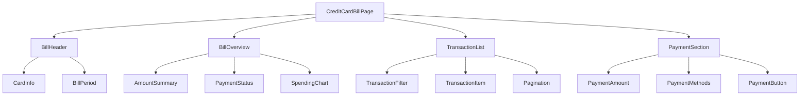
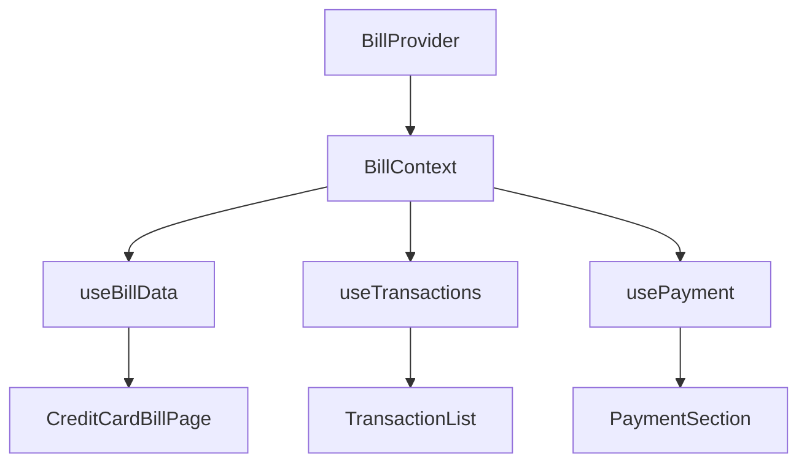
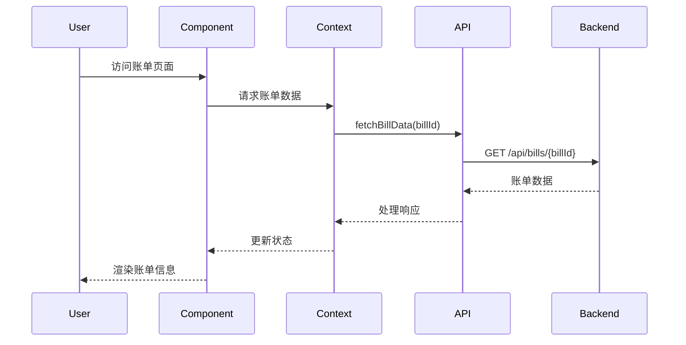

# 信用卡账单页面设计文档

## 概述

本文档定义了一个基于React的信用卡账单页面的设计方案。该页面旨在为用户提供清晰、直观的信用卡账单信息展示，包括账单概览、交易明细、还款信息等核心功能模块。

### 核心价值
- 提供清晰的账单信息展示，帮助用户了解消费情况
- 支持交易记录的筛选和查询，便于用户管理财务
- 提供便捷的还款功能入口，提升用户体验
- 确保数据安全和隐私保护

## 技术栈与依赖

### 核心技术栈
- **前端框架**: React 18+
- **状态管理**: React Context API + useReducer
- **样式方案**: CSS Modules + Tailwind CSS
- **HTTP客户端**: Axios
- **日期处理**: Day.js
- **图表库**: Recharts
- **路由管理**: React Router v6

### 开发工具
- **构建工具**: Vite
- **代码规范**: ESLint + Prettier
- **测试框架**: Jest + React Testing Library
- **类型检查**: TypeScript

## 组件架构

### 组件层次结构



### 主要组件定义

#### CreditCardBillPage (容器组件)
- **职责**: 整体页面布局和状态管理
- **状态管理**: 账单数据、交易记录、用户操作状态
- **生命周期**: 组件挂载时获取账单数据，处理用户交互

#### BillHeader (展示组件)
- **职责**: 显示信用卡基本信息和账单周期
- **属性接口**: cardNumber, cardType, billPeriod, dueDate
- **样式特点**: 采用卡片设计，突出显示关键信息

#### BillOverview (展示组件)
- **职责**: 账单金额概览和图表展示
- **属性接口**: totalAmount, paidAmount, remainingAmount, spendingData
- **交互行为**: 支持图表的数据切换和详情查看

#### TransactionList (复合组件)
- **职责**: 交易记录列表展示和管理
- **子组件**: TransactionFilter, TransactionItem, Pagination
- **状态管理**: 筛选条件、分页状态、排序方式
- **数据处理**: 支持按日期、金额、商户等条件筛选

#### PaymentSection (功能组件)
- **职责**: 还款功能模块
- **属性接口**: billAmount, minimumPayment, availablePaymentMethods
- **业务逻辑**: 还款金额验证、支付方式选择、还款确认

### Props/State 管理策略

#### 全局状态 (Context)
```
BillContext: {
  billData: BillInfo,
  transactions: Transaction[],
  paymentStatus: PaymentStatus,
  loading: boolean,
  error: string | null
}
```

#### 本地状态管理
- TransactionList: 筛选条件、分页状态
- PaymentSection: 还款金额、选中的支付方式
- SpendingChart: 图表显示模式、时间范围

## 路由与导航

### 路由结构
```mermaid
graph LR
    A[/credit-card] --> B[/bill/:billId]
    B --> C[/bill/:billId/transactions]
    B --> D[/bill/:billId/payment]
    A --> E[/bills/history]
```

### 导航规则
- 主路由展示当前账单概览
- 交易明细子路由支持深层链接
- 还款页面独立路由，支持返回确认
- 历史账单列表支持切换查看

## 样式策略

### 设计系统
- **色彩方案**: 基于品牌色的渐变设计，主色调为蓝色系
- **字体层级**: 采用响应式字体大小，确保可读性
- **间距系统**: 基于8px网格的间距规范
- **组件样式**: 统一的卡片、按钮、表单元素设计

### 响应式设计
- **断点设置**: 移动端(<768px)、平板(768-1024px)、桌面(>1024px)
- **布局适配**: Flexbox和Grid布局相结合
- **交互适配**: 移动端优化触摸操作，桌面端支持键盘导航

## 状态管理

### Context API 架构


### 状态更新流程
- **数据获取**: 通过API服务获取账单和交易数据
- **状态同步**: 使用useReducer管理复杂状态变更
- **错误处理**: 统一的错误状态管理和用户反馈
- **缓存策略**: 本地缓存频繁访问的数据

## API集成层

### 数据模型

#### 账单信息模型
| 字段名 | 类型 | 描述 |
|--------|------|------|
| billId | string | 账单唯一标识 |
| cardNumber | string | 脱敏后的卡号 |
| cardType | string | 信用卡类型 |
| billPeriod | DateRange | 账单周期 |
| totalAmount | number | 账单总金额 |
| paidAmount | number | 已还金额 |
| minimumPayment | number | 最低还款额 |
| dueDate | Date | 还款截止日期 |
| status | BillStatus | 账单状态 |

#### 交易记录模型
| 字段名 | 类型 | 描述 |
|--------|------|------|
| transactionId | string | 交易唯一标识 |
| amount | number | 交易金额 |
| currency | string | 货币类型 |
| merchant | string | 商户名称 |
| category | string | 消费类别 |
| transactionDate | Date | 交易日期 |
| description | string | 交易描述 |
| status | TransactionStatus | 交易状态 |

### API接口规范

#### 获取账单信息
- **接口路径**: GET /api/bills/{billId}
- **认证要求**: Bearer Token
- **响应格式**: JSON
- **错误处理**: 404 (账单不存在), 401 (未授权), 500 (服务器错误)

#### 获取交易记录
- **接口路径**: GET /api/bills/{billId}/transactions
- **查询参数**: page, limit, startDate, endDate, category, minAmount, maxAmount
- **认证要求**: Bearer Token
- **响应格式**: 分页的交易记录列表

#### 发起还款
- **接口路径**: POST /api/bills/{billId}/payment
- **请求体**: paymentAmount, paymentMethod, paymentDate
- **认证要求**: Bearer Token + 二次验证
- **业务验证**: 金额范围检查、支付方式有效性验证

### 数据流设计


## 测试策略

### 单元测试覆盖
- **组件测试**: 每个组件的渲染逻辑和交互行为
- **Hook测试**: 自定义Hook的状态管理逻辑
- **工具函数测试**: 数据处理和格式化函数
- **API模拟**: 使用Mock Service Worker模拟API响应

### 测试用例设计

#### 组件测试示例
- BillHeader组件正确显示卡号和账单周期
- TransactionList组件支持筛选和分页功能
- PaymentSection组件验证还款金额输入
- SpendingChart组件响应数据变更

#### 集成测试场景
- 完整的账单加载流程
- 交易记录筛选和排序功能
- 还款流程的端到端测试
- 错误状态的处理和恢复

### 性能测试
- 大量交易记录的渲染性能
- 图表组件的数据更新性能
- 移动端的触摸响应性能
- 内存使用和组件卸载测试

## 安全考虑

### 数据保护
- **敏感信息脱敏**: 信用卡号、身份信息的前端显示脱敏
- **HTTPS通信**: 所有API请求强制使用HTTPS
- **Token管理**: 访问令牌的安全存储和自动刷新
- **XSS防护**: 用户输入的严格过滤和转义

### 权限控制
- **身份验证**: 基于JWT的用户身份验证
- **会话管理**: 自动登出和会话超时处理
- **操作授权**: 敏感操作的二次确认机制
- **审计日志**: 关键操作的前端日志记录

### 前端安全
- **CSP策略**: 内容安全策略的配置
- **依赖扫描**: 第三方库的安全漏洞检查
- **构建安全**: 生产构建的代码混淆和压缩
- **环境变量**: 敏感配置的环境隔离