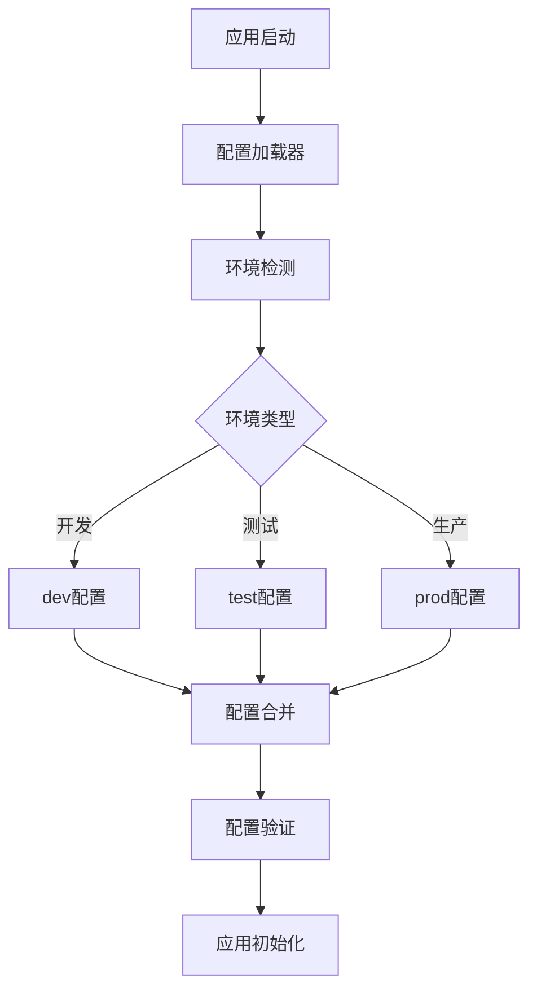
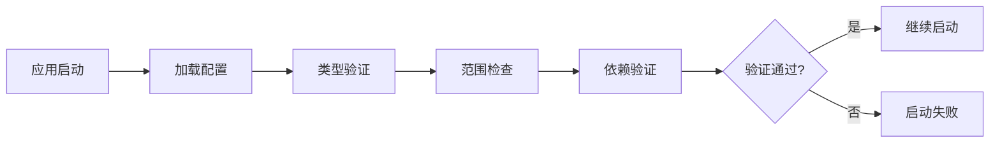
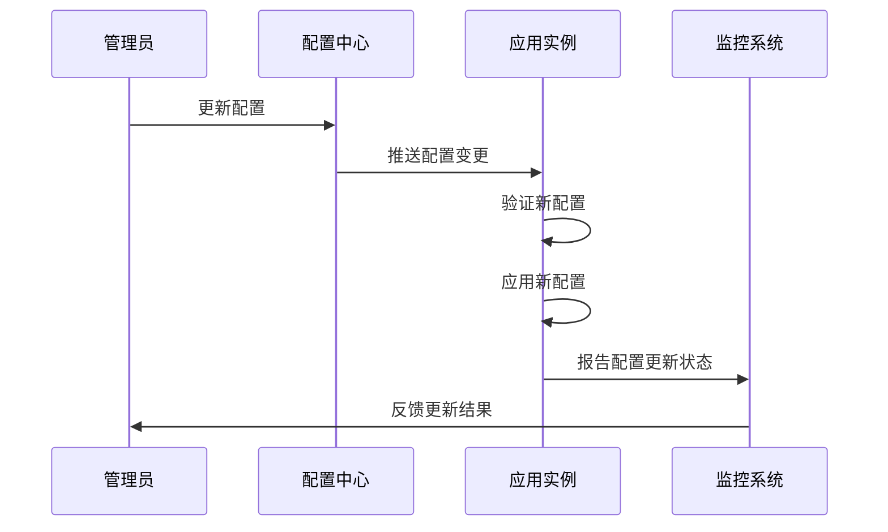
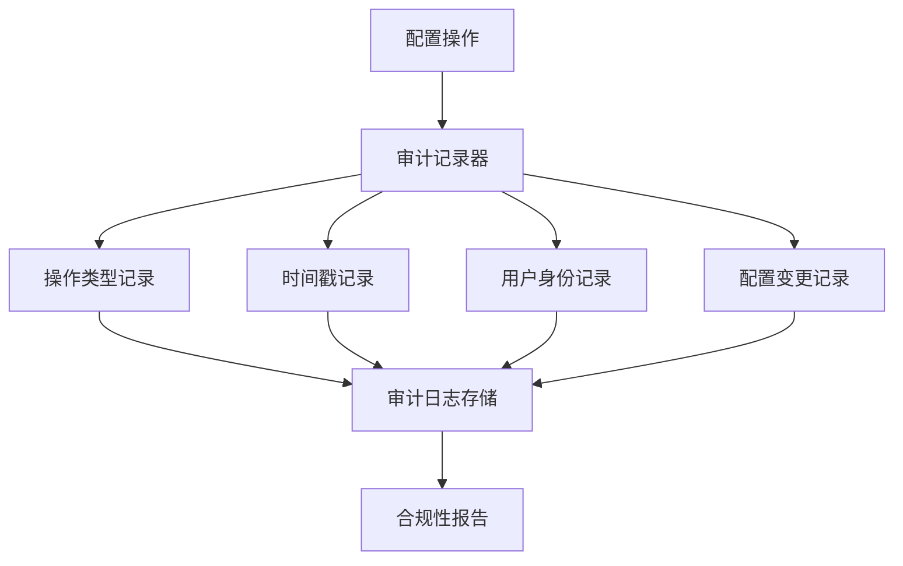

# Java配置设计文档

## 概述

本文档定义了Java应用程序的配置管理策略，涵盖从开发环境到生产环境的各种配置需求。配置管理的核心目标是实现环境无关的应用部署，提供灵活的参数调整机制，并确保配置的安全性和可维护性。

## 技术栈与依赖

### 核心配置技术
- **Spring Boot Configuration**: 基于约定优于配置的原则
- **Profile管理**: 多环境配置隔离
- **外部化配置**: application.properties/yml 文件
- **环境变量**: 敏感信息和部署特定参数

### 配置优先级策略
按优先级从高到低排列：
1. 命令行参数
2. 系统环境变量
3. 应用程序外部配置文件
4. 应用程序内部配置文件
5. 代码中的默认值

## 配置架构

### 配置层次结构

### 配置文件组织结构

| 配置文件类型 | 文件名 | 用途 | 优先级 |
|------------|--------|------|--------|
| 基础配置 | application.yml | 通用默认配置 | 低 |
| 开发环境 | application-dev.yml | 开发环境特定配置 | 中 |
| 测试环境 | application-test.yml | 测试环境特定配置 | 中 |
| 生产环境 | application-prod.yml | 生产环境特定配置 | 中 |
| 外部配置 | config/application.yml | 外部覆盖配置 | 高 |

## 配置域定义

### 服务器配置域

| 配置项 | 描述 | 默认值 | 环境变量 |
|--------|------|--------|----------|
| server.port | 服务端口 | 8080 | SERVER_PORT |
| server.servlet.context-path | 应用上下文路径 | / | CONTEXT_PATH |
| server.compression.enabled | 响应压缩启用 | true | COMPRESSION_ENABLED |

### 数据库配置域

| 配置项 | 描述 | 开发环境 | 生产环境 | 环境变量 |
|--------|------|----------|----------|----------|
| spring.datasource.url | 数据库连接URL | jdbc:h2:mem:testdb | 外部数据库 | DATABASE_URL |
| spring.datasource.username | 数据库用户名 | sa | 加密存储 | DATABASE_USERNAME |
| spring.datasource.password | 数据库密码 | 空 | 加密存储 | DATABASE_PASSWORD |
| spring.jpa.hibernate.ddl-auto | DDL策略 | create-drop | validate | DDL_AUTO |

### 日志配置域

| 配置项 | 描述 | 开发环境 | 生产环境 |
|--------|------|----------|----------|
| logging.level.root | 根日志级别 | DEBUG | INFO |
| logging.level.com.company | 应用日志级别 | DEBUG | WARN |
| logging.file.name | 日志文件路径 | 控制台输出 | /var/log/app.log |
| logging.pattern.console | 控制台日志格式 | 详细格式 | 简洁格式 |

### 安全配置域

| 配置项 | 描述 | 配置方式 |
|--------|------|----------|
| security.jwt.secret | JWT签名密钥 | 环境变量 |
| security.jwt.expiration | Token过期时间 | 配置文件 |
| security.cors.allowed-origins | CORS允许域名 | Profile特定 |
| security.rate-limit.requests-per-minute | 限流配置 | 配置文件 |

## 环境配置策略

### 开发环境配置特征
- 启用热重载和开发工具
- 使用内存数据库进行快速测试
- 详细的调试日志输出
- 宽松的安全策略便于调试

### 测试环境配置特征
- 使用独立的测试数据库
- 模拟外部服务依赖
- 启用测试特定的Profile
- 收集测试覆盖率和性能指标

### 生产环境配置特征
- 严格的安全配置
- 优化的性能参数
- 外部化的敏感信息
- 全面的监控和告警配置

## 配置验证机制

### 启动时验证

### 验证规则定义

| 验证类型 | 验证内容 | 失败处理 |
|----------|----------|----------|
| 必需参数验证 | 检查关键配置项是否存在 | 启动失败 |
| 类型验证 | 验证配置值的数据类型 | 启动失败 |
| 范围验证 | 检查数值是否在合理范围内 | 警告或失败 |
| 格式验证 | 验证URL、邮箱等格式 | 启动失败 |
| 依赖验证 | 检查配置项之间的依赖关系 | 启动失败 |

## 配置热更新机制

### 支持热更新的配置类型
- 日志级别配置
- 业务功能开关
- 缓存配置参数
- 限流阈值设置

### 热更新流程

## 敏感信息管理

### 敏感信息分类

| 信息类型 | 安全等级 | 存储方式 | 访问控制 |
|----------|----------|----------|----------|
| 数据库密码 | 高 | 加密环境变量 | 运行时解密 |
| API密钥 | 高 | 密钥管理服务 | 动态获取 |
| JWT密钥 | 高 | 硬件安全模块 | 签名时获取 |
| 第三方服务密钥 | 中 | 加密配置文件 | 启动时解密 |

### 密钥轮换策略
- 数据库密码：每季度轮换
- API密钥：每月轮换
- JWT签名密钥：每周轮换
- 加密密钥：按需轮换

## 配置监控与审计

### 监控指标

| 监控维度 | 监控内容 | 告警阈值 |
|----------|----------|----------|
| 配置加载 | 配置文件加载时间 | > 5秒 |
| 配置验证 | 验证失败次数 | > 0 |
| 配置更新 | 热更新成功率 | < 95% |
| 敏感信息访问 | 密钥访问频率 | 异常频繁 |

### 审计日志记录

## 性能优化策略

### 配置缓存机制
- 应用级缓存：将常用配置缓存在内存中
- 分层缓存：根据访问频率设置不同的缓存策略
- 缓存失效：配置更新时智能失效相关缓存

### 配置加载优化
- 懒加载：按需加载非关键配置
- 批量加载：一次性加载相关配置组
- 异步加载：对于非阻塞性配置采用异步方式

## 测试策略

### 配置测试类型

| 测试类型 | 测试目标 | 测试方法 |
|----------|----------|----------|
| 单元测试 | 配置解析逻辑 | Mock配置源 |
| 集成测试 | 配置加载流程 | 测试配置文件 |
| 环境测试 | 不同环境配置 | Profile切换测试 |
| 故障测试 | 配置错误处理 | 注入错误配置 |

### 配置回归测试
- 自动化配置验证脚本
- 配置兼容性测试
- 配置性能基准测试
- 配置安全扫描测试| 配置项 | 描述 | 配置方式 |
|--------|------|----------|
| security.jwt.secret | JWT签名密钥 | 环境变量 |
| security.jwt.expiration | Token过期时间 | 配置文件 |
| security.cors.allowed-origins | CORS允许域名 | Profile特定 |
| security.rate-limit.requests-per-minute | 限流配置 | 配置文件 |

## 环境配置策略

### 开发环境配置特征
- 启用热重载和开发工具
- 使用内存数据库进行快速测试
- 详细的调试日志输出
- 宽松的安全策略便于调试

### 测试环境配置特征
- 使用独立的测试数据库
- 模拟外部服务依赖
- 启用测试特定的Profile
- 收集测试覆盖率和性能指标

### 生产环境配置特征
- 严格的安全配置
- 优化的性能参数
- 外部化的敏感信息
- 全面的监控和告警配置

## 配置验证机制

### 启动时验证

### 验证规则定义

| 验证类型 | 验证内容 | 失败处理 |
|----------|----------|----------|
| 必需参数验证 | 检查关键配置项是否存在 | 启动失败 |
| 类型验证 | 验证配置值的数据类型 | 启动失败 |
| 范围验证 | 检查数值是否在合理范围内 | 警告或失败 |
| 格式验证 | 验证URL、邮箱等格式 | 启动失败 |
| 依赖验证 | 检查配置项之间的依赖关系 | 启动失败 |

## 配置热更新机制

### 支持热更新的配置类型
- 日志级别配置
- 业务功能开关
- 缓存配置参数
- 限流阈值设置

### 热更新流程

## 敏感信息管理

### 敏感信息分类

| 信息类型 | 安全等级 | 存储方式 | 访问控制 |
|----------|----------|----------|----------|
| 数据库密码 | 高 | 加密环境变量 | 运行时解密 |
| API密钥 | 高 | 密钥管理服务 | 动态获取 |
| JWT密钥 | 高 | 硬件安全模块 | 签名时获取 |
| 第三方服务密钥 | 中 | 加密配置文件 | 启动时解密 |

### 密钥轮换策略
- 数据库密码：每季度轮换
- API密钥：每月轮换
- JWT签名密钥：每周轮换
- 加密密钥：按需轮换

## 配置监控与审计

### 监控指标

| 监控维度 | 监控内容 | 告警阈值 |
|----------|----------|----------|
| 配置加载 | 配置文件加载时间 | > 5秒 |
| 配置验证 | 验证失败次数 | > 0 |
| 配置更新 | 热更新成功率 | < 95% |
| 敏感信息访问 | 密钥访问频率 | 异常频繁 |

### 审计日志记录

## 性能优化策略

### 配置缓存机制
- 应用级缓存：将常用配置缓存在内存中
- 分层缓存：根据访问频率设置不同的缓存策略
- 缓存失效：配置更新时智能失效相关缓存

### 配置加载优化
- 懒加载：按需加载非关键配置
- 批量加载：一次性加载相关配置组
- 异步加载：对于非阻塞性配置采用异步方式

## 测试策略

### 配置测试类型

| 测试类型 | 测试目标 | 测试方法 |
|----------|----------|----------|
| 单元测试 | 配置解析逻辑 | Mock配置源 |
| 集成测试 | 配置加载流程 | 测试配置文件 |
| 环境测试 | 不同环境配置 | Profile切换测试 |
| 故障测试 | 配置错误处理 | 注入错误配置 |

### 配置回归测试
- 自动化配置验证脚本
- 配置兼容性测试
- 配置性能基准测试
- 配置安全扫描测试

