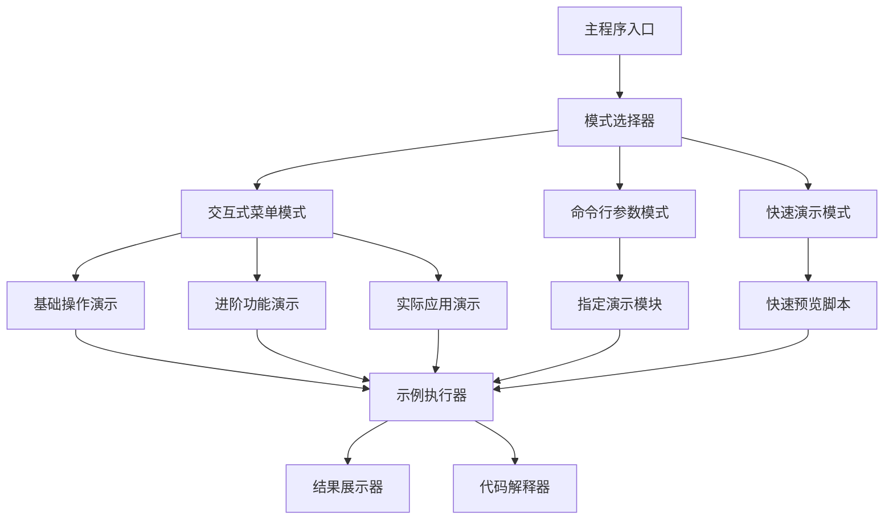
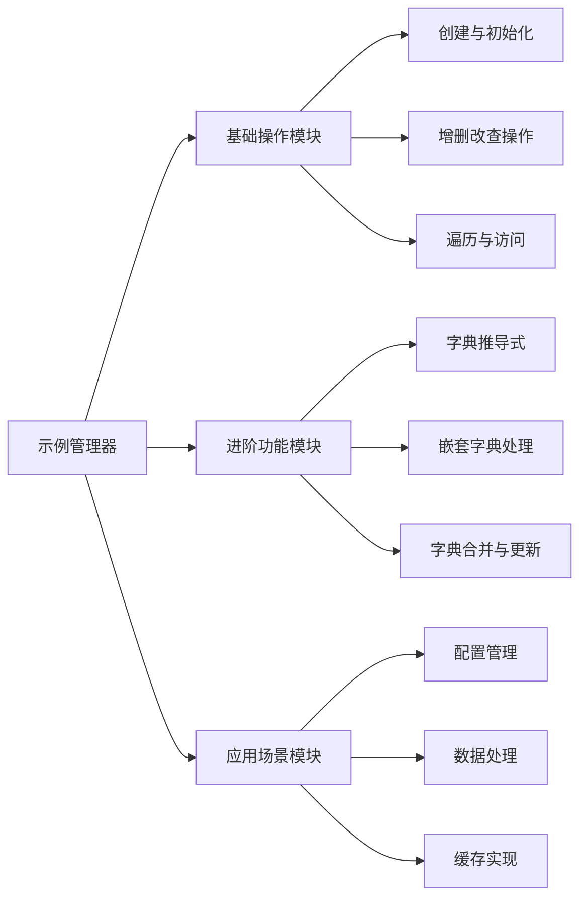
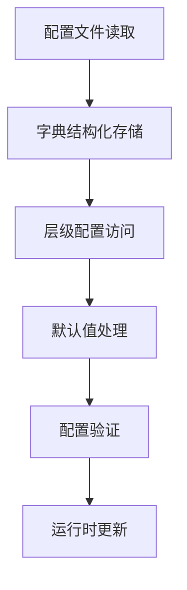
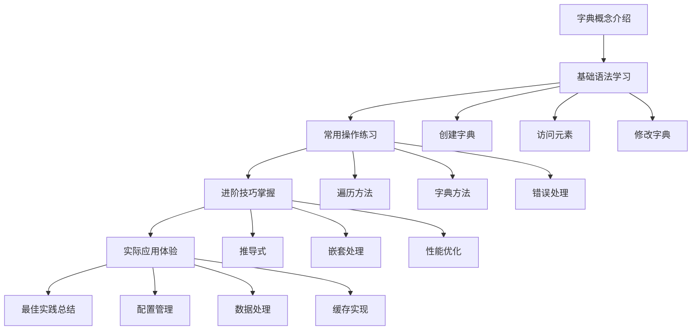
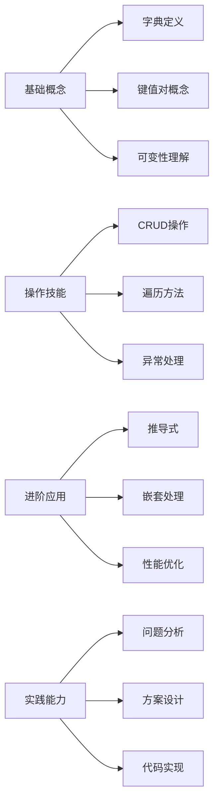

# 字典使用示例系统设计

## 概述

本项目旨在为编程新人提供全面的Python字典使用示例和学习资源。系统通过交互式演示、渐进式教学和实际应用场景，帮助初学者掌握字典数据结构的各种操作和最佳实践。

### 核心价值
- **渐进式学习**：从基础概念到高级应用，循序渐进
- **交互式体验**：提供多种运行模式，适应不同学习习惯
- **实用性导向**：结合真实场景，提升学习效果
- **零依赖设计**：仅使用Python标准库，确保开箱即用

### 目标用户
- Python编程初学者
- 其他语言转Python的开发者
- 需要系统学习字典操作的学习者

## 技术栈与依赖

### 核心技术
- **Python标准库**：确保项目零外部依赖
- **内置数据类型**：dict、list、tuple等
- **标准模块**：json、collections、itertools等

### 运行环境
- Python 3.6+
- 跨平台支持（Windows、macOS、Linux）

## 系统架构

### 整体架构设计



### 核心组件架构



## 功能模块设计

### 基础操作模块

#### 字典创建与初始化
| 操作类型 | 示例场景 | 教学重点 |
|---------|---------|---------|
| 空字典创建 | 初始化数据容器 | 语法基础 |
| 字面量创建 | 直接赋值 | 常用写法 |
| dict()构造 | 动态创建 | 构造函数用法 |
| 从序列创建 | 数据转换 | zip()函数配合 |

#### 增删改查操作
| 操作类型 | 方法 | 安全性考虑 | 返回值处理 |
|---------|------|------------|------------|
| 添加元素 | 直接赋值、update() | 键冲突处理 | 无返回值 |
| 删除元素 | del、pop()、clear() | 键不存在异常 | pop()返回值 |
| 修改元素 | 直接赋值、update() | 类型一致性 | 覆盖提醒 |
| 查询元素 | []、get()、keys() | 默认值设置 | None处理 |

### 进阶功能模块

#### 字典推导式教学
- **基础语法**：{key: value for item in iterable}
- **条件筛选**：添加if条件的推导式
- **嵌套推导**：多层推导式的使用
- **性能对比**：与传统循环的效率差异

#### 嵌套字典处理
- **多层访问**：安全的深度访问方法
- **结构扁平化**：复杂结构的简化处理
- **递归操作**：深度遍历和修改
- **路径查询**：类似JSONPath的访问方式

### 应用场景模块

#### 配置管理应用


#### 数据处理应用
- **数据分组**：按条件分类数据
- **统计计数**：频率统计和排序
- **索引构建**：快速查找表创建
- **缓存实现**：LRU缓存的字典实现

## 用户交互设计

### 运行模式设计

#### 交互式菜单模式
- **主菜单**：功能分类展示
- **子菜单**：具体示例选择
- **执行展示**：代码运行和结果显示
- **循环返回**：便于连续学习

#### 命令行参数模式
| 参数 | 功能 | 示例用法 |
|------|------|---------|
| --basic | 基础操作演示 | python main.py --basic |
| --advanced | 进阶功能演示 | python main.py --advanced |
| --scenario | 应用场景演示 | python main.py --scenario config |
| --all | 全部演示 | python main.py --all |

#### 快速演示模式
- **demo.py脚本**：精选核心示例
- **无交互运行**：直接输出结果
- **注释详细**：每行代码都有说明
- **适合预览**：快速了解功能

### 输出格式设计

#### 代码展示格式
```
==========================================
示例：字典基础创建操作
==========================================

代码：
    student = {"name": "张三", "age": 20, "grade": "大一"}
    print(f"学生信息：{student}")

结果：
    学生信息：{'name': '张三', 'age': 20, 'grade': '大一'}

说明：
    使用字面量语法创建字典，键值对用冒号分隔
    字典是无序的键值对集合（Python 3.7+保持插入顺序）
```

#### 错误演示格式
```
==========================================
常见错误：访问不存在的键
==========================================

错误代码：
    student = {"name": "张三"}
    print(student["age"])  # KeyError!

正确方式：
    age = student.get("age", "未设置")
    print(f"年龄：{age}")

学习要点：
    使用get()方法可以避免KeyError异常
    设置合适的默认值提高代码健壮性
```

## 教学内容组织

### 学习路径设计



### 示例分类体系

#### 基础操作类（Foundation）
- 字典创建的6种方法
- 元素访问的安全方式
- 增删改操作的标准流程
- 字典遍历的3种模式

#### 进阶技巧类（Advanced）
- 字典推导式的5种应用
- 嵌套字典的递归处理
- defaultdict和Counter的使用
- 字典性能优化技巧

#### 应用场景类（Scenarios）
- 配置文件管理系统
- 学生成绩统计系统
- 商品库存管理系统
- 简单缓存实现系统

## 代码组织结构

### 文件结构设计
```
src/
├── main.py              # 主程序入口
├── demo.py              # 快速演示脚本
├── examples/            # 示例模块目录
│   ├── __init__.py
│   ├── basic.py         # 基础操作示例
│   ├── advanced.py      # 进阶功能示例
│   └── scenarios.py     # 应用场景示例
├── utils/               # 工具模块目录
│   ├── __init__.py
│   ├── menu.py          # 菜单系统
│   ├── formatter.py     # 输出格式化
│   └── runner.py        # 示例执行器
└── data/                # 示例数据目录
    ├── config.json      # 配置示例数据
    ├── students.json    # 学生数据样本
    └── products.json    # 商品数据样本
```

### 模块接口设计

#### 示例执行器接口
| 方法名 | 参数 | 返回值 | 功能描述 |
|--------|------|--------|----------|
| run_example | name, params | dict | 执行指定示例 |
| get_examples | category | list | 获取示例列表 |
| format_output | result, code | str | 格式化输出 |
| show_explanation | example | str | 显示代码说明 |

#### 菜单系统接口
| 方法名 | 参数 | 返回值 | 功能描述 |
|--------|------|--------|----------|
| show_main_menu | - | str | 显示主菜单 |
| show_sub_menu | category | str | 显示子菜单 |
| get_user_choice | options | int | 获取用户选择 |
| handle_choice | choice | bool | 处理用户选择 |

## 学习效果评估

### 进度跟踪机制
- **示例完成率**：记录已学习的示例数量
- **错误统计**：跟踪常见错误和解决情况
- **时间记录**：学习各模块花费的时间
- **复习提醒**：基于遗忘曲线的复习建议

### 知识点覆盖检查


## 扩展性设计

### 新示例添加机制
- **标准化接口**：所有示例遵循统一的执行接口
- **自动发现**：系统自动识别新增的示例模块
- **分类标签**：支持多维度的示例分类
- **难度标记**：为每个示例标记适合的学习阶段

### 个性化学习路径
- **水平评估**：根据用户背景推荐起始点
- **兴趣导向**：按应用领域定制学习内容
- **进度适配**：根据学习速度调整内容深度
- **弱项强化**：针对薄弱环节提供额外练习

### 多语言支持扩展
- **界面本地化**：支持中英文切换
- **示例本地化**：变量名和注释的语言适配
- **文化适配**：使用本地化的数据示例
- **编码标准**：遵循不同语言的命名规范