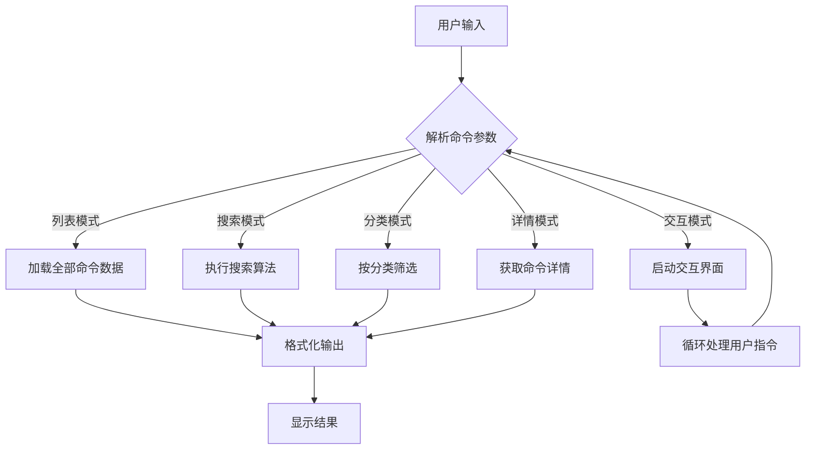
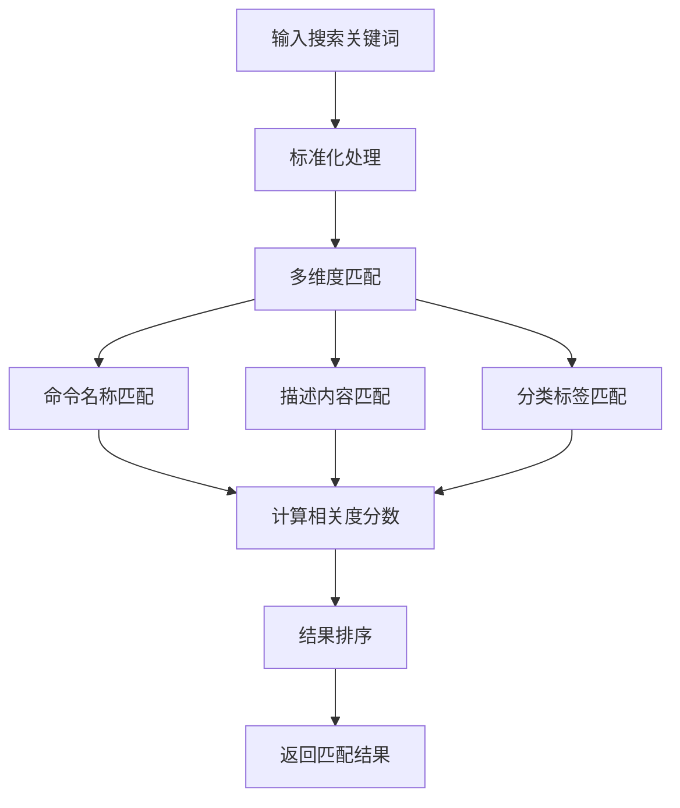
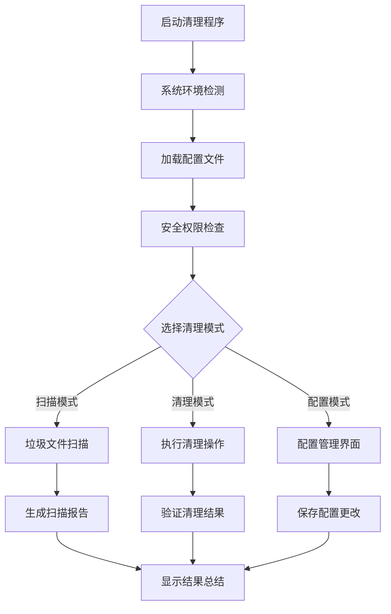
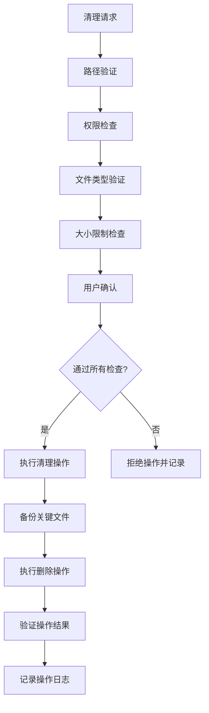
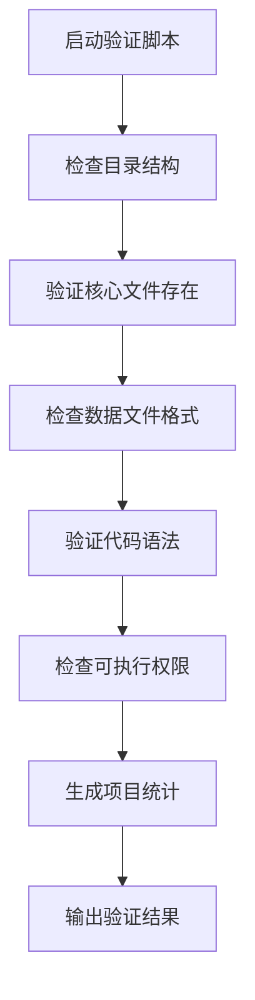

# 工程结构设计文档

## 概述

本工程包含两个独立的命令行工具项目，分别采用不同的技术栈实现特定的系统管理功能：

- **linux-file-commands**: Python实现的Linux文件命令查询工具
- **trash-cleaner**: Shell脚本实现的系统垃圾清理工具

两个项目遵循相似的工程结构模式，具备良好的模块化设计和可维护性。

## 技术栈与依赖关系

### linux-file-commands 项目
- **主要技术**: Python 3.x
- **核心依赖**: 标准库（json, argparse, re）
- **数据存储**: JSON文件格式
- **交互方式**: 命令行界面

### trash-cleaner 项目  
- **主要技术**: Bash Shell脚本
- **系统依赖**: Unix/Linux系统工具
- **交互方式**: 命令行界面和配置文件

## 项目架构

### 整体工程布局

```
工程根目录/
├── linux-file-commands/          # Python CLI工具项目
│   ├── src/                      # 核心业务逻辑
│   ├── data/                     # 数据文件存储
│   ├── tests/                    # 测试套件
│   ├── docs/                     # 项目文档
│   ├── examples/                 # 使用示例
│   └── 项目配置文件
└── trash-cleaner/                # Shell脚本工具项目
    ├── src/                      # 核心功能模块
    ├── tests/                    # 测试脚本
    ├── docs/                     # 项目文档
    ├── examples/                 # 使用示例
    └── 项目配置文件
```

### linux-file-commands 项目架构

#### 模块设计

| 模块名称 | 职责描述 | 依赖关系 |
|---------|---------|---------|
| main.py | 程序入口，处理命令行参数和用户交互 | 依赖所有功能模块 |
| parser.py | 命令行参数解析和验证 | 独立模块 |
| category.py | 命令分类管理和分类逻辑 | 依赖数据文件 |
| search.py | 命令搜索引擎和匹配算法 | 依赖数据文件 |
| detail.py | 命令详情展示和格式化 | 依赖formatter模块 |
| formatter.py | 输出格式化和主题渲染 | 独立工具模块 |

#### 数据模型

**命令数据结构**
| 字段 | 类型 | 描述 |
|-----|------|------|
| name | String | 命令名称 |
| categories | Array | 所属分类列表 |
| description | String | 命令功能描述 |
| syntax | String | 命令语法格式 |
| common_options | Array | 常用选项列表 |
| examples | Array | 使用示例 |
| related_commands | Array | 相关命令 |
| safety_tips | String | 安全使用提示 |

**分类数据结构**
| 字段 | 类型 | 描述 |
|-----|------|------|
| categories | Object | 分类定义对象 |
| description | String | 分类描述 |
| subcategories | Object | 子分类映射 |

#### 业务逻辑层

**命令查询流程**



**搜索算法设计**



### trash-cleaner 项目架构

#### 模块设计

| 模块名称 | 职责描述 | 依赖关系 |
|---------|---------|---------|
| trash-cleaner.sh | 主程序入口和流程控制 | 调用所有功能模块 |
| system_detector.sh | 系统环境检测和兼容性处理 | 独立检测模块 |
| config_manager.sh | 配置文件管理和参数处理 | 独立配置模块 |
| trash_scanner.sh | 垃圾文件扫描和分析 | 依赖logger模块 |
| security_checker.sh | 安全检查和权限验证 | 依赖logger模块 |
| cleanup_executor.sh | 清理操作执行和回滚 | 依赖所有模块 |
| ui.sh | 用户界面和交互处理 | 依赖formatter功能 |
| logger.sh | 日志记录和输出管理 | 独立工具模块 |

#### 清理执行流程



#### 安全机制设计



## 测试策略

### linux-file-commands 测试

**测试覆盖范围**
- 命令解析功能验证
- 搜索算法准确性测试
- 数据格式验证
- 输出格式正确性检查
- 交互模式功能测试

**测试执行方式**
- 单元测试：验证各模块独立功能
- 集成测试：验证模块间协作
- 数据验证：检查JSON文件格式和内容完整性

### trash-cleaner 测试

**测试覆盖范围**
- 系统兼容性测试
- 安全机制验证
- 清理功能正确性
- 配置管理功能
- 错误处理和恢复

**测试执行方式**
- 功能测试：验证各shell模块功能
- 安全测试：验证权限控制和安全检查
- 集成测试：验证整体清理流程

## 配置管理策略

### 数据文件管理

**linux-file-commands 数据管理**
- commands.json：存储所有Linux命令的详细信息
- categories.json：定义命令分类体系和层次结构
- 数据验证：启动时检查JSON格式和必需字段
- 数据扩展：支持动态添加新命令和分类

**trash-cleaner 配置管理**
- 配置文件：定义清理规则和安全策略
- 路径配置：指定扫描目录和排除路径
- 安全配置：设置文件大小限制和权限要求
- 日志配置：控制日志级别和输出格式

### 验证机制

**项目结构验证流程**



## 部署与分发

### linux-file-commands 部署

**部署要求**
- Python 3.x 运行环境
- 标准Unix/Linux命令行环境
- 读取权限用于数据文件访问

**分发方式**
- 独立脚本包：包含所有源码和数据文件
- 可执行权限配置：chmod +x linux-file-commands.py
- 路径配置：支持全局PATH安装

### trash-cleaner 部署

**部署要求**
- Bash Shell 环境
- Unix/Linux系统工具集
- 适当的文件系统权限

**分发方式**
- Shell脚本包：包含所有功能模块
- 权限配置：确保执行和访问权限
- 系统集成：支持系统级安装和配置

## 扩展性设计

### 模块化扩展

**linux-file-commands 扩展点**
- 新命令添加：通过扩展JSON数据文件
- 搜索算法优化：替换或增强search模块
- 输出格式扩展：添加新的formatter格式
- 交互界面改进：扩展用户交互功能

**trash-cleaner 扩展点**
- 清理规则扩展：添加新的扫描和清理逻辑
- 系统支持扩展：适配新的操作系统平台
- 安全策略扩展：增强安全检查机制
- 用户界面扩展：改进交互体验

### 性能优化策略

**数据访问优化**
- 延迟加载：按需加载数据文件
- 缓存机制：缓存频繁访问的数据
- 索引优化：建立高效的搜索索引

**执行效率优化**
- 并行处理：支持多线程/多进程扫描
- 内存管理：优化大文件处理
- I/O优化：减少文件系统访问次数