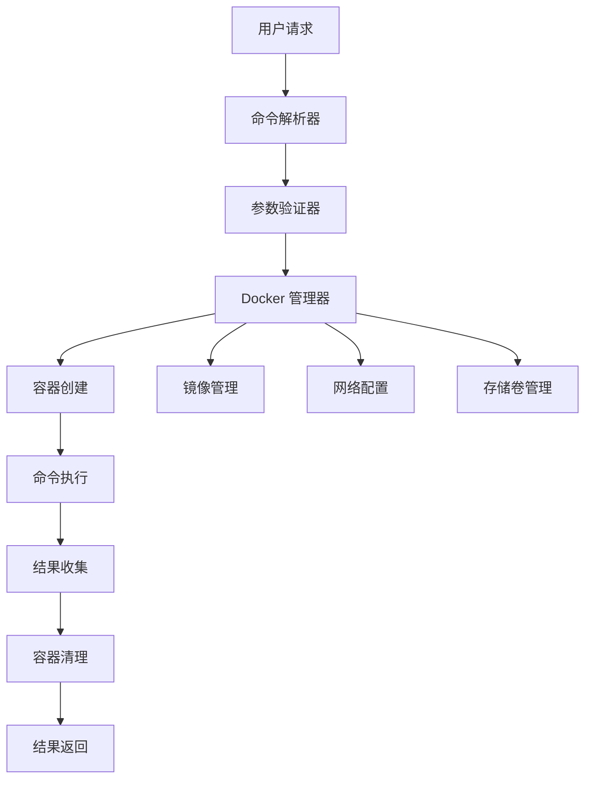
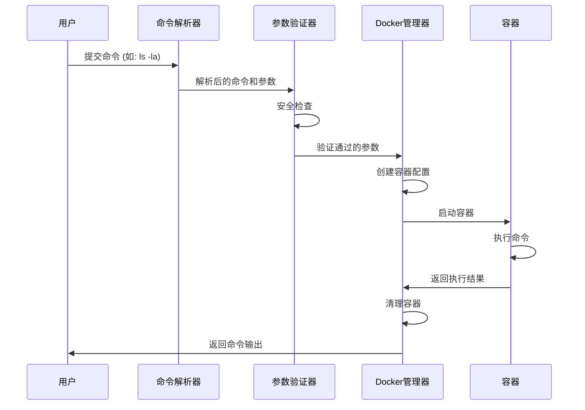

# Docker 命令执行工具设计文档

## 概述

本设计旨在创建一个通过 Docker 容器执行系统命令的工具，允许用户在隔离的环境中安全地运行各种命令，包括但不限于 `ls`、`pwd`、`cat` 等基础文件系统操作命令。该工具将提供一个统一的接口来管理 Docker 容器的创建、命令执行和资源清理。

### 核心价值
- **环境隔离**: 在独立的容器环境中执行命令，避免对宿主系统的影响
- **安全性**: 通过容器沙箱机制确保命令执行的安全性
- **可重复性**: 确保命令在一致的环境中执行
- **易用性**: 提供简单直观的接口执行 Docker 命令

## 技术栈与依赖

| 组件 | 技术选择 | 说明 |
|------|----------|------|
| 容器运行时 | Docker Engine | 提供容器化环境 |
| 基础镜像 | Alpine Linux | 轻量级 Linux 发行版 |
| 编程语言 | Python | 主要实现语言 |
| Docker SDK | docker-py | Python Docker 客户端 |
| 日志记录 | logging 模块 | 标准日志处理 |

## 架构设计



### 核心组件

#### 1. 命令解析器 (Command Parser)
- **职责**: 解析用户输入的命令和参数
- **功能**: 
  - 命令格式验证
  - 参数分离和处理
  - 特殊字符转义

#### 2. 参数验证器 (Parameter Validator)
- **职责**: 验证命令参数的安全性和有效性
- **功能**:
  - 危险命令检测
  - 参数格式验证
  - 路径安全检查

#### 3. Docker 管理器 (Docker Manager)
- **职责**: 管理 Docker 容器的生命周期
- **功能**:
  - 容器创建和配置
  - 镜像管理
  - 网络和存储配置

#### 4. 执行引擎 (Execution Engine)
- **职责**: 在容器中执行命令并收集结果
- **功能**:
  - 命令执行
  - 输出流捕获
  - 错误处理

## 功能规格

### 主要功能

#### 1. 基础命令执行
- **描述**: 支持在 Docker 容器中执行标准 Linux 命令
- **支持的命令类型**:
  - 文件系统操作: `ls`, `pwd`, `cat`, `head`, `tail`
  - 系统信息: `whoami`, `uname`, `date`
  - 网络工具: `ping`, `curl` (受限)
  - 文本处理: `grep`, `awk`, `sed`

#### 2. 工作目录映射
- **描述**: 将宿主机目录映射到容器中进行操作
- **映射策略**:
  - 只读映射: 默认模式，确保宿主机文件安全
  - 读写映射: 特殊权限下允许文件修改
  - 临时映射: 执行完毕后自动清理

#### 3. 环境变量传递
- **描述**: 支持将必要的环境变量传递给容器
- **传递规则**:
  - 白名单机制: 只传递预定义的安全变量
  - 自定义变量: 允许用户指定额外的环境变量
  - 系统变量过滤: 自动过滤敏感系统变量

### 配置参数

| 参数名称 | 默认值 | 描述 |
|----------|--------|------|
| base_image | alpine:latest | 基础容器镜像 |
| timeout | 30 | 命令执行超时时间（秒） |
| memory_limit | 256m | 容器内存限制 |
| cpu_limit | 0.5 | CPU 使用限制 |
| network_mode | none | 网络模式 |
| auto_remove | true | 执行完毕后自动删除容器 |

## 安全策略

### 命令白名单机制
- **安全命令**: 维护允许执行的安全命令列表
- **危险命令阻止**: 自动拦截潜在危险的系统命令
- **参数过滤**: 检查命令参数中的危险模式

### 资源限制
- **内存限制**: 防止容器消耗过多内存
- **CPU 限制**: 限制 CPU 使用率
- **网络隔离**: 默认禁用网络访问
- **文件系统保护**: 只读挂载宿主机目录

### 权限控制
- **非特权容器**: 以非 root 用户运行容器
- **文件系统只读**: 容器文件系统默认只读
- **系统调用限制**: 限制容器可用的系统调用

## 执行流程



## 错误处理策略

### 错误类型分类

| 错误类型 | 处理策略 | 用户反馈 |
|----------|----------|----------|
| 命令格式错误 | 立即拒绝 | 显示正确格式示例 |
| 安全检查失败 | 记录日志并拒绝 | 提示安全限制 |
| Docker 连接失败 | 重试机制 | 建议检查 Docker 服务 |
| 容器启动失败 | 资源检查 | 提示资源不足 |
| 命令执行超时 | 强制终止容器 | 显示超时信息 |
| 镜像拉取失败 | 使用本地镜像 | 提示网络问题 |

### 容错机制
- **自动重试**: 网络相关错误自动重试最多 3 次
- **降级策略**: 镜像不可用时使用备用镜像
- **资源回收**: 异常情况下确保容器资源被正确清理

## 使用示例场景

### 基础文件列表
```
输入: ls
容器执行: ls
输出: 显示当前目录文件列表
```

### 详细文件信息
```
输入: ls -la /tmp
容器执行: ls -la /tmp
输出: 显示 /tmp 目录的详细文件信息
```

### 文件内容查看
```
输入: cat /etc/os-release
容器执行: cat /etc/os-release
输出: 显示操作系统版本信息
```

### 系统信息获取
```
输入: uname -a
容器执行: uname -a
输出: 显示系统内核信息
```

## 监控与日志

### 日志记录
- **执行日志**: 记录每次命令执行的详细信息
- **安全日志**: 记录被拦截的危险命令尝试
- **性能日志**: 记录容器资源使用情况
- **错误日志**: 记录系统错误和异常

### 监控指标
- **执行成功率**: 命令执行成功的百分比
- **平均执行时间**: 命令执行的平均耗时
- **资源使用率**: 容器 CPU 和内存使用情况
- **安全事件**: 被阻止的危险操作次数

## 扩展能力

### 插件机制
- **命令插件**: 支持添加自定义命令处理器
- **验证插件**: 允许扩展安全验证规则
- **输出插件**: 支持自定义输出格式化器

### 镜像管理
- **多镜像支持**: 根据命令类型选择合适的镜像
- **镜像缓存**: 本地缓存常用镜像
- **镜像更新**: 定期更新基础镜像

### 配置管理
- **动态配置**: 支持运行时修改配置参数
- **配置模板**: 提供不同场景的预设配置
- **配置验证**: 自动验证配置参数的有效性


