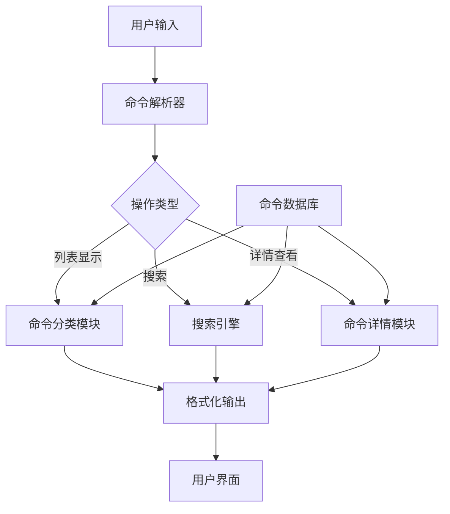
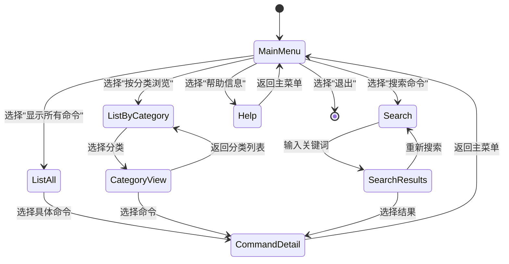

# Linux文件操作命令列表脚本设计文档

## 概述

本设计文档描述一个用于列出和展示Linux文件操作命令的脚本系统。该系统将提供一个交互式工具，帮助用户快速查找、学习和使用各种Linux文件操作命令。

### 核心价值
- 提供完整的Linux文件操作命令参考
- 支持分类浏览和快速搜索
- 包含命令示例和使用说明
- 提供交互式学习体验

### 目标用户
- Linux初学者和中级用户
- 系统管理员
- 需要快速查找文件操作命令的开发者

## 架构设计

### 系统架构

### 模块组成

| 模块名称 | 职责描述 | 主要功能 |
|---------|---------|---------|
| 命令数据库 | 存储所有文件操作命令信息 | 命令定义、参数说明、示例代码 |
| 命令解析器 | 解析用户输入参数 | 参数验证、操作路由 |
| 命令分类模块 | 按功能分类展示命令 | 分类逻辑、层级展示 |
| 搜索引擎 | 实现命令搜索功能 | 关键词匹配、模糊查找 |
| 命令详情模块 | 显示命令详细信息 | 语法说明、参数详解、使用示例 |
| 格式化输出 | 统一输出格式 | 颜色高亮、表格展示、分页显示 |

## 功能设计

### 命令分类体系

#### 基础文件操作
| 命令类别 | 包含命令 | 功能描述 |
|---------|---------|---------|
| 文件创建 | touch, mkdir, mkfifo | 创建文件、目录、命名管道 |
| 文件删除 | rm, rmdir, unlink | 删除文件和目录 |
| 文件复制 | cp, rsync | 复制文件和目录 |
| 文件移动 | mv, rename | 移动和重命名文件 |

#### 文件查看与编辑
| 命令类别 | 包含命令 | 功能描述 |
|---------|---------|---------|
| 内容查看 | cat, less, more, head, tail | 查看文件内容 |
| 文件编辑 | vim, nano, emacs, sed | 编辑文件内容 |
| 内容处理 | grep, awk, sort, uniq | 文本处理和过滤 |

#### 文件属性与权限
| 命令类别 | 包含命令 | 功能描述 |
|---------|---------|---------|
| 权限管理 | chmod, chown, chgrp | 修改文件权限和所有权 |
| 属性查看 | ls, stat, file | 查看文件属性和信息 |
| 链接管理 | ln, readlink | 创建和管理文件链接 |

#### 文件查找与定位
| 命令类别 | 包含命令 | 功能描述 |
|---------|---------|---------|
| 文件查找 | find, locate, which, whereis | 查找文件和命令 |
| 目录操作 | cd, pwd, pushd, popd | 目录导航和管理 |

#### 压缩与归档
| 命令类别 | 包含命令 | 功能描述 |
|---------|---------|---------|
| 压缩工具 | gzip, gunzip, bzip2, xz | 文件压缩和解压 |
| 归档工具 | tar, zip, unzip | 文件归档和提取 |

### 交互模式设计

#### 主菜单界面

### 命令信息结构

每个命令条目包含以下信息：

| 字段名称 | 数据类型 | 描述 |
|---------|---------|------|
| 命令名称 | 字符串 | 命令的基本名称 |
| 分类标签 | 字符串数组 | 命令所属的功能分类 |
| 简短描述 | 字符串 | 命令功能的简要说明 |
| 语法格式 | 字符串 | 命令的基本语法结构 |
| 常用参数 | 对象数组 | 主要参数及其说明 |
| 使用示例 | 字符串数组 | 实际使用场景的示例 |
| 相关命令 | 字符串数组 | 功能相似或相关的其他命令 |
| 安全提示 | 字符串 | 使用时需要注意的安全事项 |

### 搜索功能设计

#### 搜索策略
| 搜索类型 | 匹配规则 | 优先级 |
|---------|---------|-------|
| 精确匹配 | 命令名称完全匹配 | 最高 |
| 前缀匹配 | 命令名称前缀匹配 | 高 |
| 描述匹配 | 功能描述包含关键词 | 中 |
| 标签匹配 | 分类标签包含关键词 | 中 |
| 模糊匹配 | 支持拼写错误容错 | 低 |

#### 搜索结果展示
搜索结果将按照相关性排序，并提供以下信息：
- 匹配的命令名称（高亮显示匹配部分）
- 简短功能描述
- 匹配类型标识
- 相关性评分

### 输出格式设计

#### 命令列表视图
采用表格格式展示命令列表：
- 使用列对齐确保可读性
- 支持颜色高亮区分不同类型信息
- 提供分页功能处理大量命令
- 支持排序功能（按名称、分类、使用频率）

#### 命令详情视图
提供结构化的详细信息展示：
- 命令标题区域（名称、分类、简介）
- 语法说明区域（格式、参数解释）
- 示例代码区域（实用场景演示）
- 相关信息区域（相似命令、安全提示）

### 扩展性设计

#### 插件架构
系统设计支持插件扩展：
- 自定义命令数据源
- 扩展输出格式
- 添加新的搜索算法
- 集成外部文档系统

#### 配置管理
支持用户自定义配置：
- 默认显示模式
- 颜色主题设置
- 分页大小配置
- 搜索偏好设置

## 测试策略

### 功能测试
- 验证所有命令信息的准确性
- 测试搜索功能的准确性和性能
- 验证分类显示的完整性
- 测试交互流程的用户体验

### 兼容性测试
- 验证在不同Linux发行版上的兼容性
- 测试不同终端环境下的显示效果
- 验证各种shell环境的兼容性

### 性能测试
- 测试大量命令数据的加载性能
- 验证搜索响应时间
- 测试内存使用效率