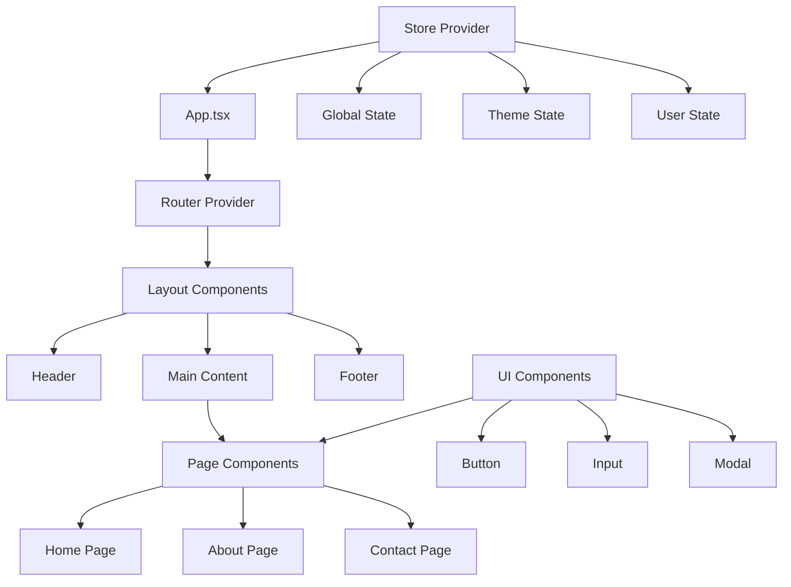
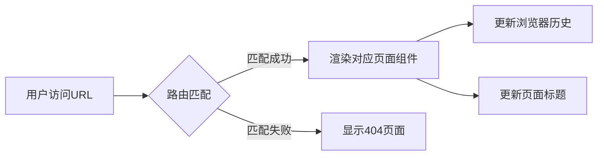
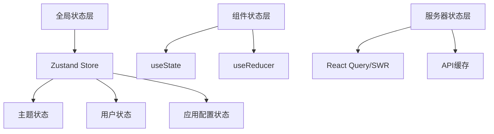
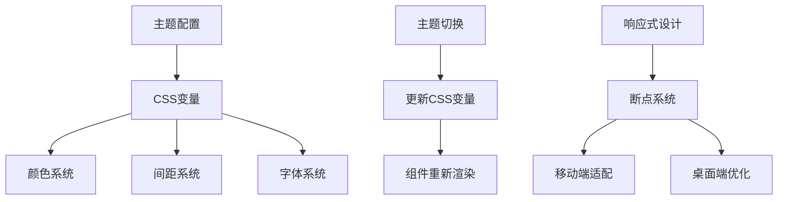
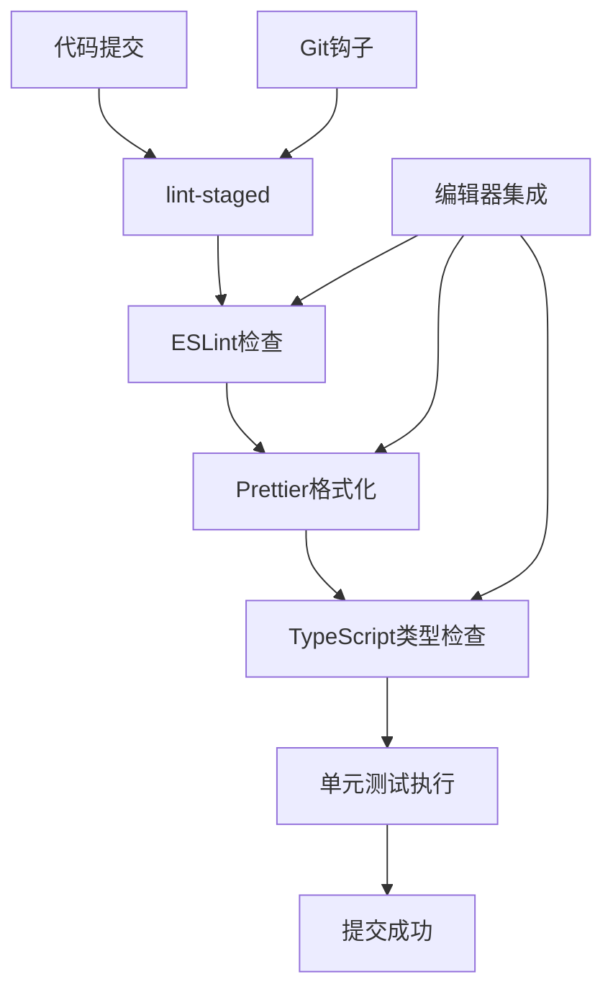

# React单页应用（SPA）项目初始化设计

## 概述

本设计文档定义了一个现代化React单页应用项目的初始化策略。项目将采用当前主流的React生态系统工具链，提供一个可扩展、易维护的前端应用基础架构。

### 核心目标
- 建立标准化的React SPA开发环境
- 配置完整的构建工具链和开发工具
- 实现组件化的前端架构
- 集成现代化的状态管理和路由解决方案
- 提供良好的开发体验和代码质量保障

## 技术栈与依赖

### 核心框架
| 技术 | 版本 | 用途 |
|------|------|------|
| React | 18.x | 前端UI框架 |
| React DOM | 18.x | DOM渲染 |
| TypeScript | 5.x | 静态类型检查 |
| Vite | 5.x | 构建工具和开发服务器 |

### 路由与状态管理
| 技术 | 版本 | 用途 |
|------|------|------|
| React Router | 6.x | 客户端路由管理 |
| Zustand | 4.x | 轻量级状态管理 |

### UI与样式
| 技术 | 版本 | 用途 |
|------|------|------|
| Tailwind CSS | 3.x | 实用优先的CSS框架 |
| Lucide React | 最新 | 图标库 |

### 开发工具
| 技术 | 版本 | 用途 |
|------|------|------|
| ESLint | 8.x | 代码质量检查 |
| Prettier | 3.x | 代码格式化 |
| Husky | 8.x | Git钩子管理 |
| lint-staged | 15.x | 暂存文件代码检查 |

## 项目架构

### 目录结构设计

```
project-root/
├── public/                 # 静态资源目录
│   ├── vite.svg           # 网站图标
│   └── index.html         # HTML模板
├── src/                   # 源代码目录
│   ├── components/        # 可重用组件
│   │   ├── ui/           # 基础UI组件
│   │   └── layout/       # 布局组件
│   ├── pages/            # 页面组件
│   ├── hooks/            # 自定义React钩子
│   ├── store/            # 状态管理
│   ├── utils/            # 工具函数
│   ├── types/            # TypeScript类型定义
│   ├── styles/           # 全局样式文件
│   ├── App.tsx           # 根组件
│   ├── main.tsx          # 应用入口点
│   └── vite-env.d.ts     # Vite类型声明
├── package.json          # 项目依赖配置
├── tsconfig.json         # TypeScript配置
├── vite.config.ts        # Vite构建配置
├── tailwind.config.js    # Tailwind CSS配置
├── .eslintrc.js          # ESLint配置
├── .prettierrc           # Prettier配置
├── .gitignore            # Git忽略文件
└── README.md             # 项目说明文档
```

### 组件架构



## 路由与导航

### 路由结构设计

| 路由路径 | 组件 | 描述 |
|----------|------|------|
| `/` | HomePage | 首页 |
| `/about` | AboutPage | 关于页面 |
| `/contact` | ContactPage | 联系页面 |
| `*` | NotFoundPage | 404错误页面 |

### 导航流程



## 状态管理策略

### 状态分层架构



### 状态管理原则
- 全局状态：跨组件共享的数据（用户信息、主题设置等）
- 本地状态：组件内部状态（表单输入、UI交互状态等）
- 服务器状态：从API获取的数据（通过React Query管理）

## API集成层

### 数据获取策略


### API客户端设计
- 统一的请求拦截器（添加认证头、请求ID等）
- 统一的响应拦截器（错误处理、数据转换等）
- 请求重试机制
- 加载状态管理
- 错误边界处理

## 样式策略

### CSS架构方案
- **Tailwind CSS**：提供实用优先的CSS类
- **CSS Modules**：组件级样式隔离（按需使用）
- **全局样式**：重置样式、字体、主题变量

### 主题系统设计



## 测试策略

### 测试层次架构

| 测试类型 | 工具 | 覆盖范围 | 目标 |
|----------|------|----------|------|
| 单元测试 | Vitest + Testing Library | 组件、钩子、工具函数 | 功能正确性 |
| 集成测试 | Testing Library | 页面级交互 | 组件协作 |
| 端到端测试 | Playwright | 完整用户流程 | 业务流程 |

### 测试策略原则
- 测试金字塔：大量单元测试、适量集成测试、少量端到端测试
- 行为驱动测试：关注用户行为而非实现细节
- 快照测试：确保UI组件的稳定性
- 可访问性测试：确保应用符合无障碍标准

## 构建与部署配置

### 构建流程设计


### 环境配置策略

| 环境 | 特点 | 配置 |
|------|------|------|
| 开发环境 | 热重载、源码映射、详细错误信息 | 开发服务器、快速构建 |
| 测试环境 | 接近生产、自动化测试 | 优化构建、测试覆盖率 |
| 生产环境 | 性能优化、错误监控 | 压缩、分割、CDN |

### 性能优化策略
- 代码分割（路由级别和组件级别）
- 懒加载（图片、组件、路由）
- 缓存策略（浏览器缓存、Service Worker）
- Bundle大小分析和优化
- 关键渲染路径优化

## 开发工具配置

### 代码质量保障



### 开发环境特性
- 热模块替换（HMR）
- 错误边界和错误提示
- 开发工具集成（React DevTools、Redux DevTools）
- 自动导入和智能提示
- 实时类型检查

## 初始化检查清单

### 环境准备检查
- [ ] Node.js版本（18.x或更高）
- [ ] npm或yarn包管理器
- [ ] Git版本控制
- [ ] 代码编辑器（推荐VS Code）

### 项目初始化步骤
1. 创建Vite React TypeScript项目
2. 安装核心依赖包
3. 配置开发工具（ESLint、Prettier、Husky）
4. 设置项目目录结构
5. 配置路由和状态管理
6. 创建基础组件和页面
7. 设置样式系统
8. 配置测试环境
9. 验证开发环境

### 验证标准
- [ ] 开发服务器正常启动
- [ ] 热重载功能正常工作
- [ ] TypeScript类型检查无错误
- [ ] ESLint和Prettier配置生效
- [ ] 路由导航功能正常
- [ ] 基础组件渲染正确
- [ ] 测试命令执行成功
- [ ] 构建命令生成正确输出