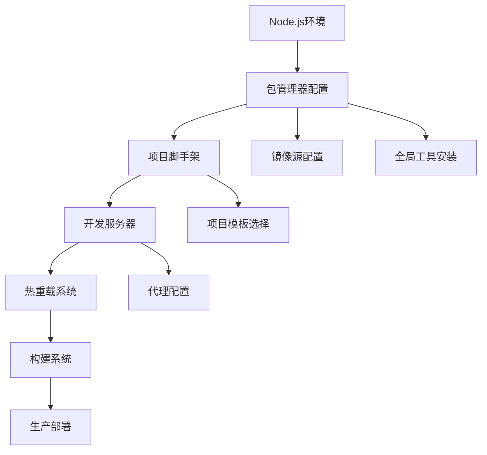
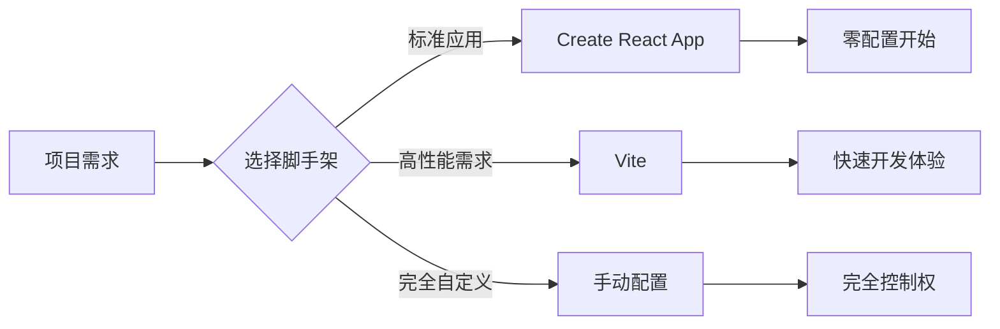
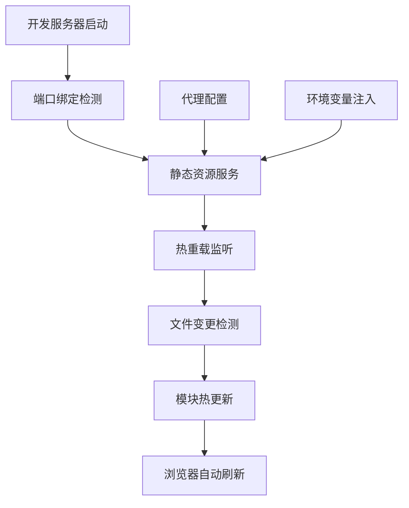
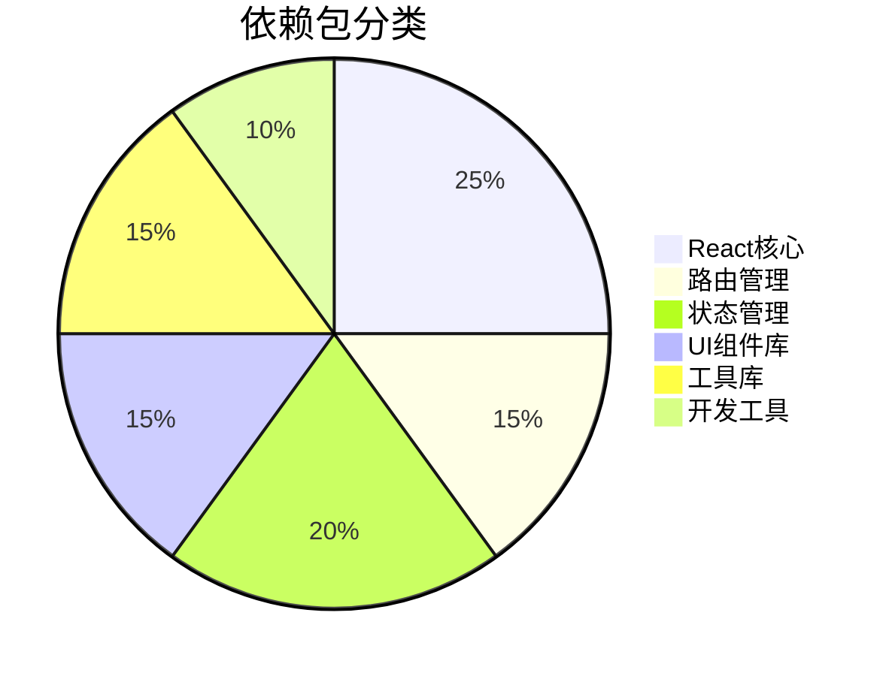
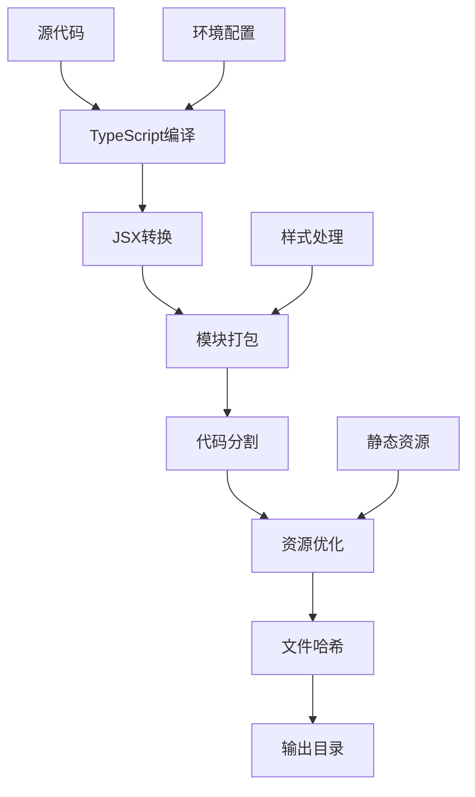
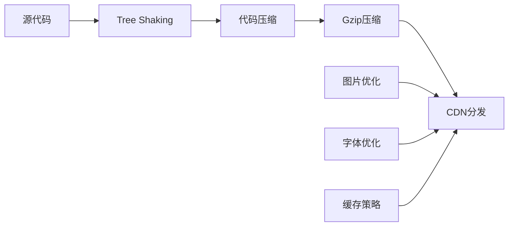
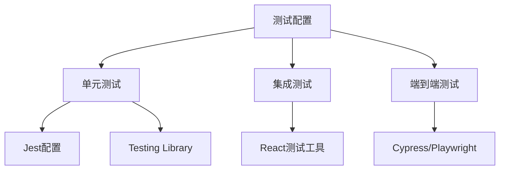
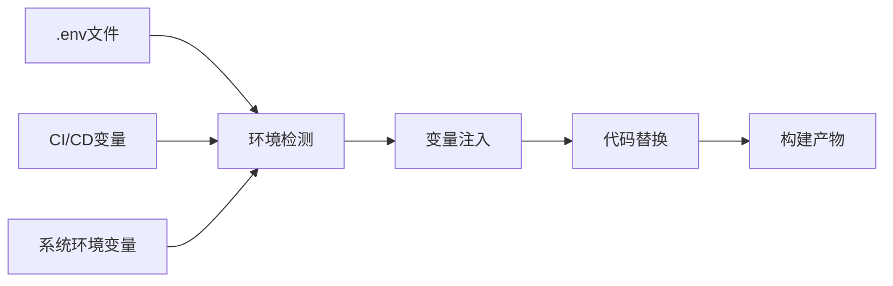
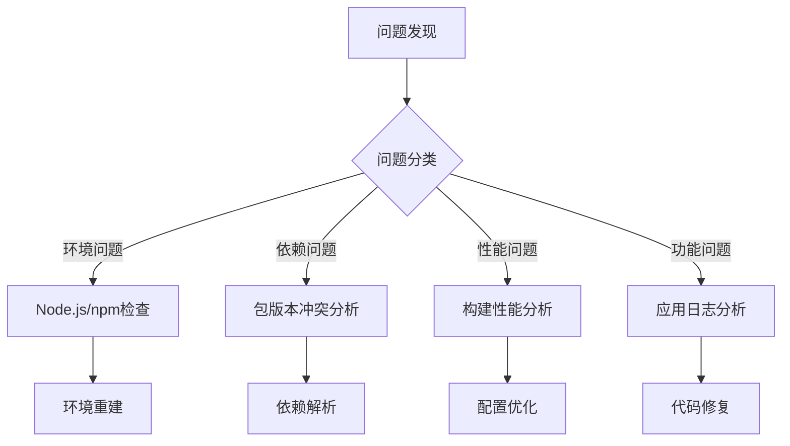
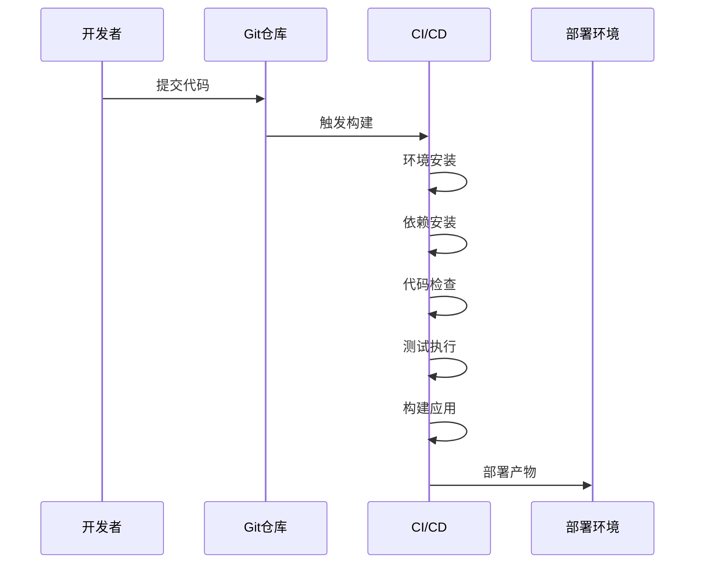

# React框架npm环境安装设计文档

## 概述

本设计文档详细描述了为React前端框架搭建完整npm开发环境的系统架构和配置策略。该环境将支持现代React应用开发的完整生命周期，包括开发、构建、测试和部署阶段。

### 核心目标
- 建立稳定可靠的Node.js运行环境
- 配置高效的包管理系统
- 搭建React开发工具链
- 确保开发环境的一致性和可重复性

## 技术栈架构

### 基础运行时环境

| 组件 | 版本要求 | 用途 |
|------|---------|------|
| Node.js | 18.x LTS | JavaScript运行时环境 |
| npm | 9.x | 默认包管理器 |
| npx | 内置 | 包执行工具 |

### React生态系统核心依赖

| 工具/库 | 类型 | 功能描述 |
|---------|------|----------|
| React | 生产依赖 | 核心React库 |
| React DOM | 生产依赖 | DOM渲染器 |
| Create React App | 开发工具 | 项目脚手架 |
| Vite | 构建工具 | 现代化构建系统（可选） |

### 开发工具链配置

## 环境安装架构

### 1. Node.js环境配置

#### 版本管理策略
- 使用Node Version Manager (nvm)实现多版本管理
- 锁定LTS版本确保稳定性
- 配置默认Node.js版本

#### 环境变量配置
| 变量名 | 用途 | 示例值 |
|--------|------|--------|
| NODE_ENV | 环境标识 | development/production |
| PATH | 可执行文件路径 | 包含node和npm路径 |
| NODE_OPTIONS | Node.js启动参数 | --max-old-space-size=4096 |

### 2. 包管理器优化配置

#### npm配置优化

| 配置项 | 设置值 | 作用 |
|--------|--------|------|
| registry | https://registry.npmmirror.com | 使用国内镜像源 |
| cache | ~/.npm | 缓存目录配置 |
| save-exact | true | 精确版本锁定 |
| fund | false | 关闭资助信息 |

#### 包管理策略
- 区分开发依赖和生产依赖
- 使用package-lock.json锁定依赖版本
- 配置.npmrc文件统一团队环境

### 3. React项目初始化架构

#### 脚手架选择方案

#### 项目结构设计

| 目录 | 用途 | 重要性 |
|------|------|--------|
| src/ | 源代码目录 | 核心 |
| public/ | 静态资源 | 必要 |
| node_modules/ | 依赖包 | 自动生成 |
| package.json | 项目配置 | 核心 |
| .gitignore | 版本控制排除 | 必要 |

## 开发环境配置

### 开发服务器架构

### 开发工具集成

| 工具 | 用途 | 集成方式 |
|------|------|----------|
| ESLint | 代码质量检查 | npm脚本 |
| Prettier | 代码格式化 | 编辑器插件 |
| React DevTools | 调试工具 | 浏览器扩展 |
| VS Code插件 | 开发体验增强 | 编辑器扩展 |

### 环境变量管理

#### 配置文件层级
1. .env - 默认环境变量
2. .env.local - 本地覆盖（不提交到版本控制）
3. .env.development - 开发环境专用
4. .env.production - 生产环境专用

## 依赖管理策略

### 核心依赖分类

### 版本管理策略

| 依赖类型 | 版本策略 | 更新频率 |
|----------|----------|----------|
| React核心 | 锁定主版本 | 季度评估 |
| UI库 | 锁定次版本 | 月度检查 |
|工具库 | 允许补丁更新 | 自动更新 |
| 开发工具 | 最新稳定版 | 及时更新 |

### 安全审计机制
- npm audit定期检查漏洞
- 依赖更新影响评估流程
- 安全补丁优先级处理

## 构建系统架构

### 构建流程设计

### 输出文件结构

| 文件类型 | 命名规则 | 缓存策略 |
|----------|----------|----------|
| JavaScript | [name].[hash].js | 长期缓存 |
| CSS | [name].[contenthash].css | 内容变化缓存 |
| 图片 | [name].[hash].[ext] | 永久缓存 |
| HTML | index.html | 不缓存 |

## 性能优化配置

### 开发环境优化

| 优化项 | 实现方式 | 预期效果 |
|--------|----------|----------|
| 编译速度 | 增量编译 | 50%速度提升 |
| 热更新 | 模块级更新 | 毫秒级响应 |
| 内存使用 | 懒加载模块 | 减少30%内存 |

### 生产环境优化

## 质量保证体系

### 代码质量检查

| 检查类型 | 工具 | 检查时机 |
|----------|------|----------|
| 语法检查 | ESLint | 实时 |
| 类型检查 | TypeScript | 编译时 |
| 样式检查 | Stylelint | 保存时 |
| 提交检查 | Husky | Git提交时 |

### 测试环境配置

## 部署配置架构

### 构建产物管理

| 环境 | 构建命令 | 输出目录 | 优化级别 |
|------|----------|----------|----------|
| 开发 | npm start | 内存 | 快速编译 |
| 测试 | npm run build:test | build/ | 部分优化 |
| 生产 | npm run build | build/ | 完全优化 |

### 环境变量注入策略

## 监控与维护

### 环境健康检查

| 检查项 | 频率 | 阈值 | 处理方式 |
|--------|------|------|----------|
| Node.js版本 | 每日 | LTS范围内 | 自动告警 |
| 依赖漏洞 | 每周 | 中等以上 | 手动评估 |
| 磁盘空间 | 实时 | >80% | 清理缓存 |
| 内存使用 | 实时 | >4GB | 重启进程 |

### 问题诊断机制

## 团队协作规范

### 环境一致性保证

| 配置文件 | 用途 | 版本控制 |
|----------|------|----------|
| .nvmrc | Node.js版本锁定 | 提交 |
| package-lock.json | 依赖版本锁定 | 提交 |
| .npmrc | npm配置 | 提交 |
| .gitignore | 排除文件配置 | 提交 |

### 开发流程规范

