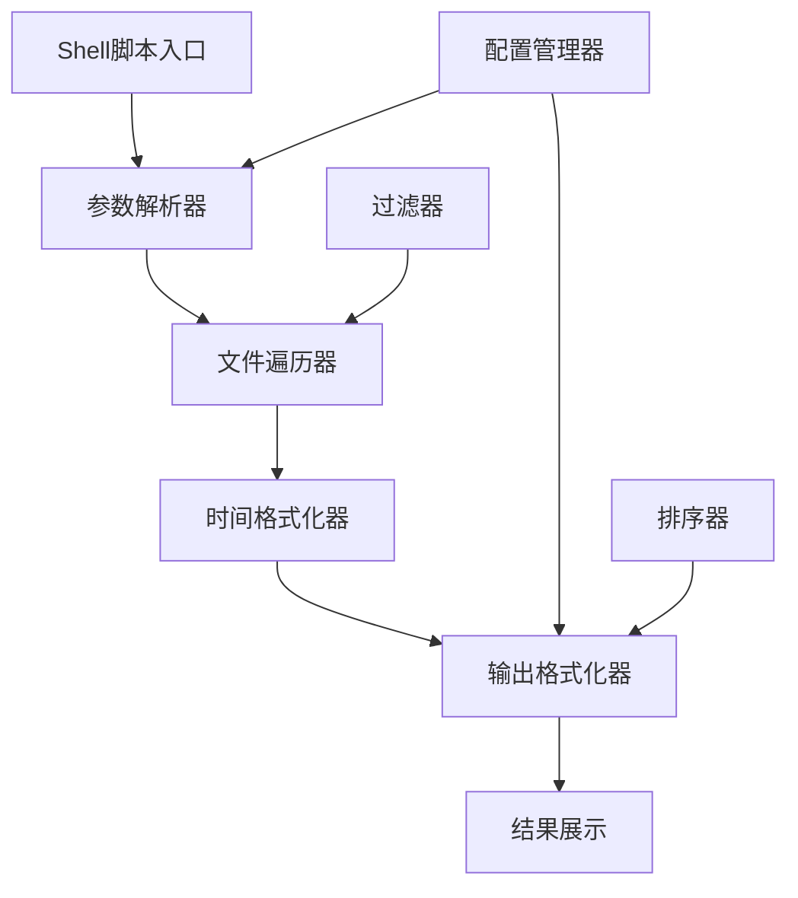

# 项目内容和修改时间列表脚本设计

## 概述

设计一个shell脚本工具，用于递归列出当前工程中的所有文件和目录，并显示其修改时间信息。该脚本旨在为开发者提供项目文件的完整概览，便于版本管理、文件跟踪和项目维护。

### 核心价值
- 快速获取项目完整文件清单
- 显示文件的详细时间信息，便于版本控制
- 提供灵活的输出格式选项
- 支持过滤和排序功能

## 架构设计

### 系统组件



### 核心模块

#### 文件遍历模块
负责递归遍历项目目录结构，收集文件和目录信息。

| 功能 | 描述 |
|------|------|
| 递归遍历 | 深度优先遍历所有子目录 |
| 符号链接处理 | 检测并适当处理符号链接 |
| 隐藏文件处理 | 可选择是否包含隐藏文件 |
| 权限检查 | 处理无权限访问的文件 |

#### 时间信息提取模块
提取并格式化文件的时间戳信息。

| 时间类型 | 说明 |
|----------|------|
| 修改时间 (mtime) | 文件内容最后修改时间 |
| 访问时间 (atime) | 文件最后访问时间 |
| 状态变更时间 (ctime) | 文件元数据最后变更时间 |
| 创建时间 | 文件创建时间（部分系统支持） |

#### 输出格式化模块
提供多种输出格式以满足不同使用场景。

| 输出格式 | 特点 | 适用场景 |
|----------|------|----------|
| 简洁模式 | 仅显示文件路径和修改时间 | 快速浏览 |
| 详细模式 | 包含文件大小、权限、所有时间信息 | 详细分析 |
| 表格模式 | 对齐的列格式 | 可读性强 |
| JSON模式 | 结构化数据输出 | 程序处理 |
| CSV模式 | 逗号分隔格式 | 数据分析 |

## 功能特性

### 命令行选项

| 选项 | 短选项 | 描述 | 默认值 |
|------|--------|------|--------|
| --help | -h | 显示帮助信息 | - |
| --all | -a | 包含隐藏文件 | false |
| --format | -f | 指定输出格式 | simple |
| --sort | -s | 排序方式 | name |
| --reverse | -r | 反向排序 | false |
| --depth | -d | 最大递归深度 | unlimited |
| --exclude | -e | 排除模式 | - |
| --include | -i | 包含模式 | - |
| --time-format | -t | 时间格式 | %Y-%m-%d %H:%M:%S |

### 过滤功能

#### 文件类型过滤
- 按文件扩展名过滤
- 按文件大小范围过滤
- 按修改时间范围过滤

#### 目录过滤
- 排除特定目录（如 .git, node_modules, __pycache__）
- 支持通配符模式匹配
- 支持正则表达式匹配

### 排序选项

| 排序方式 | 描述 |
|----------|------|
| name | 按文件名排序 |
| size | 按文件大小排序 |
| mtime | 按修改时间排序 |
| atime | 按访问时间排序 |
| extension | 按文件扩展名排序 |
| depth | 按目录深度排序 |

## 输出示例

### 简洁模式输出
```
./README.md                     2024-01-15 10:30:45
./file-cleaner/README.md        2024-01-14 16:22:30
./file-cleaner/src/main.py      2024-01-15 09:15:20
./linux-file-commands/verify.sh 2024-01-13 14:05:10
```

### 详细模式输出
```
文件路径                        大小     权限    修改时间             访问时间             状态时间
./README.md                    1.5KB    -rw-r--r--  2024-01-15 10:30:45  2024-01-15 11:00:12  2024-01-15 10:30:45
./file-cleaner/                 -       drwxr-xr-x  2024-01-14 16:22:30  2024-01-15 09:00:00  2024-01-14 16:22:30
./file-cleaner/src/main.py     2.3KB    -rw-r--r--  2024-01-15 09:15:20  2024-01-15 09:15:25  2024-01-15 09:15:20
```

### JSON模式输出结构
```json
{
  "scan_info": {
    "timestamp": "2024-01-15T11:00:00Z",
    "total_files": 25,
    "total_directories": 8,
    "scan_duration": "0.15s"
  },
  "files": [
    {
      "path": "./README.md",
      "type": "file",
      "size": 1536,
      "permissions": "-rw-r--r--",
      "mtime": "2024-01-15T10:30:45Z",
      "atime": "2024-01-15T11:00:12Z",
      "ctime": "2024-01-15T10:30:45Z"
    }
  ]
}
```

## 错误处理

### 权限错误处理
- 遇到无权限访问的文件时，记录错误但继续处理
- 在输出中标识无法访问的文件
- 提供详细的错误日志选项

### 符号链接处理
- 检测循环引用，避免无限递归
- 可选择是否跟随符号链接
- 区分显示符号链接本身和目标文件的信息

### 文件系统错误
- 处理文件在扫描过程中被删除的情况
- 处理网络文件系统的超时问题
- 提供重试机制

## 性能优化

### 大型项目优化策略
- 使用多进程并行处理大型目录
- 实现进度条显示扫描进度
- 提供中断和恢复机制
- 支持增量扫描（仅扫描变更文件）

### 内存管理
- 流式处理大型目录，避免内存溢出
- 分批输出结果，减少内存占用
- 提供内存使用监控选项

## 配置管理

### 配置文件支持
脚本支持通过配置文件设置默认选项，配置文件位置优先级：
1. 当前目录的 `.list-project.conf`
2. 用户主目录的 `.list-project.conf`
3. 系统级配置 `/etc/list-project.conf`

### 环境变量
支持通过环境变量覆盖配置选项：
- `LIST_PROJECT_FORMAT`: 默认输出格式
- `LIST_PROJECT_EXCLUDE`: 默认排除模式
- `LIST_PROJECT_TIME_FORMAT`: 默认时间格式

## 兼容性

### 操作系统支持
- Linux: 完全支持所有功能
- macOS: 完全支持所有功能
- Windows (WSL/Git Bash): 基本功能支持
- FreeBSD/OpenBSD: 基本功能支持

### Shell兼容性
- Bash 4.0+: 完全支持
- Zsh: 完全支持  
- Dash: 基本功能支持
- 其他POSIX兼容shell: 基本功能支持

## 测试策略

### 单元测试覆盖
- 文件遍历逻辑测试
- 时间格式化功能测试
- 输出格式验证测试
- 错误处理场景测试

### 集成测试场景
- 大型项目扫描测试
- 特殊文件系统测试（网络文件系统、只读文件系统）
- 符号链接复杂情况测试
- 多进程并发测试

### 性能测试
- 不同大小项目的性能基准测试
- 内存使用量测试
- 多种输出格式的性能对比测试