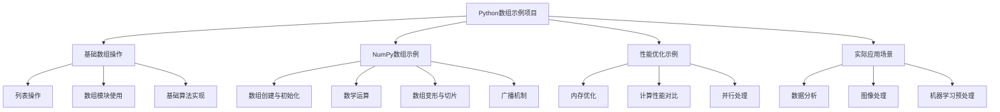
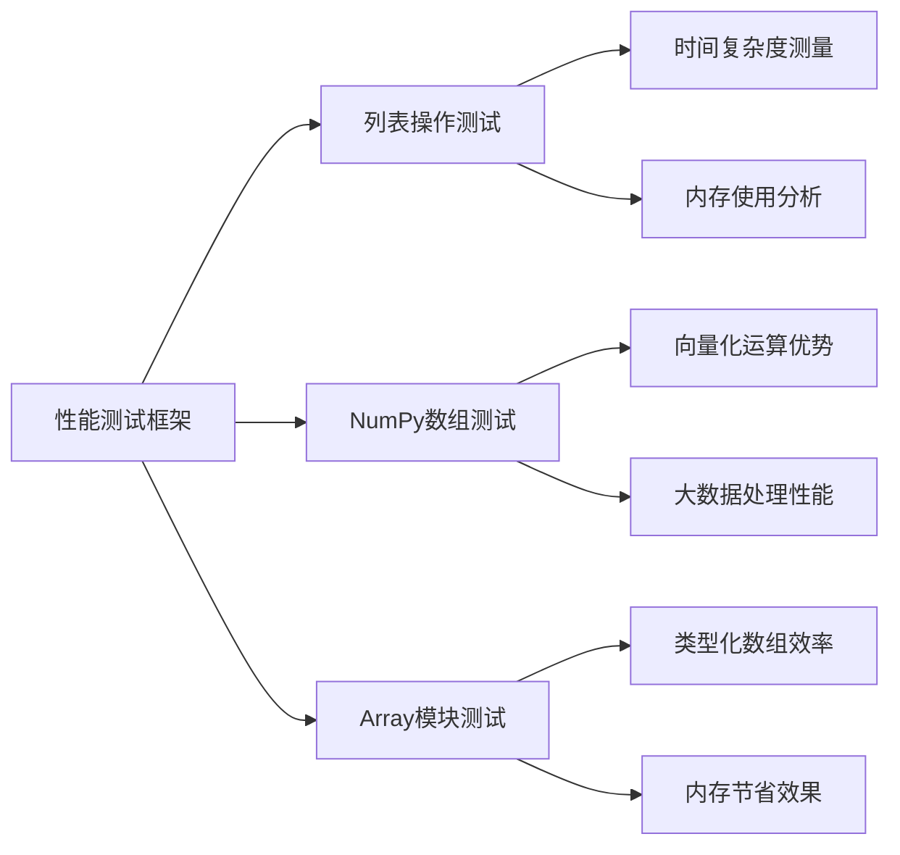
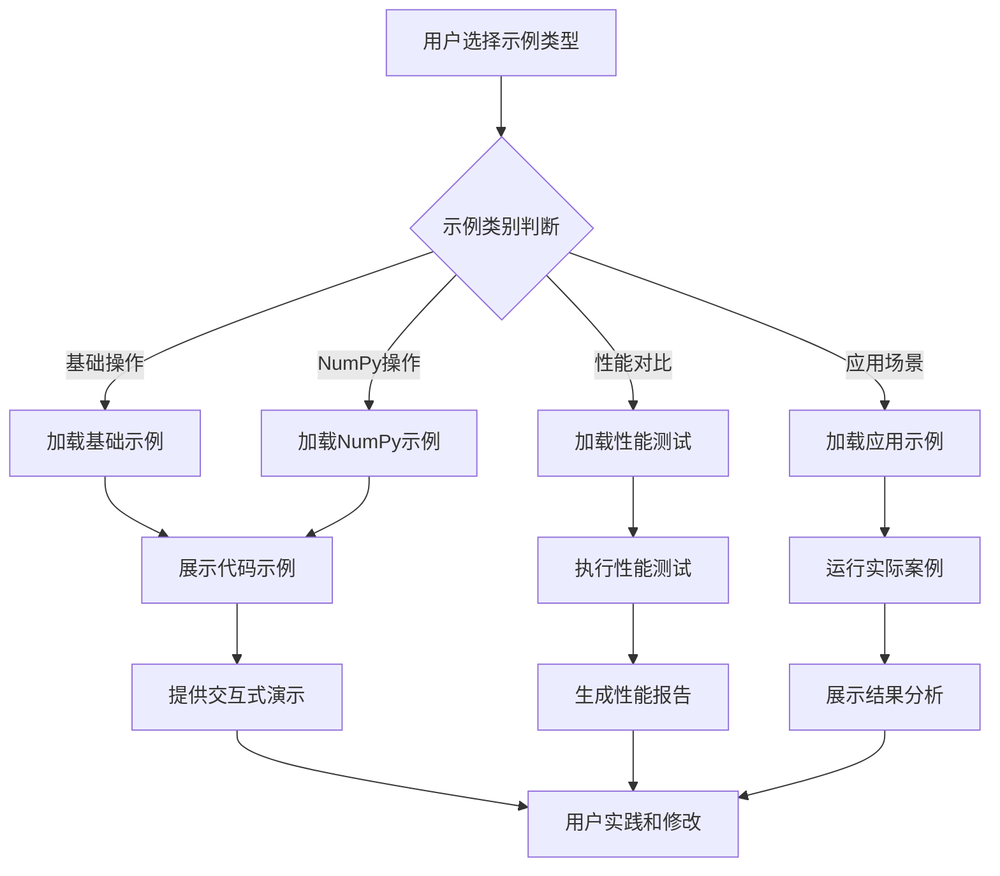
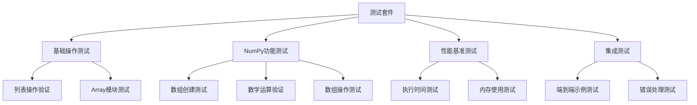

# Python 数组使用示例设计文档

## 概述

本项目旨在提供一个全面的Python数组操作示例集合，涵盖从基础数组操作到高级数据处理技术的各种应用场景。该项目将展示Python中不同类型数组（列表、NumPy数组、数组模块等）的使用方法和最佳实践。

### 项目目标
- 提供清晰易懂的Python数组操作示例
- 涵盖多种数组类型和使用场景
- 展示性能优化技巧和最佳实践
- 为初学者和进阶开发者提供参考资源

## 技术栈与依赖

### 核心技术
- Python 3.8+
- NumPy - 科学计算和数值数组操作
- Pandas - 数据分析和结构化数据处理
- Array模块 - Python内置数组类型

### 开发工具
- Jupyter Notebook - 交互式示例演示
- Matplotlib - 数据可视化
- Pytest - 单元测试

## 架构设计

### 模块组织结构

### 组件定义

| 组件名称 | 职责描述 | 主要功能 |
|---------|----------|----------|
| 基础数组操作模块 | 演示Python内置数组类型的使用 | 列表操作、数组模块使用、基础算法 |
| NumPy示例模块 | 展示NumPy数组的强大功能 | 数组创建、数学运算、数据操作 |
| 性能优化模块 | 对比不同数组类型的性能表现 | 性能测试、内存分析、优化建议 |
| 应用场景模块 | 实际项目中的数组应用示例 | 数据处理、科学计算、算法实现 |
| 工具集模块 | 辅助功能和实用工具 | 性能测量、数据生成、可视化 |

## 功能模块详细设计

### 1. 基础数组操作模块

#### 1.1 列表操作示例
- **创建与初始化**：展示多种列表创建方法
- **索引与切片**：演示列表的访问和修改操作
- **常用方法**：append、extend、insert、remove等方法使用
- **列表推导式**：高效的列表生成技巧

#### 1.2 Array模块使用
- **类型化数组**：展示不同数据类型的数组创建
- **内存效率**：对比列表与array的内存使用
- **文件操作**：数组的序列化和反序列化

#### 1.3 基础算法实现
- **排序算法**：使用数组实现经典排序算法
- **搜索算法**：二分查找、线性搜索等
- **数组变换**：旋转、反转、去重等操作

### 2. NumPy数组示例模块

#### 2.1 数组创建与初始化

| 创建方式 | 应用场景 | 性能特点 |
|---------|----------|----------|
| np.array() | 从列表创建数组 | 通用性强，适合小规模数据 |
| np.zeros() | 初始化零数组 | 内存预分配，高效 |
| np.ones() | 初始化单位数组 | 快速创建填充数组 |
| np.arange() | 创建等差数列 | 替代range，支持浮点数 |
| np.linspace() | 创建线性间隔数组 | 科学计算常用 |
| np.random | 随机数组生成 | 数据模拟和测试 |

#### 2.2 数学运算示例
- **元素级运算**：加法、乘法、幂运算等
- **矩阵运算**：矩阵乘法、转置、求逆
- **统计函数**：求和、均值、标准差、最值
- **三角函数**：sin、cos、tan等数学函数

#### 2.3 数组操作技巧
- **形状变换**：reshape、flatten、transpose
- **数组合并**：concatenate、stack、hstack、vstack
- **条件筛选**：布尔索引、where条件选择
- **广播机制**：不同形状数组的运算规则

### 3. 性能优化模块

#### 3.1 性能对比分析

#### 3.2 优化策略
- **向量化操作**：避免Python循环，使用NumPy向量化
- **内存布局优化**：了解C风格和Fortran风格存储
- **数据类型选择**：根据需求选择合适的数据类型
- **预分配策略**：避免动态扩容的性能损失

### 4. 实际应用场景模块

#### 4.1 数据分析应用
- **数据清洗**：处理缺失值、异常值检测
- **统计分析**：描述性统计、相关性分析
- **数据聚合**：分组统计、透视表操作

#### 4.2 科学计算应用
- **数值积分**：使用数组进行数值计算
- **信号处理**：滤波、傅里叶变换
- **图像处理**：像素操作、图像滤镜

#### 4.3 机器学习预处理
- **特征标准化**：数据归一化和标准化
- **特征工程**：特征提取和变换
- **数据分割**：训练集和测试集划分

## 数据流设计

### 示例执行流程

### 数据处理管道

| 阶段 | 输入 | 处理过程 | 输出 |
|------|------|----------|------|
| 数据准备 | 原始数据/参数 | 数据验证和格式化 | 标准化数据 |
| 示例执行 | 标准化数据 | 执行相应的数组操作 | 处理结果 |
| 结果展示 | 处理结果 | 格式化和可视化 | 用户友好的输出 |
| 性能分析 | 执行过程 | 时间和内存统计 | 性能报告 |

## 配置管理

### 示例配置参数

| 配置项 | 描述 | 默认值 | 可选值 |
|--------|------|--------|--------|
| array_size | 数组大小配置 | 1000 | 100-1000000 |
| data_type | 数据类型选择 | float64 | int32, float32, float64 |
| visualization | 是否显示可视化 | true | true, false |
| performance_test | 是否进行性能测试 | false | true, false |
| random_seed | 随机数种子 | 42 | 任意整数 |

### 环境配置要求

| 组件 | 最低版本 | 推荐版本 | 用途 |
|------|----------|----------|------|
| Python | 3.8 | 3.9+ | 运行环境 |
| NumPy | 1.19 | 1.21+ | 数值计算 |
| Matplotlib | 3.3 | 3.5+ | 数据可视化 |
| Jupyter | 6.0 | 6.4+ | 交互式演示 |

## 测试策略

### 单元测试设计

### 测试覆盖范围

| 测试类型 | 覆盖范围 | 验证目标 |
|----------|----------|----------|
| 功能测试 | 所有示例代码 | 正确性验证 |
| 性能测试 | 关键算法 | 性能基准 |
| 边界测试 | 极端输入 | 鲁棒性验证 |
| 兼容性测试 | 不同Python版本 | 环境兼容性 |

### 错误处理策略

| 错误类型 | 处理方式 | 用户反馈 |
|----------|----------|----------|
| 输入验证错误 | 参数检查和提示 | 友好的错误信息 |
| 内存不足 | 降级处理 | 建议减小数据规模 |
| 依赖缺失 | 环境检查 | 安装指导 |
| 计算溢出 | 异常捕获 | 数据范围建议 |