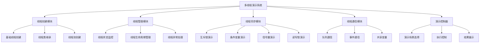
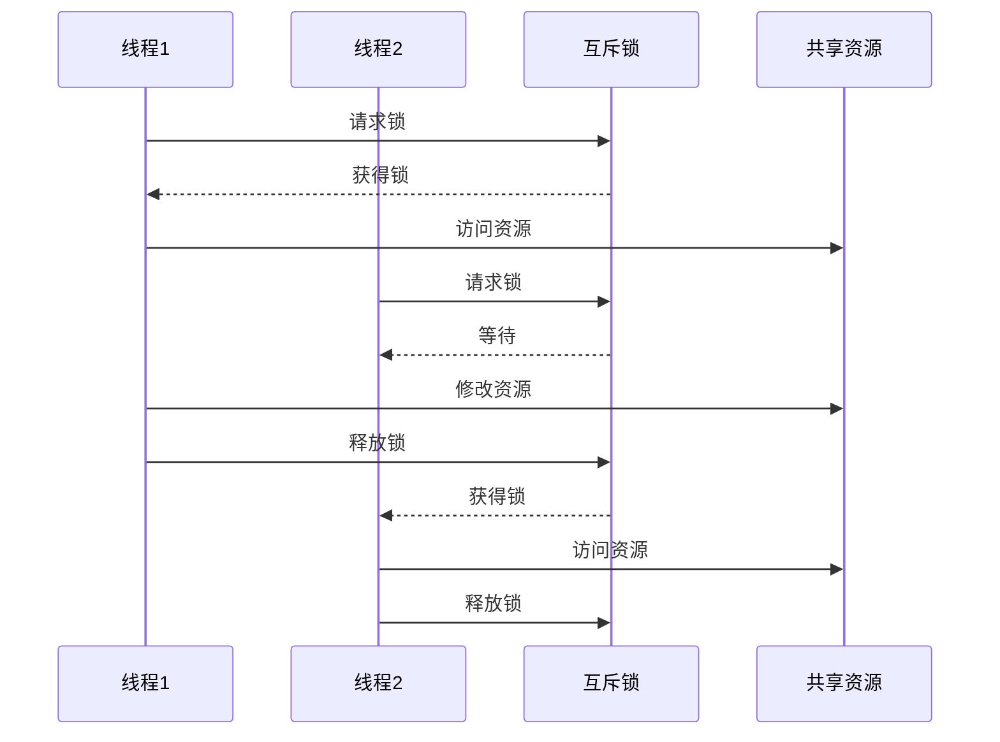
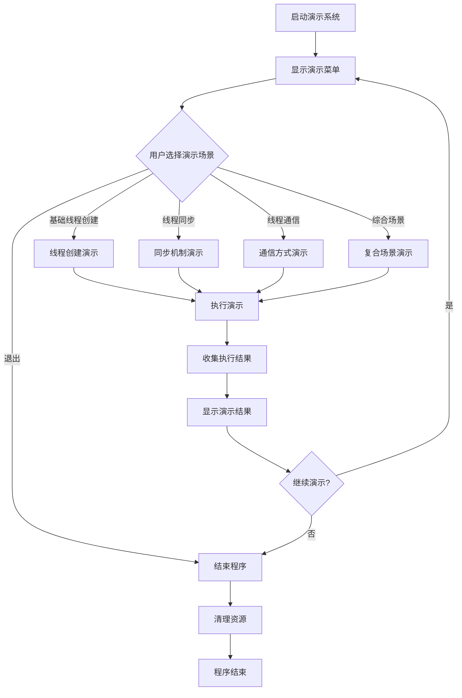

# Python多线程基础演示项目设计文档

## 概述

本项目是一个Python多线程基础演示系统，旨在展示Python中线程的创建、管理和控制的核心概念。项目通过多个实际场景演示多线程编程的基本技术，包括线程创建、线程同步、线程通信和线程生命周期管理等核心功能。

### 项目目标
- 演示Python threading模块的基本用法
- 展示不同的线程创建方式
- 演示线程同步机制（锁、条件变量、信号量）
- 展示线程间通信方法
- 提供多线程编程最佳实践示例

### 目标用户
- Python初学者学习多线程编程
- 需要了解线程管理技术的开发者
- 希望掌握多线程同步机制的程序员

## 架构设计

### 系统架构图

### 核心组件设计

| 组件名称 | 职责描述 | 主要功能 |
|---------|---------|---------|
| 线程创建模块 | 演示各种线程创建方式 | 函数式创建、类继承创建、线程池创建 |
| 线程管理模块 | 管理线程生命周期 | 启动、暂停、恢复、终止线程 |
| 线程同步模块 | 演示线程同步机制 | 锁、条件变量、信号量的使用 |
| 线程通信模块 | 演示线程间通信 | 队列、事件、共享数据结构 |
| 演示控制器 | 统一管理演示流程 | 场景选择、执行控制、结果收集 |

## 功能模块设计

### 1. 线程创建模块

#### 1.1 基础线程创建演示
- **功能描述**: 展示使用threading.Thread创建线程的基本方法
- **演示内容**:
  - 通过target参数传递函数创建线程
  - 通过args和kwargs传递参数
  - 线程命名和标识

#### 1.2 线程类继承演示
- **功能描述**: 展示通过继承Thread类创建自定义线程
- **演示内容**:
  - 重写run方法
  - 自定义初始化参数
  - 线程状态控制

#### 1.3 线程池演示
- **功能描述**: 展示使用ThreadPoolExecutor管理线程池
- **演示内容**:
  - 固定大小线程池
  - 动态任务提交
  - 结果获取和异常处理

### 2. 线程管理模块

#### 2.1 线程状态监控
- **功能描述**: 监控和展示线程的运行状态
- **监控内容**:
  - 线程是否存活
  - 线程是否为守护线程
  - 活跃线程数量统计

#### 2.2 线程生命周期管理
- **功能描述**: 演示线程从创建到销毁的完整生命周期
- **管理内容**:
  - 线程启动控制
  - 优雅关闭机制
  - 资源清理

#### 2.3 线程异常处理
- **功能描述**: 演示多线程环境下的异常处理策略
- **处理机制**:
  - 线程内异常捕获
  - 异常信息传递
  - 异常恢复策略

### 3. 线程同步模块

#### 3.1 互斥锁演示
- **功能描述**: 演示Lock和RLock的使用
- **演示场景**:
  - 共享资源竞争问题
  - 锁的获取和释放
  - 死锁预防

#### 3.2 条件变量演示
- **功能描述**: 演示Condition的使用场景
- **演示内容**:
  - 生产者-消费者模式
  - 条件等待和通知
  - 多条件协调

#### 3.3 信号量演示
- **功能描述**: 演示Semaphore控制资源访问
- **演示场景**:
  - 限制并发访问数量
  - 资源池管理
  - 计数型同步

### 4. 线程通信模块

#### 4.1 队列通信演示
- **功能描述**: 演示使用Queue进行线程间通信
- **队列类型**:
  - FIFO队列（Queue）
  - LIFO队列（LifoQueue）
  - 优先级队列（PriorityQueue）

#### 4.2 事件通信演示
- **功能描述**: 演示Event对象的信号机制
- **应用场景**:
  - 线程启动信号
  - 任务完成通知
  - 系统状态同步

#### 4.3 共享变量演示
- **功能描述**: 演示线程安全的共享数据结构
- **共享方式**:
  - threading.local局部存储
  - 全局变量保护
  - 原子操作

## 演示场景设计

### 场景1: 并发计算任务
- **目标**: 演示多线程提升计算效率
- **实现**: 使用多个线程并行计算数学运算
- **展示要点**: 线程创建、任务分配、结果汇总

### 场景2: 生产者-消费者模式
- **目标**: 演示经典的多线程协作模式
- **实现**: 生产者线程生成数据，消费者线程处理数据
- **展示要点**: 队列通信、条件同步、缓冲区管理

### 场景3: 资源池管理
- **目标**: 演示有限资源的多线程访问控制
- **实现**: 模拟数据库连接池或文件句柄池
- **展示要点**: 信号量控制、资源分配、超时处理

### 场景4: 任务调度系统
- **目标**: 演示复杂的多线程任务管理
- **实现**: 任务队列、工作线程池、结果收集
- **展示要点**: 线程池管理、动态调度、状态监控

## 数据模型设计

### 线程信息模型
| 字段名称 | 数据类型 | 描述 |
|---------|---------|------|
| thread_id | 整数 | 线程唯一标识符 |
| thread_name | 字符串 | 线程名称 |
| thread_state | 枚举 | 线程状态（运行中、等待、结束） |
| start_time | 时间戳 | 线程启动时间 |
| end_time | 时间戳 | 线程结束时间 |
| is_daemon | 布尔值 | 是否为守护线程 |
| is_alive | 布尔值 | 线程是否存活 |

### 同步对象模型
| 字段名称 | 数据类型 | 描述 |
|---------|---------|------|
| sync_type | 字符串 | 同步对象类型（Lock、Condition、Semaphore等） |
| object_id | 字符串 | 同步对象标识 |
| waiting_threads | 列表 | 等待该对象的线程列表 |
| owner_thread | 字符串 | 当前持有对象的线程（适用于锁） |

### 通信消息模型
| 字段名称 | 数据类型 | 描述 |
|---------|---------|------|
| message_id | 字符串 | 消息唯一标识 |
| sender_thread | 字符串 | 发送方线程 |
| receiver_thread | 字符串 | 接收方线程 |
| message_type | 字符串 | 消息类型 |
| message_content | 对象 | 消息内容 |
| timestamp | 时间戳 | 消息时间戳 |

## 演示执行流程

### 主要演示流程图

### 演示场景执行步骤

1. **初始化阶段**
   - 创建演示环境
   - 初始化日志系统
   - 准备测试数据

2. **演示执行阶段**
   - 根据用户选择加载对应演示
   - 创建并启动相关线程
   - 监控线程执行状态

3. **结果展示阶段**
   - 收集线程执行信息
   - 统计性能数据
   - 生成可视化报告

4. **清理阶段**
   - 等待所有线程结束
   - 释放系统资源
   - 保存演示日志

## 配置管理

### 演示配置参数
| 参数名称 | 默认值 | 描述 |
|---------|-------|------|
| max_threads | 10 | 最大线程数量 |
| demo_duration | 30 | 演示持续时间（秒） |
| log_level | INFO | 日志级别 |
| output_format | console | 输出格式（console/file） |
| enable_monitoring | true | 是否启用监控 |

### 线程池配置
| 参数名称 | 默认值 | 描述 |
|---------|-------|------|
| core_pool_size | 5 | 核心线程池大小 |
| max_pool_size | 20 | 最大线程池大小 |
| keep_alive_time | 60 | 线程空闲保持时间（秒） |
| queue_capacity | 100 | 任务队列容量 |

## 监控与日志

### 监控指标
- 活跃线程数量
- 线程创建和销毁统计
- 同步对象竞争情况
- 队列使用情况
- 异常发生频率

### 日志记录
- 线程生命周期事件
- 同步操作记录
- 异常和错误信息
- 性能统计数据
- 用户操作记录

## 测试策略

### 单元测试覆盖
- 线程创建和管理功能
- 同步机制正确性
- 通信方式可靠性
- 异常处理机制

### 集成测试场景
- 多种演示场景端到端测试
- 并发压力测试
- 资源泄漏检测
- 性能基准测试

