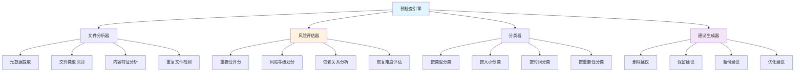
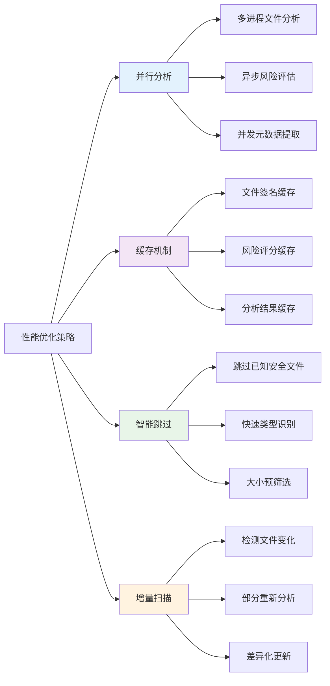
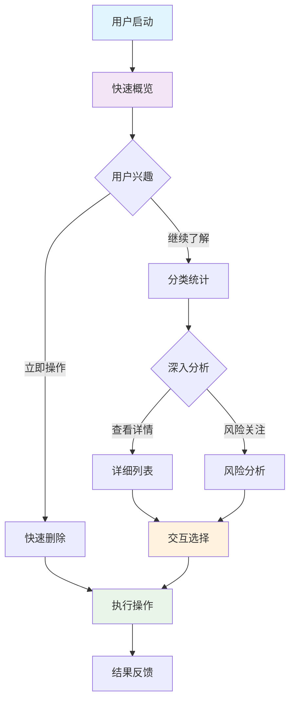

#回收站清理脚本优化设计：增强预检查与列表功能

## 概述

针对现有回收站清理脚本系统进行功能优化，重点增强删除前的检查列表能力，提供更详细的文件分析、风险评估和智能建议功能。优化后的系统将提供多层次的预览和确认机制，确保用户在删除操作前能够全面了解将要处理的内容。

### 核心优化目标
- **增强可视性**：提供详细的文件列表和统计信息展示
- **智能分析**：自动识别重要文件并提供风险评估
- **分类管理**：按文件类型、大小、时间等维度分类展示
- **交互优化**：多级确认和选择性删除支持
- **安全保障**：强化预检查机制，防止误删重要内容

## 新增功能架构

### 预检查引擎设计



### 文件分析与分类系统

``mermaid
flowchart LR
    A[扫描到的文件] --> B[文件分析器]
    
    B --> C{文件类型检测}
    C -->|文档| D[文档类别]
    C -->|媒体| E[媒体类别]
    C -->|程序| F[程序类别]
    C -->|系统| G[系统类别]
    C -->|其他| H[其他类别]
    
    D --> I[重要性评估]
    E --> I
    F --> I
    G --> I
    H --> I
    
    I --> J{风险等级}
    J -->|高风险| K[红色标记]
    J -->|中风险| L[黄色标记]
    J -->|低风险| M[绿色标记]
    J -->|安全| N[无标记]
    
    K --> O[详细列表展示]
    L --> O
    M --> O
    N --> O
    
    styleI fill:#ffeb3b
    style J fill:#ff9800
    style K fill:#f44336
    style L fill:#ffc107
    style M fill:#4caf50
```

## 增强的列表展示功能

###多视图列表设计

| 视图类型 | 展示内容 | 排序方式 | 用途 |
|----------|----------|----------|------|
| 概览视图 | 分类统计、总体信息 | 按类别 | 快速了解整体情况 |
| 详细视图| 完整文件列表 | 可自定义 | 详细检查每个文件 |
| 风险视图 | 高风险文件列表 | 按风险等级 | 重点关注重要文件 |
| 分类视图 | 按类型分组展示 | 按文件类型 | 有针对性的处理 |
| 时间视图 | 按修改时间排列 | 按时间倒序 | 了解文件新旧程度 |
| 大小视图 | 按文件大小排列 | 按大小倒序 | 优先处理大文件 |

### 交互式列表功能

``mermaid
stateDiagram-v2
    [*] --> ListScan: 开始扫描
    ListScan --> ShowOverview: 显示概览
    
    ShowOverview --> SelectView: 选择视图类型
    SelectView --> DetailView: 详细视图
    SelectView --> RiskView: 风险视图SelectView --> CategoryView: 分类视图
    SelectView --> TimeView: 时间视图
    SelectView --> SizeView: 大小视图
    
    DetailView --> FileActions: 文件操作菜单
    RiskView --> FileActions
    CategoryView --> FileActions
    TimeView--> FileActions
    SizeView --> FileActions
    
    FileActions --> MarkDelete: 标记删除
    FileActions --> MarkKeep: 标记保留
    FileActions --> ViewDetails: 查看详情
    FileActions --> OpenFile: 打开文件
    
    MarkDelete --> UpdateList:更新列表
    MarkKeep --> UpdateList
    ViewDetails --> FileActions
    OpenFile --> FileActions
    
    UpdateList --> SelectView
    UpdateList --> ConfirmAction: 确认操作
    
    ConfirmAction --> ExecuteDelete: 执行删除
    ConfirmAction --> SelectView: 继续编辑
    
    ExecuteDelete --> [*]
```

## 智能文件分析功能

### 文件重要性评分算法

| 评分因素 | 权重 | 评分规则 | 说明 |
|----------|------|----------|------|
| 文件类型 | 30% | 文档>媒体>程序>临时 | 不同类型基础权重 |
| 文件大小 | 20% | 适中大小得分高 | 过大过小都可能是垃圾 |
| 修改时间 | 25% | 最近修改得分高 | 反映文件活跃度 |
| 文件位置 | 15%| 特殊目录得分高 | 如Desktop、Documents |
| 文件关联 | 10% | 有关联文件得分高 | 项目文件、配对文件 |

### 风险等级分类标准

``mermaid
graphTDA[文件风险评估] --> B{综合评分}
    
    B -->|85-100分| C[高风险 - 红色]
    B -->|60-84分| D[中风险 - 黄色]
    B -->|30-59分| E[低风险 - 绿色]
    B -->|0-29分| F[安全 - 无标记]
    
    C --> C1[重要文档]
    C --> C2[配置文件]
    C --> C3[项目文件]
    
    D --> D1[个人文件]
    D --> D2[媒体文件]
    D --> D3[下载文件]
    
    E --> E1[临时文件]
    E --> E2[缓存文件]
    E --> E3[重复文件]
    
    F --> F1[系统垃圾]
    F --> F2[日志文件]
    F --> F3[废弃文件]
    
    style C fill:#ffcdd2
    style D fill:#fff9c4
    style E fill:#c8e6c9
    style F fill:#f5f5f5
```

## 详细预览和确认机制

### 多级确认流程

``mermaid
sequenceDiagram
    participant U as 用户
    participant S as 系统
    participant A as 分析器
    participant C as 确认器
    
    U->>S: 启动清理
    S->>A: 执行文件分析
    A->>S: 返回分析结果S->>U: 显示概览统计
    
    U->>S: 选择详细查看
    S->>U: 显示分类列表
    
    U->>S: 标记要删除的文件
    S->>C: 生成删除预览
    C->>U: 显示删除预览
    
    U->>C: 第一次确认
    C->>U: 显示风险提醒
    
    U->>C: 第二次确认
    C->>U: 显示最终确认
    
    U->>C: 最终确认
    C->>S: 执行删除操作
    S->>U: 显示操作结果
```

### 确认界面设计规范

| 确认级别 | 触发条件 | 显示内容 | 操作选项 |
|----------|----------|----------|----------|
| 一级确认 | 标准删除操作 | 文件数量、总大小 | 确认/取消 |
| 二级确认 | 包含风险文件 | 风险文件列表、警告信息 | 确认/重新选择/取消 |
| 三级确认 | 高风险操作 | 详细风险分析、影响说明 |强制确认/取消 |
| 专家确认 | 系统文件删除 | 技术详情、恢复说明 | 输入确认码/取消 |

## 新增命令行参数设计

### 预检查相关参数

| 参数 | 长格式 | 类型 | 默认值 | 说明 |
|------|--------|------|--------|------|
| `-L` | `--list-only` | 开关 | false | 仅列出文件，不执行删除 |
| `-d` | `--detailed` | 开关 | false | 显示详细文件信息 |
| `-r` | `--risk-analysis` | 开关 | false | 启用风险分析 |
| `-g` | `--group-by` | 字符串 | type | 分组方式(type/size/time/risk) |
| `-S` | `--sort-by` | 字符串 | name | 排序方式(name/size/time/risk) |
| `-I` | `--interactive` | 开关 | false | 交互式选择模式 |
| `-m` | `--min-risk` | 整数 | 0 | 最低风险等级(0-100) |
| `-x` | `--export` | 字符串 | - | 导出列表到文件(csv/json/txt) |

### 显示格式参数

| 参数 | 长格式 | 类型 | 默认值 | 说明 |
|------|--------|------|--------|------|
| `-T` | `--table-format`| 字符串 | auto | 表格格式(simple/grid/fancy/auto) |
| `-w` | `--width` | 整数 | auto | 显示宽度限制 |
| `-C` | `--columns` | 字符串 | default | 显示列(name,size,time,risk,type) |
| `-H` | `--no-header` | 开关 | false | 不显示表头 |
| `-N` | `--no-color` | 开关 | false | 禁用彩色输出 |

## 数据结构设计

### 增强的文件信息结构

| 字段名| 数据类型 | 示例值 | 说明 |
|--------|----------|--------|------|
| path | 字符串 | /path/to/file.txt | 完整路径 |
| name | 字符串 | file.txt | 文件名 |
| type | 字符串 | document | 文件类型 |
| category |字符串 | text | 文件分类 |
| size | 整数 | 1048576 | 文件大小(字节) |
| mtime | 整数 | 1703097600 | 修改时间戳 |
| atime | 整数 | 1703097600 | 访问时间戳 |
| risk_score | 整数 | 75 | 风险评分(0-100) |
| risk_level | 字符串 | medium | 风险等级 |
| risk_reasons | 数组| ["recent_file","important_type"] | 风险原因 |
| attributes | 对象 | {"readonly":false,"hidden":false} | 文件属性 |
| relationships | 数组 | ["/path/to/related.dat"] | 关联文件 |
| backup_exists | 布尔 | true | 是否存在备份 |
| marked_for_deletion | 布尔 | false | 是否标记删除 |

### 分析结果数据结构

``mermaid
classDiagram
    class AnalysisResult {
        +total_files: int
        +total_size: int
        +categories: CategoryStats[]
        +risk_distribution: RiskStats
        +recommendations: Recommendation[]
        +warnings: Warning[]
    }
    
    class CategoryStats {
        +category: string
        +count: int
        +total_size: int
        +avg_risk: float
        +files: FileInfo[]
    }
    
    class RiskStats {
        +high_risk: int
        +medium_risk: int
        +low_risk: int
        +safe: int
    }
class Recommendation {
        +type: string
        +priority: int
        +description: string
        +affected_files: string[]
    }
    
    class Warning {
        +level: string
        +message: string
        +files: string[]
        +suggested_action: string
    }
AnalysisResult --> CategoryStats
    AnalysisResult --> RiskStats
    AnalysisResult --> Recommendation
    AnalysisResult --> Warning
```

## 输出格式优化

### 列表显示格式

#### 概览模式输出示例
```
回收站内容概览
═══════════════════════════════════════════════════════════════════

📊 统计信息
├─ 总文件数: 1,247 个
├─ 总目录数: 86 个
├─总大小: 15.3 GB
└─ 平均风险: 中等

📁 分类统计
┌─────────────┬─────────┬─────────┬─────────┬─────────┐
│ 类别        │ 数量    │ 大小    │ 平均风险│建议    │
├─────────────┼─────────┼─────────┼─────────┼─────────┤
│ 📄 文档     │ 234     │ 2.1 GB  │ 高      │ 🔍 检查 │
│ 🖼️ 图片     │567     │ 8.9 GB  │ 中      │ ✅ 删除 │
│ 🎵 音频     │ 189     │ 3.2 GB  │ 低      │ ✅ 删除 │
│ 📦 压缩包   │ 45      │ 890 MB  │ 中      │ 🔍 检查 │
│ 🗑️ 临时文件  │ 212     │ 256 MB  │ 安全    │ ✅ 删除 │
└─────────────┴─────────┴─────────┴─────────┴─────────┘

⚠️  风险分析
├─ 🔴 高风险: 89 个文件 (需要仔细检查)
├─ 🟡 中风险: 456 个文件 (建议确认)
├─ 🟢 低风险: 523 个文件 (可安全删除)
└─ ⚪ 安全: 179 个文件 (建议删除)
```

#### 详细列表模式输出示例
```
详细文件列表 (按风险等级排序)
═══════════════════════════════════════════════════════════════════

🔴 高风险文件 (89个)
┌─────────────────────────────────────┬─────────┬─────────────┬─────────┐
│ 文件名                              │ 大小    │ 修改时间    │ 风险原因│
├─────────────────────────────────────┼─────────┼─────────────┼─────────┤
│ 📄 项目报告_最终版.docx              │ 2.3 MB  │ 2天前      │ 重要文档│
│ 📊 财务数据_2024.xlsx               │ 1.8 MB  │ 1周前      │ 重要文档│
│ 🔧 backup_config.json              │ 15 KB   │ 3天前      │ 配置文件│
└─────────────────────────────────────┴─────────┴─────────────┴─────────┘

🟡 中风险文件 (456个) - 显示前10个
┌─────────────────────────────────────┬─────────┬─────────────┬─────────┐
│ 文件名                              │ 大小    │ 修改时间    │ 风险原因│
├─────────────────────────────────────┼─────────┼─────────────┼─────────┤
│ 🖼️ 家庭照片_2024春节.jpg            │ 4.2 MB  │ 1个月前    │ 个人文件│
│ 📱 通讯录备份.vcf                   │ 125 KB  │ 2周前      │ 个人数据│
│ 🎵 最爱歌单.m3u                     │ 8 KB    │ 1个月前    │ 个人偏好│
└─────────────────────────────────────┴─────────┴─────────────┴─────────┘

🟢 低风险文件 (523个) - 仅显示统计
├─ 🖼️ 截图文件: 234个 (1.2 GB)
├─ 📁 空文件夹: 123个
├─ 🗑️ 重复文件: 89个 (567 MB)
└─ 📄 临时文件: 77个 (45 MB)
```

#### 交互式选择模式示例
```
交互式文件选择
═══════════════════════════════════════════════════════════════════

当前选择: 删除 234 个文件 (2.3 GB)

操作选项:
 1) 🔍 查看高风险文件详情
 2) 📋 按类别选择删除
 3) ⏰ 按时间范围选择
 4) 📏 按大小范围选择
 5) 🏷️ 手动标记/取消标记
 6) 💾 导出文件列表
 7) ✅ 确认并执行删除
 8) ❌ 取消操作

请选择操作 [1-8]: _
```

### JSON导出格式

```json
{
  "scan_summary": {
    "timestamp": "2024-12-20T10:30:00Z",
    "total_files": 1247,
    "total_directories": 86,
    "total_size_bytes": 16461516800,
    "scan_duration_seconds": 45.3
  },
  "risk_analysis": {
    "high_risk": {
      "count": 89,
      "size_bytes": 234567890,
      "files": [
        {
          "path": "/Users/user/.Trash/项目报告_最终版.docx",
          "size": 2411724,
          "risk_score": 95,
          "risk_reasons": ["important_document", "recent_modification"]
        }
      ]
    },
    "medium_risk": {
      "count": 456,
      "size_bytes": 9876543210
    },
    "low_risk": {
      "count": 523,
      "size_bytes": 5432109876
    },
    "safe": {
      "count": 179,
      "size_bytes": 876543210
    }
  },
  "categories": {
    "documents": {
      "count": 234,
      "size_bytes": 2255667788,
      "avg_risk_score": 78.5,
      "file_types": ["docx", "pdf", "txt", "xlsx"]
    },
    "images": {
      "count": 567,
      "size_bytes": 9556677889,
      "avg_risk_score": 45.2,
      "file_types": ["jpg", "png", "gif", "bmp"]
    }
  },
  "recommendations": [
    {
      "type": "backup_before_delete",
      "priority": "high",
      "description": "建议在删除前备份89个高风险文件",
      "affected_files": 89
    },
    {
      "type": "safe_to_delete",
      "priority": "medium",
      "description": "702个文件可以安全删除",
      "affected_files": 702
    }
  ]
}
```

## 模块功能扩展

### 新增文件分析器模块

```bash
# file_analyzer.sh - 文件分析器模块
主要功能:
├─ detect_file_type()           # 检测文件类型
├─ extract_metadata()           # 提取元数据
├─ calculate_risk_score()       # 计算风险评分
├─ find_related_files()         # 查找关联文件
├─ check_backup_exists()        # 检查备份存在性
└─ generate_file_signature()    # 生成文件签名
```

### 新增风险评估器模块

```bash
# risk_assessor.sh - 风险评估器模块
主要功能:
├─ assess_file_importance()     # 评估文件重要性
├─ detect_system_files()        # 检测系统文件
├─ check_file_dependencies()    # 检查文件依赖
├─ evaluate_recovery_difficulty() # 评估恢复难度
├─ generate_risk_report()       # 生成风险报告
└─ suggest_alternatives()       # 建议替代方案
```

### 新增列表管理器模块

```bash
# list_manager.sh - 列表管理器模块
主要功能:
├─ generate_file_list()         # 生成文件列表
├─ apply_filters()              # 应用过滤器
├─ sort_files()                 # 文件排序
├─ group_files()                # 文件分组
├─ export_list()                # 导出列表
├─ import_selection()           # 导入选择
├─ manage_selections()          # 管理选择状态
└─ validate_selection()         # 验证选择有效性
```

### 新增交互管理器模块

```bash
# interaction_manager.sh - 交互管理器模块
主要功能:
├─ show_interactive_menu()      # 显示交互菜单
├─ handle_user_selection()      # 处理用户选择
├─ toggle_file_marking()        # 切换文件标记
├─ show_file_details()          # 显示文件详情
├─ confirm_operations()         # 确认操作
├─ handle_batch_operations()    # 处理批量操作
└─ save_session_state()         # 保存会话状态
```

## 配置文件扩展

### 新增分析配置

| 配置项 | 类型 | 默认值 | 说明 |
|--------|------|--------|
| enable_risk_analysis | 布尔 | true | 启用风险分析 |
| min_file_size_analyze | 整数 | 1024 | 最小分析文件大小(字节) |
| max_analysis_depth | 整数 | 5 | 最大分析深度 |
| important_extensions | 数组 | ["docx","xlsx","pdf"] | 重要文件扩展名 |
| ignore_extensions | 数组 | ["tmp","log","cache"] | 忽略的扩展名 |
| risk_weight_factors | 对象 | {"type":0.3,"size":0.2} | 风险权重因子 |

### 新增显示配置

| 配置项 | 类型 | 默认值 | 说明 |
|--------|------|--------|
| default_view_mode | 字符串 | "overview" | 默认视图模式 |
| max_list_items | 整数 | 100 | 列表最大显示项目数 |
| show_risk_colors | 布尔 | true | 显示风险颜色 |
| table_style | 字符串 | "fancy" | 表格样式 |
| enable_pagination | 布尔 | true | 启用分页 |
| items_per_page | 整数 | 25 | 每页项目数 |

## 性能优化策略

### 分析性能优化



### 内存管理优化

| 优化措施 | 实现方式 | 目标效果 |
|----------|----------|----------|
| 流式处理 | 分批处理大量文件 | 降低内存峰值 |
| 结果分页 | 按需加载显示内容 | 减少内存占用 |
| 缓存清理 | 定期清理过期缓存 | 防止内存泄漏 |
| 数据压缩 | 压缩存储分析结果 | 节省存储空间 |
| 惰性加载 | 按需加载文件详情 | 加快初始响应 |

## 用户体验优化

### 渐进式信息披露



### 错误恢复机制

| 错误场景 | 检测方式 | 恢复策略 | 用户提示 |
|----------|----------|----------|----------|
| 分析中断 | 进程状态检查 | 从断点继续 | "分析已恢复，继续处理..." |
| 文件访问失败 | 权限检查 | 跳过并记录 | "跳过X个无权限文件" |
| 内存不足 | 资源监控 | 分批处理 | "切换到节省模式" |
| 用户中断 | 信号捕获 | 保存状态 | "已保存当前进度" |
| 配置错误 | 参数验证 | 使用默认值 | "使用默认配置继续" |

## 测试策略扩展

### 新功能测试用例

| 测试类别 | 测试场景 | 预期结果 |
|----------|----------|----------|
| 文件分析 | 分析1000个不同类型文件 | 正确识别所有文件类型 |
| 风险评估 | 评估包含重要文件的混合集合 | 准确标识高风险文件 |
| 列表显示 | 显示大量文件的分类列表 | 响应时间<3秒，格式正确 |
| 交互操作 | 模拟用户复杂选择操作 | 状态保持正确，无丢失 |
| 导出功能 | 导出不同格式的文件列表 | 格式正确，数据完整 |
| 性能测试 | 处理10000+文件的回收站 | 内存使用<200MB，响应流畅 |

### 兼容性测试

| 测试环境 | 测试重点 | 验证内容 |
|----------|----------|----------|
| macOS 12-14 | 文件系统特性 | 回收站路径、权限处理 |
| Ubuntu 20-22 | 终端兼容性 | 颜色显示、表格格式 |
| 低配置系统 | 性能表现 | 内存占用、响应速度 |
| 大容量回收站 | 扩展性 | 处理能力、稳定性 |
| 网络存储 | 特殊场景 | 访问速度、错误处理 |


