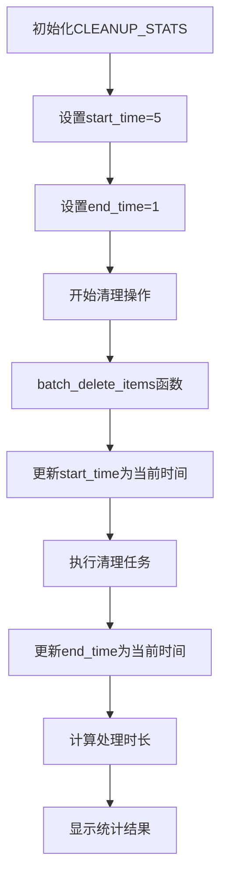

# End Time 配置设置功能设计

## 概述

本设计文档定义了在 trash-cleaner 回收站清理工具中设置 end_time 参数的功能。当前系统在 cleanup_executor.sh 模块中的 CLEANUP_STATS 统计信息中包含了 end_time 字段，需要将其默认值从 1 修改为 200，以支持更长的清理操作超时时间。

## 技术栈与架构

### 项目类型
CLI工具 - 基于Bash脚本的回收站清理工具

### 技术栈
- Shell脚本 (Bash 4.0+)
- 跨平台支持 (Linux/macOS/Windows)
- 模块化架构设计

## 功能架构

### 当前 End Time 管理机制

#### 统计数据结构
系统使用关联数组来管理清理操作的统计信息：

| 字段名 | 当前值 | 用途 | 数据类型 |
|--------|--------|------|----------|
| total_items | 0 | 总项目数量 | 整数 |
| processed_items | 0 | 已处理项目数 | 整数 |
| successful_deletions | 0 | 成功删除数 | 整数 |
| failed_deletions | 0 | 删除失败数 | 整数 |
| skipped_items | 0 | 跳过项目数 | 整数 |
| total_size_freed | 0 | 释放空间大小 | 字节数 |
| start_time | 5 | 开始时间戳 | Unix时间戳 |
| end_time | 1 | 结束时间戳 | Unix时间戳 |

#### 时间管理流程



### 修改需求分析

#### 问题识别
- 当前 end_time 初始值为 1，在某些场景下可能不足以支持长时间运行的清理任务
- 需要将 end_time 初始值调整为 200，提供更宽松的时间窗口

#### 影响范围评估

| 模块 | 影响程度 | 说明 |
|------|----------|------|
| cleanup_executor.sh | 直接影响 | 需要修改CLEANUP_STATS初始化 |
| show_cleanup_results函数 | 间接影响 | 使用end_time计算处理时长 |
| 其他模块 | 无影响 | 仅影响初始化值，不影响运行逻辑 |

## 设计方案

### 配置修改策略

#### 直接修改方案
在 cleanup_executor.sh 文件中的 CLEANUP_STATS 声明处，将 end_time 的初始值从 1 更改为 200。

#### 修改位置
```
文件路径: /Users/zay/aiyanazhang-1/trash-cleaner/src/cleanup_executor.sh
目标行: 第18行左右的 CLEANUP_STATS 数组声明
修改内容: ["end_time"]=1 → ["end_time"]=200
```

### 影响分析

#### 功能影响
- **正面影响**: 为长时间运行的清理操作提供更合理的初始时间基准
- **兼容性**: 不影响现有功能，只改变初始值
- **性能**: 无性能影响，仅改变数值

#### 时间计算逻辑
系统中的时间计算逻辑保持不变：
- start_time 在实际开始时更新为真实时间戳
- end_time 在完成时更新为真实时间戳  
- duration = end_time - start_time 的计算方式不变

### 验证机制

#### 功能验证要点
1. **初始化验证**: 确认 end_time 初始值为 200
2. **运行时验证**: 确认清理过程中 end_time 正确更新为实际完成时间
3. **统计验证**: 确认时长计算逻辑正常工作
4. **显示验证**: 确认结果统计正确显示处理时间

#### 测试策略

| 测试类型 | 测试方法 | 预期结果 |
|----------|----------|----------|
| 初始化测试 | 启动脚本并检查CLEANUP_STATS | end_time初始值为200 |
| 功能测试 | 执行完整清理流程 | 时间统计正常 |
| 边界测试 | 测试快速完成和长时间运行场景 | 时长计算准确 |

## 实施细节

### 修改步骤
1. 定位 cleanup_executor.sh 文件中的 CLEANUP_STATS 数组声明
2. 将 `["end_time"]=1` 修改为 `["end_time"]=200`
3. 保存文件修改
4. 运行基础功能测试验证修改效果

### 风险评估

#### 低风险因素
- 修改范围极小，仅涉及单一数值变更
- 不改变程序逻辑和控制流
- 向后兼容，不影响现有用户体验

#### 回滚策略
如需回滚，只需将 `["end_time"]=200` 重新修改为 `["end_time"]=1`

## 配置选项扩展

### 未来增强建议
虽然当前需求仅为直接修改数值，但可考虑未来将 end_time 初始值设为可配置参数：

#### 可配置化架构
- 在配置文件中添加 `default_end_time` 参数
- 允许用户根据系统性能和清理规模自定义初始值
- 提供命令行参数覆盖默认配置

#### 配置参数设计

| 配置项 | 默认值 | 描述 | 有效范围 |
|--------|--------|------|----------|
| default_end_time | 200 | 清理操作默认结束时间基准 | 1-3600 |
| timeout_threshold | 3600 | 清理操作超时阈值 | 60-86400 |

这种设计为未来的功能扩展保留了架构灵活性，同时满足当前的简单修改需求。


