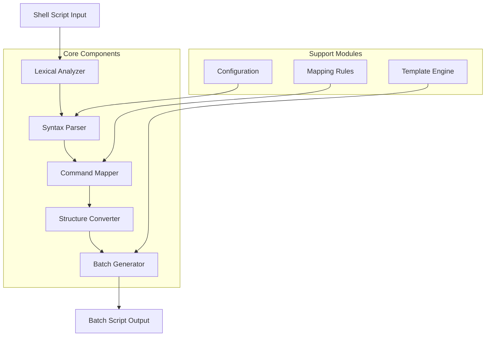
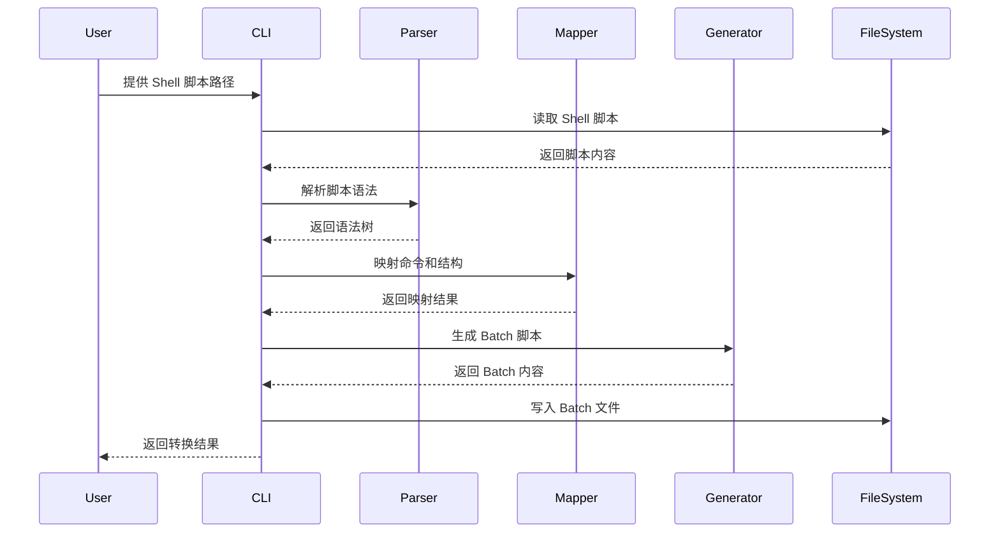
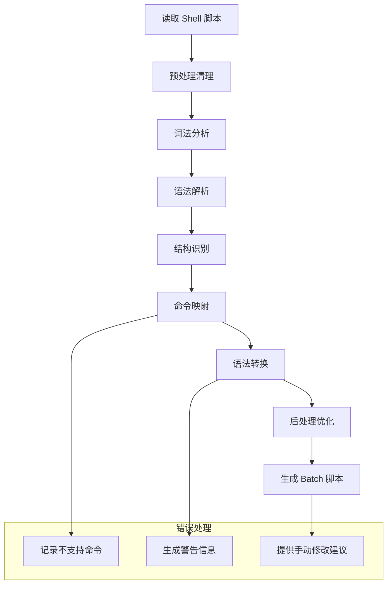
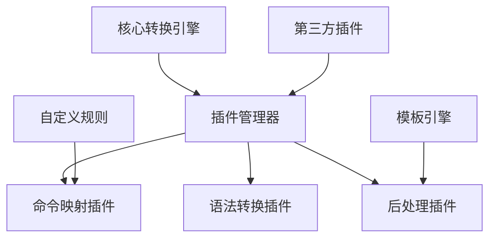

# Shell to Batch Converter - 设计文档

## 概述

Shell to Batch Converter 是一个命令行工具，用于将 Unix/Linux Shell 脚本自动转换为 Windows Batch 脚本。该工具通过解析 Shell 脚本的语法结构，识别常用命令和语法模式，并将其转换为等价的 Batch 脚本语法。

### 核心价值
- **跨平台迁移**：简化从 Unix/Linux 环境到 Windows 环境的脚本迁移过程
- **自动化转换**：减少手动转换的工作量和错误率
- **语法映射**：提供常见 Shell 命令到 Batch 命令的智能映射
- **结构保持**：保持原脚本的逻辑结构和注释

### 目标用户
- 需要在 Windows 环境部署 Linux 脚本的开发者
- 进行跨平台应用开发的团队
- 需要维护多平台脚本的系统管理员

## 技术栈与依赖

### 核心技术
- **Python 3.8+** - 主要开发语言
- **argparse** - 命令行参数解析
- **re (正则表达式)** - 语法模式匹配
- **pathlib** - 文件路径处理
- **json** - 配置文件和映射规则存储

### 外部依赖
- **colorama** - 终端彩色输出（可选）
- **pytest** - 单元测试框架

## 架构设计

### 整体架构



### 核心组件定义

#### 词法分析器 (Lexical Analyzer)
- **职责**：将输入的 Shell 脚本分解为标记序列
- **功能**：
  - 识别命令、参数、操作符、变量、字符串字面量
  - 处理注释和空白字符
  - 标记行号和位置信息

#### 语法解析器 (Syntax Parser)
- **职责**：构建抽象语法树并识别 Shell 语法结构
- **功能**：
  - 识别变量赋值、条件语句、循环结构
  - 解析管道操作和重定向
  - 处理函数定义和调用

#### 命令映射器 (Command Mapper)
- **职责**：将 Shell 命令映射为等价的 Batch 命令
- **功能**：
  - 查找命令映射规则
  - 处理参数转换
  - 标记不支持的命令

#### 结构转换器 (Structure Converter)
- **职责**：转换控制结构和语法模式
- **功能**：
  - 转换 if/then/else 到 Batch if 语法
  - 转换 for/while 循环
  - 处理变量引用语法

#### Batch 生成器 (Batch Generator)
- **职责**：生成最终的 Batch 脚本
- **功能**：
  - 应用 Batch 语法格式
  - 添加必要的 Batch 特定语句
  - 生成注释和文档

### 数据流架构



## 命令行接口设计

### 基本用法
```
shell-to-bat [OPTIONS] INPUT_FILE [OUTPUT_FILE]
```

### 命令参数表

| 参数 | 类型 | 必需 | 默认值 | 描述 |
|------|------|------|--------|------|
| INPUT_FILE | 文件路径 | 是 | - | 输入的 Shell 脚本文件 |
| OUTPUT_FILE | 文件路径 | 否 | {input}.bat | 输出的 Batch 脚本文件 |
| --verbose, -v | 标志 | 否 | False | 显示详细转换过程 |
| --dry-run | 标志 | 否 | False | 预览转换结果，不生成文件 |
| --strict | 标志 | 否 | False | 严格模式，遇到不支持命令时停止 |
| --config, -c | 文件路径 | 否 | default.json | 自定义映射配置文件 |
| --encoding | 字符串 | 否 | utf-8 | 文件编码格式 |

### 使用示例

#### 基本转换
```
shell-to-bat script.sh
```

#### 指定输出文件
```
shell-to-bat script.sh converted.bat
```

#### 详细模式转换
```
shell-to-bat -v script.sh --dry-run
```

## 命令映射规则

### Shell 到 Batch 命令映射表

| Shell 命令 | Batch 等价命令 | 说明 | 支持度 |
|------------|----------------|------|--------|
| ls | dir | 列出文件 | 完全支持 |
| ls -la | dir /a | 详细列表 | 完全支持 |
| cd | cd | 切换目录 | 完全支持 |
| pwd | cd | 显示当前目录 | 完全支持 |
| cp | copy | 复制文件 | 部分支持 |
| mv | move | 移动/重命名 | 部分支持 |
| rm | del | 删除文件 | 部分支持 |
| mkdir | mkdir | 创建目录 | 完全支持 |
| rmdir | rmdir | 删除目录 | 完全支持 |
| cat | type | 显示文件内容 | 部分支持 |
| echo | echo | 输出文本 | 完全支持 |
| grep | findstr | 文本搜索 | 部分支持 |
| which | where | 查找命令 | 部分支持 |

### 语法结构映射

#### 变量操作
| Shell 语法 | Batch 等价语法 | 示例转换 |
|------------|----------------|----------|
| VAR=value | set VAR=value | `NAME="John"` → `set NAME=John` |
| $VAR | %VAR% | `echo $NAME` → `echo %NAME%` |
| ${VAR} | %VAR% | `echo ${NAME}` → `echo %NAME%` |

#### 控制结构
| Shell 结构 | Batch 等价结构 | 复杂度 |
|------------|----------------|--------|
| if [ condition ]; then | if condition ( | 中等 |
| for var in list; do | for %%var in (list) do ( | 高 |
| while [ condition ]; do | :loop / if / goto | 高 |
| case/esac | 多个 if-else | 高 |

## 转换策略设计

### 逐步转换流程



### 转换复杂度分级

#### 简单转换（绿色）
- 基本文件操作命令
- 简单变量赋值和引用
- 直接命令映射

#### 中等转换（黄色）
- 条件语句和简单循环
- 管道操作的部分情况
- 参数处理

#### 复杂转换（红色）
- 复杂的正则表达式
- 高级 Shell 特性（数组、函数）
- 复杂的管道和重定向组合

### 错误处理策略

#### 不支持命令处理
- **记录位置**：标记原脚本中的行号
- **生成注释**：在 Batch 中添加说明注释
- **提供建议**：输出手动修改建议

#### 语法冲突处理
- **保守转换**：选择最安全的等价语法
- **添加验证**：在生成的 Batch 中添加验证逻辑
- **文档化差异**：在输出中说明语法差异

## 配置系统设计

### 配置文件结构

#### 命令映射配置 (command_mappings.json)
```
{
  "commands": {
    "ls": {
      "batch_command": "dir",
      "parameter_mappings": {
        "-l": "/a",
        "-a": "/a /h"
      },
      "notes": "部分参数不完全等价"
    }
  }
}
```

#### 语法规则配置 (syntax_rules.json)
```
{
  "variable_patterns": {
    "assignment": "\\$\\{([^}]+)\\}",
    "reference": "%\\1%"
  },
  "control_structures": {
    "if_statement": {
      "pattern": "if\\s+\\[([^]]+)\\];\\s*then",
      "replacement": "if \\1 ("
    }
  }
}
```

### 可配置选项

| 配置项 | 类型 | 默认值 | 描述 |
|--------|------|--------|------|
| strict_mode | 布尔 | false | 是否在遇到不支持命令时停止 |
| preserve_comments | 布尔 | true | 是否保留原始注释 |
| add_conversion_info | 布尔 | true | 是否添加转换信息注释 |
| encoding | 字符串 | utf-8 | 文件编码格式 |
| line_ending | 字符串 | crlf | 行结束符类型 |

## 测试策略

### 单元测试范围

#### 核心功能测试
- **词法分析器测试**：验证标记识别准确性
- **语法解析器测试**：验证语法树构建正确性
- **命令映射器测试**：验证映射规则正确性
- **生成器测试**：验证输出格式正确性

#### 边界情况测试
- **空文件处理**：测试空输入文件的处理
- **特殊字符处理**：测试包含特殊字符的脚本
- **编码问题处理**：测试不同编码格式的文件
- **大文件处理**：测试处理大型脚本文件的性能

### 集成测试场景

#### 端到端转换测试


#### 测试脚本类型
- **简单文件操作脚本**：基本的文件管理命令
- **系统管理脚本**：包含系统信息查询和配置
- **构建脚本**：包含编译和部署逻辑
- **数据处理脚本**：包含文本处理和数据转换

### 测试数据集

#### 真实脚本示例
- **开源项目构建脚本**：从 GitHub 收集的真实构建脚本
- **系统管理脚本**：常见的系统维护和监控脚本
- **数据处理脚本**：日志分析和数据转换脚本

#### 边界测试用例
- **极简脚本**：只包含单一命令的脚本
- **复杂脚本**：包含多种语法结构的复杂脚本
- **问题脚本**：包含已知转换难点的脚本

## 输出格式设计

### Batch 脚本结构

#### 文件头部信息
```
@echo off
REM ================================================
REM 此文件由 Shell-to-Batch Converter 自动生成
REM 原始文件: script.sh
REM 生成时间: 2024-01-01 12:00:00
REM 转换版本: v1.0.0
REM ================================================
```

#### 变量声明区域
```
REM === 变量定义 ===
set VAR1=value1
set VAR2=value2
```

#### 主要逻辑区域
```
REM === 主要逻辑 ===
REM 原始: ls -la
dir /a

REM 原始: if [ -f "file.txt" ]; then
if exist "file.txt" (
    REM 原始: echo "文件存在"
    echo 文件存在
)
```

### 转换信息注释

#### 成功转换标记
```
REM [转换成功] ls -la → dir /a
```

#### 部分转换标记
```
REM [部分转换] grep pattern file → findstr pattern file
REM 注意: findstr 语法可能与 grep 有差异
```

#### 失败转换标记
```
REM [转换失败] awk '{print $1}' file
REM 建议: 使用 PowerShell 或其他工具替代
```

## 扩展性设计

### 插件系统架构



### 可扩展组件

#### 命令映射扩展
- **自定义命令映射**：用户可添加特定命令的映射规则
- **第三方工具支持**：支持 Git、Docker 等工具命令转换
- **特定领域转换**：为特定应用领域提供专用转换规则

#### 输出格式扩展
- **PowerShell 输出**：生成 PowerShell 脚本而非 Batch
- **跨平台脚本**：生成能在多平台运行的脚本
- **文档生成**：同时生成转换说明文档

### 未来增强功能

#### 智能转换
- **机器学习辅助**：基于转换历史优化映射规则
- **上下文感知**：根据脚本上下文选择最佳转换策略
- **用户反馈学习**：根据用户修正建议改进转换质量

#### 集成能力
- **IDE 插件**：集成到常用编辑器和 IDE
- **CI/CD 集成**：作为构建流水线的一部分
- **版本控制集成**：与 Git 等版本控制系统集成