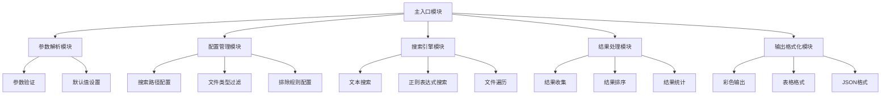
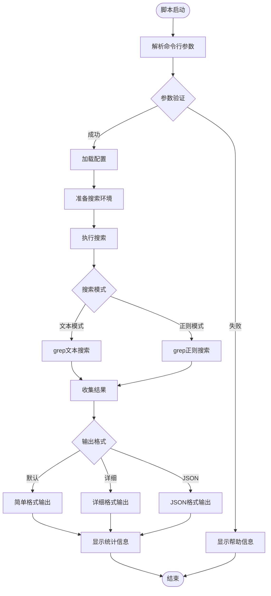

# 文本内容搜索Shell脚本设计文档

## 概述

本项目旨在设计一个功能强大的shell脚本，用于在文件系统中搜索文本内容。脚本支持普通文本搜索和正则表达式搜索，默认大小写敏感，提供灵活的搜索选项和清晰的结果输出。

### 核心价值
- 提供高效的文本内容搜索能力
- 支持多种搜索模式（文本/正则表达式）
- 提供用户友好的命令行接口
- 支持灵活的文件过滤和目录排除功能

## 技术栈

| 组件 | 技术选择 | 说明 |
|------|----------|------|
| 脚本语言 | Bash Shell | 跨平台兼容，系统原生支持 |
| 核心搜索引擎 | grep | 高性能文本搜索工具 |
| 文件遍历 | find | 灵活的文件系统遍历 |
| 参数解析 | getopts | 标准的命令行参数处理 |
| 输出格式化 | awk/sed | 结果格式化和美化 |

## 架构设计

### 模块化组件架构



### 核心流程设计



## 命令行接口设计

### 参数规范

| 参数 | 长参数 | 类型 | 必需 | 说明 |
|------|--------|------|------|------|
| -p | --pattern | string | 是 | 搜索模式（文本或正则） |
| -d | --directory | string | 否 | 搜索目录（默认当前目录） |
| -r | --regex | flag | 否 | 启用正则表达式模式 |
| -t | --type | string | 否 | 文件类型过滤（如txt,log,py） |
| -e | --exclude | string | 否 | 排除目录（如.git,node_modules） |
| -o | --output | string | 否 | 输出格式（simple/detail/json） |
| -n | --line-number | flag | 否 | 显示行号 |
| -c | --count | flag | 否 | 只显示匹配计数 |
| -l | --files-only | flag | 否 | 只显示文件名 |
| -h | --help | flag | 否 | 显示帮助信息 |
| -v | --version | flag | 否 | 显示版本信息 |

### 使用示例

```bash
# 基本文本搜索
./text-search.sh -p "function main"

# 正则表达式搜索
./text-search.sh -p "^class\s+\w+" -r

# 指定目录和文件类型
./text-search.sh -p "TODO" -d /project/src -t "py,js,java"

# 排除目录
./text-search.sh -p "error" -e ".git,node_modules,target"

# 详细输出格式
./text-search.sh -p "import" -o detail -n
```

## 核心功能模块

### 1. 参数解析模块

负责处理命令行参数和验证输入的合法性。

**功能特性**：
- 使用getopts解析短参数和长参数
- 参数类型验证和范围检查
- 设置合理的默认值
- 生成详细的错误提示

**验证规则**：
- 搜索模式不能为空
- 目录路径必须存在且可读
- 文件类型格式检查
- 输出格式枚举值验证

### 2. 配置管理模块

管理搜索配置和环境设置。

**配置项**：
- 默认搜索目录
- 默认排除目录列表
- 支持的文件类型映射
- 输出颜色配置
- 性能优化参数

**配置文件结构**：
| 配置项 | 默认值 | 说明 |
|--------|--------|------|
| DEFAULT_EXCLUDE | ".git,.svn,node_modules,target,.idea" | 默认排除目录 |
| MAX_DEPTH | 10 | 最大搜索深度 |
| COLORED_OUTPUT | true | 彩色输出开关 |
| MAX_FILE_SIZE | "10M" | 最大文件大小限制 |

### 3. 搜索引擎模块

核心搜索逻辑的实现。

**搜索策略**：
- 文本模式：使用grep -F进行字面量搜索
- 正则模式：使用grep -E进行扩展正则搜索
- 递归搜索：结合find和grep实现高效遍历
- 大小写敏感：默认启用大小写敏感匹配

**性能优化**：
- 使用find预过滤文件
- 并行处理大型目录
- 内存使用限制
- 搜索深度控制

### 4. 结果处理模块

处理和组织搜索结果。

**结果数据结构**：
| 字段 | 类型 | 说明 |
|------|------|------|
| file_path | string | 文件完整路径 |
| line_number | integer | 匹配行号 |
| line_content | string | 匹配行内容 |
| match_position | integer | 匹配位置 |
| file_size | integer | 文件大小 |
| file_modified | datetime | 文件修改时间 |

**处理功能**：
- 结果去重和排序
- 按文件名或匹配数量排序
- 结果分页显示
- 统计信息计算

### 5. 输出格式化模块

提供多种输出格式支持。

**简单格式**：
```
文件路径:行号: 匹配内容
```

**详细格式**：
```
文件: /path/to/file.txt
大小: 1.2KB
修改时间: 2024-01-15 10:30:45
---
行号 10: 匹配的文本内容
行号 25: 另一个匹配内容
```

**JSON格式**：
```json
{
  "search_summary": {
    "pattern": "search_text",
    "total_files": 5,
    "total_matches": 12,
    "search_time": "0.34s"
  },
  "results": [
    {
      "file": "/path/to/file.txt",
      "matches": [
        {
          "line": 10,
          "content": "匹配的文本内容",
          "position": 5
        }
      ]
    }
  ]
}
```

## 错误处理策略

### 错误分类

| 错误类型 | 错误代码 | 处理策略 |
|----------|----------|----------|
| 参数错误 | 1 | 显示帮助信息并退出 |
| 权限错误 | 2 | 记录警告并跳过文件 |
| 文件不存在 | 3 | 显示错误信息并继续 |
| 系统错误 | 4 | 记录详细日志并退出 |
| 搜索超时 | 5 | 显示进度并允许中断 |

### 错误处理流程


## 性能优化设计

### 搜索优化策略

| 优化项 | 实现方式 | 预期效果 |
|--------|----------|----------|
| 文件预过滤 | find命令过滤 | 减少50%处理文件数 |
| 并行处理 | xargs -P参数 | 提升2-3倍搜索速度 |
| 内存控制 | 分批处理大文件 | 控制内存使用 |
| 缓存机制 | 临时文件缓存 | 重复搜索加速 |

### 资源限制

- 单文件最大处理大小：10MB
- 最大搜索深度：10层
- 并发进程数：CPU核心数
- 内存使用限制：可用内存的25%

## 用户体验设计

### 进度显示


### 交互特性

- 实时进度显示（处理文件数/总文件数）
- 支持Ctrl+C优雅中断
- 彩色输出高亮匹配内容
- 智能分页显示大量结果
- 搜索建议和错误提示

## 测试策略

### 单元测试范围

| 测试模块 | 测试内容 | 覆盖率目标 |
|----------|----------|------------|
| 参数解析 | 各种参数组合和边界情况 | 95% |
| 搜索功能 | 文本和正则搜索准确性 | 90% |
| 文件处理 | 各种文件类型和编码 | 85% |
| 结果格式化 | 多种输出格式正确性 | 90% |
| 错误处理 | 各种异常情况处理 | 95% |

### 集成测试场景

- 大型代码库搜索性能测试
- 复杂正则表达式匹配验证
- 多种文件类型混合搜索
- 权限受限环境测试
- 网络文件系统搜索测试