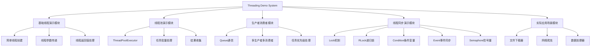
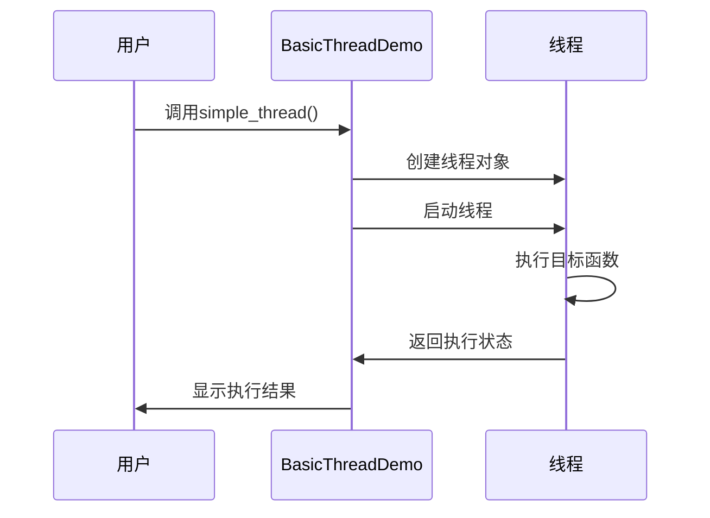
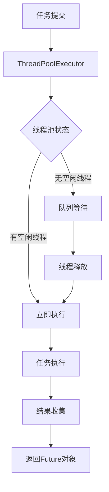
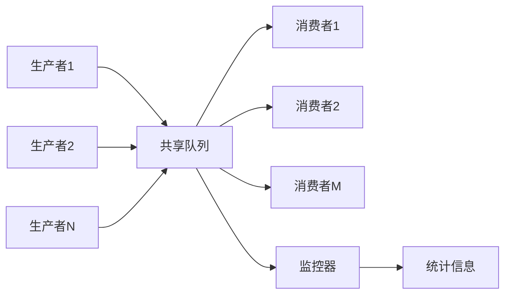
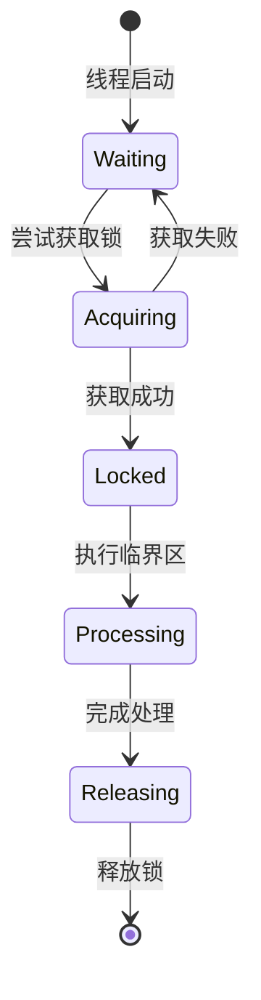
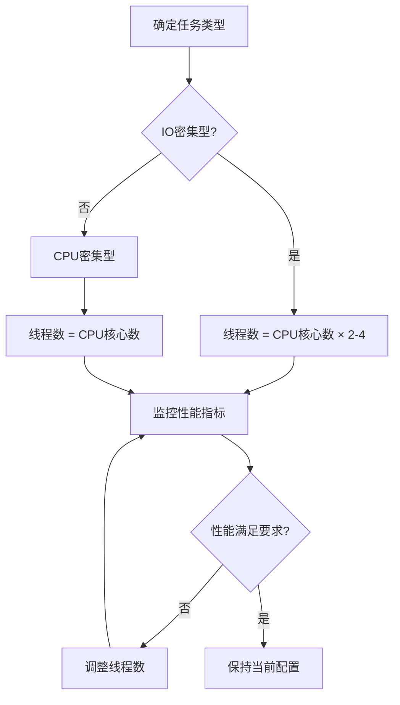
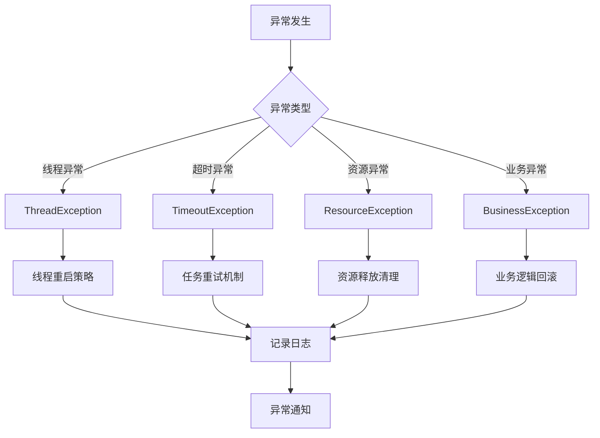
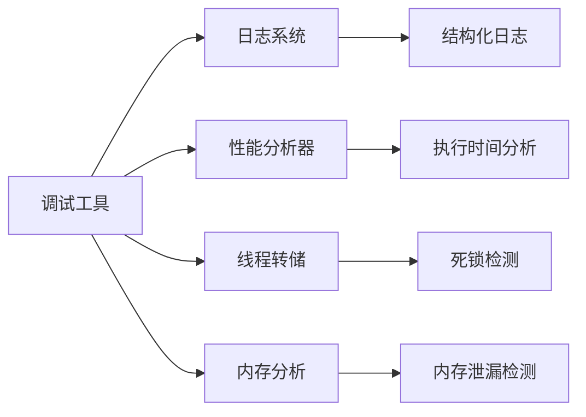
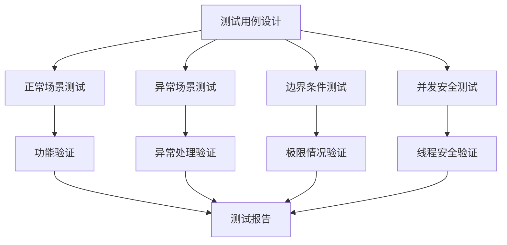

# Python 多线程演示系统设计文档

## 概述

本项目是一个Python多线程技术的综合演示系统，展示不同场景下的多线程应用模式，包括基础线程操作、线程池管理、生产者消费者模型、以及线程同步机制等核心概念。

### 项目目标
- 演示Python多线程的核心概念和使用方法
- 提供不同场景下的多线程解决方案
- 展示线程安全和同步机制的重要性
- 提供可复用的多线程工具类和方法

### 技术栈
- Python 3.8+
- threading 模块（标准库）
- concurrent.futures 模块
- queue 模块
- time 模块

## 架构设计

### 系统组件架构

### 核心类设计

| 类名 | 职责 | 主要方法 |
|------|------|----------|
| BasicThreadDemo | 基础线程操作演示 | simple_thread(), thread_with_params(), thread_with_return() |
| ThreadPoolDemo | 线程池使用演示 | batch_processing(), result_collection(), dynamic_pool() |
| ProducerConsumerDemo | 生产者消费者模式 | producer(), consumer(), priority_queue_demo() |
| ThreadSyncDemo | 线程同步机制演示 | lock_demo(), rlock_demo(), condition_demo(), event_demo() |
| FileDownloader | 实际应用：文件下载 | download_file(), batch_download() |
| DataProcessor | 实际应用：数据处理 | process_data_chunk(), parallel_processing() |

## 核心功能模块

### 基础线程演示模块

#### 功能描述
展示Python threading模块的基本使用方法，包括线程创建、启动、参数传递和结果获取。

#### 核心组件

| 组件 | 描述 | 输入 | 输出 |
|------|------|------|------|
| 简单线程创建器 | 创建和启动基础线程 | 目标函数 | 线程对象 |
| 参数传递处理器 | 处理线程函数参数传递 | 函数和参数 | 执行结果 |
| 返回值收集器 | 收集线程执行结果 | 多个线程 | 结果列表 |

#### 业务流程

### 线程池演示模块

#### 功能描述
展示concurrent.futures模块的ThreadPoolExecutor使用，实现高效的线程管理和任务调度。

#### 核心特性
- 自动线程管理和复用
- 任务队列和结果收集
- 异常处理和超时控制
- 动态线程池大小调整

#### 任务处理流程

### 生产者消费者演示模块

#### 功能描述
实现经典的生产者消费者模式，展示线程间通信和数据交换机制。

#### 架构设计

| 组件 | 角色 | 职责 |
|------|------|------|
| Producer | 生产者 | 生成数据并放入队列 |
| Consumer | 消费者 | 从队列获取数据并处理 |
| Queue | 缓冲区 | 线程安全的数据存储 |
| Monitor | 监控器 | 监控队列状态和性能 |

#### 数据流向图

### 线程同步演示模块

#### 功能描述
展示各种线程同步原语的使用，确保线程安全和数据一致性。

#### 同步机制对比

| 同步原语 | 使用场景 | 特点 | 性能 |
|----------|----------|------|------|
| Lock | 互斥访问共享资源 | 简单可靠 | 高 |
| RLock | 递归锁定场景 | 可重入 | 中 |
| Condition | 条件等待和通知 | 灵活性高 | 中 |
| Event | 事件通知机制 | 一对多通知 | 高 |
| Semaphore | 资源计数控制 | 限制并发数 | 中 |

#### 同步场景演示

### 实际应用场景模块

#### 文件下载器
- **功能**：并发下载多个文件
- **技术要点**：requests库集成、进度监控、错误重试
- **同步机制**：线程安全的进度更新、下载状态管理

#### 网络爬虫
- **功能**：并发抓取网页数据
- **技术要点**：URL队列管理、反爬虫策略、数据去重
- **同步机制**：共享数据结构保护、结果合并

#### 数据处理器
- **功能**：大数据集并行处理
- **技术要点**：数据分块、结果聚合、内存管理
- **同步机制**：任务分发、结果收集、异常处理

## 数据模型设计

### 任务对象模型

| 字段名 | 类型 | 描述 | 必填 |
|--------|------|------|------|
| task_id | str | 任务唯一标识 | 是 |
| task_type | str | 任务类型 | 是 |
| params | dict | 任务参数 | 否 |
| priority | int | 任务优先级 | 否 |
| timeout | float | 超时时间 | 否 |
| retry_count | int | 重试次数 | 否 |
| status | str | 任务状态 | 是 |
| result | any | 执行结果 | 否 |
| error | str | 错误信息 | 否 |
| created_at | datetime | 创建时间 | 是 |
| completed_at | datetime | 完成时间 | 否 |

### 线程状态模型

| 字段名 | 类型 | 描述 |
|--------|------|------|
| thread_id | str | 线程标识 |
| thread_name | str | 线程名称 |
| status | str | 运行状态 |
| start_time | datetime | 启动时间 |
| cpu_time | float | CPU使用时间 |
| memory_usage | int | 内存使用量 |
| task_count | int | 处理任务数 |

## 性能考虑

### 线程数量优化策略

### 内存管理策略

| 策略 | 适用场景 | 实现方式 |
|------|----------|----------|
| 对象池 | 频繁创建销毁对象 | 预创建对象复用 |
| 数据分块 | 大数据处理 | 分批次处理数据 |
| 垃圾回收 | 长时间运行 | 定期清理无用对象 |
| 内存监控 | 所有场景 | 实时监控内存使用 |

## 错误处理与异常管理

### 异常分类处理

### 容错机制设计

| 异常类型 | 处理策略 | 恢复方式 |
|----------|----------|----------|
| 线程死锁 | 超时检测 | 强制释放锁 |
| 内存不足 | 限流控制 | 减少并发数 |
| 网络异常 | 指数退避重试 | 自动重连 |
| 数据异常 | 数据校验 | 跳过错误数据 |

## 监控与调试

### 性能监控指标

| 指标类别 | 具体指标 | 监控方式 |
|----------|----------|----------|
| 线程指标 | 活跃线程数、线程创建销毁速率 | 实时统计 |
| 任务指标 | 任务完成率、平均处理时间 | 定期汇总 |
| 资源指标 | CPU使用率、内存占用 | 系统调用 |
| 业务指标 | 吞吐量、错误率 | 业务埋点 |

### 调试工具集成

## 测试策略

### 测试类型

| 测试类型 | 测试目标 | 实现方式 |
|----------|----------|----------|
| 单元测试 | 单个方法功能 | unittest框架 |
| 并发测试 | 线程安全性 | 多线程压力测试 |
| 性能测试 | 系统性能指标 | 负载测试工具 |
| 集成测试 | 模块间协作 | 端到端测试 |

### 测试场景设计

