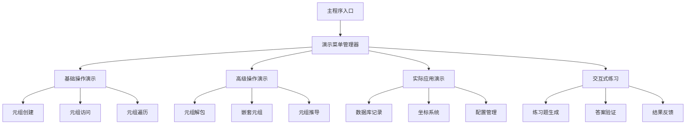
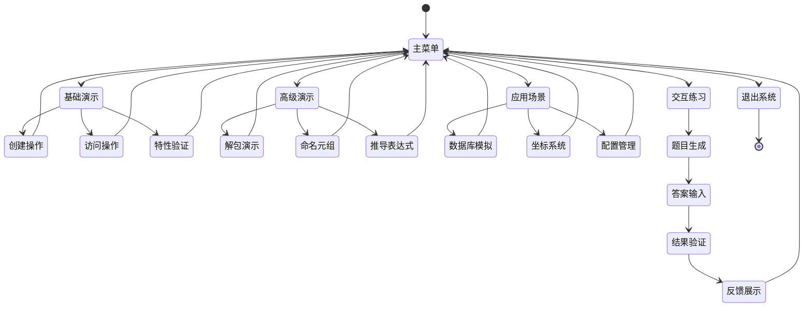
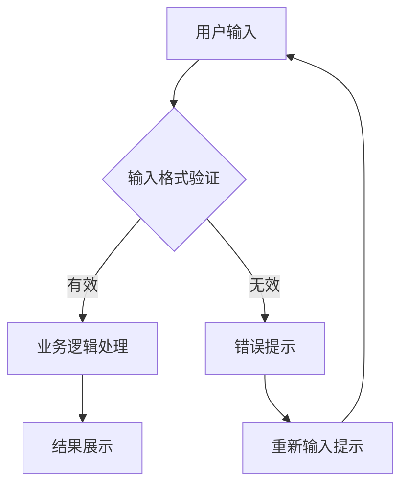
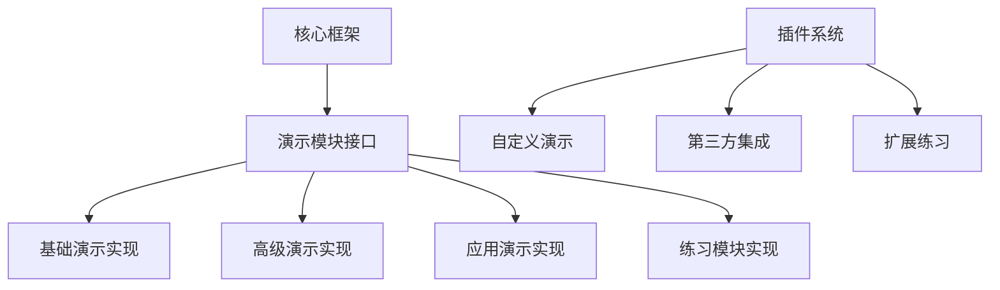
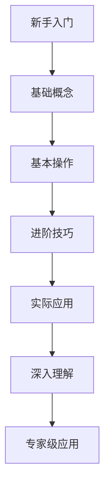

# Python元组使用演示系统设计

## 概述

本系统旨在创建一个全面的Python元组使用演示程序，通过交互式示例展示元组的各种特性、操作方法和实际应用场景。系统将提供教育性的代码示例和实践练习，帮助用户深入理解Python元组的核心概念和高级用法。

### 设计目标
- 提供完整的元组操作演示
- 展示元组在不同场景下的应用
- 通过交互式示例增强学习体验
- 涵盖从基础到高级的所有元组概念

## 技术栈与依赖

| 组件 | 技术选择 | 用途说明 |
|------|----------|----------|
| 核心语言 | Python 3.8+ | 主要编程语言 |
| 交互界面 | 命令行界面 (CLI) | 用户交互和演示展示 |
| 数据处理 | 内置数据结构 | 演示数据存储和处理 |
| 测试框架 | unittest | 确保演示代码正确性 |

## 系统架构

### 核心组件架构

### 数据流架构

## 功能模块设计

### 1. 基础操作演示模块

| 功能点 | 演示内容 | 预期输出 |
|--------|----------|----------|
| 元组创建 | 多种创建方式演示 | 不同类型元组实例 |
| 元组访问 | 索引和切片操作 | 访问结果展示 |
| 元组特性 | 不可变性验证 | 异常处理演示 |
| 元组方法 | count、index等方法 | 方法调用结果 |

### 2. 高级操作演示模块

| 功能点 | 演示内容 | 应用场景 |
|--------|----------|----------|
| 元组解包 | 单层和多层解包 | 函数参数传递 |
| 命名元组 | namedtuple使用 | 结构化数据表示 |
| 元组推导 | 生成器表达式 | 数据转换处理 |
| 元组排序 | 自定义排序规则 | 复杂数据排序 |

### 3. 实际应用演示模块

#### 3.1 数据库记录模拟
- 表示数据库查询结果
- 字段访问和数据处理
- 批量数据操作

#### 3.2 坐标系统应用
- 二维和三维坐标表示
- 坐标变换和计算
- 几何图形操作

#### 3.3 配置参数管理
- 系统配置存储
- 参数验证和访问
- 配置版本管理

### 4. 交互式练习模块

| 练习类型 | 难度等级 | 验证方式 |
|----------|----------|----------|
| 基础语法 | 初级 | 自动化测试 |
| 数据操作 | 中级 | 结果比对 |
| 应用场景 | 高级 | 逻辑验证 |

## 用户交互流程

## 演示内容规划

### 基础概念演示

| 概念 | 演示方法 | 学习目标 |
|------|----------|----------|
| 元组定义 | 代码示例对比 | 理解元组本质 |
| 不可变性 | 修改尝试演示 | 掌握不可变特性 |
| 索引访问 | 正负索引示例 | 熟练访问元素 |
| 切片操作 | 多种切片方式 | 掌握数据提取 |

### 进阶技巧演示

| 技巧 | 实现方式 | 实际价值 |
|------|----------|----------|
| 多重赋值 | 解包语法演示 | 简化变量交换 |
| 函数返回 | 多值返回示例 | 提高函数效率 |
| 数据结构 | 复合数据表示 | 增强代码可读性 |
| 性能优化 | 与列表对比 | 选择合适数据结构 |

## 错误处理策略

### 异常类型处理

| 异常类型 | 触发场景 | 处理方式 |
|----------|----------|----------|
| IndexError | 索引越界 | 边界检查和友好提示 |
| TypeError | 类型错误操作 | 类型验证和转换建议 |
| ValueError | 值错误 | 数据验证和格式化 |
| AttributeError | 属性访问错误 | 方法存在性检查 |

### 用户输入验证

## 测试策略

### 单元测试覆盖

| 测试模块 | 测试重点 | 覆盖目标 |
|----------|----------|----------|
| 基础操作 | 元组创建和访问 | 90%以上代码覆盖 |
| 高级功能 | 解包和命名元组 | 核心逻辑完整性 |
| 应用场景 | 实际使用案例 | 业务逻辑正确性 |
| 交互模块 | 用户界面响应 | 用户体验一致性 |

### 集成测试方案

## 性能考虑

### 内存管理

| 方面 | 优化策略 | 预期效果 |
|------|----------|----------|
| 对象创建 | 延迟初始化 | 减少内存占用 |
| 数据缓存 | 合理缓存策略 | 提高响应速度 |
| 垃圾回收 | 及时清理无用对象 | 稳定内存使用 |

### 执行效率

- 最小化不必要的计算操作
- 使用生成器优化大数据处理
- 合理选择数据结构提高访问效率

## 扩展性设计

### 模块化架构

### 配置管理

| 配置项 | 默认值 | 可配置范围 |
|--------|--------|------------|
| 演示速度 | 正常 | 慢速/正常/快速 |
| 详细程度 | 中等 | 简洁/中等/详细 |
| 交互模式 | 启用 | 启用/禁用 |
| 输出格式 | 控制台 | 控制台/文件/网页 |

## 文档和帮助系统

### 内置帮助

| 帮助类型 | 提供方式 | 内容范围 |
|----------|----------|----------|
| 快速帮助 | 命令行选项 | 基础操作指导 |
| 详细文档 | 交互式查看 | 完整功能说明 |
| 示例库 | 分类展示 | 实用代码片段 |
| FAQ | 问答形式 | 常见问题解答 |

### 学习路径引导

