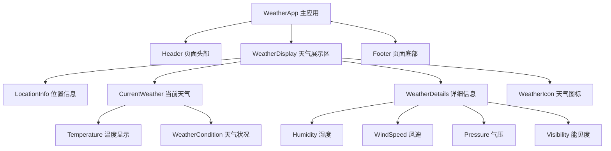
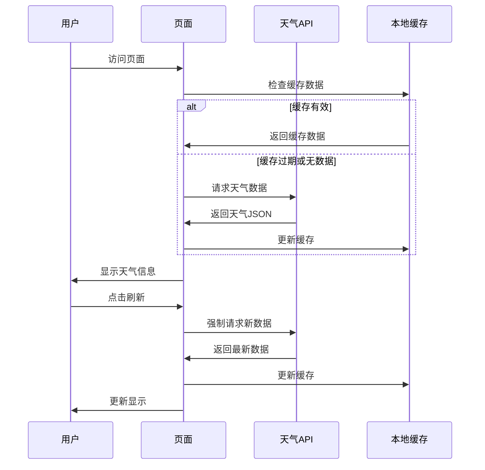
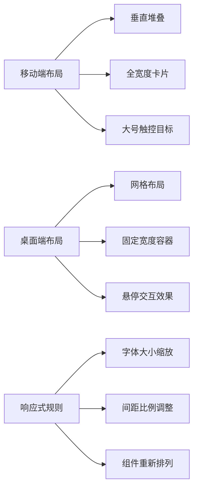
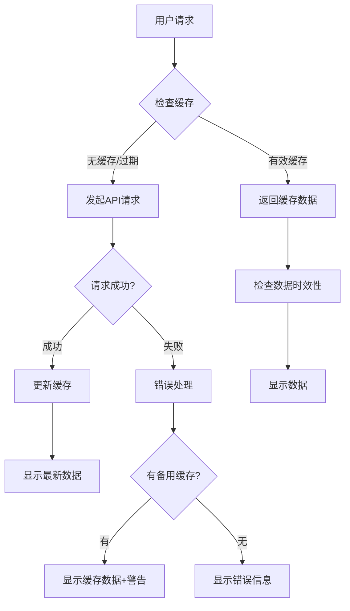
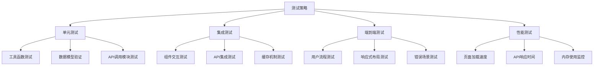

# 北京朝阳区天气显示页面设计文档

## 概述

### 项目目标
设计并实现一个基于HTML和JavaScript的单页面应用，用于显示北京朝阳区的今日天气信息。该页面将为用户提供直观、准确的当日天气数据展示。

### 核心价值
- 提供实时准确的北京朝阳区天气信息
- 简洁直观的用户界面设计
- 快速响应的页面加载体验
- 移动端友好的响应式设计

### 技术栈选择

| 技术 | 版本/规格 | 用途 |
|------|-----------|------|
| HTML5 | 最新标准 | 页面结构和语义化标记 |
| CSS3 | 最新标准 | 样式设计和响应式布局 |
| JavaScript | ES6+ | 业务逻辑和API交互 |
| 天气API | 第三方服务 | 获取实时天气数据 |

## 组件架构

### 组件层次结构

### 核心组件定义

#### WeatherApp 主应用组件
- **职责**: 整体应用状态管理和组件协调
- **状态管理**: 
  - 天气数据状态
  - 加载状态
  - 错误状态
- **生命周期**: 页面加载时自动获取天气数据

#### Header 页面头部组件
- **职责**: 显示应用标题和基本导航信息
- **内容**: 
  - 应用标题
  - 当前日期时间
  - 刷新按钮

#### WeatherDisplay 天气展示区组件
- **职责**: 天气信息的主要展示区域
- **布局**: 响应式网格布局
- **子组件协调**: 管理各个天气信息子组件的布局和数据传递

#### LocationInfo 位置信息组件
- **职责**: 显示当前查询的地理位置
- **数据**: 
  - 城市名称（北京）
  - 区域名称（朝阳区）
  - 坐标信息（可选）

#### CurrentWeather 当前天气组件
- **职责**: 显示主要天气信息
- **核心数据**:
  - 当前温度
  - 天气状况描述
  - 体感温度

#### WeatherDetails 详细信息组件
- **职责**: 展示详细的气象数据
- **信息类型**:
  - 湿度百分比
  - 风速和风向
  - 大气压力
  - 能见度距离

## 数据流架构

### API集成层

### 数据模型设计

#### WeatherData 天气数据模型

| 字段名 | 数据类型 | 描述 | 示例值 |
|--------|----------|------|--------|
| location | String | 位置信息 | "北京市朝阳区" |
| temperature | Number | 当前温度（摄氏度） | 25.6 |
| feelsLike | Number | 体感温度（摄氏度） | 27.2 |
| condition | String | 天气状况 | "晴" |
| humidity | Number | 湿度百分比 | 65 |
| windSpeed | Number | 风速（km/h） | 12.5 |
| windDirection | String | 风向 | "东南风" |
| pressure | Number | 大气压力（hPa） | 1013.25 |
| visibility | Number | 能见度（km） | 10 |
| iconCode | String | 天气图标代码 | "01d" |
| updateTime | String | 数据更新时间 | "2024-01-15 14:30:00" |

#### APIResponse API响应模型

| 字段名 | 数据类型 | 描述 |
|--------|----------|------|
| status | String | 响应状态码 |
| message | String | 响应消息 |
| data | WeatherData | 天气数据对象 |
| timestamp | Number | 服务器时间戳 |

## 样式策略

### 设计系统

#### 色彩方案

| 用途 | 颜色代码 | 应用场景 |
|------|----------|----------|
| 主色调 | #2196F3 | 标题、按钮、链接 |
| 背景色 | #F5F5F5 | 页面背景 |
| 卡片背景 | #FFFFFF | 天气信息卡片 |
| 文字主色 | #333333 | 主要文字内容 |
| 文字辅色 | #666666 | 次要文字信息 |
| 边框色 | #E0E0E0 | 分割线、边框 |
| 成功色 | #4CAF50 | 成功状态提示 |
| 警告色 | #FF9800 | 警告信息 |
| 错误色 | #F44336 | 错误状态显示 |

#### 字体系统

| 层级 | 字体大小 | 字重 | 行高 | 应用场景 |
|------|----------|------|------|----------|
| 标题一级 | 28px | 600 | 1.2 | 页面主标题 |
| 标题二级 | 24px | 500 | 1.3 | 区块标题 |
| 标题三级 | 20px | 500 | 1.4 | 子区块标题 |
| 正文大 | 18px | 400 | 1.5 | 重要数据显示 |
| 正文中 | 16px | 400 | 1.5 | 常规文字内容 |
| 正文小 | 14px | 400 | 1.4 | 辅助信息 |
| 标签文字 | 12px | 400 | 1.3 | 标签、提示文字 |

#### 间距系统

| 间距级别 | 数值 | 应用场景 |
|----------|------|----------|
| xs | 4px | 图标与文字间距 |
| sm | 8px | 相关元素间距 |
| md | 16px | 组件内部间距 |
| lg | 24px | 组件之间间距 |
| xl | 32px | 区块之间间距 |
| xxl | 48px | 页面区域间距 |

### 响应式设计策略

#### 断点设置

| 设备类型 | 屏幕宽度 | 布局特点 |
|----------|----------|----------|
| 手机 | < 576px | 单列垂直布局 |
| 平板 | 576px - 768px | 适度压缩的两列布局 |
| 小桌面 | 768px - 992px | 三列网格布局 |
| 大桌面 | > 992px | 完整四列网格布局 |

#### 布局适配规则

## API集成架构

### 天气API选择决策

#### API评估标准

| 评估维度 | 权重 | 考虑因素 |
|----------|------|----------|
| 数据准确性 | 30% | 数据来源权威性、更新频率 |
| 响应速度 | 25% | API响应时间、服务器稳定性 |
| 免费额度 | 20% | 免费调用次数、商业化限制 |
| 文档质量 | 15% | API文档完整性、示例丰富度 |
| 支持服务 | 10% | 技术支持、社区活跃度 |

#### 推荐API服务

| API服务 | 优势 | 劣势 | 适用场景 |
|---------|------|------|----------|
| OpenWeatherMap | 免费额度充足、文档详细 | 部分数据需付费 | 个人项目、原型开发 |
| 和风天气 | 中文支持好、国内访问快 | 免费额度有限 | 中文应用、商业项目 |
| AccuWeather | 数据精准度高 | 免费额度较少 | 高精度要求项目 |

### API调用策略

#### 请求优化机制

#### 缓存策略设计

| 缓存类型 | 存储位置 | 有效期 | 更新策略 |
|----------|----------|--------|----------|
| 主要数据缓存 | localStorage | 30分钟 | 自动过期刷新 |
| 备用数据缓存 | sessionStorage | 会话期间 | API失败时使用 |
| 图标资源缓存 | 浏览器缓存 | 24小时 | 版本控制更新 |

#### 错误处理机制

| 错误类型 | 处理策略 | 用户体验 |
|----------|----------|----------|
| 网络连接错误 | 显示缓存数据+重试提示 | 降级服务，保持可用性 |
| API密钥错误 | 开发者控制台警告 | 显示示例数据 |
| 地区不支持 | 提示选择其他地区 | 提供地区选择功能 |
| 数据格式错误 | 日志记录+默认数据 | 显示基本天气信息 |

## 测试策略

### 测试架构设计

### 测试用例设计

#### 功能测试用例

| 测试分类 | 测试场景 | 预期结果 | 优先级 |
|----------|----------|----------|--------|
| 核心功能 | 页面首次加载 | 显示北京朝阳区天气信息 | 高 |
| 核心功能 | 点击刷新按钮 | 获取最新天气数据 | 高 |
| 数据展示 | 温度数据显示 | 正确格式化温度数值 | 高 |
| 数据展示 | 天气图标显示 | 根据天气状况显示对应图标 | 中 |
| 错误处理 | 网络断开情况 | 显示错误提示和缓存数据 | 高 |
| 错误处理 | API服务异常 | 友好的错误信息提示 | 中 |
| 响应式设计 | 移动端显示 | 布局适配小屏幕 | 中 |
| 响应式设计 | 桌面端显示 | 充分利用大屏幕空间 | 低 |

#### 性能测试指标

| 性能指标 | 目标值 | 测试方法 | 监控工具 |
|----------|--------|----------|----------|
| 首屏加载时间 | < 2秒 | 模拟3G网络环境 | Lighthouse |
| API响应时间 | < 1秒 | 多次请求平均值 | Network面板 |
| 页面重绘次数 | 最小化 | 滚动和交互测试 | Performance面板 |
| 内存占用 | < 50MB | 长时间使用监控 | Memory面板 |
| 缓存命中率 | > 80% | 重复访问测试 | 自定义埋点 |

### 测试环境配置

#### 浏览器兼容性测试

| 浏览器 | 版本要求 | 测试重点 | 优先级 |
|--------|----------|----------|--------|
| Chrome | 最新2个主版本 | 完整功能测试 | 高 |
| Firefox | 最新2个主版本 | 兼容性验证 | 中 |
| Safari | 最新版本 | 移动端体验 | 中 |
| Edge | 最新版本 | 企业环境兼容 | 低 |

#### 设备测试覆盖

| 设备类型 | 屏幕分辨率 | 测试场景 |
|----------|------------|----------|
| iPhone | 375x667, 414x896 | 移动端核心流程 |
| Android | 360x640, 412x892 | 跨平台兼容性 |
| iPad | 768x1024, 834x1194 | 平板端适配 |
| Desktop | 1920x1080, 2560x1440 | 桌面端完整功能 |