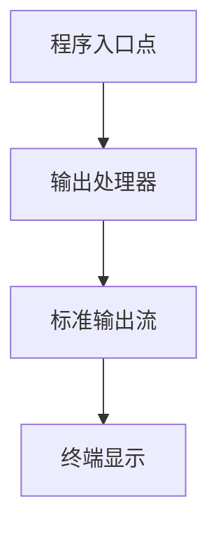
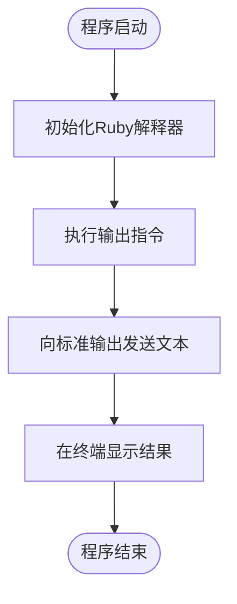

# Ruby Hello World 应用程序设计文档

## 1. 概述

本设计文档描述了一个简单的Ruby Hello World应用程序的技术架构和设计策略。该应用程序旨在演示Ruby语言的基础语法和执行模型，为初学者提供最简化的Ruby程序示例。

### 1.1 设计目标

- 提供最简洁的Ruby程序入门示例
- 展示Ruby语言的基本输出功能
- 建立可扩展的程序结构基础
- 确保跨平台兼容性和易于部署

### 1.2 核心价值

- **简洁性**: 使用最少的代码实现功能目标
- **教育性**: 为Ruby初学者提供清晰的学习起点
- **标准化**: 遵循Ruby社区的最佳实践和编码规范

## 2. 技术栈与依赖

### 2.1 运行时环境

| 组件 | 版本要求 | 说明 |
|------|----------|------|
| Ruby解释器 | >= 2.7.0 | 核心运行时环境 |
| 操作系统 | 跨平台 | Windows/macOS/Linux支持 |

### 2.2 依赖管理

- **外部依赖**: 无
- **标准库**: 仅使用Ruby核心库
- **包管理**: 不需要Bundler或Gem依赖

## 3. 应用程序架构

### 3.1 程序结构



### 3.2 组件定义

| 组件 | 职责 | 输入 | 输出 |
|------|------|------|------|
| 程序入口 | 初始化和启动应用 | 命令行参数 | 无 |
| 输出处理器 | 处理文本输出逻辑 | 字符串内容 | 格式化输出 |
| 标准输出流 | 系统级输出接口 | 文本数据 | 控制台显示 |

### 3.3 执行流程



## 4. 功能设计

### 4.1 核心功能

**主要功能**: 向标准输出打印"Hello, World!"文本

**功能特性**:
- 单一职责: 仅执行文本输出操作
- 即时执行: 程序启动后立即输出结果
- 自动退出: 输出完成后正常终止程序

### 4.2 输出规范

| 属性 | 规范 |
|------|------|
| 输出内容 | "Hello, World!" |
| 字符编码 | UTF-8 |
| 换行处理 | 自动添加换行符 |
| 错误处理 | 使用Ruby默认异常机制 |

## 5. 部署与运行策略

### 5.1 文件组织

```
项目根目录/
├── hello_world.rb          # 主程序文件
└── README.md              # 使用说明文档
```

### 5.2 执行方式

**直接执行模式**:
- 通过Ruby解释器直接运行源文件
- 支持交互式和批处理模式
- 适用于开发和学习环境

**部署要求**:
- 目标系统需安装Ruby运行时
- 确保文件执行权限正确配置
- 验证字符编码兼容性

### 5.3 错误处理策略

| 错误类型 | 处理方式 | 用户反馈 |
|----------|----------|----------|
| 语法错误 | Ruby解释器报告 | 显示错误行号和描述 |
| 运行时异常 | 默认异常处理 | 输出堆栈跟踪信息 |
| 系统级错误 | 操作系统处理 | 返回非零退出码 |

## 6. 扩展性考虑

### 6.1 未来增强方向

- **参数化输出**: 支持命令行参数自定义输出内容
- **国际化支持**: 多语言版本的问候消息
- **日志记录**: 添加执行日志和时间戳
- **配置文件**: 支持外部配置文件定制行为

### 6.2 架构演进路径


## 7. 测试策略

### 7.1 测试覆盖

| 测试类型 | 测试内容 | 验证目标 |
|----------|----------|----------|
| 单元测试 | 输出内容验证 | 确保正确的文本输出 |
| 集成测试 | 端到端执行 | 验证完整执行流程 |
| 兼容性测试 | 多版本Ruby | 确保跨版本兼容 |

### 7.2 质量保证

- **代码风格**: 遵循Ruby Style Guide规范
- **性能基准**: 启动时间和内存占用监控
- **安全检查**: 静态代码分析和漏洞扫描