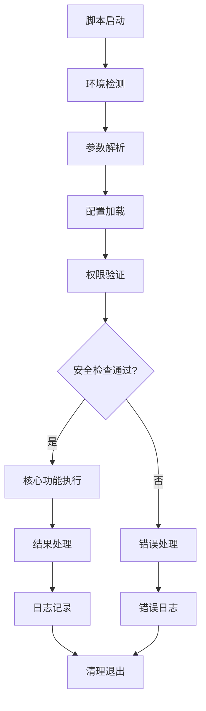
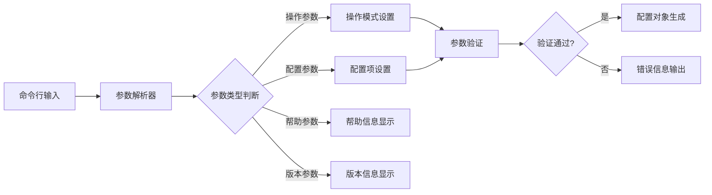
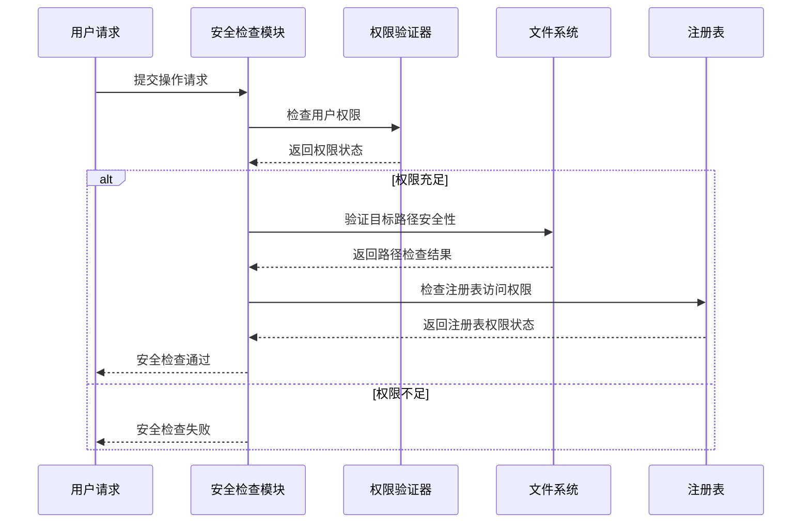
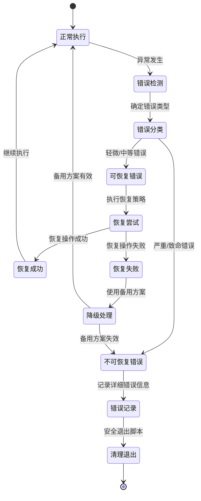
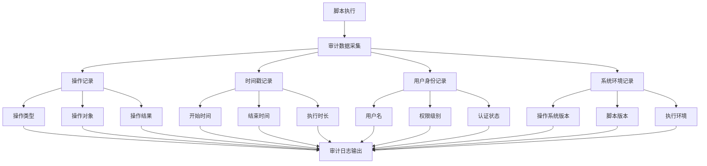
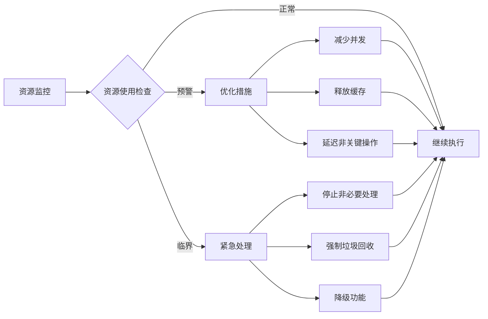
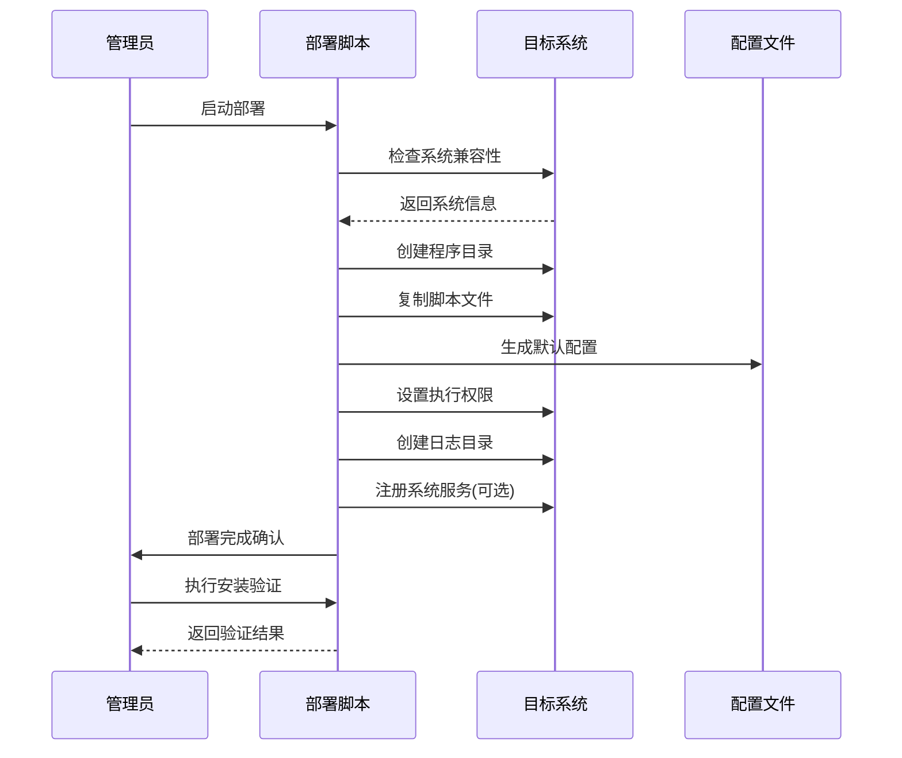
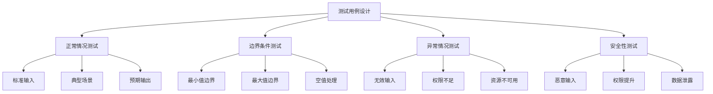

# 批处理脚本技术文档

## 概述

本文档旨在为系统管理人员提供批处理脚本的完整技术说明，帮助理解脚本的执行逻辑、功能模块和操作流程。文档涵盖脚本架构设计、执行流程、错误处理机制以及维护指南。

### 脚本用途
批处理脚本作为Windows系统自动化工具，主要用于执行重复性系统管理任务，包括但不限于文件操作、系统配置、服务管理和定期维护等。

### 目标用户
- 系统管理员
- 运维工程师  
- IT技术支持人员
- 系统集成专员

## 技术栈与依赖

### 核心技术组件

| 组件类型 | 技术栈 | 版本要求 | 用途说明 |
|---------|--------|----------|----------|
| 脚本解释器 | Windows Command Processor | Windows 7+ | 批处理命令执行环境 |
| 系统接口 | Windows API调用 | 系统原生 | 系统资源访问和操作 |
| 工具集成 | PowerShell | 2.0+ | 高级系统管理功能 |
| 日志记录 | 文本文件输出 | 无版本限制 | 操作日志和错误记录 |

### 外部依赖项

| 依赖组件 | 必需性 | 说明 |
|---------|--------|------|
| Windows Management Instrumentation | 必需 | 系统信息查询 |
| 网络服务组件 | 可选 | 网络相关操作 |
| 注册表访问权限 | 必需 | 系统配置管理 |
| 文件系统权限 | 必需 | 文件和目录操作 |

## 脚本架构设计

### 整体架构流程

### 模块化组件设计

| 模块名称 | 功能职责 | 输入参数 | 输出结果 |
|---------|----------|----------|----------|
| 环境检测模块 | 检查系统环境和依赖 | 系统路径、版本信息 | 环境状态报告 |
| 参数解析模块 | 处理命令行参数 | 命令行参数列表 | 解析后的配置对象 |
| 配置管理模块 | 加载和验证配置 | 配置文件路径 | 配置项集合 |
| 安全检查模块 | 验证权限和安全性 | 操作类型、目标路径 | 安全验证结果 |
| 核心执行模块 | 主要业务逻辑执行 | 业务参数 | 执行结果状态 |
| 日志记录模块 | 记录操作和错误信息 | 日志级别、消息内容 | 日志文件输出 |
| 错误处理模块 | 异常捕获和恢复 | 错误代码、错误信息 | 处理结果状态 |

## 核心功能架构

### 主执行流程设计

脚本采用分阶段执行模式，确保每个阶段的稳定性和可控性：

1. **初始化阶段**
   - 系统环境兼容性检查
   - 运行权限验证
   - 必要组件可用性确认

2. **配置阶段** 
   - 命令行参数解析和验证
   - 配置文件加载和合并
   - 默认值设定和覆盖处理

3. **预检查阶段**
   - 目标资源可访问性验证
   - 操作安全性评估
   - 前置条件满足性确认

4. **执行阶段**
   - 主要业务逻辑处理
   - 进度监控和状态更新
   - 异常情况处理和恢复

5. **完成阶段**
   - 执行结果汇总和验证
   - 日志记录和审计信息生成
   - 资源清理和环境恢复

### 参数处理架构

### 配置管理策略

| 配置类型 | 优先级 | 来源 | 格式 | 说明 |
|---------|--------|------|------|------|
| 命令行参数 | 最高 | 用户输入 | 标准参数格式 | 单次执行配置 |
| 配置文件 | 中等 | 外部文件 | INI/JSON格式 | 持久化配置 |
| 环境变量 | 较低 | 系统环境 | 键值对 | 环境相关配置 |
| 默认值 | 最低 | 脚本内置 | 硬编码常量 | 兜底配置 |

## 安全机制与权限控制

### 安全检查流程

### 权限验证矩阵

| 操作类型 | 所需权限级别 | 验证方式 | 失败处理 |
|---------|-------------|----------|----------|
| 文件读取 | 用户级 | 文件访问测试 | 跳过并记录 |
| 文件写入 | 用户级 | 目录写入权限检查 | 提示权限不足 |
| 文件删除 | 用户级/管理员级 | 文件属性检查 | 请求提权或跳过 |
| 注册表读取 | 用户级 | 注册表项访问测试 | 使用替代方案 |
| 注册表写入 | 管理员级 | 管理员权限检查 | 要求以管理员身份运行 |
| 服务操作 | 管理员级 | 服务控制权限验证 | 提示权限不足并退出 |
| 系统配置 | 管理员级 | 系统权限令牌检查 | 要求提权 |

### 路径安全策略

脚本实施多层路径安全验证机制：

1. **路径规范化处理**
   - 相对路径转换为绝对路径
   - 路径分隔符标准化
   - 特殊字符过滤和转义

2. **危险路径识别**
   - 系统关键目录黑名单检查
   - 网络路径和可移动媒体识别
   - 符号链接和重定向路径验证

3. **权限边界控制**
   - 用户主目录权限范围限制
   - 系统目录访问权限验证
   - 跨驱动器操作安全检查

## 错误处理与恢复机制

### 错误分类与处理策略

| 错误类型 | 严重程度 | 处理策略 | 恢复方式 |
|---------|----------|----------|----------|
| 参数错误 | 轻微 | 显示帮助信息 | 用户重新输入 |
| 权限不足 | 中等 | 提示权限要求 | 提权后重试 |
| 文件不存在 | 中等 | 跳过并继续 | 记录并继续处理 |
| 网络连接失败 | 中等 | 重试机制 | 指数退避重试 |
| 系统资源不足 | 严重 | 清理资源后重试 | 资源释放和重启 |
| 配置文件损坏 | 严重 | 使用默认配置 | 重建配置文件 |
| 系统组件缺失 | 致命 | 终止执行 | 提示安装依赖 |

### 错误恢复流程

## 日志记录与审计

### 日志分级体系

| 日志级别 | 用途说明 | 记录内容 | 输出目标 |
|---------|----------|----------|----------|
| DEBUG | 调试信息 | 详细执行步骤、变量值 | 调试日志文件 |
| INFO | 信息记录 | 正常操作流程、状态变更 | 标准输出 + 日志文件 |
| WARNING | 警告提示 | 潜在问题、非关键错误 | 标准输出 + 日志文件 |
| ERROR | 错误记录 | 操作失败、异常情况 | 错误输出 + 日志文件 |
| CRITICAL | 严重错误 | 系统级错误、脚本终止 | 错误输出 + 系统日志 |

### 审计信息采集

### 日志轮转与管理

脚本实施自动化的日志管理策略：

1. **文件大小控制**
   - 单个日志文件最大限制（如10MB）
   - 达到限制时自动创建新文件
   - 保留历史日志文件数量限制

2. **时间周期管理**
   - 按日期创建独立日志文件
   - 自动清理过期日志（如保留30天）
   - 压缩长期存档日志文件

3. **存储位置策略**
   - 用户可写目录作为默认位置
   - 支持通过配置指定日志目录
   - 自动创建不存在的日志目录

## 性能优化与监控

### 执行性能监控

| 监控指标 | 测量方式 | 预警阈值 | 优化策略 |
|---------|----------|----------|----------|
| 执行时间 | 开始/结束时间戳差值 | >预期时间50% | 算法优化、并行处理 |
| 内存使用 | 进程内存占用监控 | >100MB | 分批处理、变量清理 |
| 磁盘I/O | 文件操作频次统计 | >1000次/分钟 | 缓存机制、批量操作 |
| CPU使用率 | 进程CPU时间监控 | >80%持续5分钟 | 休眠延迟、优先级调整 |
| 网络延迟 | 网络操作响应时间 | >5秒 | 超时机制、重试策略 |

### 资源使用优化

## 部署与维护指南

### 部署环境要求

| 环境类型 | 最低要求 | 推荐配置 | 验证方法 |
|---------|----------|----------|----------|
| 操作系统 | Windows 7 SP1 | Windows 10/11 | 版本号检查 |
| 内存容量 | 2GB可用 | 4GB以上 | 系统信息查询 |
| 磁盘空间 | 100MB可用 | 1GB以上 | 磁盘空间检查 |
| 网络连接 | 可选 | 稳定互联网连接 | 连通性测试 |
| 用户权限 | 普通用户 | 管理员权限 | 权限级别检测 |

### 安装部署流程

### 维护检查清单

#### 日常维护项目

| 检查项目 | 检查频率 | 检查方法 | 异常处理 |
|---------|----------|----------|----------|
| 脚本执行状态 | 每日 | 查看执行日志 | 重启或重新配置 |
| 日志文件大小 | 每周 | 文件大小检查 | 日志轮转和清理 |
| 系统资源使用 | 每周 | 性能监控工具 | 资源优化调整 |
| 配置文件完整性 | 每月 | 配置验证脚本 | 恢复默认配置 |
| 安全策略更新 | 每月 | 安全扫描工具 | 更新安全规则 |
| 依赖组件版本 | 每季度 | 版本检查脚本 | 升级依赖组件 |

#### 故障排除指南

1. **脚本无法启动**
   - 检查文件权限设置
   - 验证依赖组件可用性
   - 确认配置文件格式正确性

2. **执行过程中断**
   - 查看详细错误日志
   - 检查系统资源状况
   - 验证网络连接稳定性

3. **输出结果异常**
   - 对比预期输出格式
   - 检查输入数据完整性
   - 验证业务逻辑正确性

4. **性能问题**
   - 监控资源使用情况
   - 分析执行时间分布
   - 优化算法和数据结构

### 版本管理与更新

脚本版本管理采用语义化版本控制：

- **主版本号**：重大功能变更或不兼容更新
- **次版本号**：新增功能或重要改进
- **修订版本号**：缺陷修复或微小改进

更新流程包括：

1. **备份当前版本**
   - 保存当前脚本文件
   - 导出现有配置
   - 记录当前执行状态

2. **测试新版本**
   - 在测试环境验证功能
   - 确认配置兼容性
   - 验证性能表现

3. **生产环境部署**
   - 选择维护窗口期
   - 执行版本更新
   - 验证功能正常

4. **回滚方案**
   - 保留回滚脚本
   - 快速恢复流程
   - 问题上报机制

## 单元测试策略

### 测试框架设计

脚本测试采用模块化测试方法，每个功能模块都有对应的测试用例：

| 测试类型 | 测试范围 | 验证内容 | 工具方法 |
|---------|----------|----------|----------|
| 单元测试 | 单个函数/模块 | 输入输出正确性 | 模拟输入、断言验证 |
| 集成测试 | 模块间交互 | 数据流和接口 | 端到端流程验证 |
| 系统测试 | 完整脚本 | 业务场景覆盖 | 实际环境测试 |
| 性能测试 | 执行效率 | 时间和资源消耗 | 基准测试工具 |
| 安全测试 | 安全机制 | 权限和数据保护 | 安全扫描工具 |

### 测试用例设计

### 自动化测试流程

测试执行采用自动化流程，确保测试的一致性和可重复性：

1. **测试环境准备**
   - 清理测试环境
   - 初始化测试数据
   - 配置测试参数

2. **测试执行阶段**
   - 顺序执行测试用例
   - 记录测试结果
   - 捕获异常信息

3. **结果分析阶段**
   - 统计测试通过率
   - 分析失败原因
   - 生成测试报告

4. **清理恢复阶段**
   - 清理测试数据
   - 恢复环境状态
   - 归档测试结果