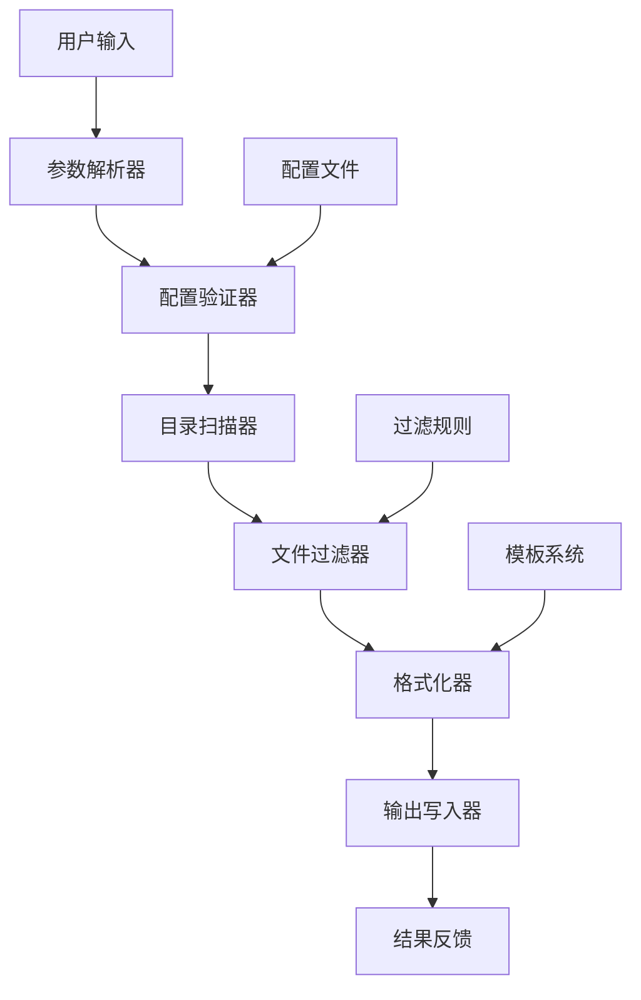
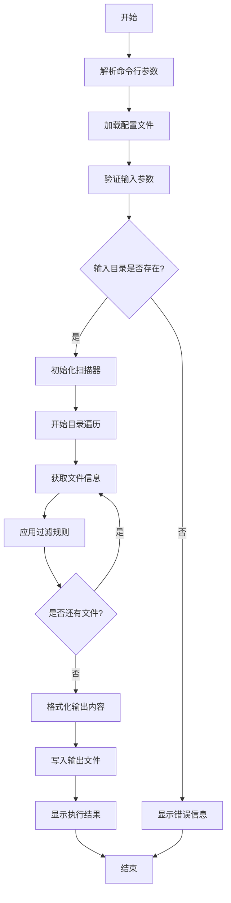
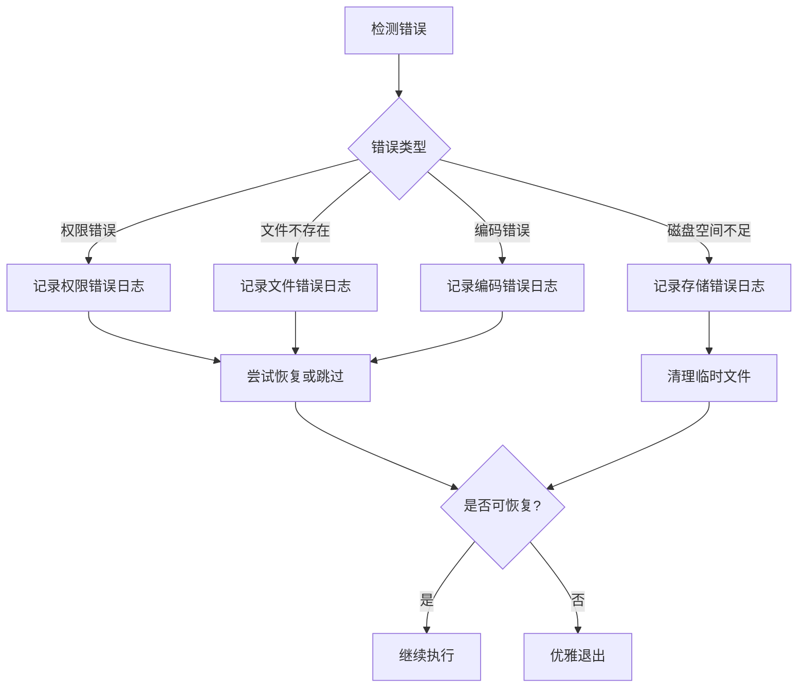

# 文件名导出脚本设计文档

## 概述

本项目旨在开发一个通用的文件名导出脚本，能够遍历指定目录下的所有文件，并将文件名信息导出到指定的输出文件中。脚本将支持多种配置选项，包括递归遍历、文件过滤、输出格式定制等功能。

### 核心价值
- 提供快速的目录文件清单生成能力
- 支持灵活的文件过滤和格式化选项
- 适用于文件管理、备份清单、项目文档等多种场景

### 目标用户
- 系统管理员进行文件清单管理
- 开发人员生成项目文件列表
- 普通用户整理文件目录信息

## 技术栈与依赖

### 推荐技术栈
- **Python**: 跨平台兼容性好，丰富的文件操作库
- **Shell Script**: 在Unix/Linux环境下性能优异
- **核心库**: os, pathlib, argparse, json等标准库

### 系统依赖
- Python 3.6+ （Python实现）
- Bash 4.0+ （Shell实现）
- 支持的操作系统：Windows、macOS、Linux

## 架构设计

### 整体架构



### 核心组件定义

| 组件名称 | 职责描述 | 输入 | 输出 |
|---------|---------|------|------|
| 参数解析器 | 解析命令行参数和选项 | 命令行参数 | 配置对象 |
| 配置验证器 | 验证输入参数的有效性 | 配置对象 | 验证后的配置 |
| 目录扫描器 | 遍历目录获取文件列表 | 目录路径、扫描配置 | 文件路径列表 |
| 文件过滤器 | 根据规则过滤文件 | 文件列表、过滤规则 | 过滤后的文件列表 |
| 格式化器 | 格式化文件信息输出 | 文件列表、格式模板 | 格式化字符串 |
| 输出写入器 | 将结果写入目标文件 | 格式化内容、输出路径 | 写入状态 |

## 功能特性设计

### 核心功能

#### 1. 目录遍历功能
- **递归遍历**: 支持深度遍历子目录
- **广度控制**: 可限制遍历深度
- **符号链接处理**: 可选择是否跟随符号链接
- **隐藏文件处理**: 可选择是否包含隐藏文件

#### 2. 文件过滤功能
- **扩展名过滤**: 支持包含/排除特定文件类型
- **文件名模式匹配**: 支持通配符和正则表达式
- **文件大小过滤**: 支持按文件大小范围筛选
- **修改时间过滤**: 支持按时间范围筛选文件

#### 3. 输出格式定制
- **简单列表**: 仅输出文件名
- **详细信息**: 包含路径、大小、修改时间等
- **JSON格式**: 结构化数据输出
- **CSV格式**: 表格化数据输出
- **自定义模板**: 用户自定义输出格式

### 配置参数表

| 参数名 | 类型 | 默认值 | 描述 |
|-------|------|--------|------|
| input_dir | 字符串 | 当前目录 | 要扫描的源目录路径 |
| output_file | 字符串 | filenames.txt | 输出文件路径 |
| recursive | 布尔值 | true | 是否递归遍历子目录 |
| max_depth | 整数 | -1 | 最大遍历深度（-1表示无限制） |
| include_hidden | 布尔值 | false | 是否包含隐藏文件 |
| follow_links | 布尔值 | false | 是否跟随符号链接 |
| file_extensions | 列表 | [] | 包含的文件扩展名列表 |
| exclude_patterns | 列表 | [] | 排除的文件名模式列表 |
| output_format | 字符串 | simple | 输出格式（simple/detailed/json/csv/custom） |
| custom_template | 字符串 | "" | 自定义输出模板 |
| encoding | 字符串 | utf-8 | 输出文件编码 |

## 工作流程设计

### 主要执行流程



### 错误处理流程



## 数据模型设计

### 文件信息模型

| 字段名 | 数据类型 | 描述 |
|-------|---------|------|
| name | 字符串 | 文件名（不含路径） |
| path | 字符串 | 文件完整路径 |
| relative_path | 字符串 | 相对于扫描根目录的路径 |
| extension | 字符串 | 文件扩展名 |
| size | 整数 | 文件大小（字节） |
| created_time | 时间戳 | 文件创建时间 |
| modified_time | 时间戳 | 文件修改时间 |
| is_directory | 布尔值 | 是否为目录 |
| is_hidden | 布尔值 | 是否为隐藏文件 |
| is_symlink | 布尔值 | 是否为符号链接 |

### 配置数据模型

| 字段名 | 数据类型 | 描述 |
|-------|---------|------|
| scan_config | 对象 | 扫描配置信息 |
| filter_config | 对象 | 过滤规则配置 |
| output_config | 对象 | 输出格式配置 |
| logging_config | 对象 | 日志配置信息 |

## 命令行接口设计

### 基本使用模式

```
filename-exporter [选项] [目录路径]
```

### 命令行选项表

| 短选项 | 长选项 | 参数 | 描述 |
|-------|--------|------|------|
| -o | --output | 文件路径 | 指定输出文件路径 |
| -r | --recursive | 无 | 启用递归遍历 |
| -d | --max-depth | 数字 | 设置最大遍历深度 |
| -H | --hidden | 无 | 包含隐藏文件 |
| -L | --follow-links | 无 | 跟随符号链接 |
| -f | --format | 格式名 | 设置输出格式 |
| -i | --include | 模式列表 | 包含文件模式 |
| -e | --exclude | 模式列表 | 排除文件模式 |
| -c | --config | 配置文件 | 指定配置文件路径 |
| -v | --verbose | 无 | 启用详细输出 |
| -h | --help | 无 | 显示帮助信息 |

### 使用示例

```
# 基本用法：导出当前目录所有文件名
filename-exporter

# 递归导出指定目录，包含隐藏文件
filename-exporter -rH /path/to/directory

# 只导出Python文件，输出为JSON格式
filename-exporter -i "*.py" -f json -o python_files.json

# 排除临时文件，限制深度为2层
filename-exporter -e "*.tmp,*.log" -d 2
```

## 输出格式规范

### 简单格式（Simple）
每行一个文件名，仅包含文件名部分

### 详细格式（Detailed）
每行包含：文件名、大小、修改时间、相对路径

### JSON格式
结构化JSON数据，包含完整文件信息和元数据

### CSV格式
表格化数据，适合在电子表格软件中查看和分析

### 自定义模板格式
支持用户自定义输出模板，使用变量替换语法

## 性能优化策略

### 内存优化
- 采用流式处理，避免一次性加载所有文件信息
- 实现文件信息的惰性加载机制
- 对大目录采用分批处理策略

### 性能优化
- 使用高效的目录遍历算法
- 实现并发文件信息收集（可选）
- 缓存文件系统操作结果

### 磁盘IO优化
- 批量写入输出文件
- 使用缓冲区减少磁盘操作次数
- 支持临时文件机制防止数据丢失

## 安全性考虑

### 输入验证
- 验证输入路径的合法性和安全性
- 防止路径遍历攻击
- 限制输出文件的写入权限

### 权限管理
- 检查目录访问权限
- 处理权限不足的文件或目录
- 提供安全的错误信息反馈

### 资源保护
- 限制最大处理文件数量
- 防止无限递归导致系统资源耗尽
- 实现超时机制避免长时间运行

## 测试策略

### 单元测试覆盖
- 参数解析功能测试
- 文件过滤逻辑测试
- 输出格式化功能测试
- 错误处理机制测试

### 集成测试场景
- 不同操作系统环境测试
- 大目录性能测试
- 特殊文件名处理测试
- 网络文件系统兼容性测试

### 边界条件测试
- 空目录处理
- 超长文件名处理
- 特殊字符文件名处理
- 权限受限场景测试