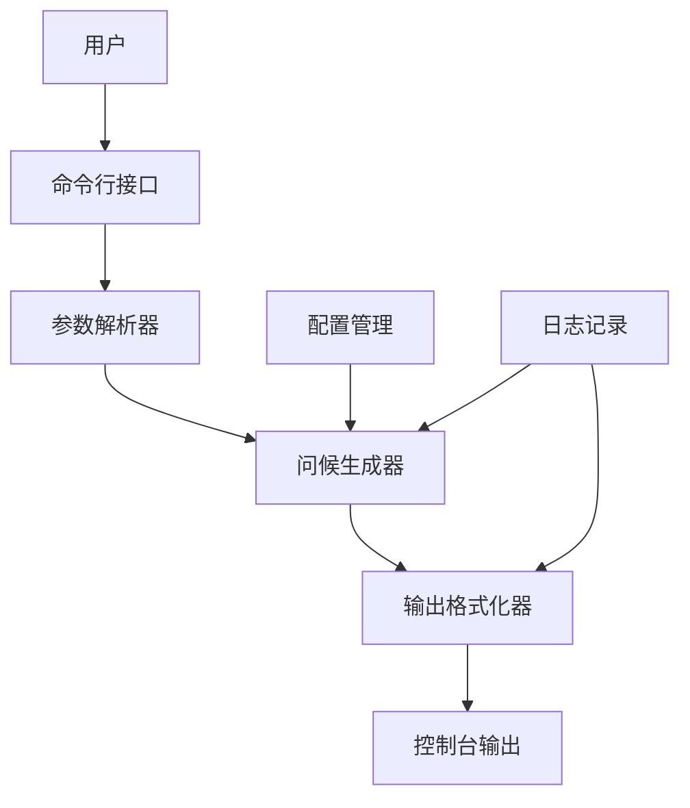
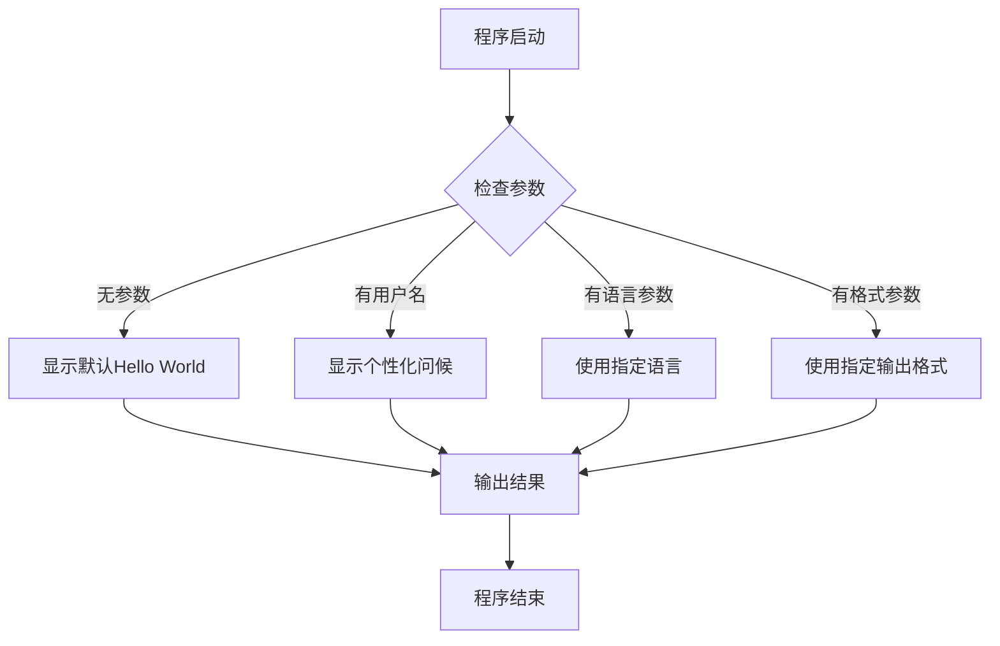
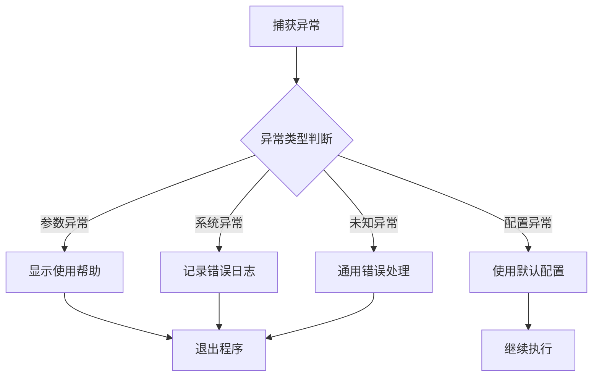

# Hello World Python脚本系统设计

## 概述

本设计文档定义了一个简单而可扩展的Python Hello World脚本系统。该系统旨在提供一个清晰的项目结构，展示基本的Python编程概念，并为后续功能扩展奠定基础。

## 技术栈与依赖

| 组件 | 技术选择 | 版本要求 | 用途 |
|------|----------|----------|------|
| 运行时 | Python | 3.7+ | 脚本执行环境 |
| 标准库 | sys, os | 内置 | 系统交互和参数处理 |
| 测试框架 | unittest | 内置 | 单元测试 |

## 架构设计

### 系统架构图

### 组件架构

系统采用模块化设计，将功能划分为以下核心组件：

| 组件名称 | 职责 | 输入 | 输出 |
|----------|------|------|------|
| 主入口模块 | 程序启动和流程控制 | 命令行参数 | 退出状态码 |
| 参数解析器 | 解析和验证用户输入 | 原始参数 | 结构化参数对象 |
| 问候生成器 | 生成个性化问候消息 | 用户名称、语言设置 | 格式化问候文本 |
| 输出管理器 | 处理不同格式的输出 | 问候消息、格式选项 | 格式化输出 |
| 配置管理器 | 管理应用配置 | 配置文件路径 | 配置对象 |

## 功能特性设计

### 核心功能

| 功能 | 描述 | 优先级 |
|------|------|--------|
| 基础问候 | 显示"Hello, World!" | 高 |
| 个性化问候 | 接受用户名并显示"Hello, [用户名]!" | 高 |
| 多语言支持 | 支持中文、英文问候 | 中 |
| 输出格式化 | 支持普通文本、JSON、XML格式输出 | 中 |
| 配置文件支持 | 通过配置文件自定义默认行为 | 低 |

### 用户交互流程

## 数据模型设计

### 用户输入模型

| 字段名 | 类型 | 必需 | 默认值 | 描述 |
|--------|------|------|--------|------|
| name | string | 否 | "World" | 问候对象的名称 |
| language | string | 否 | "en" | 输出语言(en/zh) |
| format | string | 否 | "text" | 输出格式(text/json/xml) |
| verbose | boolean | 否 | false | 是否显示详细信息 |

### 配置模型

| 配置项 | 类型 | 默认值 | 描述 |
|--------|------|--------|------|
| default_language | string | "en" | 默认输出语言 |
| default_format | string | "text" | 默认输出格式 |
| enable_colors | boolean | true | 是否启用彩色输出 |
| log_level | string | "INFO" | 日志记录级别 |

### 输出格式规范

#### 文本格式
- 标准输出：简洁的问候文本
- 详细输出：包含时间戳和额外信息

#### JSON格式
结构化输出包含问候消息、时间戳、语言和版本信息

#### XML格式
符合标准XML规范的结构化输出

## 模块设计

### 主程序模块
- 负责程序入口点和整体流程控制
- 协调各个子模块的调用
- 处理异常和错误情况
- 管理程序退出状态

### 参数处理模块
- 使用argparse库解析命令行参数
- 验证输入参数的合法性
- 提供帮助信息和使用说明
- 支持配置文件参数覆盖

### 问候逻辑模块
- 根据输入参数生成相应的问候消息
- 支持多语言模板系统
- 处理特殊字符和编码问题
- 提供问候消息的自定义扩展点

### 输出处理模块
- 支持多种输出格式的统一接口
- 处理控制台颜色和样式
- 管理输出重定向和文件输出
- 提供输出格式的扩展机制

## 错误处理策略

### 错误分类

| 错误类型 | 处理策略 | 用户反馈 |
|----------|----------|----------|
| 参数错误 | 显示帮助信息并退出 | 具体的参数错误说明 |
| 编码错误 | 回退到ASCII编码 | 警告消息但继续执行 |
| 配置文件错误 | 使用默认配置 | 警告消息 |
| 系统错误 | 记录日志并优雅退出 | 通用错误消息 |

### 异常处理流程

## 扩展性设计

### 插件系统架构
- 定义标准的插件接口
- 支持动态加载自定义问候模板
- 允许第三方输出格式扩展
- 提供配置验证和插件管理机制

### 国际化支持
- 基于gettext的多语言框架
- 支持动态语言切换
- 可扩展的语言包管理
- 地区化格式支持（日期、数字等）

### 配置管理扩展
- 支持多级配置文件继承
- 环境变量配置覆盖
- 运行时配置热重载
- 配置验证和模式定义

## 测试策略

### 单元测试覆盖

| 测试类别 | 覆盖范围 | 测试重点 |
|----------|----------|----------|
| 参数解析 | 所有输入组合 | 边界值和异常情况 |
| 问候生成 | 各种语言和格式 | 字符编码和特殊字符 |
| 输出格式化 | 所有支持格式 | 格式正确性和一致性 |
| 错误处理 | 各种异常场景 | 错误恢复和用户体验 |

### 集成测试设计
- 端到端功能测试覆盖主要使用场景
- 命令行接口的完整性测试
- 不同操作系统环境的兼容性测试
- 性能基准测试和资源使用监控

### 测试数据管理
- 多语言测试数据集
- 边界值和异常输入数据
- 配置文件测试样例
- 输出格式验证数据