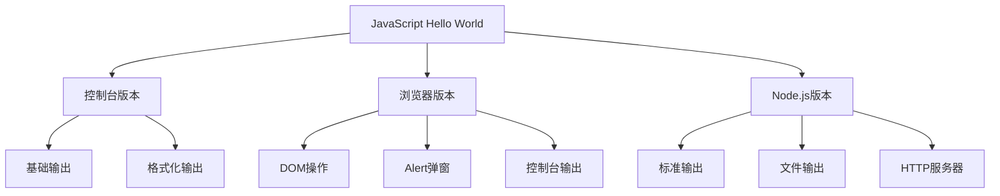
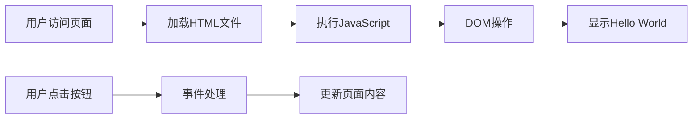
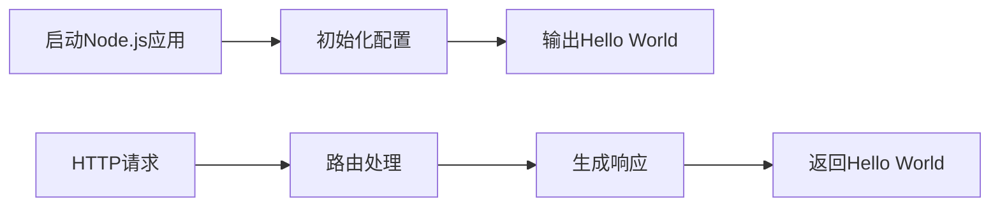
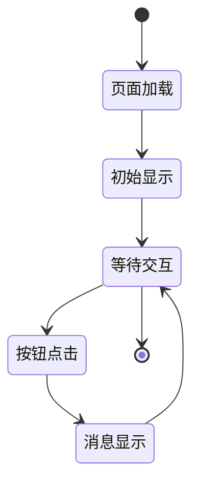
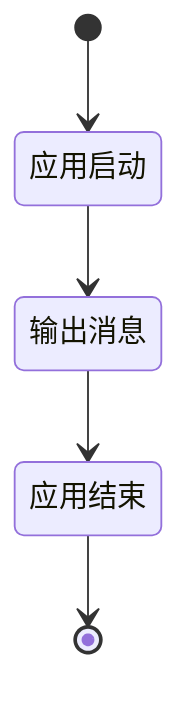
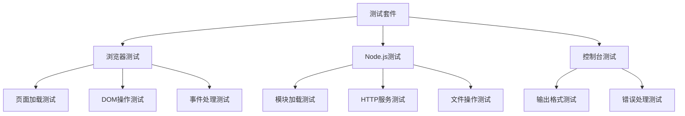

# JavaScript Hello World 项目设计文档

## 概述

JavaScript Hello World 是一个基础的入门项目，用于演示JavaScript的基本语法和不同运行环境下的输出方式。该项目将展示如何在不同环境（浏览器、Node.js、控制台）中输出"Hello, World!"消息，并提供多种实现方式供学习参考。

### 项目目标
- 演示JavaScript基础语法
- 展示不同运行环境下的输出方式
- 提供可扩展的项目结构
- 为JavaScript学习提供起点

### 适用场景
- JavaScript初学者入门
- 开发环境测试验证
- 项目模板参考

## 技术栈

| 技术组件 | 选择 | 说明 |
|---------|------|------|
| 核心语言 | JavaScript (ES6+) | 使用现代JavaScript语法 |
| 运行环境 | Node.js + 浏览器 | 支持多种运行环境 |
| 包管理 | npm | 标准的JavaScript包管理工具 |
| 文档格式 | Markdown | 提供清晰的项目说明 |

## 项目架构

### 目录结构设计

```
js-hello-world/
├── src/                    # 源代码目录
│   ├── console/           # 控制台版本
│   ├── browser/           # 浏览器版本
│   └── node/              # Node.js版本
├── examples/              # 示例文件
├── docs/                  # 文档目录
├── package.json           # 项目配置
└── README.md             # 项目说明
```

### 核心组件架构



## 功能模块设计

### 1. 控制台版本模块

**功能描述**：在开发者控制台或Node.js环境中输出Hello World消息

**核心特性**：
- 基础console.log输出
- 带时间戳的输出
- 彩色文本输出（Node.js环境）
- 格式化消息输出

**输出方式**：
| 方式 | 描述 | 适用环境 |
|------|------|----------|
| 简单输出 | console.log("Hello, World!") | 所有环境 |
| 时间戳输出 | 包含当前时间的输出 | 所有环境 |
| 彩色输出 | 使用ANSI颜色代码 | Node.js |
| 结构化输出 | JSON格式输出 | 所有环境 |

### 2. 浏览器版本模块

**功能描述**：在网页环境中通过多种方式展示Hello World消息

**核心特性**：
- HTML页面显示
- DOM动态插入
- 用户交互响应
- 样式美化

**展示方式**：
| 方式 | 描述 | 交互性 |
|------|------|--------|
| 静态HTML | 页面直接显示 | 无 |
| DOM插入 | JavaScript动态创建 | 低 |
| 按钮触发 | 点击显示消息 | 中 |
| 动画效果 | 带动画的显示 | 高 |

### 3. Node.js版本模块

**功能描述**：在Node.js服务器环境中实现Hello World功能

**核心特性**：
- 命令行应用
- HTTP服务器
- 文件操作
- 模块化设计

**实现方式**：
| 类型 | 描述 | 复杂度 |
|------|------|--------|
| CLI工具 | 命令行直接执行 | 低 |
| HTTP服务 | Web服务器响应 | 中 |
| 文件写入 | 写入到文件系统 | 中 |
| API服务 | RESTful API端点 | 高 |

## 数据流设计

### 浏览器环境数据流


### Node.js环境数据流


## 配置管理

### package.json配置结构
| 配置项 | 用途 | 示例值 |
|--------|------|--------|
| name | 项目名称 | "js-hello-world" |
| version | 版本号 | "1.0.0" |
| description | 项目描述 | "JavaScript Hello World examples" |
| main | 入口文件 | "src/node/index.js" |
| scripts | 运行脚本 | {"start": "node src/node/index.js"} |

### 运行脚本设计
| 脚本名 | 命令 | 功能 |
|--------|------|------|
| start | node src/node/index.js | 启动Node.js版本 |
| serve | http-server src/browser | 启动浏览器服务 |
| console | node src/console/index.js | 运行控制台版本 |

## 用户交互设计

### 浏览器交互流程


### 命令行交互流程


## 扩展性设计

### 消息国际化支持
| 语言 | 消息内容 | 编码 |
|------|----------|------|
| 英语 | "Hello, World!" | en |
| 中文 | "你好，世界！" | zh |
| 日语 | "こんにちは、世界！" | ja |
| 西班牙语 | "¡Hola, Mundo!" | es |

### 输出格式扩展
| 格式 | 描述 | 适用场景 |
|------|------|----------|
| 纯文本 | 简单字符串输出 | 基础演示 |
| JSON | 结构化数据格式 | API响应 |
| HTML | 标记语言格式 | 网页显示 |
| XML | 扩展标记语言 | 数据交换 |

## 测试策略

### 测试范围
| 测试类型 | 覆盖范围 | 验证内容 |
|----------|----------|----------|
| 功能测试 | 所有输出方式 | 消息正确性 |
| 环境测试 | 不同运行环境 | 兼容性验证 |
| 性能测试 | 响应时间 | 执行效率 |
| 用户体验测试 | 交互流程 | 操作便利性 |

### 测试用例设计
