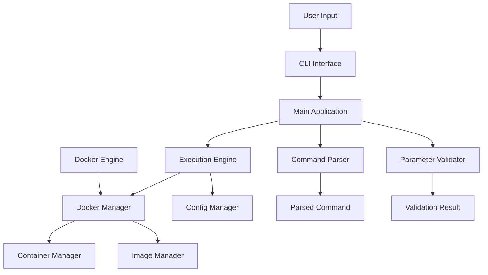

# Docker 命令执行工具技术指南

## 架构概述

Docker 命令执行工具采用模块化架构设计，主要包含以下核心组件：



## 核心组件详解

### 1. 命令解析器 (Command Parser)

**职责**: 解析用户输入的命令字符串，处理参数和选项。

**核心类**:
- `CommandParser`: 主解析器类
- `ParsedCommand`: 解析结果数据类
- `CommandHistory`: 命令历史管理

**关键功能**:
- Shell风格命令解析（使用shlex）
- 特殊参数处理（工作目录、环境变量、超时）
- 危险操作符检测（管道、重定向、命令连接）
- 参数验证和格式化

**代码示例**:
```python
parser = CommandParser()
parsed_cmd = parser.parse("ls -la /tmp")
# ParsedCommand(command='ls', args=['-la', '/tmp'], ...)
```

### 2. 参数验证器 (Parameter Validator)

**职责**: 验证命令和参数的安全性，防止恶意操作。

**核心类**:
- `ParameterValidator`: 主验证器
- `SecurityValidator`: 安全验证
- `ResourceValidator`: 资源验证
- `ValidationResult`: 验证结果

**安全机制**:
- 命令白名单/黑名单
- 路径安全检查
- 危险模式识别
- 参数长度和格式验证

**风险评估**:
- Low: 基础安全命令
- Medium: 需要谨慎使用的命令
- High: 危险或被禁止的命令

### 3. Docker管理器 (Docker Manager)

**职责**: 管理Docker容器的完整生命周期。

**核心类**:
- `DockerManager`: 主管理器
- `DockerClientManager`: 客户端连接管理
- `ImageManager`: 镜像管理
- `ContainerManager`: 容器管理

**容器安全配置**:
```python
container_config = {
    'read_only': True,           # 只读文件系统
    'user': '1000:1000',         # 非特权用户
    'network_disabled': True,     # 禁用网络
    'security_opt': ['no-new-privileges:true'],
    'cap_drop': ['ALL'],         # 删除所有权限
    'cap_add': ['CHOWN', 'SETUID', 'SETGID'],  # 仅添加必要权限
}
```

### 4. 执行引擎 (Execution Engine)

**职责**: 协调各组件，管理命令执行流程。

**核心类**:
- `ExecutionEngine`: 主执行引擎
- `ExecutionMonitor`: 执行监控
- `ExecutionMetrics`: 执行指标
- `ExecutionContext`: 执行上下文

**执行流程**:
1. 命令解析
2. 安全验证
3. 容器创建
4. 命令执行
5. 结果收集
6. 资源清理

### 5. 配置管理器 (Config Manager)

**职责**: 统一管理应用配置，支持多种配置源。

**配置类型**:
- `DockerConfig`: Docker相关配置
- `SecurityConfig`: 安全策略配置
- `LoggingConfig`: 日志配置

**配置优先级**:
1. 命令行参数
2. 环境变量
3. 配置文件
4. 默认值

## 安全设计

### 容器沙箱机制

1. **文件系统隔离**
   - 只读根文件系统
   - 临时文件系统限制
   - 挂载点权限控制

2. **网络隔离**
   - 默认无网络访问
   - 可配置受限网络模式

3. **进程隔离**
   - 非特权用户运行
   - 限制系统调用
   - 禁止新权限获取

4. **资源限制**
   - CPU使用限制
   - 内存使用限制
   - 文件描述符限制

### 命令安全验证

1. **静态分析**
   - 命令白名单检查
   - 危险模式识别
   - 参数格式验证

2. **动态监控**
   - 执行时间监控
   - 资源使用监控
   - 异常行为检测

## 性能优化

### 容器管理优化

1. **镜像缓存**
   - 本地镜像优先使用
   - 镜像分层缓存
   - 按需拉取策略

2. **容器复用**
   - 容器池管理
   - 预热容器准备
   - 批量执行优化

### 执行引擎优化

1. **并发控制**
   - 限制并发执行数量
   - 资源争用避免
   - 优雅降级策略

2. **监控优化**
   - 异步监控循环
   - 轻量级指标收集
   - 历史数据压缩

## 错误处理策略

### 错误分类

1. **用户错误**
   - 命令格式错误
   - 参数验证失败
   - 权限不足

2. **系统错误**
   - Docker服务不可用
   - 资源不足
   - 网络问题

3. **运行时错误**
   - 命令执行失败
   - 容器异常退出
   - 超时错误

### 恢复机制

1. **自动重试**
   - 网络相关错误重试
   - 资源暂时不可用重试
   - 指数退避策略

2. **降级处理**
   - 镜像获取失败时使用本地镜像
   - 网络不可用时禁用网络功能
   - 资源不足时调整限制

## 扩展机制

### 插件系统

1. **命令插件**
   - 自定义命令处理器
   - 特定应用场景适配
   - 命令转换和包装

2. **验证插件**
   - 自定义安全规则
   - 业务特定验证
   - 多级验证策略

3. **输出插件**
   - 自定义格式化器
   - 结果后处理
   - 多种输出目标

### 钩子机制

1. **执行前钩子**
   - 环境准备
   - 权限检查
   - 审计日志

2. **执行后钩子**
   - 结果处理
   - 清理操作
   - 指标收集

## 监控和诊断

### 执行指标

```python
class ExecutionMetrics:
    total_executions: int
    successful_executions: int
    failed_executions: int
    average_execution_time: float
    validation_failures: int
    docker_failures: int
    timeout_failures: int
```

### 健康检查

1. **组件健康**
   - Docker连接状态
   - 配置有效性
   - 资源可用性

2. **性能指标**
   - 成功率统计
   - 执行时间分布
   - 错误率分析

### 日志系统

1. **分级日志**
   - DEBUG: 详细调试信息
   - INFO: 一般信息记录
   - WARNING: 警告信息
   - ERROR: 错误信息

2. **结构化日志**
   - 执行上下文记录
   - 性能指标记录
   - 安全事件记录

## 部署建议

### 生产环境配置

1. **安全配置**
   ```json
   {
     "security": {
       "allowed_commands": ["ls", "cat", "grep"],
       "allow_network": false,
       "allow_privileged": false
     }
   }
   ```

2. **性能配置**
   ```json
   {
     "docker": {
       "timeout": 60,
       "memory_limit": "512m",
       "cpu_limit": 1.0
     }
   }
   ```

3. **监控配置**
   ```json
   {
     "logging": {
       "level": "INFO",
       "file_path": "/var/log/docker-executor.log"
     }
   }
   ```

### 容器化部署

```dockerfile
FROM python:3.9-slim

# 安装依赖
RUN apt-get update && apt-get install -y docker.io
COPY requirements.txt .
RUN pip install -r requirements.txt

# 复制应用
COPY src/ /app/src/
COPY config/ /app/config/

WORKDIR /app
CMD ["python", "-m", "src.main"]
```

## 最佳实践

### 安全最佳实践

1. **最小权限原则**
   - 仅开放必要命令
   - 限制文件访问范围
   - 控制资源使用量

2. **深度防御**
   - 多层验证机制
   - 容器安全加固
   - 审计日志记录

### 性能最佳实践

1. **资源管理**
   - 合理设置资源限制
   - 监控资源使用情况
   - 及时清理资源

2. **批量处理**
   - 使用批量执行减少开销
   - 优化容器创建流程
   - 合并相关操作

### 运维最佳实践

1. **监控告警**
   - 设置性能阈值
   - 配置异常告警
   - 定期健康检查

2. **日志管理**
   - 结构化日志输出
   - 日志轮转配置
   - 安全事件记录

这个技术指南为理解和维护Docker命令执行工具提供了全面的技术参考。