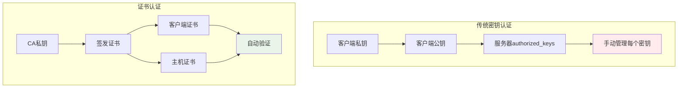
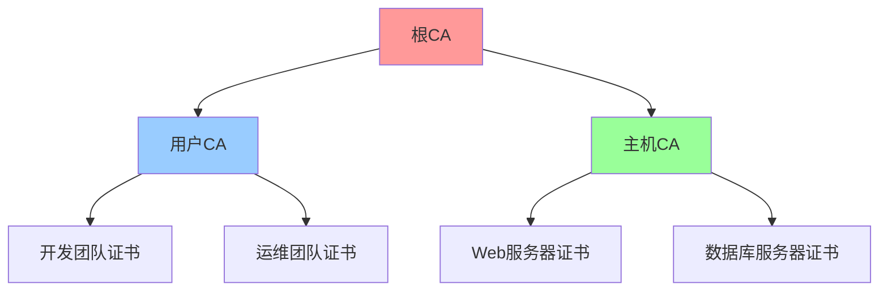

# SSH证书认证体系

## 概述

SSH证书认证是一种基于公钥基础设施(PKI)的高级认证方式，相比传统的密钥认证，证书认证提供了更好的可扩展性、中央化管理和细粒度访问控制能力。

## 证书认证基础

### 传统认证 vs 证书认证



### 证书认证优势

| 特性 | 传统密钥认证 | 证书认证 |
|------|-------------|----------|
| **扩展性** | 每台服务器手动管理 | 中央化证书管理 |
| **有效期** | 永久有效 | 可设置有效期 |
| **撤销机制** | 手动删除密钥 | 证书撤销列表(CRL) |
| **权限控制** | 基于密钥的简单控制 | 基于证书的细粒度控制 |

## SSH CA证书体系

### 证书体系架构



### CA密钥生成

```bash
#!/bin/bash
# SSH CA证书体系建立脚本

CA_DIR="/etc/ssh-ca"
USER_CA_KEY="$CA_DIR/user_ca"
HOST_CA_KEY="$CA_DIR/host_ca"

# 创建CA目录
sudo mkdir -p "$CA_DIR"
sudo chmod 700 "$CA_DIR"

# 生成用户CA密钥对
echo "生成用户CA密钥..."
sudo ssh-keygen -t ed25519 -f "$USER_CA_KEY" -N "" -C "User CA $(date +%Y%m%d)"

# 生成主机CA密钥对
echo "生成主机CA密钥..."
sudo ssh-keygen -t ed25519 -f "$HOST_CA_KEY" -N "" -C "Host CA $(date +%Y%m%d)"

# 设置正确权限
sudo chmod 600 "$USER_CA_KEY" "$HOST_CA_KEY"
sudo chmod 644 "$USER_CA_KEY.pub" "$HOST_CA_KEY.pub"

echo "CA密钥生成完成"
```

## 用户证书认证

### 用户证书签发

```bash
#!/bin/bash
# 用户证书签发脚本

USER_CA_KEY="/etc/ssh-ca/user_ca"

sign_user_certificate() {
    local user_public_key="$1"
    local username="$2"
    local cert_id="$3"
    local validity="${4:-365d}"
    local principals="${5:-$username}"
    
    echo "签发用户证书:"
    echo "  用户: $username"
    echo "  有效期: $validity"
    echo "  授权用户名: $principals"
    
    # 签发证书
    sudo ssh-keygen -s "$USER_CA_KEY" \
        -I "$cert_id" \
        -n "$principals" \
        -V "+$validity" \
        -O clear \
        -O permit-X11-forwarding \
        -O permit-agent-forwarding \
        -O permit-port-forwarding \
        -O permit-pty \
        "$user_public_key"
    
    echo "✅ 用户证书已生成: ${user_public_key}-cert.pub"
    
    # 显示证书信息
    ssh-keygen -L -f "${user_public_key}-cert.pub"
}

# 用法示例
sign_user_certificate ~/.ssh/id_ed25519.pub john "john_dev_2024" "30d" "john,deploy"
```

### 服务器端用户证书配置

```bash
# /etc/ssh/sshd_config 用户证书认证配置

# 启用公钥认证
PubkeyAuthentication yes

# 指定用户CA公钥
TrustedUserCAKeys /etc/ssh-ca/user_ca.pub

# 证书认证配置
AuthorizedPrincipalsFile /etc/ssh/auth_principals/%u

# 启用证书认证日志
LogLevel VERBOSE

# 重启SSH服务
# systemctl reload sshd
```

### 用户主体文件配置

```bash
# 创建授权主体目录
sudo mkdir -p /etc/ssh/auth_principals

# 为用户john配置授权主体
sudo tee /etc/ssh/auth_principals/john > /dev/null << 'EOF'
john
developer
deploy
EOF

# 设置正确权限
sudo chmod 644 /etc/ssh/auth_principals/*
```

## 主机证书认证

### 主机证书签发

```bash
#!/bin/bash
# 主机证书签发脚本

HOST_CA_KEY="/etc/ssh-ca/host_ca"

sign_host_certificate() {
    local hostname="$1"
    local host_public_key="$2"
    local validity="${3:-365d}"
    local hostnames="${4:-$hostname}"
    
    echo "签发主机证书:"
    echo "  主机名: $hostname"
    echo "  有效期: $validity"
    
    # 签发主机证书
    sudo ssh-keygen -s "$HOST_CA_KEY" \
        -I "${hostname}_$(date +%Y%m%d)" \
        -h \
        -n "$hostnames" \
        -V "+$validity" \
        "$host_public_key"
    
    echo "✅ 主机证书已生成: ${host_public_key}-cert.pub"
}

# 自动配置主机证书
setup_host_certificate() {
    local hostname="${1:-$(hostname)}"
    local host_key_path="/etc/ssh/ssh_host_ed25519_key"
    
    # 签发证书
    sign_host_certificate "$hostname" "$host_key_path.pub"
    
    # 配置SSH服务器使用证书
    echo "HostCertificate /etc/ssh/ssh_host_ed25519_key-cert.pub" | sudo tee -a /etc/ssh/sshd_config
    sudo systemctl reload sshd
    
    echo "✅ 主机证书配置完成"
}
```

### 客户端主机证书验证

```bash
# ~/.ssh/config 客户端主机证书验证配置

# 使用证书的特定主机配置
Host *.company.com
    UserKnownHostsFile ~/.ssh/known_hosts_ca
    StrictHostKeyChecking yes

# 配置主机CA公钥
# echo "@cert-authority *.company.com $(cat /etc/ssh-ca/host_ca.pub)" >> ~/.ssh/known_hosts_ca
```

## 证书撤销和管理

### 证书撤销

```bash
#!/bin/bash
# 证书撤销脚本

CRL_FILE="/etc/ssh-ca/revoked_keys"

revoke_certificate() {
    local cert_file="$1"
    local reason="${2:-key-compromise}"
    
    echo "撤销证书: $cert_file"
    echo "撤销原因: $reason"
    
    # 生成SSH撤销列表
    ssh-keygen -k -f "$CRL_FILE" "$cert_file"
    
    echo "✅ 证书已撤销"
    
    # 分发到所有服务器
    distribute_crl
}

distribute_crl() {
    local servers_file="/etc/ssh-ca/servers.list"
    
    echo "分发证书撤销列表..."
    
    while IFS= read -r server; do
        [[ -z "$server" || "$server" =~ ^# ]] && continue
        
        echo "更新服务器: $server"
        scp "$CRL_FILE" "root@$server:/etc/ssh/revoked_keys"
        ssh "root@$server" "systemctl reload sshd"
        
    done < "$servers_file"
    
    echo "✅ 撤销列表分发完成"
}
```

### 服务器端CRL配置

```bash
# /etc/ssh/sshd_config CRL配置
RevokedKeys /etc/ssh/revoked_keys

# 重载配置
systemctl reload sshd
```

## 企业级证书管理

### 证书监控脚本

```bash
#!/bin/bash
# SSH证书监控脚本

check_expiring_certificates() {
    local days_ahead="${1:-7}"
    local cert_dir="/etc/ssh-certificates"
    
    echo "检查 $days_ahead 天内过期的证书..."
    
    for cert_file in "$cert_dir"/*.pub; do
        [[ ! -f "$cert_file" ]] && continue
        
        # 获取证书信息
        local cert_info=$(ssh-keygen -L -f "$cert_file" 2>/dev/null)
        local expires=$(echo "$cert_info" | grep "Valid:" | awk '{print $5" "$6}')
        
        if [[ -n "$expires" ]]; then
            local expires_epoch=$(date -d "$expires" +%s 2>/dev/null)
            local now_epoch=$(date +%s)
            local days_remaining=$(( (expires_epoch - now_epoch) / 86400 ))
            
            if [[ $days_remaining -le $days_ahead && $days_remaining -ge 0 ]]; then
                echo "⚠️  证书即将过期: $(basename "$cert_file") (剩余 $days_remaining 天)"
            elif [[ $days_remaining -lt 0 ]]; then
                echo "❌ 证书已过期: $(basename "$cert_file")"
            fi
        fi
    done
}

# 生成证书报告
generate_certificate_report() {
    local report_file="/var/reports/ssh-cert-report-$(date +%Y%m%d).txt"
    
    {
        echo "SSH证书管理报告 - $(date)"
        echo "=================================="
        echo ""
        
        echo "证书状态统计:"
        echo "-------------"
        check_expiring_certificates 30
        
    } > "$report_file"
    
    echo "✅ 证书报告已生成: $report_file"
}

case "${1:-check}" in
    "check")
        check_expiring_certificates "${2:-7}"
        ;;
    "report")
        generate_certificate_report
        ;;
    *)
        echo "SSH证书监控工具"
        echo "用法: $0 {check [天数]|report}"
        ;;
esac
```

## 最佳实践总结

### 证书管理策略

1. **CA密钥安全**: 离线存储、硬件安全模块、多人授权
2. **证书生命周期**: 短期用户证书、长期主机证书
3. **访问控制**: 基于主体的细粒度权限控制
4. **监控审计**: 证书使用监控、过期提醒、撤销追踪

### 实施建议

```bash
# 证书管理检查清单

# ✅ CA建立
- [ ] 生成用户CA和主机CA密钥对
- [ ] 安全存储CA私钥
- [ ] 配置CA公钥分发

# ✅ 用户证书
- [ ] 配置用户证书签发流程
- [ ] 设置合适的证书有效期
- [ ] 配置用户主体授权

# ✅ 主机证书
- [ ] 为所有服务器签发主机证书
- [ ] 客户端配置主机CA验证
- [ ] 定期更新主机证书

# ✅ 证书撤销
- [ ] 建立证书撤销机制
- [ ] 配置CRL分发流程
- [ ] 测试证书撤销功能

# ✅ 监控管理
- [ ] 设置证书过期监控
- [ ] 建立审计日志记录
- [ ] 定期生成管理报告
```

## 下一步

完成证书认证学习后，建议继续：

1. **[自动化管理](./automation-scripts.md)** - 学习SSH自动化技术
2. **[性能调优](./performance-tuning.md)** - 优化SSH性能
3. **[企业集成](./enterprise-integration.md)** - 企业级SSH集成

---

🔐 **安全提醒**: 
- CA私钥是整个证书体系的根基，必须严格保护
- 定期轮换CA密钥和证书
- 建立完善的证书撤销和监控机制
- 在生产环境中充分测试证书认证流程