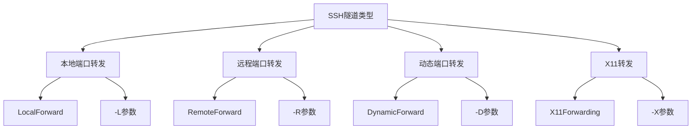
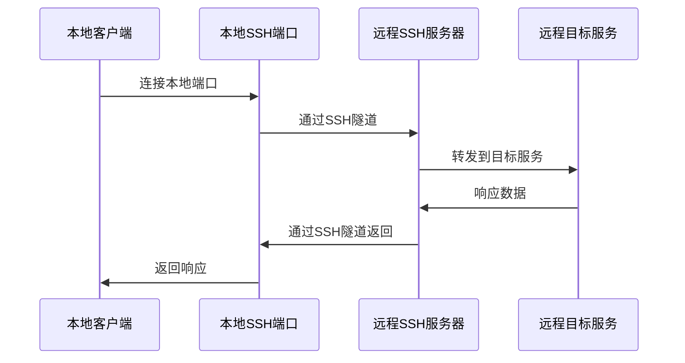

# SSH代理转发和隧道技术

## 概述

SSH代理转发和隧道技术是SSH的高级功能，能够实现安全的网络穿透、端口转发和流量代理。这些技术在复杂网络环境、远程开发和安全访问中发挥重要作用。

## SSH隧道基础

### 隧道类型



## 本地端口转发

### 基本概念

本地端口转发将本地端口的流量通过SSH隧道转发到远程服务器的指定端口。



### 配置方法

#### 命令行方式

```bash
# 基本语法
ssh -L [bind_address:]port:host:hostport user@server

# 示例1: 访问远程数据库
ssh -L 3306:localhost:3306 user@db-server.com
# 本地3306端口 -> SSH隧道 -> 远程服务器的3306端口

# 示例2: 访问内网Web服务
ssh -L 8080:192.168.1.100:80 user@gateway.com
# 本地8080端口 -> SSH隧道 -> 内网192.168.1.100的80端口

# 示例3: 绑定特定IP
ssh -L 127.0.0.1:5432:localhost:5432 user@db-server.com
# 仅绑定到127.0.0.1接口

# 示例4: 多端口转发
ssh -L 3306:localhost:3306 -L 6379:localhost:6379 user@server.com
# 同时转发MySQL和Redis端口
```

#### 配置文件方式

```bash
# ~/.ssh/config
Host db-tunnel
    HostName db-server.com
    User dbadmin
    LocalForward 3306 localhost:3306
    LocalForward 6379 localhost:6379
    
Host web-dev
    HostName dev-server.com
    User developer
    LocalForward 3000 localhost:3000
    LocalForward 5432 postgres.internal:5432
```

### 实际应用场景

#### 场景1: 数据库访问

```bash
#!/bin/bash
# 数据库隧道连接脚本

DB_SERVER="production-db.company.com"
DB_USER="dbadmin"
LOCAL_PORT="3306"
REMOTE_PORT="3306"

echo "建立数据库隧道连接..."
ssh -f -N -L $LOCAL_PORT:localhost:$REMOTE_PORT $DB_USER@$DB_SERVER

echo "隧道已建立，可以通过localhost:$LOCAL_PORT访问数据库"
echo "连接示例:"
echo "  mysql -h 127.0.0.1 -P $LOCAL_PORT -u root -p"

# 检查隧道状态
if ss -tlnp | grep ":$LOCAL_PORT " >/dev/null; then
    echo "✅ 隧道运行正常"
else
    echo "❌ 隧道建立失败"
fi
```

#### 场景2: Web开发环境

```bash
# 开发环境隧道配置
Host dev-env
    HostName dev.company.com
    User developer
    
    # Web服务
    LocalForward 3000 localhost:3000
    LocalForward 8080 localhost:8080
    
    # 数据库服务
    LocalForward 5432 postgres.internal:5432
    LocalForward 3306 mysql.internal:3306
    
    # 缓存服务
    LocalForward 6379 redis.internal:6379
    LocalForward 11211 memcached.internal:11211
    
    # 保持连接
    ControlMaster auto
    ControlPath ~/.ssh/master-%r@%h:%p
    ControlPersist 8h
```

## 远程端口转发

### 基本概念

远程端口转发将远程服务器端口的流量通过SSH隧道转发到本地或其他服务器。

### 配置方法

#### 命令行方式

```bash
# 基本语法
ssh -R [bind_address:]port:host:hostport user@server

# 示例1: 将本地Web服务暴露给远程服务器
ssh -R 8080:localhost:3000 user@public-server.com
# 远程服务器8080端口 -> SSH隧道 -> 本地3000端口

# 示例2: 远程访问本地数据库
ssh -R 3306:localhost:3306 user@remote-server.com
# 远程服务器可通过localhost:3306访问本地MySQL

# 示例3: 反向代理
ssh -R 0.0.0.0:8080:localhost:3000 user@server.com
# 绑定到远程服务器所有接口（需要GatewayPorts yes）
```

#### 服务器配置要求

```bash
# /etc/ssh/sshd_config
# 允许远程端口转发
AllowTcpForwarding yes

# 允许绑定到非localhost接口
GatewayPorts yes

# 重启SSH服务
systemctl reload sshd
```

### 应用场景

#### 场景1: 内网服务外网访问

```bash
#!/bin/bash
# 内网服务发布脚本

LOCAL_SERVICE_PORT="3000"
REMOTE_SERVER="public.example.com"
REMOTE_PORT="8080"
SSH_USER="tunnel"

echo "发布本地服务到公网..."
ssh -f -N -R $REMOTE_PORT:localhost:$LOCAL_SERVICE_PORT $SSH_USER@$REMOTE_SERVER

echo "服务已发布："
echo "  内网地址: http://localhost:$LOCAL_SERVICE_PORT"
echo "  公网地址: http://$REMOTE_SERVER:$REMOTE_PORT"

# 监控隧道状态
while true; do
    if ssh $SSH_USER@$REMOTE_SERVER "ss -tlnp | grep :$REMOTE_PORT" >/dev/null 2>&1; then
        echo "$(date): 隧道运行正常"
    else
        echo "$(date): 隧道连接中断，尝试重连..."
        ssh -f -N -R $REMOTE_PORT:localhost:$LOCAL_SERVICE_PORT $SSH_USER@$REMOTE_SERVER
    fi
    sleep 60
done
```

## 动态端口转发(SOCKS代理)

### 基本概念

动态端口转发创建一个SOCKS代理服务器，允许多个应用程序通过同一个SSH隧道访问远程网络。

### 配置方法

```bash
# 创建SOCKS代理
ssh -D [bind_address:]port user@server

# 示例1: 基本SOCKS代理
ssh -D 1080 user@proxy-server.com
# 本地1080端口作为SOCKS代理

# 示例2: 绑定特定接口
ssh -D 127.0.0.1:1080 user@proxy-server.com

# 示例3: 后台运行
ssh -f -N -D 1080 user@proxy-server.com
```

### 客户端配置

#### 浏览器配置

```bash
# Firefox代理配置
# 设置 -> 网络设置 -> 手动代理配置
# SOCKS Host: 127.0.0.1
# Port: 1080
# SOCKS v5

# Chrome启动参数
google-chrome --proxy-server="socks5://127.0.0.1:1080"

# curl使用SOCKS代理
curl --socks5 127.0.0.1:1080 http://example.com
```

#### 系统级代理

```bash
# 配置系统环境变量
export https_proxy=socks5://127.0.0.1:1080
export http_proxy=socks5://127.0.0.1:1080
export all_proxy=socks5://127.0.0.1:1080

# 测试代理连接
curl --proxy socks5://127.0.0.1:1080 http://httpbin.org/ip
```

### 应用场景

#### 场景1: 科学上网

```bash
#!/bin/bash
# SOCKS代理管理脚本

PROXY_SERVER="proxy.example.com"
PROXY_USER="user"
LOCAL_PORT="1080"
PID_FILE="/tmp/ssh-socks.pid"

start_proxy() {
    if [[ -f "$PID_FILE" ]] && kill -0 $(cat "$PID_FILE") 2>/dev/null; then
        echo "代理已在运行"
        return 1
    fi
    
    echo "启动SOCKS代理..."
    ssh -f -N -D $LOCAL_PORT $PROXY_USER@$PROXY_SERVER
    echo $! > "$PID_FILE"
    
    sleep 2
    if ss -tlnp | grep ":$LOCAL_PORT " >/dev/null; then
        echo "✅ SOCKS代理启动成功: 127.0.0.1:$LOCAL_PORT"
    else
        echo "❌ SOCKS代理启动失败"
        rm -f "$PID_FILE"
        return 1
    fi
}

stop_proxy() {
    if [[ -f "$PID_FILE" ]]; then
        local pid=$(cat "$PID_FILE")
        if kill -0 "$pid" 2>/dev/null; then
            kill "$pid"
            echo "SOCKS代理已停止"
        fi
        rm -f "$PID_FILE"
    else
        echo "代理未运行"
    fi
}

case "$1" in
    start)
        start_proxy
        ;;
    stop)
        stop_proxy
        ;;
    restart)
        stop_proxy
        sleep 1
        start_proxy
        ;;
    status)
        if [[ -f "$PID_FILE" ]] && kill -0 $(cat "$PID_FILE") 2>/dev/null; then
            echo "代理正在运行 (PID: $(cat "$PID_FILE"))"
        else
            echo "代理未运行"
        fi
        ;;
    *)
        echo "用法: $0 {start|stop|restart|status}"
        ;;
esac
```

## 跳板机和代理链

### 跳板机配置

```bash
# ~/.ssh/config 跳板机配置
Host bastion
    HostName bastion.company.com
    User admin
    ControlMaster yes
    ControlPath ~/.ssh/master-%r@%h:%p
    ControlPersist 10m

Host internal-*
    User developer
    ProxyJump bastion
    # 或使用ProxyCommand
    # ProxyCommand ssh -W %h:%p bastion

Host web1
    HostName web1.internal.company.com
    User deploy
    ProxyJump bastion

Host db1
    HostName db1.internal.company.com
    User dbadmin
    ProxyJump bastion
```

### 多级跳板

```bash
# 多级跳板配置
Host bastion1
    HostName bastion1.company.com
    User admin

Host bastion2
    HostName bastion2.internal
    User admin
    ProxyJump bastion1

Host deep-internal
    HostName app.deep.internal
    User developer
    ProxyJump bastion1,bastion2
```

### 自动化跳板脚本

```bash
#!/bin/bash
# 智能跳板连接脚本

declare -A JUMP_ROUTES=(
    ["web1.internal"]="bastion.company.com"
    ["db1.internal"]="bastion.company.com"
    ["app.deep.internal"]="bastion1.company.com,bastion2.internal"
)

connect_with_jump() {
    local target="$1"
    local jump_route="${JUMP_ROUTES[$target]}"
    
    if [[ -z "$jump_route" ]]; then
        echo "直接连接: $target"
        ssh "$target"
    else
        echo "通过跳板连接: $target (via $jump_route)"
        ssh -J "$jump_route" "$target"
    fi
}

# 自动检测最佳路由
auto_connect() {
    local target="$1"
    
    # 尝试直接连接
    if timeout 5 ssh -o BatchMode=yes -o ConnectTimeout=3 "$target" exit 2>/dev/null; then
        echo "直接连接可用"
        ssh "$target"
        return
    fi
    
    # 尝试跳板连接
    connect_with_jump "$target"
}

if [[ $# -eq 0 ]]; then
    echo "用法: $0 <目标主机>"
    echo "支持的主机:"
    for host in "${!JUMP_ROUTES[@]}"; do
        echo "  $host (via ${JUMP_ROUTES[$host]})"
    done
else
    auto_connect "$1"
fi
```

## X11转发

### 基本配置

```bash
# 启用X11转发
ssh -X user@server
# 或
ssh -Y user@server  # 信任X11转发

# 配置文件方式
Host gui-server
    HostName server.com
    User developer
    ForwardX11 yes
    ForwardX11Trusted yes
```

### 服务器端配置

```bash
# /etc/ssh/sshd_config
X11Forwarding yes
X11DisplayOffset 10
X11UseLocalhost yes

# 重启SSH服务
systemctl reload sshd
```

### 应用示例

```bash
# 在远程服务器运行图形应用
ssh -X user@server
firefox &
gedit &

# 检查X11转发状态
echo $DISPLAY
# 输出类似: localhost:10.0
```

## 高级隧道技术

### 持久化隧道管理

```bash
#!/bin/bash
# SSH隧道管理守护进程

TUNNELS_CONFIG="/etc/ssh-tunnels/tunnels.conf"
PID_DIR="/var/run/ssh-tunnels"
LOG_FILE="/var/log/ssh-tunnels.log"

# 隧道配置格式:
# name:type:local_port:remote_host:remote_port:ssh_server:ssh_user

create_tunnel() {
    local config="$1"
    IFS=':' read -r name type local_port remote_host remote_port ssh_server ssh_user <<< "$config"
    
    local pid_file="$PID_DIR/$name.pid"
    
    case "$type" in
        "local")
            ssh -f -N -L "$local_port:$remote_host:$remote_port" "$ssh_user@$ssh_server"
            ;;
        "remote")
            ssh -f -N -R "$local_port:$remote_host:$remote_port" "$ssh_user@$ssh_server"
            ;;
        "dynamic")
            ssh -f -N -D "$local_port" "$ssh_user@$ssh_server"
            ;;
    esac
    
    echo $! > "$pid_file"
    log "隧道 $name 已启动 (PID: $!)"
}

monitor_tunnels() {
    while IFS= read -r tunnel_config; do
        [[ -z "$tunnel_config" || "$tunnel_config" =~ ^# ]] && continue
        
        IFS=':' read -r name _ _ _ _ _ _ <<< "$tunnel_config"
        local pid_file="$PID_DIR/$name.pid"
        
        if [[ -f "$pid_file" ]]; then
            local pid=$(cat "$pid_file")
            if ! kill -0 "$pid" 2>/dev/null; then
                log "隧道 $name 已断开，重新启动..."
                rm -f "$pid_file"
                create_tunnel "$tunnel_config"
            fi
        else
            log "启动隧道 $name..."
            create_tunnel "$tunnel_config"
        fi
        
    done < "$TUNNELS_CONFIG"
}

log() {
    echo "[$(date -Iseconds)] $*" >> "$LOG_FILE"
}

# 创建必要目录
mkdir -p "$PID_DIR"

# 主监控循环
while true; do
    monitor_tunnels
    sleep 30
done
```

### 负载均衡隧道

```bash
#!/bin/bash
# 负载均衡SSH隧道

SERVERS=("tunnel1.example.com" "tunnel2.example.com" "tunnel3.example.com")
LOCAL_PORT="8080"
REMOTE_PORT="80"
USER="tunnel"

get_active_server() {
    for server in "${SERVERS[@]}"; do
        if timeout 3 ssh -o BatchMode=yes "$USER@$server" exit 2>/dev/null; then
            echo "$server"
            return 0
        fi
    done
    return 1
}

create_balanced_tunnel() {
    local active_server
    active_server=$(get_active_server)
    
    if [[ -n "$active_server" ]]; then
        echo "使用服务器: $active_server"
        ssh -L "$LOCAL_PORT:localhost:$REMOTE_PORT" "$USER@$active_server"
    else
        echo "❌ 所有服务器均不可用"
        return 1
    fi
}

create_balanced_tunnel
```

## 安全考虑

### 隧道安全配置

```bash
# 限制端口转发权限
# /etc/ssh/sshd_config

# 仅允许特定用户使用端口转发
Match User tunnel-user
    AllowTcpForwarding yes
    PermitTunnel yes

# 其他用户禁用端口转发
Match User *
    AllowTcpForwarding no
    PermitTunnel no

# 限制转发目标
PermitOpen localhost:3306 localhost:5432
```

### 访问控制

```bash
# 客户端安全配置
Host production-tunnel
    HostName prod.company.com
    User tunnel
    IdentityFile ~/.ssh/id_ed25519_tunnel
    IdentitiesOnly yes
    
    # 安全选项
    StrictHostKeyChecking yes
    VerifyHostKeyDNS yes
    
    # 限制功能
    RequestTTY no
    RemoteCommand /bin/false
    
    # 隧道配置
    LocalForward 3306 localhost:3306
    ExitOnForwardFailure yes
```

### 监控和审计

```bash
#!/bin/bash
# SSH隧道监控脚本

monitor_tunnels() {
    echo "=== SSH隧道监控报告 $(date) ==="
    
    # 检查活动隧道
    echo "活动的SSH隧道:"
    ss -tlnp | grep ssh | while read line; do
        local port=$(echo "$line" | awk '{print $4}' | cut -d: -f2)
        local pid=$(echo "$line" | awk '{print $7}' | cut -d, -f2 | cut -d= -f2)
        
        if [[ -n "$pid" ]]; then
            local cmd=$(ps -p "$pid" -o cmd --no-headers 2>/dev/null)
            echo "  端口 $port: $cmd"
        fi
    done
    
    # 检查隧道连接数
    echo ""
    echo "隧道连接统计:"
    ss -tn | grep -E ":(1080|3306|5432|8080)" | wc -l | \
    xargs -I {} echo "  活动连接数: {}"
    
    # 检查异常连接
    echo ""
    echo "可疑连接检查:"
    ss -tn | awk '$1=="ESTAB" && $4 ~ /:22$/ {print $5}' | \
    sort | uniq -c | sort -rn | head -5
}

# 生成监控报告
monitor_tunnels | tee "/var/log/ssh-tunnel-monitor-$(date +%Y%m%d).log"
```

## 最佳实践总结

### 隧道使用准则

1. **最小权限**: 仅开放必要的端口和服务
2. **访问控制**: 使用防火墙和SSH配置限制访问
3. **监控审计**: 记录隧道使用情况和异常活动
4. **连接管理**: 及时关闭不需要的隧道连接
5. **安全认证**: 使用密钥认证而非密码认证

### 性能优化

1. **连接复用**: 使用ControlMaster减少连接开销
2. **压缩传输**: 在低带宽环境启用压缩
3. **Keep-Alive**: 配置保活参数防止连接断开
4. **负载均衡**: 在多服务器环境使用负载均衡

## 下一步

完成代理转发学习后，建议继续：

1. **[证书认证](./certificate-auth.md)** - 学习SSH证书认证体系
2. **[自动化管理](./automation-scripts.md)** - 掌握SSH自动化技术
3. **[性能调优](./performance-tuning.md)** - 优化SSH性能

---

🔒 **安全提醒**: 
- 谨慎使用端口转发功能，避免暴露内网服务
- 定期审查和清理不必要的隧道连接
- 在生产环境中实施严格的访问控制策略
- 监控隧道使用情况，及时发现异常活动