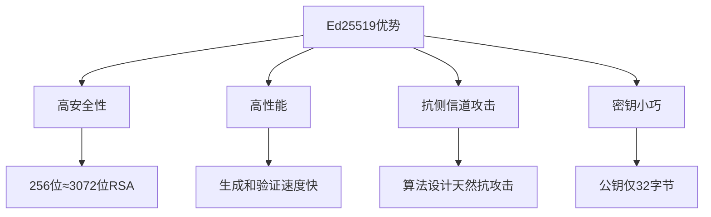
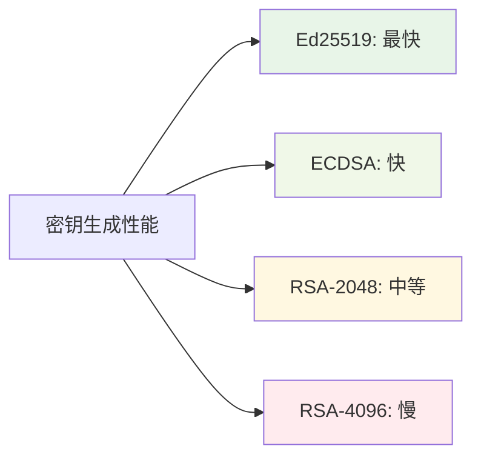
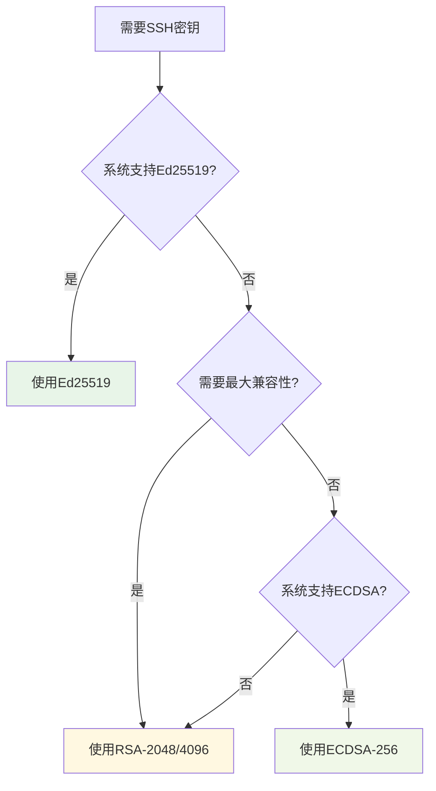
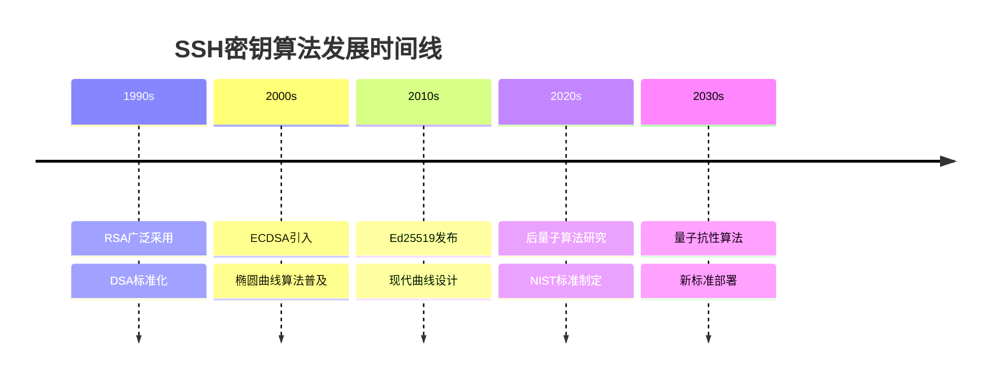
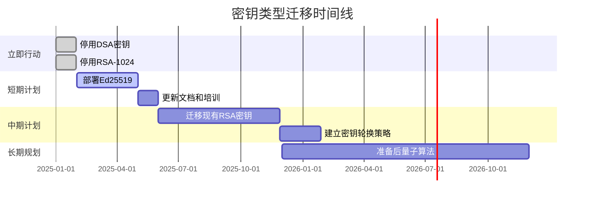

# SSH密钥类型详解

## 概述

SSH支持多种密钥类型，每种都有其特定的优势和适用场景。选择合适的密钥类型对于平衡安全性、性能和兼容性至关重要。

## 支持的密钥类型

### RSA (Rivest-Shamir-Adleman)

RSA是最广泛支持的密钥类型，基于大整数分解的数学难题。

#### 特性
- **算法**: 基于RSA公钥密码系统
- **密钥长度**: 1024, 2048, 3072, 4096位
- **兼容性**: 几乎所有SSH实现都支持
- **性能**: 中等，较大的密钥长度会影响性能

#### 推荐配置
```bash
# 推荐的RSA密钥生成
ssh-keygen -t rsa -b 4096 -C "your_email@example.com"
```

#### 安全建议
- **最小长度**: 2048位（1024位已不安全）
- **推荐长度**: 4096位（高安全要求）
- **过渡方案**: 适合需要广泛兼容性的环境

### DSA (Digital Signature Algorithm)

DSA是较老的数字签名算法，现在不推荐使用。

#### 特性
- **算法**: 基于离散对数问题
- **密钥长度**: 固定1024位
- **兼容性**: 广泛支持但正在淘汰
- **性能**: 较好

#### ⚠️ 重要警告
```
DSA密钥已被认为不安全，不推荐在新系统中使用：
- 固定1024位长度不足以抵御现代攻击
- 许多新版本SSH默认禁用DSA
- 仅用于兼容旧系统
```

### ECDSA (Elliptic Curve DSA)

ECDSA基于椭圆曲线密码学，提供更好的安全性和性能比。

#### 特性
- **算法**: 椭圆曲线数字签名算法
- **密钥长度**: 256, 384, 521位
- **兼容性**: 现代SSH实现广泛支持
- **性能**: 优秀，密钥小但安全性高

#### 支持的曲线

| 曲线名称 | 密钥长度 | 安全等级 | NIST标准 |
|----------|----------|----------|----------|
| prime256v1 | 256位 | 128位对称等价 | P-256 |
| secp384r1 | 384位 | 192位对称等价 | P-384 |
| secp521r1 | 521位 | 260位对称等价 | P-521 |

#### 生成示例
```bash
# ECDSA P-256 (推荐用于一般用途)
ssh-keygen -t ecdsa -b 256 -C "your_email@example.com"

# ECDSA P-384 (高安全要求)
ssh-keygen -t ecdsa -b 384 -C "your_email@example.com"
```

### Ed25519

Ed25519是基于Curve25519椭圆曲线的现代签名算法，被认为是目前最安全和高效的选择。

#### 特性
- **算法**: Edwards曲线数字签名算法
- **密钥长度**: 固定256位
- **兼容性**: OpenSSH 6.5+, 现代系统推荐
- **性能**: 极佳，比RSA和ECDSA更快

#### 优势


#### 生成示例
```bash
# Ed25519密钥生成（强烈推荐）
ssh-keygen -t ed25519 -C "your_email@example.com"
```

## 密钥类型对比

### 综合对比表

| 密钥类型 | 推荐度 | 安全性 | 性能 | 兼容性 | 密钥大小 | 生成速度 |
|----------|--------|--------|------|--------|----------|----------|
| **Ed25519** | ⭐⭐⭐⭐⭐ | 极高 | 极佳 | 现代系统 | 小 | 极快 |
| **ECDSA** | ⭐⭐⭐⭐ | 高 | 优秀 | 良好 | 小 | 快 |
| **RSA** | ⭐⭐⭐ | 中-高* | 中等 | 极佳 | 大 | 慢 |
| **DSA** | ❌ | 低 | 好 | 兼容 | 中 | 快 |

*RSA安全性取决于密钥长度

### 性能对比



### 密钥大小对比

| 类型 | 私钥大小 | 公钥大小 | 指纹长度 |
|------|----------|----------|----------|
| Ed25519 | 32字节 | 32字节 | 43字符 |
| ECDSA-256 | 32字节 | 65字节 | 43字符 |
| RSA-2048 | 256字节 | 256字节 | 43字符 |
| RSA-4096 | 512字节 | 512字节 | 43字符 |

## 选择建议

### 决策流程图



### 使用场景推荐

#### 🎯 新项目/现代环境
```bash
# 首选：Ed25519
ssh-keygen -t ed25519 -C "modern-system@example.com"

# 备选：ECDSA P-256
ssh-keygen -t ecdsa -b 256 -C "modern-system@example.com"
```

#### 🔄 兼容性要求高
```bash
# 选择RSA 2048位（最小安全要求）
ssh-keygen -t rsa -b 2048 -C "compatible-system@example.com"

# 或RSA 4096位（更高安全性）
ssh-keygen -t rsa -b 4096 -C "compatible-system@example.com"
```

#### 🏢 企业环境
```bash
# 高安全要求：Ed25519
ssh-keygen -t ed25519 -C "enterprise-user@company.com"

# 符合FIPS标准：ECDSA P-384
ssh-keygen -t ecdsa -b 384 -C "fips-compliant@company.com"
```

#### ⚡ 高性能要求
```bash
# 最佳性能：Ed25519
ssh-keygen -t ed25519 -C "high-performance@example.com"
```

## 安全考虑

### 密钥强度等价

| SSH密钥类型 | 等价对称密钥强度 | 抗量子计算 |
|-------------|------------------|------------|
| RSA-1024 | ~80位 (不安全) | 否 |
| RSA-2048 | ~112位 | 否 |
| RSA-3072 | ~128位 | 否 |
| RSA-4096 | ~140位 | 否 |
| ECDSA-256 | ~128位 | 否 |
| ECDSA-384 | ~192位 | 否 |
| ECDSA-521 | ~260位 | 否 |
| Ed25519 | ~128位 | 否 |

### 未来发展趋势



### 量子安全考虑

⚠️ **重要提醒**: 
- 当前所有SSH密钥类型都不能抵抗量子计算攻击
- 正在开发后量子密码学标准
- 对于长期安全需求，需要关注NIST后量子标准

## 实际建议

### 2025年推荐策略

1. **新部署**: 优先使用Ed25519
2. **现有系统**: 逐步迁移到Ed25519或ECDSA
3. **兼容性**: 必要时保留RSA-2048/4096
4. **淘汰**: 停止使用DSA和RSA-1024

### 迁移计划



## 下一步

选择了合适的密钥类型后，您可以：

1. **[学习密钥生成](../operations/key-generation.md)** - 详细的密钥生成指南
2. **[了解安全原理](./security-principles.md)** - 深入理解SSH安全机制
3. **[配置SSH客户端](../configuration/client-config.md)** - 开始实际配置

---

🔐 **安全提示**: 无论选择哪种密钥类型，都要确保私钥的安全存储，并定期进行密钥轮换。