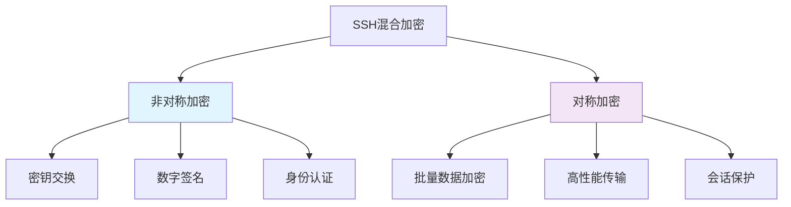
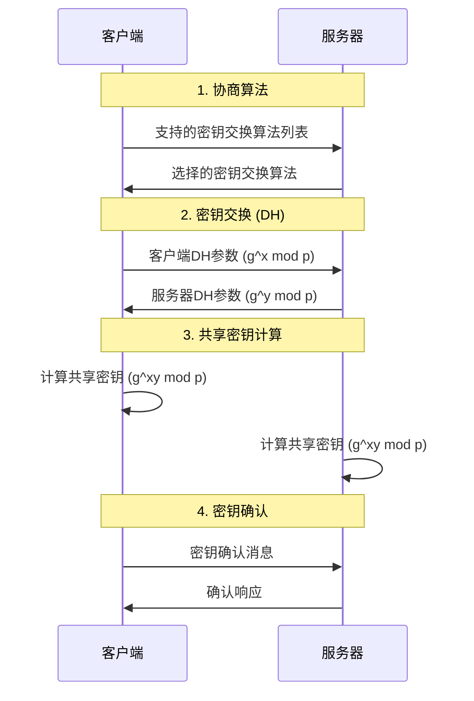
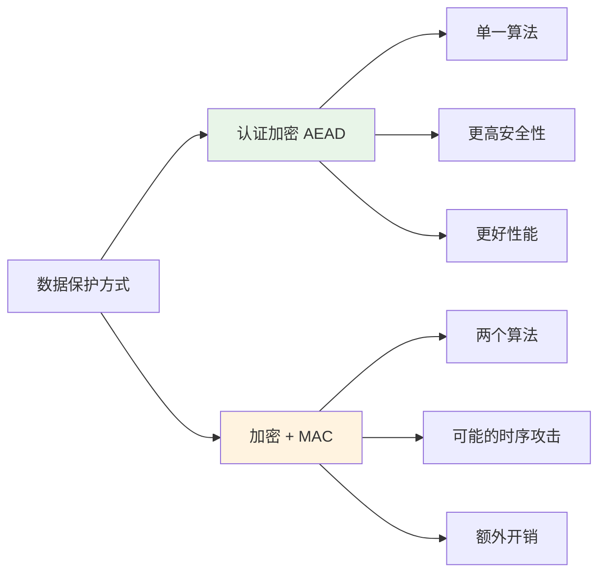
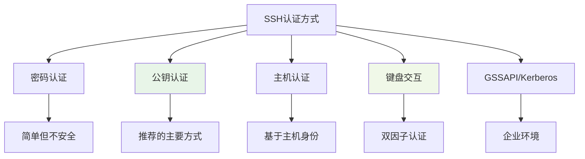
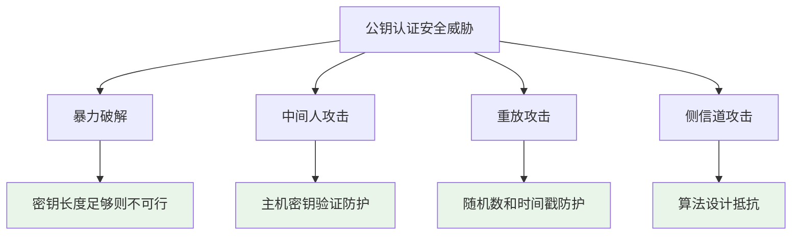
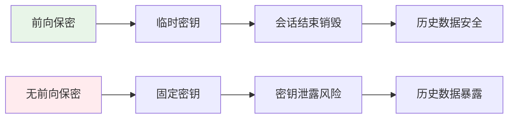
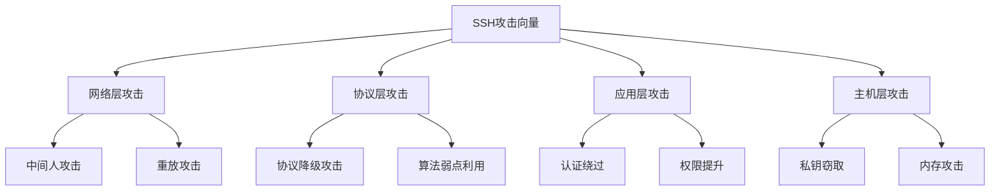

# SSH安全原理

## 概述

SSH的安全性建立在多层防护机制之上，包括加密、认证、完整性验证等。深入理解这些安全原理有助于正确配置和使用SSH系统。

## 加密体系架构

### 混合加密系统

SSH采用混合加密系统，结合对称加密和非对称加密的优势：



### 加密层次结构

| 层次 | 功能 | 算法示例 | 生命周期 |
|------|------|----------|----------|
| **传输层** | 数据流加密 | AES-256-GCM | 会话期间 |
| **认证层** | 身份验证 | RSA, Ed25519 | 密钥轮换周期 |
| **连接层** | 通道复用 | 无额外加密 | 连接期间 |

## 密钥交换机制

### Diffie-Hellman密钥交换

SSH使用Diffie-Hellman算法安全地协商会话密钥：



### 支持的密钥交换算法

#### 推荐算法（按优先级）

1. **curve25519-sha256**: 现代椭圆曲线，最高安全性
2. **ecdh-sha2-nistp256**: NIST P-256曲线
3. **ecdh-sha2-nistp384**: NIST P-384曲线  
4. **diffie-hellman-group16-sha512**: 经典DH，4096位
5. **diffie-hellman-group14-sha256**: 经典DH，2048位

#### 不推荐/不安全的算法

❌ **避免使用**:
- `diffie-hellman-group1-sha1`: 1024位，已被破解
- `diffie-hellman-group14-sha1`: SHA-1哈希已不安全

## 对称加密算法

### 数据加密

会话建立后，所有数据使用对称加密保护：

#### 推荐的对称加密算法

| 算法 | 密钥长度 | 安全性 | 性能 | 备注 |
|------|----------|--------|------|------|
| **aes256-gcm** | 256位 | 极高 | 优秀 | 认证加密(推荐) |
| **aes128-gcm** | 128位 | 高 | 极佳 | 认证加密 |
| **aes256-ctr** | 256位 | 高 | 良好 | 需要额外MAC |
| **aes128-ctr** | 128位 | 中等 | 优秀 | 需要额外MAC |

#### 认证加密 vs 传统加密



## 消息认证

### MAC算法

消息认证码(MAC)确保数据完整性和真实性：

#### 推荐MAC算法

1. **hmac-sha2-256**: SHA-256基础的HMAC
2. **hmac-sha2-512**: SHA-512基础的HMAC  
3. **umac-128**: 高性能MAC算法

### 数字签名

用于主机密钥验证和用户认证：

#### 签名算法对比

| 算法 | 签名大小 | 验证速度 | 安全性 | 推荐度 |
|------|----------|----------|--------|--------|
| **ssh-ed25519** | 64字节 | 极快 | 极高 | ⭐⭐⭐⭐⭐ |
| **ecdsa-sha2-nistp256** | ~70字节 | 快 | 高 | ⭐⭐⭐⭐ |
| **rsa-sha2-256** | 256字节 | 慢 | 中等 | ⭐⭐⭐ |
| **ssh-rsa** | 256字节 | 慢 | 低 | ❌ |

## 身份认证机制

### 多种认证方式

SSH支持多种认证方式，可以组合使用：



### 公钥认证安全性

#### 认证强度分析

公钥认证的安全性基于以下数学难题：

- **RSA**: 大整数分解问题
- **ECDSA**: 椭圆曲线离散对数问题  
- **Ed25519**: Curve25519椭圆曲线问题

#### 攻击抵抗能力



## 安全协议版本

### SSH协议版本比较

| 版本 | 发布年份 | 安全性 | 兼容性 | 状态 |
|------|----------|--------|--------|------|
| **SSH-1** | 1995 | 已被破解 | 部分遗留系统 | 禁用 |
| **SSH-2** | 1997 | 安全 | 广泛支持 | 推荐 |

⚠️ **重要**: SSH-1协议存在设计缺陷，必须禁用。

### SSH-2协议改进

相比SSH-1，SSH-2提供了：

- 更强的加密算法支持
- 更好的完整性保护
- 修复的协议设计缺陷
- 更灵活的认证机制

## 前向保密性

### 概念说明

前向保密性(Perfect Forward Secrecy, PFS)确保即使长期密钥被泄露，历史会话数据仍然安全。



### 实现机制

SSH通过以下方式实现前向保密：

1. **临时密钥交换**: 每次连接生成新的会话密钥
2. **密钥销毁**: 会话结束后立即销毁临时密钥
3. **独立性**: 每个会话使用独立的加密密钥

## 安全配置建议

### 强化配置示例

#### 客户端安全配置
```bash
# ~/.ssh/config
Host *
    # 优先使用安全的密钥交换算法
    KexAlgorithms curve25519-sha256,ecdh-sha2-nistp384,ecdh-sha2-nistp256
    
    # 优先使用安全的主机密钥类型
    HostKeyAlgorithms ssh-ed25519,ecdsa-sha2-nistp384,ecdsa-sha2-nistp256
    
    # 优先使用认证加密
    Ciphers aes256-gcm@openssh.com,aes128-gcm@openssh.com,aes256-ctr
    
    # 强MAC算法
    MACs hmac-sha2-256,hmac-sha2-512
    
    # 禁用不安全的选项
    PubkeyAcceptedKeyTypes -ssh-rsa
```

#### 服务器安全配置
```bash
# /etc/ssh/sshd_config
Protocol 2

# 密钥交换算法
KexAlgorithms curve25519-sha256,ecdh-sha2-nistp384,ecdh-sha2-nistp256

# 主机密钥
HostKey /etc/ssh/ssh_host_ed25519_key
HostKey /etc/ssh/ssh_host_ecdsa_key

# 加密算法
Ciphers aes256-gcm@openssh.com,aes128-gcm@openssh.com,aes256-ctr

# MAC算法
MACs hmac-sha2-256,hmac-sha2-512

# 禁用不安全认证
PasswordAuthentication no
ChallengeResponseAuthentication no
UsePAM no
```

## 安全审计

### 算法强度监控

定期检查SSH配置中使用的算法：

```bash
#!/bin/bash
# SSH算法安全检查脚本

echo "=== SSH客户端算法检查 ==="
ssh -Q kex | grep -E "(group1|sha1)" && echo "警告: 发现不安全的密钥交换算法"
ssh -Q cipher | grep -E "(3des|rc4)" && echo "警告: 发现不安全的加密算法"
ssh -Q mac | grep "sha1" && echo "警告: 发现不安全的MAC算法"

echo "=== SSH服务器配置检查 ==="
sshd -T | grep -i "kexalgorithms" 
sshd -T | grep -i "ciphers"
sshd -T | grep -i "macs"
```

### 连接安全监控

```bash
# 检查活动SSH连接的加密参数
netstat -tnp | grep :22 | while read line; do
    echo "SSH连接: $line"
done
```

## 威胁模型

### 常见攻击场景



### 防护措施

| 攻击类型 | 防护机制 | 配置要求 |
|----------|----------|----------|
| 中间人攻击 | 主机密钥验证 | StrictHostKeyChecking yes |
| 协议降级 | 禁用弱算法 | 移除不安全算法 |
| 暴力破解 | 失败延迟 | LoginGraceTime, MaxAuthTries |
| 私钥泄露 | 密钥轮换 | 定期更新密钥 |

## 下一步

理解了SSH安全原理后，建议继续学习：

1. **[密钥生成最佳实践](../operations/key-generation.md)**
2. **[安全配置指南](../security/security-policies.md)**
3. **[密钥管理策略](../security/key-management.md)**

---

🔒 **安全提醒**: SSH的安全性不仅依赖于协议设计，更需要正确的配置和管理。定期更新和审计配置是确保安全的关键。