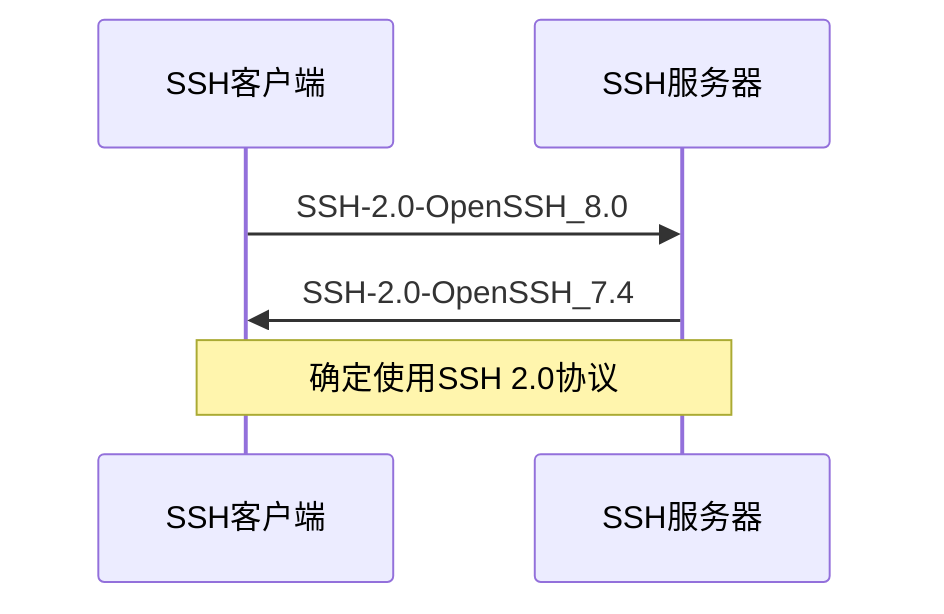
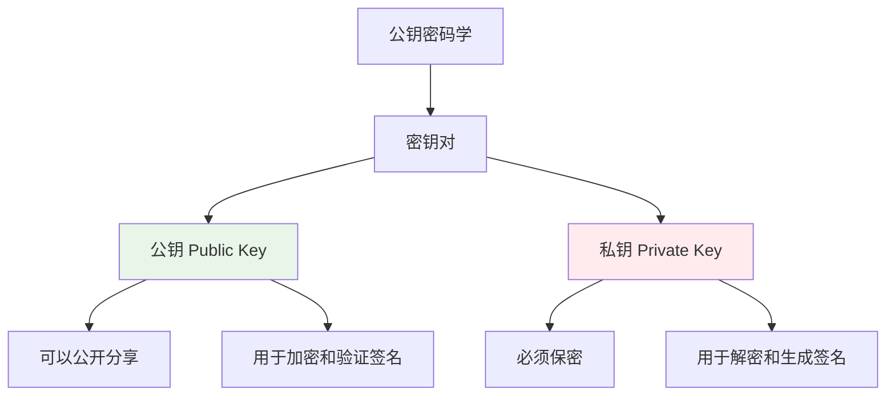
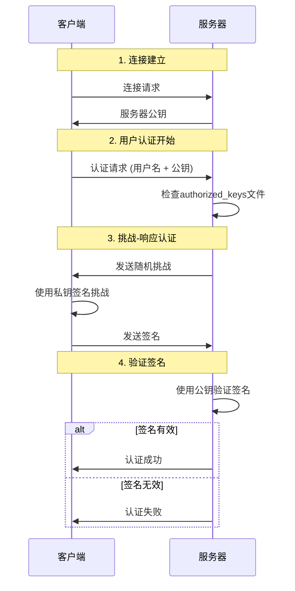
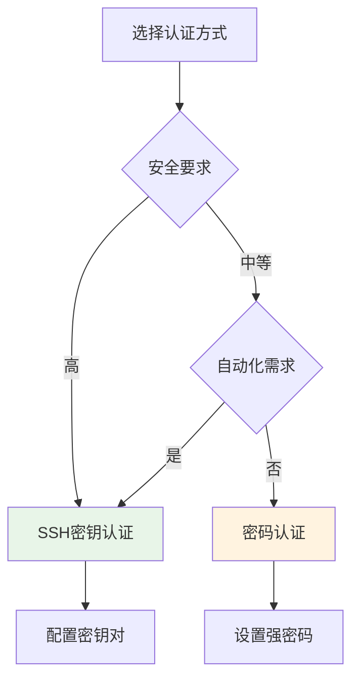

# SSH基础概念

## 什么是SSH

SSH (Secure Shell) 是一种网络协议，用于在不安全的网络上安全地访问远程计算机。它通过加密技术保护数据传输，防止信息被窃听、篡改或伪造。

### SSH的核心特性

- **加密通信**: 所有数据传输都经过加密处理
- **身份验证**: 确保连接双方的身份真实性
- **数据完整性**: 防止数据在传输过程中被篡改
- **端口转发**: 支持安全的端口转发功能

## SSH工作原理

SSH使用客户端-服务器架构，建立连接的过程包括以下几个阶段：

### 1. 协议版本协商

### 2. 密钥交换
服务器和客户端协商会话密钥，用于后续的加密通信。

### 3. 用户认证
客户端向服务器证明其身份，SSH支持多种认证方式：
- **密码认证**: 使用用户名和密码
- **公钥认证**: 使用公私钥对
- **主机认证**: 基于主机的认证
- **多因子认证**: 结合多种认证方式

### 4. 会话建立
认证成功后，建立加密的通信会话。

## 公钥密码学基础

SSH的安全性基于公钥密码学（非对称加密），理解这个概念对SSH密钥管理至关重要。

### 基本概念

### 工作机制

1. **加密通信**:
   - 使用对方的公钥加密数据
   - 只有对应的私钥才能解密

2. **数字签名**:
   - 使用自己的私钥生成签名
   - 任何人都可以用公钥验证签名

### SSH中的应用

在SSH认证中：
- **客户端**持有私钥，用于生成认证签名
- **服务器**存储客户端的公钥，用于验证签名
- 这样既保证了安全性，又避免了密码传输

## SSH认证流程

### 公钥认证详细过程

### 认证过程说明

1. **公钥提交**: 客户端向服务器提交要使用的公钥标识
2. **挑战生成**: 服务器生成随机数据作为挑战
3. **签名生成**: 客户端使用私钥对挑战数据进行签名
4. **签名验证**: 服务器使用公钥验证签名的有效性

## SSH vs 传统登录方式

### 安全性对比

| 特性 | 密码认证 | SSH密钥认证 |
|------|----------|-------------|
| 传输安全 | 密码可能被截获 | 私钥不在网络传输 |
| 暴力破解 | 容易遭受字典攻击 | 几乎不可能破解 |
| 密码复杂度 | 依赖用户选择 | 加密强度可控 |
| 管理便利性 | 需要记忆密码 | 一次配置长期使用 |
| 自动化支持 | 需要交互输入 | 支持无人值守 |

### 使用场景建议

## 最佳实践预览

虽然详细的最佳实践将在后续章节介绍，但以下是一些基础原则：

### 🔐 安全原则
- **最小权限**: 只授予必要的访问权限
- **定期轮换**: 定期更新密钥和密码
- **监控审计**: 记录和监控访问活动

### 🛠️ 管理原则
- **标准化配置**: 使用一致的配置标准
- **文档记录**: 维护详细的配置文档
- **备份恢复**: 建立密钥备份和恢复机制

### 📈 性能原则
- **连接复用**: 使用连接复用减少开销
- **合适算法**: 选择平衡安全性和性能的算法
- **缓存优化**: 合理使用SSH缓存机制

## 下一步

了解了SSH的基础概念后，建议继续学习：

1. **[密钥类型选择](./key-types.md)** - 了解不同密钥类型的特点
2. **[密钥生成指南](../operations/key-generation.md)** - 学习如何生成SSH密钥
3. **[基础配置](../configuration/client-config.md)** - 配置第一个SSH连接

---

💡 **提示**: 如果您是SSH新手，建议按顺序阅读文档。如果遇到问题，可以查看[故障排除指南](../troubleshooting/diagnostic-guide.md)。