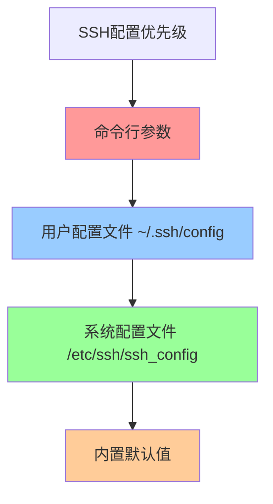

# SSH客户端配置指南

## 概述

SSH客户端配置是优化SSH连接体验和安全性的关键环节。通过合理配置，可以简化连接过程、提高安全性、实现连接复用等功能。本指南详细介绍SSH客户端的各种配置选项和最佳实践。

## 配置文件层次

### 配置优先级

SSH客户端配置遵循以下优先级顺序：



### 配置文件位置

| 配置文件 | 作用范围 | 权限要求 | 典型用途 |
|----------|----------|----------|----------|
| `~/.ssh/config` | 当前用户 | 600 | 个人连接配置 |
| `/etc/ssh/ssh_config` | 系统全局 | 644 | 默认策略配置 |
| 命令行参数 | 单次连接 | N/A | 临时覆盖设置 |

## 基础配置语法

### 配置文件格式

```bash
# ~/.ssh/config 基本格式

# 全局配置（应用于所有主机）
Host *
    ServerAliveInterval 60
    ServerAliveCountMax 3
    
# 特定主机配置
Host myserver
    HostName server.example.com
    User admin
    Port 2222
    IdentityFile ~/.ssh/id_ed25519_work
    
# 模式匹配配置
Host *.internal.com
    User deploy
    IdentityFile ~/.ssh/id_ed25519_internal
    ProxyJump bastion.internal.com
```

### 配置语法规则

- **大小写敏感**: 参数名称区分大小写
- **首次匹配**: 使用第一个匹配的Host条目
- **注释**: 以`#`开头的行为注释
- **空行**: 空行被忽略
- **值类型**: yes/no、数字、字符串等

## 常用配置选项

### 连接基础配置

```bash
# 主机连接配置
Host webserver
    HostName web1.company.com
    User deploy
    Port 22
    
# 使用IP地址
Host database
    HostName 192.168.1.100
    User dbadmin
    Port 3306
    
# 通过跳板机连接
Host internal-server
    HostName 10.0.1.50
    User admin
    ProxyJump bastion.company.com
```

### 身份认证配置

```bash
# 密钥认证配置
Host github.com
    User git
    IdentityFile ~/.ssh/id_ed25519_github
    IdentitiesOnly yes
    
# 多密钥配置
Host work-servers
    HostName *.work.com
    User employee
    IdentityFile ~/.ssh/id_ed25519_work
    IdentityFile ~/.ssh/id_rsa_legacy
    
# 禁用密码认证
Host secure-servers
    HostName *.secure.com
    PasswordAuthentication no
    ChallengeResponseAuthentication no
```

### 连接优化配置

```bash
# 连接保活配置
Host *
    ServerAliveInterval 60
    ServerAliveCountMax 3
    TCPKeepAlive yes
    
# 连接复用配置
Host *
    ControlMaster auto
    ControlPath ~/.ssh/master-%r@%h:%p
    ControlPersist 10m
    
# 压缩配置
Host slow-connection
    HostName remote.slow.com
    Compression yes
    CompressionLevel 6
```

## 高级配置功能

### 连接复用详解

连接复用可以显著提高SSH连接性能：

```bash
# 完整的连接复用配置
Host *
    # 启用连接复用
    ControlMaster auto
    
    # 控制套接字路径
    ControlPath ~/.ssh/master-%r@%h:%p
    
    # 保持连接时间
    ControlPersist 10m
    
    # 共享已有连接
    ControlPersist yes
```

#### 连接复用管理命令

```bash
# 检查活动的主连接
ssh -O check user@hostname

# 退出主连接
ssh -O exit user@hostname

# 强制停止主连接
ssh -O stop user@hostname

# 列出所有控制连接
ls -la ~/.ssh/master-*
```

### 代理和隧道配置

```bash
# HTTP代理配置
Host through-proxy
    HostName target.example.com
    ProxyCommand nc -X connect -x proxy.company.com:8080 %h %p
    
# SOCKS代理配置
Host socks-proxy
    HostName target.example.com
    ProxyCommand nc -X 5 -x socks-proxy.com:1080 %h %p
    
# SSH跳板配置
Host target-through-bastion
    HostName target.internal
    ProxyJump bastion.company.com
    
# 多级跳板配置
Host deep-internal
    HostName app.internal
    ProxyJump bastion1.com,bastion2.internal
```

### 端口转发配置

```bash
# 本地端口转发
Host database-tunnel
    HostName db.company.com
    LocalForward 3306 localhost:3306
    User dbuser
    
# 远程端口转发
Host web-reverse-tunnel
    HostName web.company.com
    RemoteForward 8080 localhost:80
    User webuser
    
# 动态端口转发（SOCKS代理）
Host socks-tunnel
    HostName proxy.company.com
    DynamicForward 1080
    User proxyuser
```

## 安全配置强化

### 算法和加密配置

```bash
# 强化的安全配置
Host secure-*
    # 密钥交换算法
    KexAlgorithms curve25519-sha256,ecdh-sha2-nistp384,ecdh-sha2-nistp256
    
    # 主机密钥算法
    HostKeyAlgorithms ssh-ed25519,ecdsa-sha2-nistp384,ecdsa-sha2-nistp256
    
    # 对称加密算法
    Ciphers aes256-gcm@openssh.com,aes128-gcm@openssh.com,aes256-ctr
    
    # MAC算法
    MACs hmac-sha2-256,hmac-sha2-512
    
    # 公钥算法
    PubkeyAcceptedKeyTypes ssh-ed25519,ecdsa-sha2-nistp384,ecdsa-sha2-nistp256
```

### 主机验证配置

```bash
# 严格主机密钥检查
Host production-*
    StrictHostKeyChecking yes
    UserKnownHostsFile ~/.ssh/known_hosts
    
# 开发环境宽松配置
Host dev-*
    StrictHostKeyChecking accept-new
    UserKnownHostsFile ~/.ssh/known_hosts_dev
    
# 测试环境跳过验证（不推荐）
Host test-*
    StrictHostKeyChecking no
    UserKnownHostsFile /dev/null
```

## 环境特定配置

### 个人开发者配置

```bash
# ~/.ssh/config - 个人开发者示例

# 全局默认配置
Host *
    ServerAliveInterval 60
    ServerAliveCountMax 3
    ControlMaster auto
    ControlPath ~/.ssh/master-%r@%h:%p
    ControlPersist 10m
    
# GitHub配置
Host github.com
    User git
    IdentityFile ~/.ssh/id_ed25519_github
    IdentitiesOnly yes
    
# GitLab配置
Host gitlab.com
    User git
    IdentityFile ~/.ssh/id_ed25519_gitlab
    IdentitiesOnly yes
    
# 个人服务器
Host vps
    HostName myserver.example.com
    User admin
    Port 2222
    IdentityFile ~/.ssh/id_ed25519_personal
    
# 开发环境
Host dev
    HostName dev.myproject.com
    User developer
    IdentityFile ~/.ssh/id_ed25519_dev
    LocalForward 3000 localhost:3000
    LocalForward 5432 localhost:5432
```

### 企业环境配置

```bash
# ~/.ssh/config - 企业环境示例

# 全局安全策略
Host *
    ServerAliveInterval 30
    ServerAliveCountMax 3
    StrictHostKeyChecking yes
    IdentitiesOnly yes
    
# 生产环境配置
Host prod-*
    User deploy
    IdentityFile ~/.ssh/id_ed25519_prod
    ProxyJump bastion.company.com
    KexAlgorithms curve25519-sha256,ecdh-sha2-nistp384
    Ciphers aes256-gcm@openssh.com,aes256-ctr
    
# 测试环境配置  
Host staging-*
    User staging
    IdentityFile ~/.ssh/id_ed25519_staging
    ProxyJump bastion-staging.company.com
    
# 开发环境配置
Host dev-*
    User developer
    IdentityFile ~/.ssh/id_ed25519_dev
    
# 跳板机配置
Host bastion.company.com
    User $(whoami)
    IdentityFile ~/.ssh/id_ed25519_bastion
    ControlMaster yes
    ControlPersist 8h
```

### 多身份管理配置

```bash
# 个人和工作身份分离
Host personal-*
    User personal
    IdentityFile ~/.ssh/id_ed25519_personal
    IdentitiesOnly yes
    
Host work-*
    User employee
    IdentityFile ~/.ssh/id_ed25519_work
    IdentitiesOnly yes
    
# 不同项目使用不同密钥
Host project1-*
    IdentityFile ~/.ssh/id_ed25519_project1
    User project1-user
    
Host project2-*
    IdentityFile ~/.ssh/id_ed25519_project2
    User project2-user
```

## 配置管理和维护

### 配置验证和测试

```bash
#!/bin/bash
# SSH配置验证脚本

# 检查配置文件语法
check_config_syntax() {
    echo "检查SSH配置语法..."
    
    if ssh -F ~/.ssh/config -T git@github.com 2>&1 | grep -q "syntax error"; then
        echo "❌ 配置文件语法错误"
        return 1
    else
        echo "✅ 配置文件语法正确"
        return 0
    fi
}

# 测试连接配置
test_connections() {
    local test_hosts=("github.com" "work-server" "dev-env")
    
    echo "测试连接配置..."
    
    for host in "${test_hosts[@]}"; do
        echo -n "测试 $host: "
        
        if ssh -F ~/.ssh/config -o BatchMode=yes -o ConnectTimeout=5 \
           "$host" 'exit 0' 2>/dev/null; then
            echo "✅ 连接成功"
        else
            echo "❌ 连接失败"
        fi
    done
}

# 检查文件权限
check_permissions() {
    echo "检查SSH文件权限..."
    
    local ssh_dir="$HOME/.ssh"
    local config_file="$ssh_dir/config"
    
    # 检查.ssh目录权限
    local dir_perms=$(stat -c "%a" "$ssh_dir" 2>/dev/null)
    if [[ "$dir_perms" == "700" ]]; then
        echo "✅ .ssh目录权限正确 (700)"
    else
        echo "❌ .ssh目录权限错误 ($dir_perms)，应该是700"
    fi
    
    # 检查config文件权限
    if [[ -f "$config_file" ]]; then
        local file_perms=$(stat -c "%a" "$config_file")
        if [[ "$file_perms" == "600" ]]; then
            echo "✅ config文件权限正确 (600)"
        else
            echo "❌ config文件权限错误 ($file_perms)，应该是600"
        fi
    fi
}

# 显示有效配置
show_effective_config() {
    local host="$1"
    
    echo "主机 $host 的有效配置:"
    ssh -F ~/.ssh/config -G "$host" | head -20
}

# 主程序
main() {
    echo "SSH客户端配置验证工具"
    echo "======================"
    
    check_config_syntax
    echo ""
    
    check_permissions  
    echo ""
    
    test_connections
    echo ""
    
    if [[ -n "$1" ]]; then
        show_effective_config "$1"
    fi
}

main "$@"
```

### 配置备份和同步

```bash
#!/bin/bash
# SSH配置备份和同步脚本

SSH_DIR="$HOME/.ssh"
BACKUP_DIR="$HOME/.ssh-backups"
CONFIG_REPO="git@github.com:username/ssh-configs.git"

# 备份SSH配置
backup_ssh_config() {
    local backup_date=$(date +%Y%m%d_%H%M%S)
    local backup_path="$BACKUP_DIR/ssh-config-$backup_date"
    
    echo "备份SSH配置到: $backup_path"
    
    mkdir -p "$backup_path"
    
    # 备份配置文件
    cp "$SSH_DIR/config" "$backup_path/" 2>/dev/null
    cp "$SSH_DIR/known_hosts" "$backup_path/" 2>/dev/null
    
    # 备份公钥文件
    cp "$SSH_DIR"/*.pub "$backup_path/" 2>/dev/null
    
    # 创建备份清单
    ls -la "$SSH_DIR" > "$backup_path/file_list.txt"
    
    echo "备份完成: $backup_path"
}

# 同步配置到Git仓库
sync_to_git() {
    local git_dir="$HOME/.ssh-config-repo"
    
    if [[ ! -d "$git_dir" ]]; then
        echo "克隆配置仓库..."
        git clone "$CONFIG_REPO" "$git_dir"
    fi
    
    cd "$git_dir"
    
    # 复制配置文件（排除私钥）
    cp "$SSH_DIR/config" ./
    cp "$SSH_DIR"/*.pub ./ 2>/dev/null
    
    # 提交更改
    git add .
    git commit -m "更新SSH配置 - $(date)"
    git push origin main
    
    echo "配置已同步到Git仓库"
}

# 从Git仓库恢复配置
restore_from_git() {
    local git_dir="$HOME/.ssh-config-repo"
    
    if [[ ! -d "$git_dir" ]]; then
        echo "克隆配置仓库..."
        git clone "$CONFIG_REPO" "$git_dir"
    fi
    
    cd "$git_dir"
    git pull origin main
    
    # 恢复配置文件
    cp config "$SSH_DIR/"
    cp *.pub "$SSH_DIR/" 2>/dev/null
    
    # 设置正确权限
    chmod 600 "$SSH_DIR/config"
    chmod 644 "$SSH_DIR"/*.pub
    
    echo "配置已从Git仓库恢复"
}

case "$1" in
    "backup")
        backup_ssh_config
        ;;
    "sync")
        sync_to_git
        ;;
    "restore")
        restore_from_git
        ;;
    *)
        echo "用法: $0 {backup|sync|restore}"
        exit 1
        ;;
esac
```

## 故障排除

### 常见配置问题

| 问题 | 症状 | 解决方案 |
|------|------|----------|
| 配置不生效 | 设置被忽略 | 检查Host顺序和匹配规则 |
| 权限错误 | Permission denied | 设置config文件权限为600 |
| 密钥不匹配 | Authentication failed | 验证IdentityFile路径 |
| 连接超时 | Connection timeout | 检查ProxyJump和网络 |

### 调试配置问题

```bash
# 详细调试连接过程
ssh -vvv -F ~/.ssh/config hostname

# 显示有效配置
ssh -G hostname

# 测试特定配置文件
ssh -F /path/to/test/config hostname

# 忽略配置文件
ssh -F /dev/null hostname
```

## 最佳实践总结

### 配置组织建议

1. **分层配置**: 全局默认 + 特定配置
2. **模式匹配**: 使用通配符简化配置
3. **安全优先**: 默认采用最安全设置
4. **文档化**: 添加注释说明配置用途

### 维护建议

1. **定期备份**: 备份重要配置文件
2. **版本控制**: 使用Git管理配置变更
3. **定期审查**: 清理无用配置条目
4. **测试验证**: 验证配置更改效果

## 下一步

完成客户端配置后，建议继续学习：

1. **[服务端配置](./server-config.md)** - 配置SSH服务器
2. **[连接管理](./connection-management.md)** - 管理多个连接
3. **[安全策略](../security/security-policies.md)** - 实施安全策略

---

⚙️ **配置提醒**: 
- 始终验证配置更改的效果
- 保持配置文件的整洁和文档化
- 定期审查和更新安全设置
- 备份重要的配置文件