# SSH密钥部署指南

## 概述

密钥部署是将生成的公钥安全地安装到目标服务器的过程。正确的部署确保了SSH连接的安全性和可用性。本指南涵盖了各种部署方法和最佳实践。

## 部署基础

### 目标文件位置

SSH公钥需要部署到服务器的特定位置：

```bash
# 默认位置
~/.ssh/authorized_keys

# 系统级位置（管理员账户）
/etc/ssh/authorized_keys/username

# 自定义位置（需要在sshd_config中配置）
/custom/path/authorized_keys
```

### 文件权限要求

正确的权限设置对SSH安全至关重要：

```bash
# SSH目录权限
chmod 700 ~/.ssh

# authorized_keys文件权限
chmod 600 ~/.ssh/authorized_keys

# 用户目录权限（父目录也需要正确权限）
chmod 755 ~
```

## 自动化部署方法

### 使用ssh-copy-id（推荐）

`ssh-copy-id`是最简单和安全的部署方法：

#### 基本用法

```bash
# 部署默认密钥
ssh-copy-id user@server.com

# 指定特定密钥文件
ssh-copy-id -i ~/.ssh/id_ed25519.pub user@server.com

# 指定端口
ssh-copy-id -i ~/.ssh/id_ed25519.pub -p 2222 user@server.com

# 强制覆盖（谨慎使用）
ssh-copy-id -f -i ~/.ssh/id_ed25519.pub user@server.com
```

#### 批量部署脚本

```bash
#!/bin/bash
# 批量密钥部署脚本

SERVERS=(
    "web1.example.com"
    "web2.example.com"
    "db1.example.com"
    "cache1.example.com"
)

KEY_FILE="$HOME/.ssh/id_ed25519.pub"
USERNAME="deploy"

echo "开始批量部署SSH密钥..."

for server in "${SERVERS[@]}"; do
    echo "部署到: $server"
    
    if ssh-copy-id -i "$KEY_FILE" "$USERNAME@$server"; then
        echo "✓ 成功部署到 $server"
    else
        echo "✗ 部署失败: $server"
    fi
    
    echo "---"
done

echo "批量部署完成！"
```

### 手动部署方法

当无法使用`ssh-copy-id`时的替代方案：

#### 方法1：使用SSH命令

```bash
# 将公钥内容追加到authorized_keys
cat ~/.ssh/id_ed25519.pub | ssh user@server.com 'mkdir -p ~/.ssh && cat >> ~/.ssh/authorized_keys'

# 设置正确权限
ssh user@server.com 'chmod 700 ~/.ssh && chmod 600 ~/.ssh/authorized_keys'
```

#### 方法2：使用SCP

```bash
# 复制公钥文件到服务器
scp ~/.ssh/id_ed25519.pub user@server.com:~/temp_key.pub

# 登录服务器配置
ssh user@server.com
mkdir -p ~/.ssh
cat ~/temp_key.pub >> ~/.ssh/authorized_keys
chmod 700 ~/.ssh
chmod 600 ~/.ssh/authorized_keys
rm ~/temp_key.pub
```

#### 方法3：直接编辑

```bash
# 在服务器上直接编辑authorized_keys
ssh user@server.com
vi ~/.ssh/authorized_keys

# 将公钥内容粘贴到文件中
# 保存并设置权限
chmod 600 ~/.ssh/authorized_keys
```

## 高级部署配置

### 密钥选项配置

在`authorized_keys`文件中，可以为每个公钥设置特定选项：

#### 基本选项语法

```bash
# 格式：选项1,选项2,... ssh-keytype AAAAB3N... comment
command="/usr/bin/validate-rsync",no-port-forwarding ssh-ed25519 AAAAB3NzaC1lZ... user@example.com
```

#### 常用安全选项

```bash
# 限制来源IP
from="192.168.1.0/24,10.0.0.0/8" ssh-ed25519 AAAAB3NzaC1lZ... trusted@example.com

# 禁用端口转发
no-port-forwarding ssh-ed25519 AAAAB3NzaC1lZ... noforward@example.com

# 禁用X11转发
no-X11-forwarding ssh-ed25519 AAAAB3NzaC1lZ... nox11@example.com

# 禁用代理转发
no-agent-forwarding ssh-ed25519 AAAAB3NzaC1lZ... noagent@example.com

# 强制命令执行
command="/usr/local/bin/backup.sh" ssh-ed25519 AAAAB3NzaC1lZ... backup@example.com

# 组合多个选项
from="192.168.1.100",command="/usr/bin/rsync",no-port-forwarding,no-X11-forwarding ssh-ed25519 AAAAB3NzaC1lZ... rsync@example.com
```

### 密钥选项详解

| 选项 | 功能 | 使用场景 |
|------|------|----------|
| `from="pattern"` | 限制连接来源 | IP白名单控制 |
| `command="cmd"` | 强制执行特定命令 | 自动化脚本、备份 |
| `no-port-forwarding` | 禁用端口转发 | 限制功能的服务账户 |
| `no-X11-forwarding` | 禁用X11转发 | 服务器环境 |
| `no-agent-forwarding` | 禁用代理转发 | 增强安全性 |
| `no-pty` | 禁用伪终端分配 | 仅执行命令的账户 |
| `environment="VAR=value"` | 设置环境变量 | 自定义执行环境 |

### 专用场景配置

#### 备份专用密钥

```bash
# ~/.ssh/authorized_keys
command="/usr/local/bin/backup.sh",no-port-forwarding,no-X11-forwarding,no-agent-forwarding,no-pty ssh-ed25519 AAAAB3NzaC1lZ... backup@example.com
```

#### Git服务器密钥

```bash
# ~/.ssh/authorized_keys  
command="/usr/bin/git-shell -c \"$SSH_ORIGINAL_COMMAND\"",no-port-forwarding,no-X11-forwarding ssh-ed25519 AAAAB3NzaC1lZ... git@example.com
```

#### 监控系统密钥

```bash
# ~/.ssh/authorized_keys
from="monitor.example.com",command="/usr/local/bin/check-status.sh",no-port-forwarding,no-pty ssh-ed25519 AAAAB3NzaC1lZ... monitor@example.com
```

## 企业级部署策略

### 中央化密钥管理

#### LDAP集成部署

```bash
#!/bin/bash
# LDAP SSH密钥同步脚本

LDAP_SERVER="ldap.company.com"
LDAP_BASE="ou=people,dc=company,dc=com"
SSH_KEYS_DIR="/etc/ssh/authorized_keys"

# 从LDAP获取用户SSH密钥
get_user_keys() {
    local username="$1"
    ldapsearch -x -H "ldap://$LDAP_SERVER" \
               -b "$LDAP_BASE" \
               "(uid=$username)" \
               sshPublicKey | \
    grep "sshPublicKey:" | \
    sed 's/^sshPublicKey: //'
}

# 更新用户authorized_keys
update_user_keys() {
    local username="$1"
    local keys_file="$SSH_KEYS_DIR/$username"
    
    # 创建临时文件
    temp_file=$(mktemp)
    
    # 获取LDAP中的密钥
    get_user_keys "$username" > "$temp_file"
    
    if [[ -s "$temp_file" ]]; then
        # 更新密钥文件
        mv "$temp_file" "$keys_file"
        chmod 600 "$keys_file"
        chown root:root "$keys_file"
        echo "✓ 更新用户 $username 的SSH密钥"
    else
        echo "✗ 未找到用户 $username 的SSH密钥"
        rm -f "$temp_file"
    fi
}

# 同步所有用户
sync_all_users() {
    # 获取所有用户列表
    ldapsearch -x -H "ldap://$LDAP_SERVER" \
               -b "$LDAP_BASE" \
               "(objectClass=posixAccount)" \
               uid | \
    grep "^uid:" | \
    cut -d' ' -f2 | \
    while read username; do
        update_user_keys "$username"
    done
}

# 执行同步
sync_all_users
```

### 配置管理工具部署

#### Ansible密钥部署

```yaml
# ansible-playbook ssh-keys.yml
- name: Deploy SSH Keys
  hosts: all
  become: yes
  vars:
    ssh_users:
      - name: admin
        keys:
          - "ssh-ed25519 AAAAC3NzaC1lZDI1NTE5... admin@company.com"
      - name: deploy
        keys:
          - "ssh-ed25519 AAAAC3NzaC1lZDI1NTE5... deploy@company.com"
          - "ssh-rsa AAAAB3NzaC1yc2EAAAA... deploy-legacy@company.com"

  tasks:
    - name: Create SSH directory
      file:
        path: "/home/{{ item.name }}/.ssh"
        state: directory
        owner: "{{ item.name }}"
        group: "{{ item.name }}"
        mode: '0700'
      loop: "{{ ssh_users }}"

    - name: Deploy SSH public keys
      authorized_key:
        user: "{{ item.0.name }}"
        key: "{{ item.1 }}"
        state: present
      with_subelements:
        - "{{ ssh_users }}"
        - keys
```

#### Chef密钥部署

```ruby
# cookbooks/ssh_keys/recipes/default.rb
ssh_users = data_bag('ssh_users')

ssh_users.each do |user_id|
  user_data = data_bag_item('ssh_users', user_id)
  
  directory "/home/#{user_data['username']}/.ssh" do
    owner user_data['username']
    group user_data['username']
    mode '0700'
  end
  
  user_data['ssh_keys'].each do |key_data|
    ssh_authorized_keys user_data['username'] do
      user user_data['username']
      key key_data['public_key']
      options key_data['options'] if key_data['options']
    end
  end
end
```

## 部署验证

### 连接测试

```bash
#!/bin/bash
# SSH连接测试脚本

test_ssh_connection() {
    local user="$1"
    local host="$2"
    local key_file="$3"
    local port="${4:-22}"
    
    echo "测试连接: $user@$host:$port (使用密钥: $key_file)"
    
    # 测试连接
    if ssh -i "$key_file" -p "$port" -o BatchMode=yes -o ConnectTimeout=10 "$user@$host" 'echo "SSH连接成功"' 2>/dev/null; then
        echo "✓ 连接成功"
        return 0
    else
        echo "✗ 连接失败"
        return 1
    fi
}

# 测试配置
TESTS=(
    "admin server1.example.com ~/.ssh/id_ed25519 22"
    "deploy server2.example.com ~/.ssh/id_ed25519_deploy 2222"
    "backup backup.example.com ~/.ssh/id_rsa_backup 22"
)

echo "开始SSH连接测试..."

failed_tests=0
for test_config in "${TESTS[@]}"; do
    read -r user host key_file port <<< "$test_config"
    
    if ! test_ssh_connection "$user" "$host" "$key_file" "$port"; then
        ((failed_tests++))
    fi
    echo "---"
done

if [[ $failed_tests -eq 0 ]]; then
    echo "✓ 所有测试通过！"
    exit 0
else
    echo "✗ $failed_tests 个测试失败"
    exit 1
fi
```

### 部署状态检查

```bash
#!/bin/bash
# 检查密钥部署状态

check_key_deployment() {
    local user="$1"
    local host="$2"
    local expected_keys="$3"
    
    echo "检查 $user@$host 的密钥部署状态"
    
    # 获取服务器上的authorized_keys
    actual_keys=$(ssh "$user@$host" 'cat ~/.ssh/authorized_keys 2>/dev/null | wc -l')
    
    if [[ "$actual_keys" -eq "$expected_keys" ]]; then
        echo "✓ 密钥数量正确 ($actual_keys/$expected_keys)"
    else
        echo "✗ 密钥数量不匹配 ($actual_keys/$expected_keys)"
    fi
    
    # 检查文件权限
    permissions=$(ssh "$user@$host" 'stat -c "%a" ~/.ssh/authorized_keys 2>/dev/null')
    if [[ "$permissions" == "600" ]]; then
        echo "✓ 文件权限正确 (600)"
    else
        echo "✗ 文件权限错误 ($permissions，应该是600)"
    fi
}

# 部署检查配置
declare -A DEPLOYMENTS=(
    ["admin@server1.example.com"]=2
    ["deploy@server2.example.com"]=1
    ["backup@backup.example.com"]=1
)

for deployment in "${!DEPLOYMENTS[@]}"; do
    check_key_deployment "$deployment" "${DEPLOYMENTS[$deployment]}"
    echo "---"
done
```

## 故障排除

### 常见部署问题

| 问题 | 可能原因 | 解决方案 |
|------|----------|----------|
| ssh-copy-id失败 | 密码认证被禁用 | 手动部署或临时启用密码认证 |
| 权限错误 | 文件/目录权限不正确 | 检查并修复权限 |
| 密钥不生效 | SELinux/AppArmor阻止 | 检查安全策略 |
| 连接仍要求密码 | authorized_keys文件损坏 | 重新部署密钥 |

### 调试部署问题

```bash
# 详细调试SSH连接
ssh -vvv -i ~/.ssh/id_ed25519 user@server.com

# 检查服务器端SSH配置
ssh user@server.com 'sudo sshd -T | grep -i "pubkey\|authorized"'

# 检查authorized_keys文件完整性
ssh user@server.com 'ssh-keygen -l -f ~/.ssh/authorized_keys'
```

## 安全最佳实践

### 部署前检查清单

- [ ] 验证公钥文件完整性
- [ ] 确认目标服务器身份
- [ ] 检查网络连接安全性
- [ ] 准备回滚方案

### 部署后验证清单

- [ ] 测试SSH密钥认证
- [ ] 验证文件权限设置
- [ ] 确认密钥选项生效
- [ ] 禁用密码认证（如适用）

### 企业部署建议

```mermaid
graph TD
    A[密钥部署流程] --> B[开发环境测试]
    B --> C[预生产验证]
    C --> D[生产环境部署]
    
    B --> B1[功能测试]
    B --> B2[权限验证]
    
    C --> C1[完整性测试]
    C --> C2[性能测试]
    
    D --> D1[逐步部署]
    D --> D2[监控验证]
    D --> D3[回滚准备]
    
    style D fill:#e8f5e8
```



## 下一步

成功部署密钥后，建议继续：

1. **[SSH客户端配置](../configuration/client-config.md)** - 优化SSH客户端设置
2. **[连接管理](../configuration/connection-management.md)** - 管理多个SSH连接
3. **[安全加固](../security/security-policies.md)** - 实施安全策略

---

🔐 **安全提醒**: 
- 定期审计已部署的密钥
- 及时清理不再使用的密钥
- 监控异常的SSH连接活动
- 建立密钥轮换流程