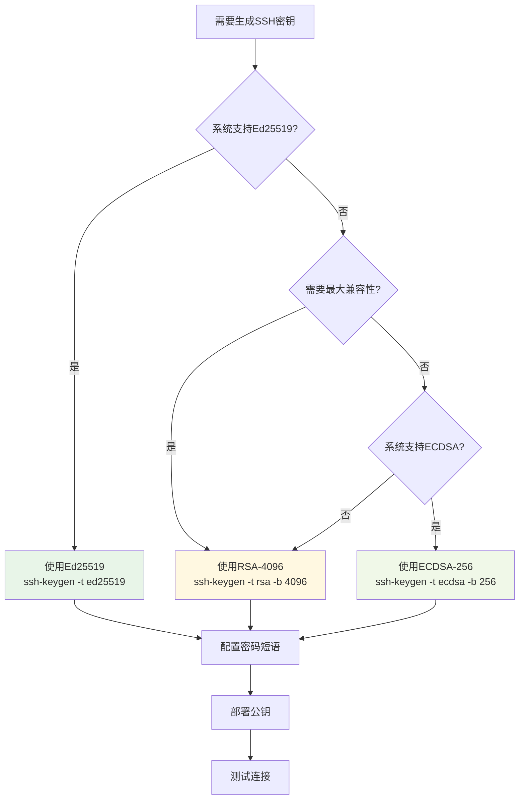

# SSH密钥生成指南

## 概述

SSH密钥生成是SSH配置的第一步，也是最关键的一步。正确生成强密钥对确保了后续所有操作的安全基础。本指南将详细介绍各种密钥类型的生成方法和最佳实践。

## 基础密钥生成

### ssh-keygen 命令基础

`ssh-keygen` 是SSH密钥生成的标准工具：

```bash
# 基本语法
ssh-keygen [选项] [参数]

# 常用选项
-t    指定密钥类型 (rsa, dsa, ecdsa, ed25519)
-b    指定密钥长度
-C    添加注释 (通常是邮箱地址)
-f    指定密钥文件名
-N    指定密码短语
-q    静默模式
```

### 快速开始

#### 1. 默认密钥生成（推荐新手）

```bash
# 生成默认类型密钥（通常是RSA-3072或Ed25519）
ssh-keygen

# 交互式提示：
# Generating public/private rsa key pair.
# Enter file in which to save the key (/home/user/.ssh/id_rsa): [回车]
# Enter passphrase (empty for no passphrase): [输入密码或回车]
# Enter same passphrase again: [再次输入密码]
```

#### 2. 推荐的现代密钥生成

```bash
# Ed25519密钥（强烈推荐）
ssh-keygen -t ed25519 -C "your_email@example.com"

# 或者指定文件名
ssh-keygen -t ed25519 -f ~/.ssh/id_ed25519_work -C "work@company.com"
```

## 各类型密钥详细生成

### Ed25519密钥（推荐）

Ed25519是当前最推荐的密钥类型，提供最佳的安全性和性能平衡。

#### 标准生成

```bash
# 基础生成
ssh-keygen -t ed25519 -C "your_email@example.com"

# 指定文件名和注释
ssh-keygen -t ed25519 -f ~/.ssh/id_ed25519_personal -C "personal@example.com"

# 非交互式生成（脚本中使用）
ssh-keygen -t ed25519 -f ~/.ssh/id_ed25519_auto -N "your_passphrase" -C "auto@example.com"
```

#### 高安全性生成

```bash
# 使用强密码短语
ssh-keygen -t ed25519 -f ~/.ssh/id_ed25519_secure -C "secure@example.com"
# 提示时输入复杂密码短语

# 验证生成的密钥
ssh-keygen -l -f ~/.ssh/id_ed25519_secure.pub
```

### ECDSA密钥

ECDSA提供良好的安全性和兼容性，适合需要广泛兼容性的环境。

#### 不同曲线生成

```bash
# P-256曲线（推荐用于一般用途）
ssh-keygen -t ecdsa -b 256 -C "ecdsa256@example.com"

# P-384曲线（高安全要求）
ssh-keygen -t ecdsa -b 384 -C "ecdsa384@example.com"

# P-521曲线（最高安全等级）
ssh-keygen -t ecdsa -b 521 -C "ecdsa521@example.com"
```

#### 企业环境配置

```bash
# 符合FIPS标准的ECDSA密钥
ssh-keygen -t ecdsa -b 384 -f ~/.ssh/id_ecdsa_fips -C "fips-compliant@company.com"

# 验证FIPS兼容性
ssh-keygen -l -v -f ~/.ssh/id_ecdsa_fips.pub
```

### RSA密钥

RSA密钥具有最佳的兼容性，适合需要支持旧系统的环境。

#### 推荐配置

```bash
# RSA-2048（最小安全要求）
ssh-keygen -t rsa -b 2048 -C "rsa2048@example.com"

# RSA-4096（推荐用于高安全要求）
ssh-keygen -t rsa -b 4096 -C "rsa4096@example.com"

# 快速生成（跳过密码短语）
ssh-keygen -t rsa -b 4096 -f ~/.ssh/id_rsa_quick -N "" -C "quick@example.com"
```

#### 兼容性考虑

```bash
# 为旧系统生成兼容性密钥
ssh-keygen -t rsa -b 2048 -f ~/.ssh/id_rsa_legacy -C "legacy-system@example.com"

# 生成时指定旧的密钥格式（如果需要）
ssh-keygen -t rsa -b 2048 -m PEM -f ~/.ssh/id_rsa_pem -C "pem-format@example.com"
```

## 高级生成选项

### 密码短语管理

密码短语为私钥提供额外的安全层：

```bash
# 生成时设置密码短语
ssh-keygen -t ed25519 -f ~/.ssh/id_ed25519_protected -C "protected@example.com"

# 为现有密钥添加/修改密码短语
ssh-keygen -p -f ~/.ssh/id_ed25519_protected

# 移除密码短语（不推荐）
ssh-keygen -p -f ~/.ssh/id_ed25519_protected -N ""
```

### 密钥文件命名策略

建议使用有意义的文件名来管理多个密钥：

```bash
# 按用途命名
ssh-keygen -t ed25519 -f ~/.ssh/id_ed25519_work -C "work@company.com"
ssh-keygen -t ed25519 -f ~/.ssh/id_ed25519_personal -C "personal@example.com"
ssh-keygen -t ed25519 -f ~/.ssh/id_ed25519_github -C "github@example.com"

# 按环境命名
ssh-keygen -t ed25519 -f ~/.ssh/id_ed25519_production -C "prod@company.com"
ssh-keygen -t ed25519 -f ~/.ssh/id_ed25519_staging -C "staging@company.com"
ssh-keygen -t ed25519 -f ~/.ssh/id_ed25519_development -C "dev@company.com"
```

### 批量生成脚本

对于需要生成多个密钥的场景：

```bash
#!/bin/bash
# 批量密钥生成脚本

KEYS_DIR="$HOME/.ssh"
EMAIL_BASE="user@company.com"

# 密钥配置数组
declare -A KEYS=(
    ["work_ed25519"]="ed25519"
    ["personal_rsa"]="rsa:4096"
    ["github_ed25519"]="ed25519"
    ["server_ecdsa"]="ecdsa:384"
)

for key_name in "${!KEYS[@]}"; do
    IFS=':' read -r type length <<< "${KEYS[$key_name]}"
    
    echo "生成密钥: $key_name ($type)"
    
    if [[ "$type" == "ed25519" ]]; then
        ssh-keygen -t ed25519 -f "$KEYS_DIR/id_${key_name}" -N "" -C "$key_name@$EMAIL_BASE"
    elif [[ "$type" == "rsa" ]]; then
        ssh-keygen -t rsa -b "$length" -f "$KEYS_DIR/id_${key_name}" -N "" -C "$key_name@$EMAIL_BASE"
    elif [[ "$type" == "ecdsa" ]]; then
        ssh-keygen -t ecdsa -b "$length" -f "$KEYS_DIR/id_${key_name}" -N "" -C "$key_name@$EMAIL_BASE"
    fi
done

echo "密钥生成完成！"
ls -la "$KEYS_DIR"/id_*
```

## 密钥验证和检查

### 验证生成的密钥

```bash
# 查看密钥指纹
ssh-keygen -l -f ~/.ssh/id_ed25519.pub

# 详细信息显示
ssh-keygen -l -v -f ~/.ssh/id_ed25519.pub

# 查看密钥的视觉指纹
ssh-keygen -l -v -f ~/.ssh/id_ed25519.pub

# 输出示例：
# 256 SHA256:nThbg6kXUpJWGl7E1IGOCspRomTxdCARLviKw6E5SY8 user@example.com (ED25519)
# +--[ED25519 256]--+
# |        .        |
# |         o       |
# |        X        |
# |       + B       |
# |      S + =      |
# |     o * =       |
# |      X O        |
# |     + + E       |
# |      .          |
# +----[SHA256]-----+
```

### 密钥安全检查

```bash
#!/bin/bash
# 密钥安全检查脚本

check_key_security() {
    local key_file="$1"
    
    if [[ ! -f "$key_file" ]]; then
        echo "错误: 密钥文件 $key_file 不存在"
        return 1
    fi
    
    echo "检查密钥: $key_file"
    
    # 检查文件权限
    local perms=$(stat -c "%a" "$key_file")
    if [[ "$perms" != "600" ]]; then
        echo "警告: 密钥文件权限不安全 ($perms)，应该是 600"
    else
        echo "✓ 文件权限正确 (600)"
    fi
    
    # 检查密钥类型和强度
    local key_info=$(ssh-keygen -l -f "$key_file")
    echo "密钥信息: $key_info"
    
    # 检查是否有密码短语保护
    if ssh-keygen -y -f "$key_file" -P "" >/dev/null 2>&1; then
        echo "警告: 私钥没有密码短语保护"
    else
        echo "✓ 私钥有密码短语保护"
    fi
    
    echo "---"
}

# 检查所有SSH密钥
for key in ~/.ssh/id_*; do
    if [[ -f "$key" && ! "$key" == *.pub ]]; then
        check_key_security "$key"
    fi
done
```

## 最佳实践总结

### 密钥类型选择决策树



### 安全生成检查清单

#### ✅ 生成前检查
- [ ] 确定使用场景和安全要求
- [ ] 选择合适的密钥类型
- [ ] 准备有意义的文件名和注释
- [ ] 确保在安全的环境中操作

#### ✅ 生成过程
- [ ] 使用强密码短语（推荐）
- [ ] 验证密钥指纹
- [ ] 检查文件权限 (600 for private, 644 for public)
- [ ] 备份私钥（安全存储）

#### ✅ 生成后验证
- [ ] 测试密钥是否正常工作
- [ ] 验证密钥强度足够
- [ ] 确认公钥格式正确
- [ ] 记录密钥信息和用途

### 常见生成问题

| 问题 | 原因 | 解决方案 |
|------|------|----------|
| 权限错误 | 文件权限设置不当 | `chmod 600 ~/.ssh/id_*` |
| 密钥类型不支持 | SSH版本过旧 | 升级SSH或使用RSA |
| 生成失败 | 磁盘空间不足 | 清理空间或更换目录 |
| 密码短语遗忘 | 没有记录密码 | 重新生成密钥 |

## 实际应用示例

### 个人开发者配置

```bash
# 为不同服务生成专用密钥
ssh-keygen -t ed25519 -f ~/.ssh/id_ed25519_github -C "github@yourname.com"
ssh-keygen -t ed25519 -f ~/.ssh/id_ed25519_gitlab -C "gitlab@yourname.com"
ssh-keygen -t ed25519 -f ~/.ssh/id_ed25519_servers -C "servers@yourname.com"

# 验证生成结果
for key in ~/.ssh/id_ed25519_*; do
    if [[ ! "$key" == *.pub ]]; then
        echo "密钥: $key"
        ssh-keygen -l -f "$key.pub"
        echo "---"
    fi
done
```

### 企业环境配置

```bash
# 企业标准密钥生成
ssh-keygen -t ecdsa -b 384 -f ~/.ssh/id_ecdsa_corporate -C "employee@company.com"

# 为不同环境生成密钥
ssh-keygen -t ed25519 -f ~/.ssh/id_ed25519_prod -C "prod-access@company.com"
ssh-keygen -t ed25519 -f ~/.ssh/id_ed25519_stage -C "stage-access@company.com"
ssh-keygen -t ed25519 -f ~/.ssh/id_ed25519_dev -C "dev-access@company.com"

# 设置适当的权限
chmod 600 ~/.ssh/id_*
chmod 644 ~/.ssh/id_*.pub
```

## 下一步

生成密钥后，您可以继续：

1. **[配置SSH客户端](../configuration/client-config.md)** - 配置SSH使用生成的密钥
2. **[部署公钥](./key-deployment.md)** - 将公钥部署到服务器
3. **[密钥管理](./key-management.md)** - 学习密钥的日常管理

---

🔑 **重要提醒**: 
- 始终为私钥设置强密码短语
- 定期备份私钥到安全位置  
- 不要在不安全的环境中生成密钥
- 及时轮换老旧密钥