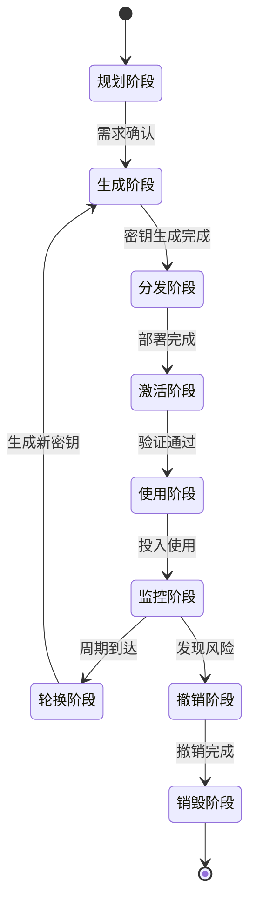
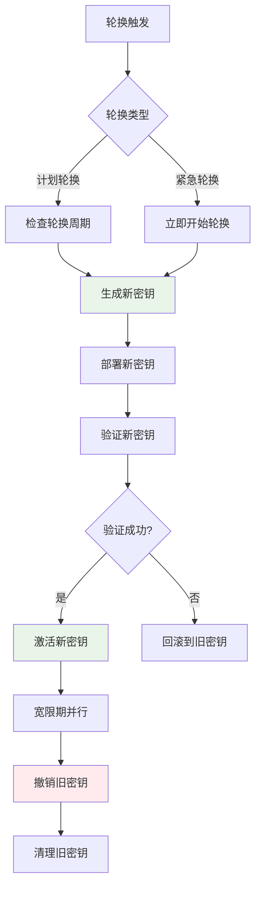
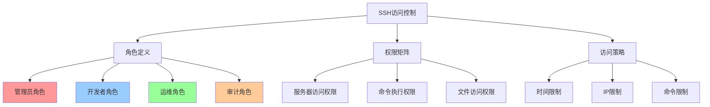

# SSH密钥管理策略

## 概述

SSH密钥管理是维护安全SSH环境的核心，涵盖密钥的创建、分发、监控、轮换和撤销等全生命周期管理。有效的密钥管理策略可以大大降低安全风险并提高运维效率。

## 密钥生命周期管理

### 生命周期阶段



### 各阶段管理要点

| 阶段 | 主要任务 | 关键指标 | 负责角色 |
|------|----------|----------|----------|
| **规划** | 需求分析、策略制定 | 需求覆盖率 | 安全团队 |
| **生成** | 密钥创建、强度验证 | 密钥强度、生成时间 | 系统管理员 |
| **分发** | 安全部署、权限配置 | 部署成功率 | 运维团队 |
| **使用** | 日常操作、访问控制 | 使用频率、错误率 | 最终用户 |
| **监控** | 活动监控、异常检测 | 监控覆盖率 | 安全运营 |
| **轮换** | 定期更新、平滑过渡 | 轮换周期、成功率 | 运维团队 |
| **撤销** | 紧急撤销、访问阻断 | 响应时间 | 安全团队 |

## 密钥组织结构

### 命名规范策略

#### 个人密钥命名

```bash
# 格式：id_{type}_{purpose}_{environment}
~/.ssh/id_ed25519_personal_general
~/.ssh/id_ed25519_work_development
~/.ssh/id_ed25519_github_projects
~/.ssh/id_rsa_legacy_compatibility

# 企业环境格式：id_{type}_{dept}_{role}_{env}
~/.ssh/id_ed25519_it_admin_prod
~/.ssh/id_ed25519_dev_deploy_staging
~/.ssh/id_ecdsa_security_audit_all
```

### 目录组织结构

```bash
# 用户密钥目录结构
~/.ssh/
├── keys/
│   ├── personal/
│   │   ├── id_ed25519_github
│   │   ├── id_ed25519_personal_servers
│   │   └── id_rsa_legacy_systems
│   ├── work/
│   │   ├── id_ed25519_company_prod
│   │   ├── id_ed25519_company_staging
│   │   └── id_ecdsa_company_dev
│   └── archived/
│       ├── old_id_rsa_2023
│       └── expired_id_ecdsa_2022
├── config
├── known_hosts
└── authorized_keys
```

## 密钥轮换策略

### 自动化轮换流程



### 轮换实施脚本

```bash
#!/bin/bash
# SSH密钥自动轮换脚本

# 生成新密钥
generate_new_key() {
    local key_name="$1"
    local key_type="$2"
    local output_dir="$3"
    
    echo "生成新密钥: $key_name ($key_type)"
    
    case "$key_type" in
        "ed25519")
            ssh-keygen -t ed25519 -f "$output_dir/$key_name" -N "" -C "rotated-$(date -Iseconds)"
            ;;
        "ecdsa")
            ssh-keygen -t ecdsa -b 384 -f "$output_dir/$key_name" -N "" -C "rotated-$(date -Iseconds)"
            ;;
        "rsa")
            ssh-keygen -t rsa -b 4096 -f "$output_dir/$key_name" -N "" -C "rotated-$(date -Iseconds)"
            ;;
    esac
}

# 部署密钥到服务器
deploy_key_to_servers() {
    local key_file="$1"
    local servers_list="$2"
    local username="$3"
    
    while IFS= read -r server; do
        [[ -z "$server" || "$server" =~ ^# ]] && continue
        
        echo "部署密钥到: $username@$server"
        ssh-copy-id -i "$key_file.pub" "$username@$server"
    done < "$servers_list"
}

# 验证新密钥
verify_new_key() {
    local key_file="$1"
    local servers_list="$2"
    local username="$3"
    
    while IFS= read -r server; do
        [[ -z "$server" || "$server" =~ ^# ]] && continue
        
        if ssh -i "$key_file" -o BatchMode=yes -o ConnectTimeout=10 \
           "$username@$server" 'echo "验证成功"' >/dev/null 2>&1; then
            echo "验证成功: $server"
        else
            echo "验证失败: $server"
            return 1
        fi
    done < "$servers_list"
}
```

## 访问控制和审计

### 基于角色的访问控制



### 密钥使用监控

```bash
#!/bin/bash
# SSH密钥使用监控脚本

# 分析SSH日志
analyze_ssh_logs() {
    echo "=== SSH访问统计 ==="
    
    # 统计今日连接
    grep "$(date '+%b %d')" /var/log/auth.log | \
    grep "Accepted publickey" | \
    awk '{print $9}' | sort | uniq -c | sort -nr
    
    echo "=== 失败登录尝试 ==="
    grep "$(date '+%b %d')" /var/log/auth.log | \
    grep "authentication failure" | \
    awk '{print $12}' | sort | uniq -c | sort -nr
}

# 检查密钥使用异常
check_anomalies() {
    echo "=== 异常检测 ==="
    
    # 检查非工作时间访问
    grep "$(date '+%b %d')" /var/log/auth.log | \
    grep "Accepted publickey" | \
    awk '$3 < 8 || $3 > 18 {print $0}' | \
    head -10
    
    # 检查异常IP
    grep "$(date '+%b %d')" /var/log/auth.log | \
    grep "Accepted publickey" | \
    awk '{print $11}' | sort | uniq -c | \
    awk '$1 > 50 {print "高频访问IP: " $2 " (" $1 " 次)"}'
}

# 生成报告
generate_report() {
    echo "SSH访问审计报告 - $(date)"
    echo "================================"
    analyze_ssh_logs
    echo ""
    check_anomalies
}

generate_report
```

## 最佳实践总结

### 密钥管理检查清单

#### ✅ 生成阶段
- [ ] 选择合适的密钥类型和长度
- [ ] 使用强密码短语保护私钥
- [ ] 设置有意义的密钥注释
- [ ] 验证密钥指纹

#### ✅ 部署阶段
- [ ] 使用安全的部署方法
- [ ] 设置正确的文件权限
- [ ] 配置合适的密钥选项
- [ ] 测试连接功能

#### ✅ 使用阶段
- [ ] 定期监控密钥使用
- [ ] 记录访问日志
- [ ] 检测异常活动
- [ ] 维护密钥清单

#### ✅ 维护阶段
- [ ] 定期轮换密钥
- [ ] 清理过期密钥
- [ ] 更新密钥文档
- [ ] 备份重要密钥

### 安全原则

1. **最小权限原则**: 只授予必要的访问权限
2. **职责分离**: 不同角色使用不同密钥
3. **定期轮换**: 建立密钥轮换周期
4. **监控审计**: 记录所有密钥活动
5. **备份恢复**: 建立密钥备份机制

## 下一步

完成密钥管理策略后，建议继续：

1. **[安全配置](../security/security-policies.md)** - 实施安全策略
2. **[故障排除](../troubleshooting/diagnostic-guide.md)** - 处理常见问题
3. **[高级应用](../advanced/certificate-auth.md)** - 探索高级功能

---

🔐 **管理提醒**: 
- 建立完善的密钥管理流程
- 定期审查和更新管理策略
- 培训团队成员掌握最佳实践
- 持续改进管理工具和方法