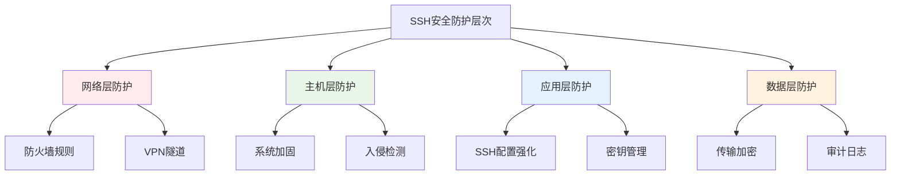

# SSH安全策略

## 概述

SSH安全策略是保护SSH环境的核心框架，包括密钥管理、访问控制、监控审计等多个方面。完善的安全策略可以有效防范威胁、降低风险并确保合规性。

## 安全框架设计

### 多层防护模型



### 风险评估矩阵

| 威胁类型 | 影响程度 | 发生概率 | 风险等级 | 防护措施 |
|----------|----------|----------|----------|----------|
| 暴力破解 | 中 | 高 | 高 | 密钥认证、失败延迟 |
| 中间人攻击 | 高 | 中 | 高 | 主机密钥验证、CA体系 |
| 内部威胁 | 高 | 低 | 中 | 最小权限、审计监控 |
| 配置错误 | 中 | 中 | 中 | 配置管理、定期审计 |
| 密钥泄露 | 高 | 低 | 中 | 密钥轮换、访问控制 |

## 密钥安全策略

### 密钥安全等级分类

```bash
# 密钥安全等级定义

# 1级 - 基础安全（开发环境）
LEVEL1_KEY_TYPE="rsa"
LEVEL1_KEY_LENGTH="2048"
LEVEL1_ROTATION_PERIOD="365 days"

# 2级 - 标准安全（生产环境）
LEVEL2_KEY_TYPE="ecdsa"
LEVEL2_KEY_LENGTH="384"
LEVEL2_ROTATION_PERIOD="180 days"

# 3级 - 高度安全（关键系统）
LEVEL3_KEY_TYPE="ed25519"
LEVEL3_ROTATION_PERIOD="90 days"
LEVEL3_PASSPHRASE="required"
```

### 密钥轮换自动化

```bash
#!/bin/bash
# 密钥轮换策略脚本

# 安全等级配置
declare -A SECURITY_LEVELS=(
    ["development"]="90:ecdsa:256"
    ["production"]="30:ed25519:256"
    ["critical"]="15:ed25519:256"
)

# 检查密钥是否需要轮换
needs_rotation() {
    local key_file="$1"
    local rotation_period="$2"
    
    if [[ ! -f "$key_file" ]]; then
        return 0  # 密钥不存在，需要生成
    fi
    
    local key_age=$(( $(date +%s) - $(stat -c %Y "$key_file") ))
    local rotation_seconds=$(( rotation_period * 24 * 3600 ))
    
    [[ $key_age -gt $rotation_seconds ]]
}

# 生成安全密钥
generate_secure_key() {
    local key_name="$1"
    local key_type="$2"
    local output_dir="$3"
    
    case "$key_type" in
        "ed25519")
            ssh-keygen -t ed25519 -f "$output_dir/$key_name" -N "" -C "$key_name-$(date -Iseconds)"
            ;;
        "ecdsa")
            ssh-keygen -t ecdsa -b 384 -f "$output_dir/$key_name" -N "" -C "$key_name-$(date -Iseconds)"
            ;;
    esac
    
    echo "安全密钥生成完成: $output_dir/$key_name"
}

# 主轮换流程
rotate_keys_by_policy() {
    local environment="$1"
    local config="${SECURITY_LEVELS[$environment]}"
    
    IFS=':' read -r rotation_days key_type key_length <<< "$config"
    
    echo "开始 $environment 环境密钥轮换 (轮换周期: $rotation_days 天)"
    
    # 实施密钥轮换逻辑
    # ...
}
```

## 访问控制策略

### 基于角色的访问控制(RBAC)

```yaml
# ssh-rbac-policy.yaml
roles:
  admin:
    description: "系统管理员"
    permissions:
      - ssh_access: all_hosts
      - port_forwarding: yes
      - shell_access: unrestricted
    constraints:
      - source_networks: ["admin_network"]
      - session_timeout: 3600
      
  developer:
    description: "开发人员"
    permissions:
      - ssh_access: ["dev_servers", "staging_servers"]
      - port_forwarding: local_only
      - shell_access: restricted
    constraints:
      - source_networks: ["office_network"]
      - session_timeout: 7200
      
  deploy:
    description: "部署账户"
    permissions:
      - ssh_access: ["production_servers"]
      - port_forwarding: no
      - shell_access: command_only
    constraints:
      - force_command: "/usr/local/bin/deploy.sh"
      - session_timeout: 1800

users:
  john.doe:
    roles: ["admin"]
    ssh_keys:
      - "ssh-ed25519 AAAAC3NzaC1lZDI1NTE5... john.doe@company.com"
    additional_constraints:
      - mfa_required: yes
      
  deploy-bot:
    roles: ["deploy"]
    ssh_keys:
      - "ssh-ed25519 AAAAC3NzaC1lZDI1NTE5... deploy-bot@automation"
    additional_constraints:
      - automated_only: yes
```

### 访问控制实施

```bash
#!/bin/bash
# SSH访问控制策略实施脚本

AUTHORIZED_KEYS_DIR="/etc/ssh/authorized_keys"

# 生成用户的authorized_keys文件
generate_user_authorized_keys() {
    local username="$1"
    local user_roles="$2"
    local ssh_keys="$3"
    
    local authorized_keys_file="$AUTHORIZED_KEYS_DIR/$username"
    
    echo "# Generated by SSH RBAC Policy - $(date)" > "$authorized_keys_file"
    
    # 根据角色添加限制选项
    local key_options=""
    case "$user_roles" in
        *admin*)
            key_options="no-user-rc"
            ;;
        *developer*)
            key_options="no-port-forwarding,no-X11-forwarding,no-user-rc"
            ;;
        *deploy*)
            key_options="command=\"/usr/local/bin/deploy.sh\",no-port-forwarding,no-X11-forwarding,no-pty"
            ;;
    esac
    
    # 写入密钥
    while IFS= read -r key; do
        [[ -z "$key" ]] && continue
        echo "$key_options $key" >> "$authorized_keys_file"
    done <<< "$ssh_keys"
    
    chmod 600 "$authorized_keys_file"
}

# 更新sshd_config
update_sshd_config() {
    local sshd_config="/etc/ssh/sshd_config"
    
    # 使用集中化authorized_keys
    sed -i 's|^#\?AuthorizedKeysFile.*|AuthorizedKeysFile /etc/ssh/authorized_keys/%u|' "$sshd_config"
    
    # 添加角色匹配规则
    cat >> "$sshd_config" << 'EOF'

# RBAC Policy Enforcement
Match Group admin
    AllowTcpForwarding yes
    X11Forwarding yes

Match Group developer  
    AllowTcpForwarding local
    X11Forwarding yes

Match Group deploy
    AllowTcpForwarding no
    X11Forwarding no
    ForceCommand /usr/local/bin/deploy.sh
EOF

    systemctl reload sshd
}
```

## 网络安全策略

### 防火墙规则

```bash
#!/bin/bash
# SSH防火墙规则配置

# 设置默认策略
iptables -P INPUT DROP
iptables -P FORWARD DROP
iptables -P OUTPUT ACCEPT

# 允许本地回环
iptables -A INPUT -i lo -j ACCEPT

# 允许已建立的连接
iptables -A INPUT -m state --state ESTABLISHED,RELATED -j ACCEPT

# SSH访问规则
iptables -A INPUT -p tcp -s 192.168.1.0/24 --dport 22 -j ACCEPT
iptables -A INPUT -p tcp -s 10.0.1.0/24 --dport 22 -j ACCEPT

# 限制SSH连接频率（防暴力破解）
iptables -A INPUT -p tcp --dport 22 -m state --state NEW -m recent --set --name SSH
iptables -A INPUT -p tcp --dport 22 -m state --state NEW -m recent --update --seconds 60 --hitcount 4 --name SSH -j DROP

# 记录被拒绝的连接
iptables -A INPUT -p tcp --dport 22 -j LOG --log-prefix "SSH-DENIED: "
iptables -A INPUT -p tcp --dport 22 -j DROP

# 保存规则
iptables-save > /etc/iptables/rules.v4
```

### 入侵检测

```bash
#!/bin/bash
# SSH入侵检测配置

# Fail2ban配置
configure_fail2ban() {
    cat > /etc/fail2ban/jail.d/ssh-custom.conf << 'EOF'
[sshd]
enabled = true
port = 22
filter = sshd
logpath = /var/log/auth.log
maxretry = 3
bantime = 3600
findtime = 600

[sshd-ddos]
enabled = true
port = 22
filter = sshd-ddos
logpath = /var/log/auth.log
maxretry = 10
bantime = 600
findtime = 60
EOF

    systemctl restart fail2ban
}

# 实时监控
create_ssh_monitor() {
    cat > /usr/local/bin/ssh-monitor.sh << 'EOF'
#!/bin/bash
ALERT_EMAIL="admin@company.com"
LOG_FILE="/var/log/auth.log"

# 监控失败登录
failed_logins=$(grep "$(date '+%b %d')" "$LOG_FILE" | \
               grep "authentication failure" | wc -l)

if [[ $failed_logins -gt 50 ]]; then
    echo "警告: 今日失败登录次数异常 ($failed_logins 次)" | \
    mail -s "SSH安全警报" "$ALERT_EMAIL"
fi

# 检查异常IP
grep "$(date '+%b %d')" "$LOG_FILE" | \
grep "Accepted publickey" | \
awk '{print $11}' | sort | uniq -c | \
awk '$1 > 100 {print "高频登录IP: " $2 " (" $1 " 次)"}' | \
mail -s "SSH异常活动检测" "$ALERT_EMAIL"
EOF

    chmod +x /usr/local/bin/ssh-monitor.sh
    echo "*/10 * * * * /usr/local/bin/ssh-monitor.sh" | crontab -
}

configure_fail2ban
create_ssh_monitor
```

## 审计和合规

### 审计策略

```bash
#!/bin/bash
# SSH审计配置

# 配置SSH日志
configure_ssh_logging() {
    cat > /etc/rsyslog.d/50-ssh-audit.conf << 'EOF'
auth.info /var/log/ssh-audit/ssh-auth.log
authpriv.info /var/log/ssh-audit/ssh-auth.log
EOF

    systemctl restart rsyslog
}

# 会话记录
create_session_logger() {
    cat > /usr/local/bin/ssh-session-logger.sh << 'EOF'
#!/bin/bash
SESSION_LOG_DIR="/var/log/ssh-sessions"
SESSION_ID="${SSH_CLIENT// /_}_$(date +%Y%m%d_%H%M%S)_$$"
SESSION_LOG="$SESSION_LOG_DIR/${USER}_${SESSION_ID}.log"

mkdir -p "$SESSION_LOG_DIR"

{
    echo "=== SSH会话开始 ==="
    echo "时间: $(date)"
    echo "用户: $USER"
    echo "客户端: $SSH_CLIENT"
    echo "==================="
} >> "$SESSION_LOG"

if [[ -z "$SSH_ORIGINAL_COMMAND" ]]; then
    script -q -a -f "$SESSION_LOG"
else
    echo "执行命令: $SSH_ORIGINAL_COMMAND" >> "$SESSION_LOG"
    eval "$SSH_ORIGINAL_COMMAND"
fi
EOF

    chmod +x /usr/local/bin/ssh-session-logger.sh
}

configure_ssh_logging
create_session_logger
```

### 合规性报告

```bash
#!/bin/bash
# 生成SSH合规性报告

generate_compliance_report() {
    local report_file="/var/reports/ssh-compliance-$(date +%Y%m%d).txt"
    mkdir -p /var/reports
    
    {
        echo "SSH安全合规性报告 - $(date)"
        echo "=============================="
        
        echo "1. 配置合规性检查"
        if sshd -T | grep -q "protocol 2"; then
            echo "✅ 协议版本: SSH-2"
        else
            echo "❌ 协议版本: 不符合要求"
        fi
        
        local root_login=$(sshd -T | grep permitrootlogin | awk '{print $2}')
        if [[ "$root_login" == "no" ]]; then
            echo "✅ Root登录: 已禁用"
        else
            echo "❌ Root登录: 未禁用"
        fi
        
        echo ""
        echo "2. 密钥管理检查"
        local weak_keys=0
        for key_file in /etc/ssh/ssh_host_*_key.pub; do
            [[ ! -f "$key_file" ]] && continue
            
            local key_info=$(ssh-keygen -l -f "$key_file")
            local key_type=$(echo "$key_info" | awk '{print $4}')
            
            if [[ "$key_type" == "(DSA)" ]]; then
                echo "❌ 发现DSA密钥（已过时）"
                ((weak_keys++))
            fi
        done
        
        if [[ $weak_keys -eq 0 ]]; then
            echo "✅ 主机密钥符合要求"
        fi
        
        echo ""
        echo "3. 审计日志状态"
        if [[ -d "/var/log/ssh-audit" ]]; then
            echo "✅ 审计日志已配置"
        else
            echo "❌ 审计日志未配置"
        fi
        
    } > "$report_file"
    
    echo "合规性报告生成: $report_file"
}

generate_compliance_report
```

## 最佳实践总结

### 安全策略检查清单

#### ✅ 密钥管理
- [ ] 实施密钥分级管理
- [ ] 建立密钥轮换机制
- [ ] 使用强密码短语保护
- [ ] 定期审计密钥使用

#### ✅ 访问控制
- [ ] 实施基于角色的访问控制
- [ ] 配置最小权限原则
- [ ] 限制网络访问来源
- [ ] 监控异常访问活动

#### ✅ 网络安全
- [ ] 配置防火墙规则
- [ ] 实施入侵检测
- [ ] 启用连接限制
- [ ] 记录安全事件

#### ✅ 审计合规
- [ ] 配置审计日志
- [ ] 实施会话记录
- [ ] 定期生成合规报告
- [ ] 保持日志完整性

## 下一步

完成安全策略后，建议继续：

1. **[故障排除](../troubleshooting/diagnostic-guide.md)** - 解决常见问题
2. **[高级应用](../advanced/certificate-auth.md)** - 探索高级功能
3. **[监控审计](./audit-logging.md)** - 深入了解审计机制

---

🔒 **安全提醒**: 
- 定期审查和更新安全策略
- 保持安全配置的一致性
- 及时响应安全事件
- 持续改进安全措施