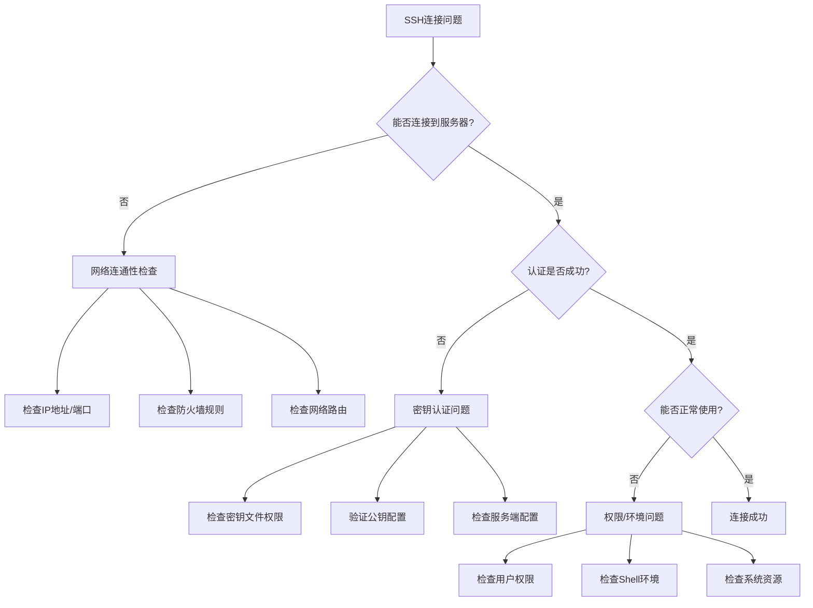

# SSH故障排除指南

## 概述

SSH连接问题是日常运维中最常见的问题之一。本指南提供系统化的故障排除方法，帮助快速定位和解决各种SSH相关问题。

## 故障排除流程

### 问题诊断决策树



## 常见问题分类

### 连接问题

#### 问题1: Connection refused

**症状**: `ssh: connect to host server.com port 22: Connection refused`

**可能原因**:
- SSH服务未启动
- 端口配置错误
- 防火墙阻止连接
- 网络不通

**排查步骤**:

```bash
# 1. 检查SSH服务状态
systemctl status sshd
# 或
service ssh status

# 2. 检查SSH服务是否监听
ss -tlnp | grep :22
# 或
netstat -tlnp | grep :22

# 3. 检查防火墙规则
iptables -L -n | grep 22
# 或
ufw status

# 4. 测试网络连通性
ping server.com
telnet server.com 22

# 5. 检查SSH配置端口
grep "^Port" /etc/ssh/sshd_config
```

**解决方案**:

```bash
# 启动SSH服务
systemctl start sshd
systemctl enable sshd

# 开放防火墙端口
iptables -A INPUT -p tcp --dport 22 -j ACCEPT
# 或
ufw allow 22

# 检查并修复SSH配置
sudo sshd -t  # 测试配置语法
sudo systemctl reload sshd
```

#### 问题2: Connection timed out

**症状**: `ssh: connect to host server.com port 22: Connection timed out`

**可能原因**:
- 网络路由问题
- 防火墙丢包
- 服务器负载过高
- DNS解析问题

**排查脚本**:

```bash
#!/bin/bash
# SSH连接超时诊断脚本

HOST="$1"
PORT="${2:-22}"

if [[ -z "$HOST" ]]; then
    echo "用法: $0 <主机> [端口]"
    exit 1
fi

echo "=== SSH连接诊断: $HOST:$PORT ==="

# 1. DNS解析测试
echo "1. DNS解析测试"
if nslookup "$HOST" >/dev/null 2>&1; then
    echo "✅ DNS解析正常"
    RESOLVED_IP=$(nslookup "$HOST" | grep "Address:" | tail -1 | awk '{print $2}')
    echo "   解析IP: $RESOLVED_IP"
else
    echo "❌ DNS解析失败"
    exit 1
fi

# 2. 网络连通性测试
echo "2. 网络连通性测试"
if ping -c 3 -W 5 "$HOST" >/dev/null 2>&1; then
    echo "✅ ICMP连通正常"
else
    echo "⚠️  ICMP不通（可能被禁用）"
fi

# 3. 端口连通性测试
echo "3. 端口连通性测试"
if timeout 10 bash -c "echo >/dev/tcp/$HOST/$PORT" 2>/dev/null; then
    echo "✅ 端口 $PORT 可达"
else
    echo "❌ 端口 $PORT 不可达"
fi

# 4. TCP连接测试
echo "4. TCP连接详细测试"
timeout 10 telnet "$HOST" "$PORT" 2>&1 | head -5

# 5. 路由跟踪
echo "5. 路由跟踪"
traceroute -m 15 "$HOST" 2>/dev/null | head -10

echo "=== 诊断完成 ==="
```

### 认证问题

#### 问题1: Permission denied (publickey)

**症状**: `Permission denied (publickey)`

**可能原因**:
- 密钥文件路径错误
- 密钥文件权限不正确
- 公钥未正确部署
- SSH配置问题

**详细排查**:

```bash
#!/bin/bash
# SSH密钥认证问题诊断

HOST="$1"
USER="$2"
KEY_FILE="$3"

if [[ $# -lt 2 ]]; then
    echo "用法: $0 <主机> <用户> [密钥文件]"
    exit 1
fi

echo "=== SSH密钥认证诊断 ==="

# 1. 检查本地密钥文件
echo "1. 本地密钥文件检查"
if [[ -n "$KEY_FILE" ]]; then
    if [[ -f "$KEY_FILE" ]]; then
        echo "✅ 密钥文件存在: $KEY_FILE"
        
        # 检查权限
        KEY_PERMS=$(stat -c "%a" "$KEY_FILE")
        if [[ "$KEY_PERMS" == "600" ]]; then
            echo "✅ 密钥文件权限正确 (600)"
        else
            echo "❌ 密钥文件权限错误 ($KEY_PERMS)，应该是600"
            echo "   修复命令: chmod 600 $KEY_FILE"
        fi
        
        # 检查密钥格式
        if ssh-keygen -l -f "$KEY_FILE" >/dev/null 2>&1; then
            echo "✅ 密钥格式正确"
            ssh-keygen -l -f "$KEY_FILE"
        else
            echo "❌ 密钥格式错误或损坏"
        fi
    else
        echo "❌ 密钥文件不存在: $KEY_FILE"
    fi
else
    echo "检查默认密钥文件..."
    for default_key in ~/.ssh/id_rsa ~/.ssh/id_ecdsa ~/.ssh/id_ed25519; do
        if [[ -f "$default_key" ]]; then
            echo "找到默认密钥: $default_key"
            KEY_FILE="$default_key"
            break
        fi
    done
fi

# 2. 详细连接测试
echo "2. 详细连接测试"
echo "执行命令: ssh -vvv ${KEY_FILE:+-i $KEY_FILE} $USER@$HOST"
echo "请查看详细输出中的认证过程..."

# 3. 检查服务器端配置（如果有访问权限）
echo "3. 建议的服务器端检查命令："
echo "   sudo grep 'PubkeyAuthentication\|AuthorizedKeysFile' /etc/ssh/sshd_config"
echo "   sudo ls -la /home/$USER/.ssh/"
echo "   sudo cat /home/$USER/.ssh/authorized_keys"
echo "   sudo tail -f /var/log/auth.log"

# 4. 生成测试用的ssh命令
echo "4. 调试命令："
echo "   ssh -vvv ${KEY_FILE:+-i $KEY_FILE} $USER@$HOST"
echo "   ssh -o BatchMode=yes ${KEY_FILE:+-i $KEY_FILE} $USER@$HOST"
```

#### 问题2: Too many authentication failures

**症状**: `Received disconnect from server: 2: Too many authentication failures`

**可能原因**:
- SSH agent中加载了太多密钥
- MaxAuthTries设置过低
- 多个无效密钥尝试

**解决方案**:

```bash
# 1. 清空SSH agent
ssh-add -D

# 2. 只添加需要的密钥
ssh-add ~/.ssh/id_ed25519_specific

# 3. 使用IdentitiesOnly选项
ssh -o IdentitiesOnly=yes -i ~/.ssh/specific_key user@host

# 4. 在配置文件中设置
cat >> ~/.ssh/config << 'EOF'
Host problem-server
    HostName server.example.com
    User myuser
    IdentitiesOnly yes
    IdentityFile ~/.ssh/id_ed25519_specific
EOF
```

### 权限问题

#### SSH目录和文件权限检查

```bash
#!/bin/bash
# SSH权限问题诊断和修复脚本

fix_ssh_permissions() {
    local user_home="$1"
    local ssh_dir="$user_home/.ssh"
    
    echo "修复SSH权限: $ssh_dir"
    
    # 检查并修复.ssh目录权限
    if [[ -d "$ssh_dir" ]]; then
        local dir_perms=$(stat -c "%a" "$ssh_dir")
        if [[ "$dir_perms" != "700" ]]; then
            echo "修复.ssh目录权限: $dir_perms -> 700"
            chmod 700 "$ssh_dir"
        fi
    else
        echo "创建.ssh目录"
        mkdir -p "$ssh_dir"
        chmod 700 "$ssh_dir"
    fi
    
    # 修复私钥权限
    for private_key in "$ssh_dir"/id_*; do
        [[ ! -f "$private_key" ]] && continue
        [[ "$private_key" == *.pub ]] && continue
        
        local key_perms=$(stat -c "%a" "$private_key")
        if [[ "$key_perms" != "600" ]]; then
            echo "修复私钥权限: $(basename $private_key) $key_perms -> 600"
            chmod 600 "$private_key"
        fi
    done
    
    # 修复公钥权限
    for public_key in "$ssh_dir"/*.pub; do
        [[ ! -f "$public_key" ]] && continue
        
        local key_perms=$(stat -c "%a" "$public_key")
        if [[ "$key_perms" != "644" ]]; then
            echo "修复公钥权限: $(basename $public_key) $key_perms -> 644"
            chmod 644 "$public_key"
        fi
    done
    
    # 修复authorized_keys权限
    if [[ -f "$ssh_dir/authorized_keys" ]]; then
        local auth_perms=$(stat -c "%a" "$ssh_dir/authorized_keys")
        if [[ "$auth_perms" != "600" ]]; then
            echo "修复authorized_keys权限: $auth_perms -> 600"
            chmod 600 "$ssh_dir/authorized_keys"
        fi
    fi
    
    # 修复config权限
    if [[ -f "$ssh_dir/config" ]]; then
        local config_perms=$(stat -c "%a" "$ssh_dir/config")
        if [[ "$config_perms" != "600" ]]; then
            echo "修复config权限: $config_perms -> 600"
            chmod 600 "$ssh_dir/config"
        fi
    fi
    
    echo "权限修复完成"
}

# 检查用户主目录权限
check_home_permissions() {
    local user_home="$1"
    local home_perms=$(stat -c "%a" "$user_home")
    
    echo "用户主目录权限: $home_perms"
    
    # 主目录不能对group/other有写权限
    if [[ $(( home_perms & 022 )) -ne 0 ]]; then
        echo "⚠️  主目录权限过于宽松，可能导致SSH认证失败"
        echo "   建议权限: 755 或 700"
        echo "   修复命令: chmod 755 $user_home"
    fi
}

# 主函数
main() {
    local target_user="${1:-$(whoami)}"
    local user_home
    
    if [[ "$target_user" == "$(whoami)" ]]; then
        user_home="$HOME"
    else
        user_home="/home/$target_user"
    fi
    
    echo "=== SSH权限诊断和修复 ==="
    echo "目标用户: $target_user"
    echo "用户目录: $user_home"
    echo ""
    
    check_home_permissions "$user_home"
    echo ""
    fix_ssh_permissions "$user_home"
}

main "$@"
```

## 性能问题

### 连接缓慢问题

**常见原因**:
- DNS反向解析延迟
- GSSAPI认证超时
- 主机密钥验证缓慢

**优化配置**:

```bash
# 客户端优化配置 (~/.ssh/config)
Host *
    # 禁用GSSAPI认证
    GSSAPIAuthentication no
    
    # 禁用主机名检查
    CheckHostIP no
    
    # 连接复用
    ControlMaster auto
    ControlPath ~/.ssh/master-%r@%h:%p
    ControlPersist 10m
    
    # 启用压缩
    Compression yes

# 服务器端优化配置 (/etc/ssh/sshd_config)
# 禁用DNS反向解析
UseDNS no

# 禁用GSSAPI
GSSAPIAuthentication no

# 启用TCP保活
TCPKeepAlive yes
ClientAliveInterval 60
ClientAliveCountMax 3
```

### 性能测试脚本

```bash
#!/bin/bash
# SSH性能测试脚本

HOST="$1"
USER="${2:-$(whoami)}"

if [[ -z "$HOST" ]]; then
    echo "用法: $0 <主机> [用户名]"
    exit 1
fi

echo "=== SSH性能测试: $USER@$HOST ==="

# 1. 连接时间测试
echo "1. 连接时间测试"
for i in {1..3}; do
    echo -n "第 $i 次连接: "
    time ssh -o BatchMode=yes "$USER@$HOST" 'exit 0' 2>&1 | grep real
done

# 2. 文件传输性能
echo "2. 文件传输性能测试"
dd if=/dev/zero of=/tmp/test_file bs=1M count=10 2>/dev/null

echo "上传测试 (10MB):"
time scp /tmp/test_file "$USER@$HOST":/tmp/ 2>&1 | grep real

echo "下载测试 (10MB):"
time scp "$USER@$HOST":/tmp/test_file /tmp/downloaded_file 2>&1 | grep real

# 清理测试文件
rm -f /tmp/test_file /tmp/downloaded_file
ssh "$USER@$HOST" 'rm -f /tmp/test_file'

# 3. 连接复用测试
echo "3. 连接复用测试"
echo "启用连接复用的连接时间:"
time ssh -o ControlMaster=auto -o ControlPath=/tmp/ssh-%r@%h:%p "$USER@$HOST" 'exit 0' 2>&1 | grep real

echo "复用已有连接的时间:"
time ssh -o ControlPath=/tmp/ssh-%r@%h:%p "$USER@$HOST" 'exit 0' 2>&1 | grep real

# 清理控制连接
ssh -O exit -o ControlPath=/tmp/ssh-%r@%h:%p "$USER@$HOST" 2>/dev/null
```

## 综合诊断工具

### 一键诊断脚本

```bash
#!/bin/bash
# SSH问题综合诊断工具

SSH_DIAG_VERSION="1.0"
TARGET_HOST="$1"
TARGET_USER="$2"
KEY_FILE="$3"

print_header() {
    echo "=================================="
    echo "SSH问题诊断工具 v$SSH_DIAG_VERSION"
    echo "=================================="
    echo "目标: ${TARGET_USER:-当前用户}@${TARGET_HOST:-localhost}"
    echo "时间: $(date)"
    echo ""
}

check_prerequisites() {
    echo "=== 前置检查 ==="
    
    # 检查必要命令
    local missing_cmds=()
    for cmd in ssh ssh-keygen nc telnet ping; do
        if ! command -v "$cmd" >/dev/null 2>&1; then
            missing_cmds+=("$cmd")
        fi
    done
    
    if [[ ${#missing_cmds[@]} -gt 0 ]]; then
        echo "❌ 缺少必要命令: ${missing_cmds[*]}"
        return 1
    else
        echo "✅ 必要命令检查通过"
    fi
    
    return 0
}

run_network_tests() {
    [[ -z "$TARGET_HOST" ]] && return
    
    echo "=== 网络连通性测试 ==="
    
    # DNS解析
    if nslookup "$TARGET_HOST" >/dev/null 2>&1; then
        echo "✅ DNS解析正常"
    else
        echo "❌ DNS解析失败"
    fi
    
    # ICMP连通性
    if ping -c 2 -W 3 "$TARGET_HOST" >/dev/null 2>&1; then
        echo "✅ ICMP连通性正常"
    else
        echo "⚠️  ICMP连通性异常（可能被禁用）"
    fi
    
    # SSH端口连通性
    if timeout 5 bash -c "echo >/dev/tcp/$TARGET_HOST/22" 2>/dev/null; then
        echo "✅ SSH端口(22)可达"
    else
        echo "❌ SSH端口(22)不可达"
    fi
}

run_auth_tests() {
    echo "=== 认证配置检查 ==="
    
    # 检查本地SSH配置
    local ssh_dir="$HOME/.ssh"
    if [[ -d "$ssh_dir" ]]; then
        echo "✅ SSH目录存在: $ssh_dir"
        
        # 检查权限
        local dir_perms=$(stat -c "%a" "$ssh_dir")
        if [[ "$dir_perms" == "700" ]]; then
            echo "✅ SSH目录权限正确"
        else
            echo "❌ SSH目录权限错误 ($dir_perms)，应该是700"
        fi
        
        # 列出可用密钥
        echo "可用的密钥文件:"
        for key in "$ssh_dir"/id_*; do
            [[ ! -f "$key" ]] && continue
            [[ "$key" == *.pub ]] && continue
            echo "  - $(basename "$key")"
        done
    else
        echo "❌ SSH目录不存在: $ssh_dir"
    fi
}

generate_recommendations() {
    echo "=== 建议和解决方案 ==="
    
    echo "常用调试命令:"
    echo "1. 详细连接调试:"
    echo "   ssh -vvv ${TARGET_USER:+$TARGET_USER@}${TARGET_HOST:-localhost}"
    
    echo "2. 测试特定密钥:"
    echo "   ssh -i ~/.ssh/id_ed25519 ${TARGET_USER:+$TARGET_USER@}${TARGET_HOST:-localhost}"
    
    echo "3. 忽略known_hosts:"
    echo "   ssh -o UserKnownHostsFile=/dev/null -o StrictHostKeyChecking=no ${TARGET_USER:+$TARGET_USER@}${TARGET_HOST:-localhost}"
    
    echo "4. 服务器端日志查看:"
    echo "   sudo tail -f /var/log/auth.log"
    
    echo "5. 权限修复:"
    echo "   chmod 700 ~/.ssh"
    echo "   chmod 600 ~/.ssh/id_*"
    echo "   chmod 644 ~/.ssh/*.pub"
}

# 主函数
main() {
    print_header
    
    if ! check_prerequisites; then
        exit 1
    fi
    
    run_network_tests
    echo ""
    
    run_auth_tests  
    echo ""
    
    generate_recommendations
    
    echo ""
    echo "=== 诊断完成 ==="
    echo "如需更详细的帮助，请查阅SSH故障排除文档"
}

# 显示用法
if [[ $# -eq 0 ]]; then
    echo "SSH问题诊断工具"
    echo "用法: $0 [主机] [用户] [密钥文件]"
    echo ""
    echo "示例:"
    echo "  $0                          # 本地诊断"
    echo "  $0 server.com              # 诊断连接到server.com"
    echo "  $0 server.com user         # 诊断user@server.com"
    echo "  $0 server.com user keyfile # 使用指定密钥"
    echo ""
fi

main "$@"
```

## 下一步

完成故障排除后，建议继续：

1. **[高级应用](../advanced/proxy-forwarding.md)** - 学习SSH高级功能
2. **[性能优化](../advanced/performance-tuning.md)** - 优化SSH性能
3. **[监控告警](../security/monitoring.md)** - 设置SSH监控

---

🔧 **故障排除提醒**: 
- 系统化地排查问题，避免盲目尝试
- 保留详细的调试日志用于分析
- 在生产环境谨慎操作，先在测试环境验证
- 建立故障处理知识库，积累经验